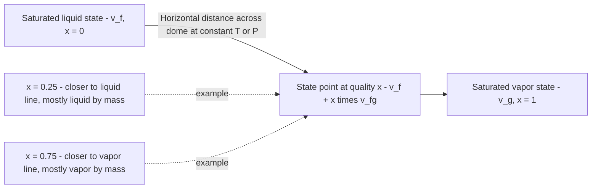

## Saturation States and Quality of Two-Phase Mixtures

### Introduction

When a pure substance exists simultaneously as liquid and vapor in thermodynamic equilibrium, its state cannot be fixed by pressure and temperature alone, since these two properties are dependent on each other along the saturation curve. This section develops the concept of **quality** — the property that resolves this indeterminacy — and the systematic methods used to extract state properties from saturation tables.

### Saturated Liquid and Saturated Vapor States

**Saturated liquid**: the state of liquid that is on the verge of vaporization — any addition of heat at constant pressure will begin producing vapor. Denoted with subscript $f$ (from the German *Flüssigkeit*, liquid).

**Saturated vapor**: the state of vapor that is on the verge of condensation — any removal of heat at constant pressure will begin producing liquid. Denoted with subscript $g$ (from *gas*).

**Saturated liquid-vapor mixture**: the two-phase region between these states, where both liquid and vapor coexist in equilibrium at the same temperature and pressure ($T_{sat}$, $P_{sat}$).

**Key Points**

- Properties at saturated liquid state: $v_f$, $u_f$, $h_f$, $s_f$
- Properties at saturated vapor state: $v_g$, $u_g$, $h_g$, $s_g$
- Difference (used for latent effects): subscript $fg$, e.g. $v_{fg} = v_g - v_f$, $h_{fg} = h_g - h_f$
- $h_{fg}$ specifically is called the **enthalpy of vaporization** (or latent heat of vaporization) — the energy required to vaporize a unit mass of saturated liquid at a given temperature/pressure

### Why Quality Is Needed

Inside the two-phase dome, temperature and pressure are **not independent properties** — fixing one fixes the other via the saturation curve $P_{sat} = f(T_{sat})$. This means the state postulate (which requires two independent intensive properties to fix the state of a simple compressible substance) cannot be satisfied using $T$ and $P$ alone within this region.

**Quality** ($x$) serves as the second independent property needed to fully define the state inside the dome, since it directly captures information (the relative proportion of liquid and vapor) that $T$ and $P$ cannot.

### Definition of Quality

Quality is defined as the mass fraction of vapor in a saturated mixture:

$$x = \frac{m_g}{m_{total}} = \frac{m_g}{m_f + m_g}$$

where $m_f$ is the mass of saturated liquid and $m_g$ is the mass of saturated vapor present in the mixture.

**Key Points**

- $x = 0$: pure saturated liquid (no vapor present)
- $x = 1$: pure saturated vapor (no liquid present)
- $0 < x < 1$: two-phase mixture
- Quality is undefined (has no physical meaning) outside the saturation dome — it cannot be applied to compressed liquid or superheated vapor states
- Quality is sometimes expressed as a percentage (e.g., $x = 0.75$ is "75% quality")
- Quality is an intensive property despite being defined via a mass ratio, because it describes the state of the mixture independent of the total mass of the system

### Related Concept: Moisture Content

The complement of quality, called **moisture** or **moisture fraction**, is sometimes used, particularly in steam turbine engineering:

$$y = 1 - x = \frac{m_f}{m_{total}}$$

Turbine designers often specify allowable *moisture content* limits (rather than minimum quality) at the low-pressure turbine exhaust, since moisture is what physically causes blade erosion.

### Property Evaluation Using Quality

For any extensive property expressed on a specific (per-unit-mass) basis — specific volume $v$, specific internal energy $u$, specific enthalpy $h$, specific entropy $s$ — the mixture property is the quality-weighted average of the saturated liquid and saturated vapor values:

$$v = (1-x) v_f + x \, v_g = v_f + x(v_g - v_f) = v_f + x \, v_{fg}$$

$$u = u_f + x \, u_{fg}$$

$$h = h_f + x \, h_{fg}$$

$$s = s_f + x \, s_{fg}$$

**General form:**

$$y_{mix} = y_f + x \, y_{fg}, \quad \text{where } y \in \{v, u, h, s\}$$

This linear interpolation between endpoint states is exact (not an approximation) because it derives directly from the mass-weighted definition of a specific property: $Y_{total} = m_f y_f + m_g y_g$, divided by $m_{total}$.

### Derivation from First Principles

Starting from the total extensive property $Y$ (e.g., total volume $V$):

$$V = V_f + V_g = m_f v_f + m_g v_g$$

Dividing through by total mass $m = m_f + m_g$:

$$v = \frac{m_f}{m} v_f + \frac{m_g}{m} v_g$$

Since $\frac{m_g}{m} = x$ and $\frac{m_f}{m} = 1 - x$:

$$v = (1-x)v_f + x \, v_g$$

Expanding and simplifying confirms the standard working formula $v = v_f + x(v_g - v_f)$.

### Worked Example 1: Finding Quality from Specific Volume

**Problem:** A rigid tank contains 2 kg of water at 300 kPa with a specific volume of $v = 0.4 \text{ m}^3/\text{kg}$. Determine the quality and the mass of vapor present.

**Solution:**

From saturated water tables at 300 kPa: $v_f = 0.001073 \text{ m}^3/\text{kg}$, $v_g = 0.6058 \text{ m}^3/\text{kg}$.

Confirm two-phase state: $v_f < v < v_g$ → $0.001073 < 0.4 < 0.6058$ ✓ (two-phase mixture confirmed)

$$x = \frac{v - v_f}{v_g - v_f} = \frac{0.4 - 0.001073}{0.6058 - 0.001073} = \frac{0.3989}{0.6047} = 0.6596$$

Mass of vapor:

$$m_g = x \cdot m_{total} = 0.6596 \times 2 \text{ kg} = 1.319 \text{ kg}$$

Mass of liquid: $m_f = (1 - 0.6596)(2) = 0.681 \text{ kg}$

### Worked Example 2: Finding Enthalpy and Entropy Given Quality

**Problem:** Refrigerant-134a at $-20°C$ has a quality of $x = 0.4$. Determine the specific enthalpy and specific entropy.

**Solution:**

From saturated R-134a tables at $-20°C$: $h_f = 25.49 \text{ kJ/kg}$, $h_g = 238.41 \text{ kJ/kg}$, $s_f = 0.09901 \text{ kJ/(kg·K)}$, $s_g = 0.94254 \text{ kJ/(kg·K)}$. [Unverified: illustrative table values; consult a current R-134a property table for precise figures, as reference states vary by table source.]

$$h = h_f + x(h_g - h_f) = 25.49 + 0.4(238.41 - 25.49) = 25.49 + 85.17 = 110.66 \text{ kJ/kg}$$

$$s = s_f + x(s_g - s_f) = 0.09901 + 0.4(0.94254 - 0.09901) = 0.09901 + 0.3374 = 0.4364 \text{ kJ/(kg·K)}$$

### Worked Example 3: Reverse Problem — Finding Quality from Enthalpy

**Problem:** Steam at 400 kPa has a specific enthalpy of $h = 2,000 \text{ kJ/kg}$. Determine the quality and specific volume.

**Solution:**

From saturated water tables at 400 kPa: $h_f = 604.74 \text{ kJ/kg}$, $h_g = 2738.6 \text{ kJ/kg}$, $v_f = 0.001084 \text{ m}^3/\text{kg}$, $v_g = 0.4625 \text{ m}^3/\text{kg}$.

Confirm two-phase: $h_f < h < h_g$ → $604.74 < 2000 < 2738.6$ ✓

$$x = \frac{h - h_f}{h_{fg}} = \frac{2000 - 604.74}{2738.6 - 604.74} = \frac{1395.26}{2133.86} = 0.6540$$

Using this same quality to find specific volume:

$$v = v_f + x \, v_{fg} = 0.001084 + 0.6540(0.4625 - 0.001084) = 0.001084 + 0.3018 = 0.3029 \text{ m}^3/\text{kg}$$

**Key Point:** Quality found from any one property (here, enthalpy) applies identically to all other specific properties at that same saturation state, since all properties vary linearly with $x$ between the same endpoint states.

### Graphical Interpretation

On a T-v or P-v diagram, quality represents the *horizontal position* of a state point within the saturation dome, measured as a fraction of the total horizontal width of the dome at that particular temperature or pressure.

Lines of constant quality ("isoquality lines" or "quality lines") can be drawn connecting points of equal $x$ across different pressures/temperatures within the dome — these curve from the triple-point line up to the critical point, converging to a single point at the critical point (where $x$ becomes meaningless since $v_f = v_g$).

### Diagram: Quality as Position Within the Saturation Dome (svg_diagram)

<svg xmlns="http://www.w3.org/2000/svg" viewBox="0 0 760 440" font-family="Arial, sans-serif">
<text x="380" y="26" text-anchor="middle" font-size="16" font-weight="bold" fill="#1a1a1a">Quality as Position Within the Saturation Dome (svg_diagram)</text>

<line x1="80" y1="380" x2="700" y2="380" stroke="#333" stroke-width="1.5" />
<line x1="80" y1="380" x2="80" y2="60" stroke="#333" stroke-width="1.5" />
<text x="680" y="400" font-size="12" fill="#333">specific volume, v</text>
<text x="35" y="70" font-size="12" fill="#333">T</text>

<path d="M 150,340 Q 380,80 610,340" fill="none" stroke="#c0392b" stroke-width="2.5" />
<path d="M 150,340 Q 260,360 380,340" fill="none" stroke="#c0392b" stroke-width="2" stroke-dasharray="4,3" />
<circle cx="380" cy="82" r="4" fill="#c0392b" />
<text x="380" y="66" text-anchor="middle" font-size="10" fill="#c0392b" font-weight="bold">Critical Point</text>

<text x="200" y="300" font-size="10" fill="`#2c5f8a`" font-weight="bold">Saturated liquid line (x=0)</text>

<text x="500" y="300" font-size="10" fill="`#2c5f8a`" font-weight="bold">Saturated vapor line (x=1)</text>

<line x1="180" y1="250" x2="570" y2="250" stroke="#555" stroke-width="1" stroke-dasharray="3,3" />
<text x="700" y="253" font-size="10" fill="#555">T = const</text>

<circle cx="180" cy="250" r="5" fill="#2c5f8a" />
<text x="180" y="240" text-anchor="middle" font-size="9" fill="#2c5f8a">v_f (x=0)</text>
<circle cx="570" cy="250" r="5" fill="#2c5f8a" />
<text x="570" y="240" text-anchor="middle" font-size="9" fill="#2c5f8a">v_g (x=1)</text>
<circle cx="278" cy="250" r="5" fill="#27ae60" />
<text x="278" y="270" text-anchor="middle" font-size="9" fill="#27ae60">x = 0.25</text>
<circle cx="375" cy="250" r="5" fill="#27ae60" />
<text x="375" y="270" text-anchor="middle" font-size="9" fill="#27ae60">x = 0.50</text>
<circle cx="472" cy="250" r="5" fill="#27ae60" />
<text x="472" y="270" text-anchor="middle" font-size="9" fill="#27ae60">x = 0.75</text>

<path d="M 180,250 Q 260,140 380,82" fill="none" stroke="#888" stroke-width="1" stroke-dasharray="2,2" />
<text x="230" y="160" font-size="9" fill="#888">x = 0 line</text>
<path d="M 375,250 Q 378,160 380,82" fill="none" stroke="#8e44ad" stroke-width="1.2" stroke-dasharray="2,2" />
<text x="420" y="180" font-size="9" fill="#8e44ad">x = 0.5 isoquality line</text>

<rect x="440" y="330" width="260" height="55" fill="#f7f7f7" stroke="#ccc" rx="4" />
<text x="450" y="348" font-size="9" fill="#333">v = v_f + x(v_g - v_f)</text>
<text x="450" y="364" font-size="9" fill="#333">x is the fractional horizontal</text>
<text x="450" y="377" font-size="9" fill="#333">position across the dome at fixed T</text>
</svg>

### Common Errors in Quality Calculations

**Key Points**

- Applying quality formulas outside the two-phase region (e.g., attempting to compute "quality" for a superheated or compressed liquid state — quality is meaningless there)
- Using the wrong saturation table entry — quality calculations require $v_f$, $v_g$ (or $h_f$, $h_g$, etc.) at the *actual* saturation temperature or pressure of the mixture, not at a nearby tabulated value without interpolation
- Forgetting that quality must lie between 0 and 1 — if a calculated value falls outside this range, the assumed two-phase state is incorrect (the actual state is either compressed liquid or superheated vapor)
- Mixing intensive quality-based formulas with extensive total-mass quantities without correctly multiplying by total mass
- Assuming quality is preserved during a throttling process without verification — while enthalpy is conserved in adiabatic throttling ($h_1 = h_2$), the resulting quality (or degree of superheat) at the downstream state must be recalculated from $h_2$ using the downstream pressure's saturation table, since $h_f$ and $h_g$ change with pressure

### Application: Throttling Calorimeter

A practical application of two-phase quality determination is the **throttling calorimeter**, used to measure the quality of wet steam experimentally when it is too high in moisture to measure directly.

**Procedure:**

1. Wet steam at pressure $P_1$ and unknown quality $x_1$ is throttled (expanded through a valve) to a much lower pressure $P_2$
2. The throttling process is adiabatic and conserves enthalpy: $h_1 = h_2$
3. If the pressure drop is large enough, the resulting state at $P_2$ becomes superheated vapor, where temperature $T_2$ can be measured directly with a thermometer
4. $h_2$ is then read from superheated tables at $(P_2, T_2)$
5. Since $h_1 = h_2$, the original quality is back-calculated:

   $$x_1 = \frac{h_1 - h_{f,1}}{h_{fg,1}}$$

This technique circumvents the difficulty of directly measuring moisture content in a two-phase flow, converting the problem into a straightforward superheated-vapor temperature measurement.

### Relevance to Power Cycle Design

**Key Points**

- **Turbine exhaust quality**: Steam turbines are typically designed to maintain exit quality above approximately 0.88–0.90 to limit moisture-related blade erosion and efficiency losses; this constrains allowable expansion ratios and motivates reheat cycle designs
- **Boiler exit conditions**: Boilers are designed to produce either saturated vapor ($x=1$) or superheated vapor, never wet steam, to avoid carryover of liquid droplets into downstream superheater tubes and turbines
- **Condenser design**: Condensers are sized to bring turbine exhaust (often still slightly wet or saturated vapor) fully to saturated liquid ($x = 0$) or slightly subcooled liquid, maximizing the enthalpy drop recovered as work
- **Two-phase flow in evaporators and condensers**: Quality varies continuously along the flow path in heat exchanger tubes, and local quality significantly affects the convective heat transfer coefficient — flow boiling and condensation correlations are typically expressed as functions of local quality

### Related Topics

- Phase Behavior and P-v-T Surfaces
- Steam Tables: Structure, Interpolation, and Usage
- Throttling Processes and the Joule-Thomson Effect
- Rankine Cycle Turbine Expansion and Reheat
- Two-Phase Flow Heat Transfer Correlations
- Refrigeration Cycle Analysis Using P-h Diagrams