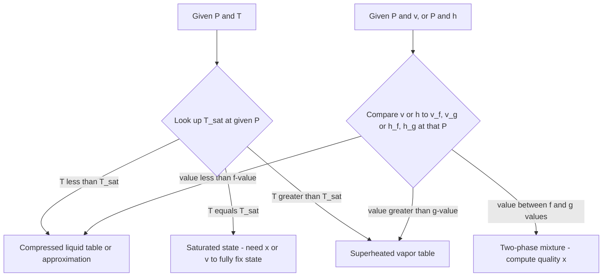

## Property Tables and Charts for Steam and Refrigerants

### Introduction

Property tables and charts are the primary practical tools engineers use to evaluate thermodynamic states of real substances, since equations of state for real fluids near the saturation dome are too complex for routine hand calculation. This section covers the structure, organization, and correct usage of steam tables, refrigerant tables, and their graphical counterparts (Mollier and P-h diagrams).

### Why Tables Instead of Equations

Simple equations of state like the ideal gas law fail near the saturation dome and at high pressures because intermolecular forces and finite molecular volume become significant. Real substances like water and refrigerants are instead characterized using highly accurate empirical correlations (e.g., the IAPWS-IF97 formulation for water) fitted to experimental data across wide ranges of pressure and temperature. These correlations are computationally complex, so their results are pre-tabulated into property tables for manual and quick-reference engineering use, and embedded directly into software for computational use.

### Categories of Property Tables

**Key Points**

- **Saturated tables (temperature-based)**: Indexed by temperature; give corresponding $P_{sat}$ and saturated liquid/vapor properties
- **Saturated tables (pressure-based)**: Indexed by pressure; give corresponding $T_{sat}$ and saturated liquid/vapor properties — the same data as the temperature-based table, reorganized for problems where pressure is the known quantity
- **Superheated vapor tables**: Indexed by both pressure and temperature independently; used only when $T > T_{sat}(P)$
- **Compressed (subcooled) liquid tables**: Indexed by pressure and temperature; used when $T < T_{sat}(P)$; less commonly tabulated in full because compressed liquid properties are weakly pressure-dependent
- **Saturated solid-vapor tables** (for sublimation, e.g., ice): Used for states below the triple point

### Structure of a Saturated Table Entry

A typical saturated water table row (temperature-based) contains:

| Column | Symbol | Meaning |
| --- | --- | --- |
| Temperature | $T$ | Saturation temperature (°C or K) |
| Saturation pressure | $P_{sat}$ | Corresponding pressure (kPa or MPa) |
| Specific volume, liquid | $v_f$ | m³/kg |
| Specific volume, vapor | $v_g$ | m³/kg |
| Internal energy, liquid | $u_f$ | kJ/kg |
| Internal energy, vapor | $u_g$ | kJ/kg |
| Enthalpy, liquid | $h_f$ | kJ/kg |
| Enthalpy of vaporization | $h_{fg}$ | kJ/kg |
| Enthalpy, vapor | $h_g$ | kJ/kg |
| Entropy, liquid | $s_f$ | kJ/(kg·K) |
| Entropy, vapor | $s_g$ | kJ/(kg·K) |

Some tables omit $v_{fg}$ and $u_{fg}$ (since these are less frequently needed directly) but always retain $h_{fg}$ due to its central role in energy balance calculations across boilers, condensers, and evaporators.

### Reference State Convention

Property tables report internal energy, enthalpy, and entropy relative to an arbitrarily chosen **reference state**, since absolute values of these properties cannot be measured — only differences matter for engineering calculations.

**Key Points**

- **Steam tables (IAPWS convention)**: Typically set $u = 0$ and $s = 0$ for saturated liquid at the triple point (0.01°C)
- **Refrigerant tables**: Often set $h = 0$ and $s = 0$ for saturated liquid at $-40°C$ (a common ASHRAE convention)
- Different tables (or different software packages) may use different reference states — this means **numerical values from different sources should never be directly combined**; only differences in properties (computed within a single, consistent table/source) are physically meaningful
- When switching between tables, verify the reference state and, if necessary, recompute all properties from consistent state points within the same source

### Interpolation Techniques

Tables list discrete values at fixed intervals; states falling between tabulated points require interpolation.

**Linear interpolation** (standard approach, adequate when table intervals are reasonably fine):

$$y = y_1 + \frac{y_2 - y_1}{x_2 - x_1}(x - x_1)$$

where $(x_1, y_1)$ and $(x_2, y_2)$ are the bracketing tabulated points and $x$ is the target value.

**Double interpolation** (required for superheated tables when both $P$ and $T$ fall between tabulated values):

1. Interpolate for the desired temperature at the lower tabulated pressure → $y_{P_1}$
2. Interpolate for the desired temperature at the upper tabulated pressure → $y_{P_2}$
3. Interpolate between $y_{P_1}$ and $y_{P_2}$ at the desired pressure → final value

**Worked Example — Double Interpolation:**

Find $h$ for superheated steam at $P = 350 \text{ kPa}$, $T = 220°C$, given table entries at 300 kPa and 400 kPa, each listing $T = 200°C$ and $T = 250°C$.

Assume (illustrative values): at 300 kPa, $h(200°C) = 2865.5$, $h(250°C) = 2967.6$; at 400 kPa, $h(200°C) = 2860.5$, $h(250°C) = 2964.2$ kJ/kg. [Unverified: illustrative figures for demonstrating method, not verified against a current steam table edition.]

**Step 1** — interpolate at 300 kPa for $T=220°C$:

$$h_{300} = 2865.5 + \frac{2967.6-2865.5}{250-200}(220-200) = 2865.5 + \frac{102.1}{50}(20) = 2865.5 + 40.84 = 2906.34$$

**Step 2** — interpolate at 400 kPa for $T=220°C$:

$$h_{400} = 2860.5 + \frac{2964.2-2860.5}{50}(20) = 2860.5 + 41.48 = 2901.98$$

**Step 3** — interpolate between pressures at $T=220°C$:

$$h = 2906.34 + \frac{2901.98 - 2906.34}{400-300}(350-300) = 2906.34 + \frac{-4.36}{100}(50) = 2906.34 - 2.18 = 2904.16 \text{ kJ/kg}$$

**Note:** Interpolation for pressure is often more accurate using $1/P$ or $\ln P$ as the interpolating variable rather than $P$ directly, since many properties vary more linearly with these transformed variables — this refinement is used in high-precision applications but linear-in-$P$ interpolation is standard for routine engineering work.

### Identifying the Correct Table Region

Given a state defined by two properties, a systematic check determines which table to consult:

### The Mollier Diagram (h-s Diagram)

The **Mollier diagram** plots specific enthalpy ($h$) against specific entropy ($s$), and is particularly useful for steam turbine analysis because isentropic (constant-entropy) processes — the idealized model for turbine and compressor expansion/compression — appear as simple vertical lines.

**Key Points**

- Constant-pressure lines (isobars) appear as curves sloping upward and to the right
- Constant-temperature lines appear in the superheated region, becoming nearly horizontal at low pressure (approaching ideal gas behavior) and curving into the two-phase region as nearly horizontal lines coincident with isobars (since $T$ and $P$ are linked in the dome)
- Constant-quality lines (isoquality lines) are drawn within the two-phase dome
- **Primary use case**: For an ideal (isentropic) turbine expansion, the process is a vertical line from the inlet state down to the exit pressure; the vertical drop in $h$ directly gives ideal turbine work per unit mass, and the endpoint's position relative to the saturation dome and quality lines immediately shows the resulting exit quality

### Worked Example: Using the Mollier Diagram Concept for Turbine Work

**Problem:** Steam enters a turbine at 4 MPa, 400°C ($h_1 \approx 3213.6 \text{ kJ/kg}$, $s_1 \approx 6.7690 \text{ kJ/(kg·K)}$) and expands isentropically to 10 kPa. Determine the ideal work output and exit quality.

**Solution:**

At 10 kPa: $s_f = 0.6493$, $s_g = 8.1502$, $h_f = 191.83$, $h_{fg} = 2392.8$ kJ/kg. [Unverified: illustrative steam table figures.]

Since expansion is isentropic, $s_2 = s_1 = 6.7690 \text{ kJ/(kg·K)}$. Since $s_f < s_2 < s_g$, the exit state is a two-phase mixture.

$$x_2 = \frac{s_2 - s_f}{s_{fg}} = \frac{6.7690 - 0.6493}{8.1502 - 0.6493} = \frac{6.1197}{7.5009} = 0.8159$$

$$h_2 = h_f + x_2 h_{fg} = 191.83 + 0.8159(2392.8) = 191.83 + 1952.4 = 2144.2 \text{ kJ/kg}$$

Ideal (isentropic) specific work:

$$w_{turbine} = h_1 - h_2 = 3213.6 - 2144.2 = 1069.4 \text{ kJ/kg}$$

**Note:** The computed exit quality (0.816) falls below the typical acceptable design threshold of approximately 0.88–0.90, indicating this specific expansion would cause excessive turbine blade erosion in practice — motivating reheat cycle design to keep exit quality above acceptable limits. [Inference: this conclusion follows from applying the commonly cited 0.88–0.90 design threshold to the calculated result, not from a code-mandated universal limit.]

### The P-h Diagram (Pressure-Enthalpy Diagram)

The **P-h diagram** (or log P-h diagram, since pressure is usually plotted on a logarithmic scale) is the standard chart for **refrigeration and heat pump cycle analysis**, plotting pressure against specific enthalpy.

**Key Points**

- The saturation dome appears with saturated liquid line on the left, saturated vapor line on the right, critical point at the apex
- Isotherms are nearly vertical in the subcooled liquid region, horizontal within the two-phase dome (since $T$ is fixed at $T_{sat}(P)$), and curve downward-right in the superheated vapor region
- **Primary use case**: Each of the four basic vapor-compression refrigeration cycle processes appears as a distinct, easily visualized line segment:
  - **Compression** (compressor): a nearly vertical line moving up in pressure (ideally following a constant-entropy line)
  - **Condensation** (condenser): a horizontal line moving left at high pressure (constant $P$, decreasing $h$)
  - **Expansion** (throttling valve): a vertical line moving down in pressure at *constant enthalpy* (a defining feature of adiabatic throttling)
  - **Evaporation** (evaporator): a horizontal line moving right at low pressure (constant $P$, increasing $h$)

This makes the P-h diagram the natural visualization tool for computing each component's energy transfer directly as horizontal or vertical distances on the chart, and it is the standard chart included in refrigerant manufacturer data sheets (e.g., for R-134a, R-410A, R-32, CO₂/R-744, and other refrigerants).

### Diagram: Vapor-Compression Cycle on a P-h Diagram (svg_diagram)

<svg xmlns="http://www.w3.org/2000/svg" viewBox="0 0 760 460" font-family="Arial, sans-serif">
<text x="380" y="26" text-anchor="middle" font-size="16" font-weight="bold" fill="#1a1a1a">Vapor-Compression Cycle on P-h Diagram (svg_diagram)</text>

<line x1="90" y1="400" x2="700" y2="400" stroke="#333" stroke-width="1.5" />
<line x1="90" y1="400" x2="90" y2="60" stroke="#333" stroke-width="1.5" />
<text x="670" y="420" font-size="12" fill="#333">specific enthalpy, h</text>
<text x="30" y="70" font-size="12" fill="#333">log P</text>

<path d="M 220,380 Q 380,100 540,380" fill="none" stroke="#c0392b" stroke-width="2.5" />
<text x="240" y="360" font-size="10" fill="#2c5f8a" font-weight="bold">Sat. liquid line</text>
<text x="480" y="360" font-size="10" fill="#2c5f8a" font-weight="bold">Sat. vapor line</text>
<circle cx="380" cy="105" r="4" fill="#c0392b" />
<text x="380" y="92" text-anchor="middle" font-size="9" fill="#c0392b">Critical Pt</text>

<circle cx="555" cy="330" r="5" fill="#27ae60" />
<text x="565" y="325" font-size="10" fill="#27ae60" font-weight="bold">1</text>

<circle cx="610" cy="150" r="5" fill="#27ae60" />
<text x="620" y="148" font-size="10" fill="#27ae60" font-weight="bold">2</text>

<circle cx="255" cy="150" r="5" fill="#27ae60" />
<text x="240" y="140" font-size="10" fill="#27ae60" font-weight="bold">3</text>

<circle cx="255" cy="330" r="5" fill="#27ae60" />
<text x="240" y="345" font-size="10" fill="#27ae60" font-weight="bold">4</text>

<line x1="555" y1="330" x2="610" y2="150" stroke="#8e44ad" stroke-width="2" />
<text x="600" y="240" font-size="9" fill="#8e44ad">1→2 Compression (~isentropic)</text>
<line x1="610" y1="150" x2="255" y2="150" stroke="#e67e22" stroke-width="2" />
<text x="380" y="140" text-anchor="middle" font-size="9" fill="#e67e22">2→3 Condensation (const P)</text>
<line x1="255" y1="150" x2="255" y2="330" stroke="#2980b9" stroke-width="2" />
<text x="200" y="245" font-size="9" fill="#2980b9" transform="rotate(-90 200 245)">3→4 Throttling (const h)</text>
<line x1="255" y1="330" x2="555" y2="330" stroke="#16a085" stroke-width="2" />
<text x="380" y="345" text-anchor="middle" font-size="9" fill="#16a085">4→1 Evaporation (const P)</text>

<rect x="480" y="380" width="230" height="60" fill="#f7f7f7" stroke="#ccc" rx="4" />
<text x="490" y="396" font-size="9" fill="#333">Compressor work: h2 - h1</text>
<text x="490" y="410" font-size="9" fill="#333">Condenser heat rejected: h2 - h3</text>
<text x="490" y="424" font-size="9" fill="#333">Evaporator cooling effect: h1 - h4</text>
</svg>

### Refrigerant Tables: Structural Differences from Steam Tables

**Key Points**

- Refrigerant tables cover a narrower, application-relevant temperature range (typically $-40°C$ to above critical temperature) compared to steam tables, which must span from the triple point to well above typical power-cycle operating conditions
- Refrigerant selection tables often list multiple refrigerants side-by-side or in a shared database format (since dozens of refrigerants — R-134a, R-410A, R-32, R-1234yf, ammonia/R-717, CO₂/R-744 — are in common industrial and HVAC use) rather than one refrigerant per textbook chapter
- Environmental regulatory data (GWP — global warming potential, ODP — ozone depletion potential) is frequently included alongside thermodynamic property tables in modern refrigerant reference material, reflecting the ongoing phase-down of high-GWP refrigerants under agreements such as the Kigali Amendment [Unverified: current regulatory status and phase-down schedules vary by jurisdiction and change over time — verify against current regulations for any compliance-related work]
- Refrigerant tables commonly include a superheated section with entries at a *fixed pressure* extending across many temperatures, since refrigeration cycle analysis frequently requires tracing compressor discharge conditions across a wide superheat range

### Software and Digital Property Databases

**Key Points**

- **NIST REFPROP**: An industry-standard reference property database and calculation engine covering a very wide range of pure fluids and mixtures, based on high-accuracy equations of state; commonly used in industry and research when table interpolation is too imprecise
- **CoolProp**: An open-source alternative to REFPROP, implementing similar equations of state, accessible via Python, Excel, and other environments
- **Engineering Equation Solver (EES)**: Widely used in academic thermodynamics coursework, includes built-in property functions for water, refrigerants, and many other substances, eliminating manual table interpolation
- Digital tools compute properties directly from the underlying equations of state rather than interpolating tabulated data, generally offering higher precision, though textbook tables remain standard for developing manual calculation skill and conceptual understanding

### Common Errors in Table Usage

**Key Points**

- Confusing temperature-based and pressure-based saturated tables, leading to lookups at the wrong governing property
- Neglecting to check whether a state is compressed liquid, saturated mixture, or superheated vapor before selecting a table — applying superheated-table logic to a two-phase state (or vice versa) produces meaningless results
- Interpolating across a phase boundary (e.g., linearly interpolating between a superheated table entry and a saturated table entry as if they were continuous) — properties change discontinuously in behavior (though not in value) across the saturation line in some cases and must be interpolated within the same table type only
- Overlooking that different textbook editions and software may use different reference states, causing apparent (but non-physical) discrepancies when cross-checking answers between sources
- Misreading units — many international tables use MPa for pressure while US-focused texts may use psia; similarly, kJ/kg versus BTU/lbm requires explicit conversion, not direct substitution

### Related Topics

- Phase Behavior and P-v-T Surfaces
- Saturation States and Quality of Two-Phase Mixtures
- The Rankine Cycle: Analysis Using Steam Tables
- Vapor-Compression Refrigeration Cycle Analysis
- Equations of State for Real Gases (Van der Waals, Redlich-Kwong, Generalized Compressibility)
- Isentropic Efficiency of Turbines and Compressors