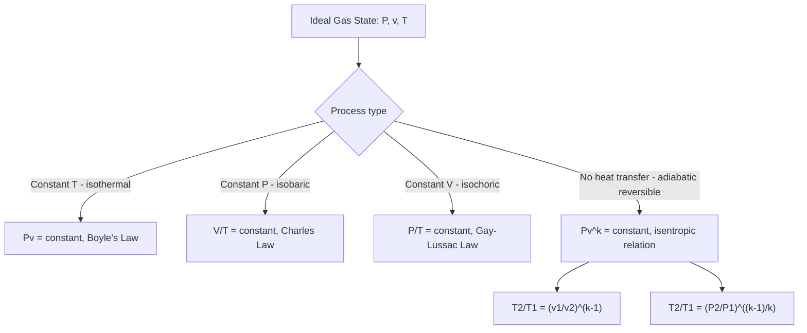

## The Ideal Gas Equation of State

### Introduction

The ideal gas equation of state is the simplest and most widely used relationship between pressure, specific volume, and temperature for a gas, providing a computationally convenient approximation that is remarkably accurate for many engineering applications involving air, combustion gases, and other low-density gases far from their saturation conditions.

### The Ideal Gas Model

An **ideal gas** is a theoretical construct in which molecules are treated as point masses with no volume and no intermolecular forces except during perfectly elastic collisions. Real gases approach this idealized behavior at **low pressure and high temperature relative to their critical point**, where molecules are spaced far apart and intermolecular attractive forces become negligible.

### The Equation of State

**Molar (extensive) form:**

$$PV = nR_uT$$

**Specific (per unit mass) form:**

$$Pv = RT$$

**Total mass form:**

$$PV = mRT$$

where:

- $P$ = absolute pressure (Pa, kPa)
- $V$ = total volume (m³)
- $v$ = specific volume (m³/kg)
- $n$ = number of moles (mol, kmol)
- $m$ = mass (kg)
- $T$ = absolute temperature (K) — **must be absolute**, never °C or °F
- $R_u$ = universal gas constant = $8.314 \text{ kJ/(kmol·K)} = 8.314 \text{ J/(mol·K)}$
- $R$ = specific gas constant = $R_u / M$, where $M$ is molar mass (kg/kmol)

**Key Points**

- The specific gas constant $R$ differs for every gas, since it depends on molar mass: $R_{air} = 0.2870 \text{ kJ/(kg·K)}$, $R_{water\,vapor} = 0.4615 \text{ kJ/(kg·K)}$, $R_{CO_2} = 0.1889 \text{ kJ/(kg·K)}$
- The universal gas constant $R_u$ is the same for all gases, reflecting the fact that equal volumes of any ideal gas at the same $P$ and $T$ contain equal numbers of molecules (Avogadro's principle)

### Derivation Context: Combining Empirical Gas Laws

The ideal gas equation combines three empirically observed relationships:

**Boyle's Law** (constant $T$): $$P_1 V_1 = P_2 V_2$$

**Charles's Law** (constant $P$): $$\frac{V_1}{T_1} = \frac{V_2}{T_2}$$

**Gay-Lussac's Law** (constant $V$): $$\frac{P_1}{T_1} = \frac{P_2}{T_2}$$

Combining these three proportionalities into a single relationship, and incorporating Avogadro's principle relating volume to the number of moles, yields the combined ideal gas law:

$$\frac{P_1 V_1}{T_1} = \frac{P_2 V_2}{T_2} = nR_u = \text{constant}$$

### Two-State Process Form

For a fixed mass of ideal gas undergoing any process between two states:

$$\frac{P_1 V_1}{T_1} = \frac{P_2 V_2}{T_2}$$

This form is particularly convenient for analyzing simple processes without needing to know $R$ explicitly, since $R$ cancels out.

### Worked Example 1: Basic State Evaluation

**Problem:** A rigid tank contains 5 kg of air at 300 kPa and 27°C. Determine the volume of the tank.

**Solution:**

Convert temperature to absolute: $T = 27 + 273.15 = 300.15 \text{ K}$ (commonly rounded to 300 K)

Using $R_{air} = 0.287 \text{ kJ/(kg·K)}$:

$$V = \frac{mRT}{P} = \frac{(5)(0.287)(300)}{300} = \frac{430.5}{300} = 1.435 \text{ m}^3$$

### Worked Example 2: Two-State Process

**Problem:** Air in a piston-cylinder device occupies 0.5 m³ at 200 kPa and 300 K. It is compressed to 0.2 m³ while the temperature rises to 400 K. Determine the final pressure.

**Solution:**

$$\frac{P_1 V_1}{T_1} = \frac{P_2 V_2}{T_2}$$

$$P_2 = P_1 \frac{V_1}{V_2}\frac{T_2}{T_1} = (200)\left(\frac{0.5}{0.2}\right)\left(\frac{400}{300}\right) = 200 \times 2.5 \times 1.333 = 666.7 \text{ kPa}$$

### Validity and Limitations of the Ideal Gas Assumption

**Key Points**

- The ideal gas equation loses accuracy near the saturation dome, at high pressure, or near the critical point — precisely where intermolecular forces and finite molecular volume (the effects the ideal gas model neglects) become significant
- As a practical rule of thumb, gases at pressures well below their critical pressure and temperatures well above their critical temperature behave nearly ideally
- Water vapor is a notable case requiring caution: at typical condenser/boiler pressures relevant to steam power cycles, water vapor deviates substantially from ideal gas behavior and must be evaluated using steam tables rather than the ideal gas law
- Air, nitrogen, oxygen, hydrogen, and combustion products at typical atmospheric and moderately elevated pressures (and well above their respective critical temperatures) are commonly and accurately treated as ideal gases in engineering practice

### Quantifying Deviation: The Compressibility Factor

The **compressibility factor** $Z$ quantifies the deviation of a real gas from ideal gas behavior:

$$Z = \frac{Pv}{RT} \quad \Rightarrow \quad Pv = ZRT$$

**Key Points**

- $Z = 1$ exactly for an ideal gas
- $Z < 1$: attractive intermolecular forces dominate (volume smaller than ideal gas prediction)
- $Z > 1$: repulsive forces / finite molecular volume dominate (volume larger than ideal gas prediction)
- $Z$ is correlated using **reduced properties**: reduced pressure $P_R = P/P_{cr}$ and reduced temperature $T_R = T/T_{cr}$, based on the **principle of corresponding states** — different gases exhibit approximately the same $Z$ behavior at the same $P_R$ and $T_R$
- Generalized compressibility charts (Nelson-Obert charts) plot $Z$ as a function of $P_R$ and $T_R$, allowing a single chart to approximate real-gas behavior across many different substances

### Diagram: Ideal Gas Validity Regions Relative to the Compressibility Factor (svg_diagram)

<svg xmlns="http://www.w3.org/2000/svg" viewBox="0 0 740 420" font-family="Arial, sans-serif">
<text x="370" y="26" text-anchor="middle" font-size="16" font-weight="bold" fill="#1a1a1a">Compressibility Factor vs. Reduced Pressure (svg_diagram)</text>
<line x1="90" y1="360" x2="680" y2="360" stroke="#333" stroke-width="1.5" />
<line x1="90" y1="360" x2="90" y2="60" stroke="#333" stroke-width="1.5" />
<text x="650" y="382" font-size="12" fill="#333">Reduced Pressure, P_R</text>
<text x="45" y="70" font-size="12" fill="#333">Z</text>

<line x1="90" y1="200" x2="680" y2="200" stroke="#888" stroke-width="1" stroke-dasharray="4,3" />
<text x="695" y="204" font-size="10" fill="#888">Z=1</text>

<path d="M 90,200 Q 200,320 300,290 Q 450,220 680,140" fill="none" stroke="#2980b9" stroke-width="2" />
<text x="200" y="335" font-size="9" fill="#2980b9">Low T_R (e.g., T_R = 1.0)</text>

<path d="M 90,200 Q 250,210 400,195 Q 550,175 680,155" fill="none" stroke="#27ae60" stroke-width="2" />
<text x="450" y="185" font-size="9" fill="#27ae60">Higher T_R (e.g., T_R = 2.0)</text>

<rect x="100" y="195" width="120" height="35" fill="#f4f4f4" stroke="#ccc" opacity="0.9" />
<text x="160" y="216" text-anchor="middle" font-size="9" fill="#333">Ideal gas region</text>
<text x="160" y="227" text-anchor="middle" font-size="8" fill="#333">(low P_R, high T_R)</text>

<text x="90" y="400" font-size="10" fill="#444">Z deviates most from 1 near the critical region (P_R and T_R near 1)</text>

</svg>

### Specific Heats of Ideal Gases

For an ideal gas, internal energy and enthalpy are functions of temperature alone (not pressure or volume) — a defining simplification known as **Joule's law**:

$$u = u(T) \quad \text{only}, \qquad h = h(T) = u(T) + RT \quad \text{only}$$

This leads directly to:

$$du = c_v \, dT \quad \Rightarrow \quad \Delta u = \int_{T_1}^{T_2} c_v \, dT$$

$$dh = c_p \, dT \quad \Rightarrow \quad \Delta h = \int_{T_1}^{T_2} c_p \, dT$$

**Mayer's relation** (connecting the two specific heats for an ideal gas):

$$c_p - c_v = R$$

**Specific heat ratio:**

$$k = \frac{c_p}{c_v}$$

For air at room temperature: $c_p \approx 1.005 \text{ kJ/(kg·K)}$, $c_v \approx 0.718 \text{ kJ/(kg·K)}$, $k \approx 1.4$.

**Key Points**

- Because $u$ and $h$ depend on $T$ alone for an ideal gas, $\Delta u$ and $\Delta h$ can be computed using constant average specific heats (cold-air-standard assumption) or using variable specific heat data (ideal gas tables) for greater accuracy over large temperature ranges
- This temperature-only dependence does **not** hold for real gases or for liquids/two-phase mixtures, where $u$ and $h$ depend on both $T$ and $P$ (or $v$)

### Worked Example 3: Energy Change Using Ideal Gas Specific Heats

**Problem:** Air is heated from 300 K to 500 K at constant volume in a rigid tank containing 2 kg of air. Determine the heat transfer required, assuming constant specific heats.

**Solution:**

For a constant-volume process with no work: $Q = \Delta U = m c_v \Delta T$

$$Q = (2)(0.718)(500 - 300) = (2)(0.718)(200) = 287.2 \text{ kJ}$$

### The Ideal Gas Process Diagram

### Polytropic Processes for Ideal Gases

Many real compression and expansion processes are approximated by a **polytropic process**, generalizing the constant-property relationships:

$$Pv^n = \text{constant}$$

where $n$ is the polytropic index. Special cases:

| $n$ value | Process type |
| --- | --- |
| $n = 0$ | Isobaric (constant pressure) |
| $n = 1$ | Isothermal (constant temperature, for ideal gas) |
| $n = k$ (specific heat ratio) | Isentropic (reversible adiabatic) |
| $n = \infty$ | Isochoric (constant volume) |

**Boundary work for a polytropic process** ($n \neq 1$):

$$W_{boundary} = \int_1^2 P \, dV = \frac{P_2 V_2 - P_1 V_1}{1 - n} = \frac{mR(T_2 - T_1)}{1-n}$$

**For the isothermal case** ($n = 1$):

$$W_{boundary} = P_1 V_1 \ln\left(\frac{V_2}{V_1}\right) = mRT \ln\left(\frac{V_2}{V_1}\right)$$

### Worked Example 4: Polytropic Compression Work

**Problem:** 2 kg of air is compressed polytropically ($n = 1.3$) from 100 kPa, 300 K to 500 kPa. Determine the boundary work.

**Solution:**

First find $T_2$ using the polytropic temperature-pressure relation:

$$\frac{T_2}{T_1} = \left(\frac{P_2}{P_1}\right)^{(n-1)/n}$$

$$T_2 = 300 \left(\frac{500}{100}\right)^{(1.3-1)/1.3} = 300 (5)^{0.2308} = 300 \times 1.4535 = 436.05 \text{ K}$$

Boundary work:

$$W = \frac{mR(T_2 - T_1)}{1-n} = \frac{(2)(0.287)(436.05 - 300)}{1 - 1.3} = \frac{(2)(0.287)(136.05)}{-0.3} = \frac{78.09}{-0.3} = -260.3 \text{ kJ}$$

The negative sign indicates work is done *on* the gas during compression, consistent with the sign convention where boundary work is positive when done *by* the system.

### Common Errors When Applying the Ideal Gas Law

**Key Points**

- Using Celsius or Fahrenheit directly in $Pv = RT$ instead of converting to Kelvin or Rankine — this is one of the most frequent sources of gross calculation error
- Applying the ideal gas law to states near or within the saturation dome, or near the critical point, where deviation from ideal behavior becomes significant
- Using the universal gas constant $R_u$ in the specific-volume form of the equation instead of the specific gas constant $R = R_u/M$ (a units/molar-mass mismatch)
- Assuming $u$ and $h$ depend on pressure for an ideal gas — for an ideal gas, they depend on temperature only, a simplification that does *not* extend to real gases or liquids
- Forgetting that $c_p - c_v = R$ holds specifically for ideal gases; this relation does not hold in the same simple form for real gases or liquids

### Relevance to Power and Energy Systems

**Key Points**

- Gas turbine (Brayton cycle) analysis very commonly treats air and combustion products as ideal gases, given the high temperatures and moderate pressures involved relative to their critical points
- Compressed air energy storage (CAES) system sizing and analysis relies directly on the ideal gas law for pressure-volume-temperature relationships in storage caverns/tanks
- Internal combustion engine air-standard cycle analysis (Otto, Diesel, Dual cycles) assumes ideal gas behavior for the working fluid to simplify analysis to closed-form relations
- Psychrometric (humid air) calculations in HVAC and cooling tower design apply the ideal gas law separately to the dry air and water vapor components of moist air (Dalton's law of partial pressures)

### Related Topics

- Phase Behavior and P-v-T Surfaces
- Compressibility Factor and Generalized Compressibility Charts
- The Brayton Cycle for Gas Turbine Power Plants
- Polytropic Processes and Boundary Work Calculations
- First Law of Thermodynamics for Closed Systems
- Psychrometrics and Moist Air Properties