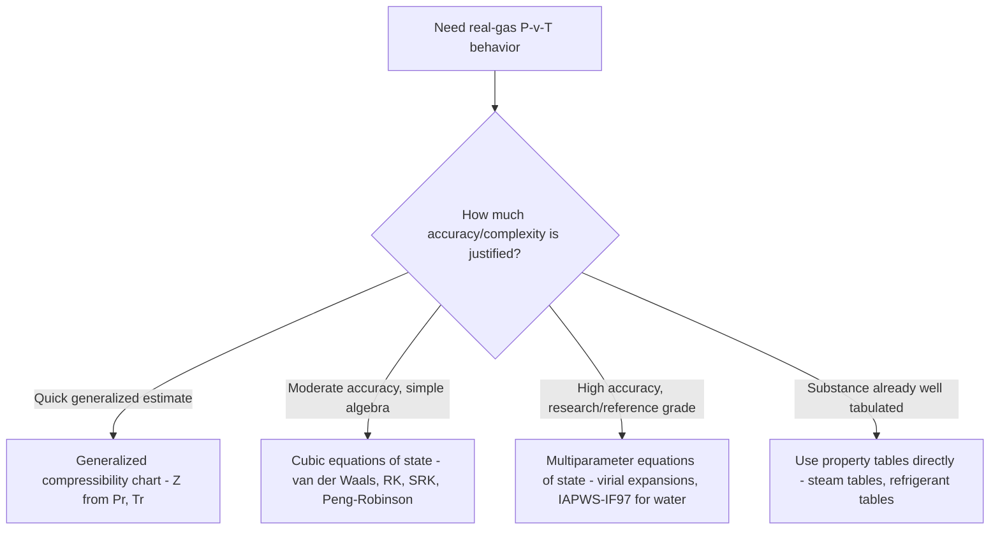

## Compressibility Factor and Real Gas Behavior

### Introduction

Real gases deviate from ideal gas behavior under conditions of high pressure, low temperature, or proximity to the critical point — precisely the operating regimes encountered in many power and refrigeration applications. The compressibility factor provides a systematic, generalized correction to the ideal gas equation, allowing engineers to quantify and account for these deviations without resorting to substance-specific equations of state for every calculation.

### Definition of the Compressibility Factor

The **compressibility factor** $Z$ is defined as the ratio of the actual specific volume of a real gas to the specific volume predicted by the ideal gas law at the same pressure and temperature:

$$Z = \frac{Pv}{RT} = \frac{v_{actual}}{v_{ideal}}$$

Rearranging gives the real-gas equation of state:

$$Pv = ZRT$$

**Key Points**

- $Z = 1$: gas behaves exactly as an ideal gas
- $Z = 1$ is also the limiting behavior for all real gases as $P \to 0$, regardless of temperature — at sufficiently low pressure, molecules are always spaced far enough apart for intermolecular forces and molecular volume to become negligible
- $Z < 1$: net attractive intermolecular forces dominate, pulling molecules closer together than ideal gas behavior would predict (smaller actual volume)
- $Z > 1$: net repulsive effects dominate, primarily due to finite molecular volume at high density, causing actual volume to exceed the ideal gas prediction

### Physical Origin of Deviation from Ideal Behavior

The ideal gas model assumes point-mass molecules with no intermolecular forces. Real molecules violate both assumptions:

**Key Points**

- **Intermolecular attractive forces** (van der Waals forces) pull molecules together, reducing the effective pressure a gas exerts on its container compared to the ideal prediction — this effect dominates at moderate pressure and lower temperature, driving $Z$ below 1
- **Finite molecular volume** means molecules themselves occupy space, reducing the volume actually available for molecular motion — this effect dominates at high pressure and high density, driving $Z$ above 1
- The competition between these two effects produces the characteristic dip-then-rise shape of $Z$ versus pressure seen at fixed, low reduced temperatures

### The Principle of Corresponding States

A central empirical observation underlying generalized real-gas correlations is the **principle of corresponding states**: different gases exhibit approximately the same deviation from ideal gas behavior (the same $Z$) when compared at the same **reduced pressure** and **reduced temperature**, defined relative to each gas's own critical properties.

$$P_R = \frac{P}{P_{cr}}, \qquad T_R = \frac{T}{T_{cr}}$$

**Key Points**

- $P_{cr}$ and $T_{cr}$ are the critical pressure and critical temperature, substance-specific constants tabulated for common gases
- The principle holds because the critical point represents a physically analogous reference state across substances — all gases approach a similar type of molecular crowding and force balance as conditions approach their own critical point
- This principle allows a *single* generalized chart to approximate real-gas behavior for many different substances, rather than requiring a separate empirical correlation for every gas

### Generalized Compressibility Chart

The **generalized compressibility chart** (Nelson-Obert chart) plots $Z$ as a function of $P_R$ for a family of curves at fixed values of $T_R$.

**Key Points**

- At very low $P_R$ (regardless of $T_R$), all curves converge toward $Z \approx 1$
- At low $T_R$ (e.g., $T_R \approx 1.0$, near the critical temperature), $Z$ dips well below 1 at moderate pressure before rising above 1 at high pressure
- At high $T_R$ (e.g., $T_R \gtrsim 2$–3), $Z$ remains close to 1 across a much wider range of $P_R$, since the gas is far from its critical/condensation conditions and behaves nearly ideally
- At the critical point itself ($P_R = 1$, $T_R = 1$), $Z$ takes a universal approximate value of $Z_{cr} \approx 0.27$–0.29 for many substances, another manifestation of corresponding states

### Diagram: Generalized Compressibility Chart Structure (svg_diagram)

<svg xmlns="http://www.w3.org/2000/svg" viewBox="0 0 740 440" font-family="Arial, sans-serif">
<text x="370" y="26" text-anchor="middle" font-size="16" font-weight="bold" fill="#1a1a1a">Generalized Compressibility Chart (svg_diagram)</text>
<line x1="90" y1="380" x2="680" y2="380" stroke="#333" stroke-width="1.5" />
<line x1="90" y1="380" x2="90" y2="60" stroke="#333" stroke-width="1.5" />
<text x="640" y="402" font-size="12" fill="#333">Reduced Pressure, P_R</text>
<text x="45" y="70" font-size="12" fill="#333">Z</text>
<line x1="90" y1="210" x2="680" y2="210" stroke="#888" stroke-width="1" stroke-dasharray="4,3" />
<text x="690" y="214" font-size="10" fill="#888">Z=1</text>

<path d="M 90,210 C 180,340 260,360 320,340 C 420,290 520,220 680,120" fill="none" stroke="#c0392b" stroke-width="2.2" />
<text x="180" y="358" font-size="9" fill="#c0392b" font-weight="bold">T_R = 1.0</text>

<path d="M 90,210 C 200,270 300,270 380,250 C 480,225 580,190 680,150" fill="none" stroke="#e67e22" stroke-width="2" />
<text x="300" y="288" font-size="9" fill="#e67e22" font-weight="bold">T_R = 1.5</text>

<path d="M 90,210 C 250,220 400,205 550,180 L 680,165" fill="none" stroke="#27ae60" stroke-width="2" />
<text x="450" y="195" font-size="9" fill="#27ae60" font-weight="bold">T_R = 2.0</text>

<path d="M 90,210 L 680,195" fill="none" stroke="#2980b9" stroke-width="2" />
<text x="500" y="205" font-size="9" fill="#2980b9" font-weight="bold">T_R = 3.0 (near-ideal)</text>
<circle cx="230" cy="345" r="4" fill="#c0392b" />
<text x="230" y="330" font-size="8" fill="#c0392b">Critical point region: Z ≈ 0.27</text>
<rect x="480" y="330" width="200" height="45" fill="#f4f4f4" stroke="#ccc" />
<text x="490" y="348" font-size="9" fill="#333">All curves converge to Z=1</text>
<text x="490" y="362" font-size="9" fill="#333">as P_R approaches 0</text>
</svg>

### Worked Example 1: Using the Compressibility Chart

**Problem:** Determine the specific volume of nitrogen at 10 MPa and 150 K using the generalized compressibility chart. Nitrogen's critical properties: $T_{cr} = 126.2 \text{ K}$, $P_{cr} = 3.39 \text{ MPa}$.

**Solution:**

Calculate reduced properties:

$$T_R = \frac{150}{126.2} = 1.189, \qquad P_R = \frac{10}{3.39} = 2.95$$

From the generalized compressibility chart at these coordinates: $Z \approx 0.83$ [Unverified: precise chart-read value depends on the specific chart/correlation source and reading precision; treat as illustrative].

Specific gas constant for nitrogen: $R_{N_2} = 0.2968 \text{ kJ/(kg·K)}$

$$v = \frac{ZRT}{P} = \frac{(0.83)(0.2968)(150)}{10{,}000} = \frac{36.96}{10{,}000} = 0.003696 \text{ m}^3/\text{kg}$$

**Comparison:** The ideal gas prediction ($Z=1$) would give $v_{ideal} = 0.004452 \text{ m}^3/\text{kg}$ — a difference of approximately 17%, illustrating that ignoring real-gas effects at this condition would introduce significant error.

### Pseudo-Critical Properties for Gas Mixtures

For gas mixtures (e.g., natural gas, combustion product mixtures), **Kay's rule** provides a simple approximation using mole-fraction-weighted pseudo-critical properties:

$$P_{cr}' = \sum_i y_i P_{cr,i}, \qquad T_{cr}' = \sum_i y_i T_{cr,i}$$

where $y_i$ is the mole fraction of component $i$. These pseudo-critical values are then used in place of true critical properties to compute pseudo-reduced properties and read $Z$ from the standard chart, providing a reasonable approximation for mixtures without requiring a mixture-specific chart.

### Real Gas Equations of State

Beyond the generalized $Z$-chart approach, several analytical equations of state incorporate corrections for intermolecular forces and molecular volume directly into the pressure-volume-temperature relationship.

**Van der Waals equation of state:**

$$\left(P + \frac{a}{v^2}\right)(v - b) = RT$$

where $a$ accounts for intermolecular attractive forces and $b$ accounts for the finite volume occupied by molecules. Both constants are determined from each substance's critical properties:

$$a = \frac{27 R^2 T_{cr}^2}{64 P_{cr}}, \qquad b = \frac{R T_{cr}}{8 P_{cr}}$$

**Key Points**

- The van der Waals equation is historically significant as the first equation of state to qualitatively capture liquid-vapor phase behavior and the existence of a critical point, but it is not highly accurate quantitatively for most engineering purposes
- More refined cubic equations of state — **Redlich-Kwong**, **Soave-Redlich-Kwong (SRK)**, and **Peng-Robinson** — improve accuracy substantially and remain in wide use in chemical and petroleum engineering for phase-equilibrium and real-gas calculations

**Redlich-Kwong equation of state:**

$$P = \frac{RT}{v-b} - \frac{a}{\sqrt{T}\,v(v+b)}$$

with constants again determined from critical properties:

$$a = \frac{0.42748 R^2 T_{cr}^{2.5}}{P_{cr}}, \qquad b = \frac{0.08664 R T_{cr}}{P_{cr}}$$

**Key Points**

- Redlich-Kwong generally provides improved accuracy over van der Waals, particularly for gas-phase properties, though it remains less accurate for liquid-phase density predictions
- The Soave modification (SRK) improves vapor pressure predictions by introducing a temperature-dependent term to the attraction parameter, extending applicability to vapor-liquid equilibrium calculations important in refrigerant and hydrocarbon processing
- The Peng-Robinson equation offers further improved liquid density predictions and is widely used in the petroleum and natural gas industries

### Virial Equation of State

An alternative, more mathematically rigorous approach expresses $Z$ as a power series in specific volume or pressure:

$$Z = 1 + \frac{B}{v} + \frac{C}{v^2} + \frac{D}{v^3} + \cdots$$

where $B$, $C$, $D$, ... are temperature-dependent **virial coefficients**, derivable in principle from statistical mechanics based on intermolecular potential functions. Truncating after the second virial coefficient $B$ gives a reasonable approximation at low-to-moderate density:

$$Z \approx 1 + \frac{B(T)}{v}$$

**Key Points**

- The virial equation has a stronger theoretical foundation than cubic equations of state, since each coefficient corresponds to specific orders of molecular interaction (pairwise, three-body, etc.)
- It is less convenient for direct engineering calculation compared to cubic equations of state or the generalized $Z$-chart, and is more commonly used in fundamental research and high-accuracy reference equations of state (e.g., those underlying steam and refrigerant property tables)

### Comparison of Real-Gas Modeling Approaches

### Worked Example 2: Ideal Gas Error Estimation

**Problem:** Estimate the percent error in using the ideal gas law to determine the specific volume of steam at 10 MPa and 400°C, compared to the value from steam tables ($v_{table} = 0.02641 \text{ m}^3/\text{kg}$).

**Solution:**

$$T = 400 + 273.15 = 673.15 \text{ K}, \quad R_{water} = 0.4615 \text{ kJ/(kg·K)}$$

$$v_{ideal} = \frac{RT}{P} = \frac{(0.4615)(673.15)}{10{,}000} = \frac{310.66}{10{,}000} = 0.031066 \text{ m}^3/\text{kg}$$

$$\% \text{error} = \frac{v_{ideal} - v_{table}}{v_{table}} \times 100 = \frac{0.031066 - 0.02641}{0.02641} \times 100 \approx 17.6\%$$

This substantial error illustrates why the ideal gas law is unsuitable for steam at typical power-plant boiler pressures, and why steam tables (or a real-gas correction via $Z$) are required in this regime.

### Practical Guidelines for When Real-Gas Corrections Matter

**Key Points**

- $P_R < 0.10$ **and** $T_R > 2$: ideal gas assumption typically introduces less than about 1% error, safe to use $Pv=RT$ directly
- $P_R$ approaching 1 or $T_R$ near 1 (near the critical region): significant deviation is likely; use compressibility charts, a cubic equation of state, or property tables
- Substances with tabulated high-accuracy property data available (water/steam, common refrigerants) should generally use those tables directly rather than the generalized $Z$-chart, since tables/equations of state fitted specifically to that substance are more accurate than a generalized correlation
- The generalized $Z$-chart is most valuable for gases lacking dedicated high-accuracy tables (e.g., many industrial and process gases, hydrocarbon mixtures) where a substance-specific reference equation of state is unavailable

### Relevance to Power and Energy Systems

**Key Points**

- Natural gas pipeline and storage engineering routinely uses compressibility factor corrections, since transmission pressures place natural gas well outside ideal-gas-appropriate conditions
- Supercritical CO₂ (sCO₂) power cycles — an emerging area in advanced power generation — operate very close to CO₂'s critical point ($T_{cr} = 31.1°C$, $P_{cr} = 7.38$ MPa) by design, where compressibility factor effects are extreme and dominate cycle performance and turbomachinery design, making accurate real-gas property data essential rather than optional in this technology
- High-pressure gas compression and storage (compressed natural gas, hydrogen storage) requires real-gas corrections since storage pressures often place these systems in the moderate-to-high $P_R$ regime
- Refrigerant selection and cycle analysis inherently rely on real-gas/two-phase property tables (built from high-accuracy equations of state) rather than the ideal gas law, since refrigerants operate specifically in the two-phase and near-saturation regime where ideal gas behavior fails

### Related Topics

- The Ideal Gas Equation of State
- Phase Behavior and P-v-T Surfaces
- Property Tables and Charts for Steam and Refrigerants
- Supercritical CO2 Power Cycles
- Vapor-Compression Refrigeration Cycle Analysis
- Natural Gas Processing and Transmission Engineering Fundamentals