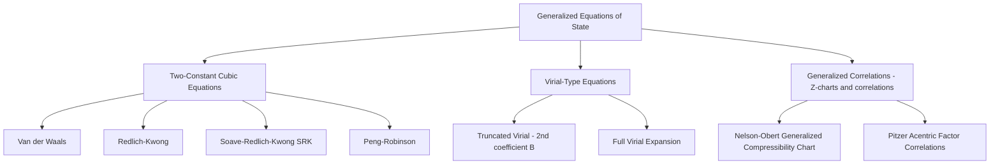
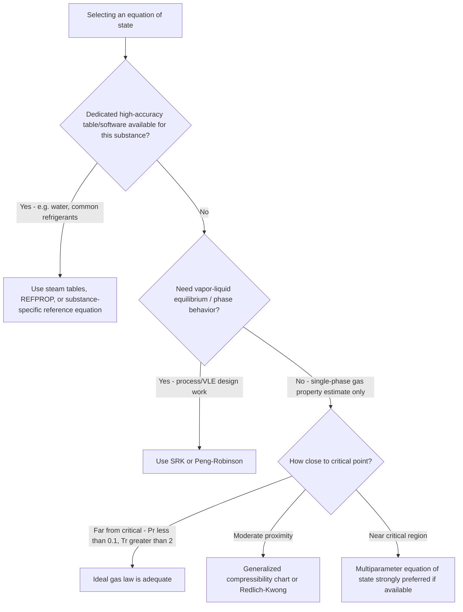

## Generalized Equations of State

### Introduction

Generalized equations of state extend beyond the ideal gas law and simple compressibility charts to provide analytically tractable, substance-independent relationships that capture real-gas behavior across a wide range of pressure and temperature. This section surveys the major classes of generalized equations of state, their theoretical basis, and their comparative accuracy and use cases in thermodynamic analysis.

### Purpose of Generalized Equations of State

**Key Points**

- Provide a mathematical (rather than purely graphical/tabular) relationship between $P$, $v$, and $T$ applicable to many substances via substance-specific constants derived from readily available data (typically critical properties)
- Enable computational implementation in engineering software, where continuous analytical functions are more tractable than interpolating discrete tabulated data
- Bridge the gap between the overly simple ideal gas law and full substance-specific high-accuracy reference equations (like those underlying steam tables), offering a "good enough for most engineering purposes" middle ground
- Essential for substances lacking dedicated high-accuracy property tables, and foundational to phase-equilibrium calculations in chemical and process engineering

### Classification of Generalized Equations of State

### The Van der Waals Equation of State

The historically first and conceptually simplest cubic equation of state:

$$\left(P + \frac{a}{v^2}\right)(v-b) = RT$$

**Physical interpretation of correction terms:**

- $a/v^2$ term: added to pressure to account for the reduction in observed pressure caused by intermolecular attractive forces pulling molecules inward, away from the container walls
- $b$ term: subtracted from specific volume to account for the finite physical volume occupied by molecules themselves, since molecules cannot be compressed into zero volume

**Constants determined from critical-point conditions** (requiring that the critical isotherm have a horizontal inflection point at the critical point on a P-v diagram):

$$a = \frac{27 R^2 T_{cr}^2}{64 P_{cr}}, \qquad b = \frac{R T_{cr}}{8 P_{cr}}$$

**Key Points**

- The van der Waals equation correctly predicts the *qualitative* existence of a critical point and liquid-vapor coexistence, a major conceptual advance over the ideal gas law
- Quantitatively, it is not highly accurate — predicted critical compressibility factor $Z_{cr} = 3/8 = 0.375$ is noticeably higher than the experimentally observed range (typically 0.23–0.29) for most real substances
- Rarely used for precise engineering calculation today, but remains pedagogically important as the conceptual foundation for all subsequent cubic equations of state

### The Redlich-Kwong Equation of State

An improvement over van der Waals, introducing temperature dependence into the attractive-force term:

$$P = \frac{RT}{v-b} - \frac{a}{\sqrt{T}\,v(v+b)}$$

$$a = \frac{0.42748\,R^2 T_{cr}^{2.5}}{P_{cr}}, \qquad b = \frac{0.08664\,R\,T_{cr}}{P_{cr}}$$

**Key Points**

- Provides substantially improved accuracy for vapor-phase properties compared to van der Waals across a wide range of conditions
- Less accurate for liquid-phase density and for vapor-liquid equilibrium (saturation) predictions, since the original formulation does not accurately reproduce vapor pressure curves
- Widely regarded as a good general-purpose equation for gas-phase PVT calculations when higher accuracy than ideal-gas but simpler than a full reference equation of state is needed

### The Soave-Redlich-Kwong (SRK) Equation

Soave's modification replaces the $\sqrt{T}$ temperature dependence with a substance-specific function calibrated using the **acentric factor** $\omega$, substantially improving vapor pressure and vapor-liquid equilibrium predictions:

$$P = \frac{RT}{v-b} - \frac{a\,\alpha(T)}{v(v+b)}$$

$$\alpha(T) = \left[1 + m\left(1 - \sqrt{T_R}\right)\right]^2, \qquad m = 0.480 + 1.574\,\omega - 0.176\,\omega^2$$

**Key Points**

- The **acentric factor** $\omega$ is a substance-specific empirical parameter quantifying deviation of a molecule's shape/polarity from the spherical, non-polar behavior assumed by simple corresponding-states theory; tabulated for most common substances alongside critical properties
- SRK is widely used in the natural gas and petroleum refining industries for vapor-liquid equilibrium calculations, phase envelope construction, and process simulation
- Represented a major practical advance because it enabled accurate simultaneous prediction of both vapor and liquid phase behavior from a single equation, useful for flash calculations in process design

### The Peng-Robinson Equation of State

A further refinement, adjusting the functional form of the attractive term to improve liquid density predictions specifically:

$$P = \frac{RT}{v-b} - \frac{a\,\alpha(T)}{v(v+b) + b(v-b)}$$

$$a = \frac{0.45724\,R^2 T_{cr}^2}{P_{cr}}, \qquad b = \frac{0.07780\,R\,T_{cr}}{P_{cr}}$$

$$\alpha(T) = \left[1 + \kappa\left(1-\sqrt{T_R}\right)\right]^2, \qquad \kappa = 0.37464 + 1.54226\,\omega - 0.26992\,\omega^2$$

**Key Points**

- Peng-Robinson generally provides improved liquid-density accuracy compared to SRK while retaining comparable accuracy for vapor-phase properties and vapor pressure prediction
- Extremely widely used in petroleum, natural gas, and chemical process simulation software as a default or near-default equation of state choice
- Both SRK and Peng-Robinson remain **cubic** in specific volume (i.e., third-degree polynomial when expanded), which is computationally convenient since cubic equations have closed-form root-finding methods, unlike higher-order multiparameter equations

### Comparative Accuracy Summary

| Equation of State | Vapor-Phase Accuracy | Liquid-Phase Accuracy | VLE / Saturation Accuracy | Computational Complexity |
| --- | --- | --- | --- | --- |
| Van der Waals | Moderate | Poor | Poor | Very simple |
| Redlich-Kwong | Good | Poor-Moderate | Moderate | Simple |
| Soave-Redlich-Kwong | Good | Moderate | Good | Simple |
| Peng-Robinson | Good | Good | Good | Simple |
| Virial (truncated) | Good (low-moderate density) | Not applicable | Not applicable | Simple |
| Multiparameter (IAPWS-IF97, REFPROP) | Excellent | Excellent | Excellent | High |

[Inference: qualitative accuracy rankings summarized here reflect general consensus in thermodynamics and process engineering references; exact accuracy for any specific substance and condition range should be verified against validated data for that application.]

### The Virial Equation of State

Rooted more directly in statistical mechanics than the empirical cubic equations, the virial equation expresses compressibility factor as a power series in $1/v$ (or equivalently in $P$):

$$Z = 1 + \frac{B}{v} + \frac{C}{v^2} + \frac{D}{v^3} + \cdots$$

**Key Points**

- $B(T)$, the second virial coefficient, accounts for pairwise (two-body) molecular interactions and is the most commonly used truncation for engineering estimates at low-to-moderate density
- $C(T)$, the third virial coefficient, accounts for three-body interactions and becomes significant only at higher densities
- Truncating after $B$ gives: $Z \approx 1 + B(T)/v$, valid up to roughly the critical density for many gases, but increasingly inaccurate near and above the critical point where higher-order terms become significant
- Generalized correlations exist for estimating $B(T)$ from reduced properties (e.g., the Pitzer correlation), extending virial-based estimation to substances lacking direct experimental $B(T)$ data

### The Pitzer Acentric Factor Correlation for Z

An alternative generalized approach to the standard two-parameter ($P_R$, $T_R$) compressibility chart incorporates the acentric factor as a third correlating parameter, improving accuracy for non-spherical or polar molecules:

$$Z = Z^{(0)} + \omega Z^{(1)}$$

where $Z^{(0)}$ is the compressibility factor for a hypothetical simple fluid (zero acentric factor, e.g., argon-like behavior) and $Z^{(1)}$ is a correction term, both tabulated or correlated as functions of $P_R$ and $T_R$.

**Key Points**

- This **three-parameter corresponding states principle** ($P_R$, $T_R$, $\omega$) provides meaningfully better accuracy than the simple two-parameter Nelson-Obert chart, particularly for polar or elongated molecules that deviate from the simple-fluid assumption
- The acentric factor $\omega$ is defined based on the reduced vapor pressure at $T_R = 0.7$: $\omega = -\log_{10}(P_{sat}/P_{cr})_{T_R=0.7} - 1$, calibrated so that $\omega \approx 0$ for simple spherical molecules like argon and krypton

### Multiparameter Reference Equations of State

For applications demanding the highest achievable accuracy (steam tables, refrigerant property databases, custody-transfer natural gas metering), **multiparameter equations of state** are used instead of generalized cubic equations.

**Key Points**

- These equations use dozens to over a hundred empirically fitted terms (often expressed as a Helmholtz energy function of density and temperature) calibrated against extensive experimental data for a *single specific substance*
- **IAPWS-IF97** (International Association for the Properties of Water and Steam, Industrial Formulation 1997) is the reference standard underlying modern steam tables and software used in power plant engineering
- **NIST REFPROP** implements substance-specific multiparameter equations of state for a very wide range of pure fluids and mixtures, generally considered the highest-accuracy generalized computational tool available for engineering use
- These equations are not analytically simple (unlike cubic equations) and are essentially always evaluated via software rather than hand calculation, since they typically require iterative numerical solution even to find specific volume given pressure and temperature

### Worked Example: Comparing Equations of State

**Problem:** Estimate the specific volume of methane at $T = 200 \text{ K}$, $P = 5 \text{ MPa}$ using (a) the ideal gas law and (b) the Redlich-Kwong equation. Methane properties: $T_{cr} = 190.6 \text{ K}$, $P_{cr} = 4.60 \text{ MPa}$, $R = 0.5182 \text{ kJ/(kg·K)}$.

**Solution (a) — Ideal gas:**

$$v_{ideal} = \frac{RT}{P} = \frac{(0.5182)(200)}{5000} = 0.02073 \text{ m}^3/\text{kg}$$

**Solution (b) — Redlich-Kwong constants:**

$$a = \frac{0.42748 R^2 T_{cr}^{2.5}}{P_{cr}} = \frac{0.42748 (0.5182)^2 (190.6)^{2.5}}{4600} \approx 32.53 \text{ (in consistent SI-based units for this equation form)}$$

$$b = \frac{0.08664 R T_{cr}}{P_{cr}} = \frac{0.08664 (0.5182)(190.6)}{4600} \approx 0.001862 \text{ m}^3/\text{kg}$$

Solving $P = \dfrac{RT}{v-b} - \dfrac{a}{\sqrt{T}\,v(v+b)}$ iteratively for $v$ at $T=200$ K, $P=5000$ kPa yields $v_{RK} \approx 0.0179 \text{ m}^3/\text{kg}$ [Unverified: value obtained via iterative numerical solution; presented as illustrative of the expected direction and magnitude of correction rather than a fully verified precision result].

**Comparison:** The Redlich-Kwong estimate is roughly 14% lower than the ideal gas estimate, illustrating the direction of correction expected: at $T_R = 200/190.6 = 1.049$ (near critical temperature) and $P_R = 5/4.60 = 1.09$ (near critical pressure), methane is close enough to its critical region that attractive intermolecular forces measurably reduce specific volume below the ideal gas prediction — consistent with $Z < 1$ behavior in this region of the generalized compressibility chart.

### Selecting an Equation of State in Practice

### Common Errors and Misconceptions

**Key Points**

- Treating cubic equations of state (van der Waals, RK, SRK, Peng-Robinson) as universally interchangeable in accuracy — they differ meaningfully, particularly for liquid-phase and saturation predictions
- Applying a two-parameter ($P_R$, $T_R$) correlation to strongly polar or associating fluids (e.g., water, ammonia, alcohols) without acentric-factor or polarity corrections, where two-parameter corresponding states is known to be less accurate
- Assuming cubic equations of state provide steam-table-level accuracy for water — dedicated multiparameter formulations (IAPWS-IF97) remain substantially more accurate for water/steam and should be preferred whenever available
- Neglecting that critical constants ($T_{cr}$, $P_{cr}$, $\omega$) must be substance-specific and correctly sourced — using incorrect or mismatched critical property data invalidates any generalized equation of state result regardless of which equation form is used
- Forgetting that most generalized cubic equations require iterative (not direct algebraic) solution for specific volume at a given $P$ and $T$, since they are cubic in $v$

### Relevance to Power and Energy Systems

**Key Points**

- Natural gas processing, transmission, and custody-transfer metering rely heavily on SRK, Peng-Robinson, and specialized multiparameter equations (e.g., AGA8/GERG-2008) for accurate volumetric and energy-content calculations
- Supercritical CO₂ power cycle design requires highly accurate equations of state near CO₂'s critical point, where generalized cubic equations show their largest deviations and dedicated reference equations (e.g., Span-Wagner for CO₂) are preferred for turbomachinery and heat exchanger design
- Combustion and gas turbine cycle simulations commonly use cubic equations of state (rather than the ideal gas law) when higher fidelity is needed for high-pressure combustor and compressor modeling
- Refrigerant development and cycle simulation software rely on multiparameter reference equations of state (via REFPROP or equivalent) to evaluate emerging low-GWP refrigerant blends where full experimental property tables may not yet be as mature as for legacy refrigerants

### Related Topics

- The Ideal Gas Equation of State
- Compressibility Factor and Real Gas Behavior
- Property Tables and Charts for Steam and Refrigerants
- Vapor-Liquid Equilibrium and Phase Envelope Construction
- Supercritical CO2 Power Cycles
- Natural Gas Processing and Custody Transfer Metering