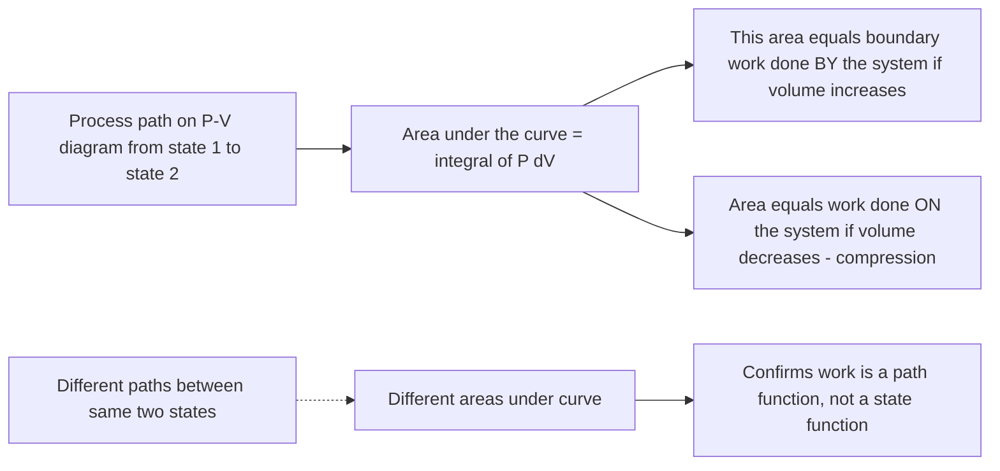

## Energy Balance for Closed Systems

### Introduction

The energy balance for a closed system is the direct engineering application of the first law of thermodynamics — the principle of conservation of energy — to systems that exchange energy with their surroundings but not mass. This formulation underlies the analysis of piston-cylinder devices, rigid tanks, and any process where a fixed quantity of matter undergoes heating, cooling, compression, or expansion.

### Definition of a Closed System

A **closed system** (also called a control mass) is a fixed quantity of matter with a boundary that mass cannot cross, though energy in the form of heat and/or work may cross the boundary freely. The boundary itself may be fixed or movable (as in a piston-cylinder device).

**Key Points**

- Contrast with an **open system** (control volume), where both mass and energy may cross the boundary
- Contrast with an **isolated system**, where neither mass nor energy crosses the boundary
- Closed system analysis is fundamental to reciprocating engines during individual strokes, sealed rigid tanks, and piston-cylinder compression/expansion processes

### The First Law of Thermodynamics for a Closed System

The first law states that energy is conserved: energy cannot be created or destroyed, only converted from one form to another or transferred between a system and its surroundings.

**General statement (net energy transfer = net change in total energy):**

$$Q - W = \Delta E$$

where:

- $Q$ = net heat transfer to the system (positive when heat enters the system)
- $W$ = net work done by the system (positive when work is done by the system on the surroundings)
- $\Delta E$ = change in total energy of the system

**Sign convention** (traditional/classical convention, widely used in engineering thermodynamics):

- $Q > 0$: heat added to the system
- $Q < 0$: heat removed from the system
- $W > 0$: work done by the system
- $W < 0$: work done on the system

**Key Points**

- An alternative sign convention treats both heat and work as positive when they add energy to the system ($\Delta E = Q + W$, with $W$ positive when done *on* the system) — this convention is increasingly common in modern textbooks and software; the two conventions are mathematically equivalent but must not be mixed within a single calculation

### Total Energy of a System

The total energy $E$ of a closed system comprises internal, kinetic, and potential energy:

$$E = U + KE + PE = U + \frac{1}{2}mV^2 + mgz$$

For a stationary closed system with negligible changes in kinetic and potential energy (the most common simplifying assumption in basic thermodynamic cycle analysis):

$$\Delta E = \Delta U$$

giving the commonly used simplified form:

$$Q - W = \Delta U$$

**Key Points**

- $U$ is internal energy — energy stored at the molecular level (translational, rotational, vibrational molecular motion and intermolecular potential energy)
- Neglecting $\Delta KE$ and $\Delta PE$ is valid for the vast majority of stationary thermodynamic system analyses (rigid tanks, piston-cylinders at rest), but is *not* valid for flow systems with significant velocity or elevation change (addressed separately in the energy balance for control volumes)

### Differential and Integrated Forms

**Differential form** (for a small/incremental process):

$$\delta Q - \delta W = dU$$

The use of $\delta$ (rather than $d$) for heat and work signifies that they are **path functions** (inexact differentials) — their values depend on the process path, not just the initial and final states. In contrast, $U$ is a **point function** (state function, exact differential) — $dU$ depends only on the initial and final states.

**Integrated form for a process from state 1 to state 2:**

$$Q_{1\to2} - W_{1\to2} = U_2 - U_1$$

**Key Points**

- $Q_{1\to2}$ and $W_{1\to2}$ (sometimes written $_1Q_2$ and $_1W_2$) explicitly denote the total heat and work exchanged *during* the process, not properties of any single state
- $U_2 - U_1 = \Delta U$ depends only on the endpoint states, regardless of the specific process path taken between them — this path-independence is the defining characteristic of a thermodynamic property

### Specific (Per-Unit-Mass) Form

For a system of mass $m$, the energy balance is often expressed per unit mass using lowercase specific properties:

$$q - w = \Delta u = u_2 - u_1$$

where $q = Q/m$ (kJ/kg) and $w = W/m$ (kJ/kg).

### Forms of Work in Closed Systems

**Boundary (moving-boundary) work**, the most common work mode for closed systems (e.g., piston-cylinder devices), arises from the system boundary moving against an external pressure:

$$W_{boundary} = \int_1^2 P \, dV$$

**Key Points**

- For a **constant-pressure (isobaric) process**: $W_{boundary} = P(V_2 - V_1) = P \Delta V$
- For a **constant-volume (isochoric) process**: $W_{boundary} = 0$ (no boundary displacement, hence no boundary work, regardless of pressure change)
- For an **isothermal ideal gas process**: $W_{boundary} = mRT \ln(V_2/V_1)$
- For a **polytropic process** ($Pv^n = \text{constant}$, $n \neq 1$): $W_{boundary} = \dfrac{P_2V_2 - P_1V_1}{1-n}$
- Other work modes may also appear in closed-system problems: electrical work ($W_{elec} = VI\,\Delta t$), shaft work (via a stirrer or paddle wheel), and spring work — all of which add to (or must be separated from) boundary work in the total work term

### The Boundary Work Integral on a P-V Diagram

Boundary work corresponds geometrically to the **area under the process curve** on a P-V diagram.

**Key Points**

- Because boundary work equals the area under the process path, two different processes connecting the *same* initial and final states generally yield *different* amounts of boundary work — direct confirmation that work is a path function
- This is in sharp contrast to $\Delta U$, which is identical regardless of path between the same two endpoint states, since internal energy is a property

### Worked Example 1: Constant-Pressure Heating with Boundary Work

**Problem:** A piston-cylinder device contains 2 kg of water at 100 kPa, initially at 25°C. Heat is added at constant pressure until the water becomes saturated vapor. Determine the boundary work done and the heat transfer required.

**Solution:**

From saturated water tables at 100 kPa: $T_{sat} = 99.63°C$, $v_f = 0.001043$, $v_g = 1.6941 \text{ m}^3/\text{kg}$, $u_f = 417.36$, $u_{fg} = 2088.7$, $u_g = 2506.1$ kJ/kg (illustrative table values).

Since the initial state (25°C, 100 kPa) is compressed liquid, approximate $v_1 \approx v_f$ at 25°C $\approx 0.001003 \text{ m}^3/\text{kg}$, $u_1 \approx u_f$ at 25°C $\approx 104.83$ kJ/kg.

Final state is saturated vapor at 100 kPa: $v_2 = v_g = 1.6941 \text{ m}^3/\text{kg}$, $u_2 = u_g = 2506.1$ kJ/kg.

**Boundary work** (constant pressure process):

$$W = mP(v_2 - v_1) = (2)(100)(1.6941 - 0.001003) = (2)(100)(1.6931) = 338.6 \text{ kJ}$$

**Energy balance** (neglecting $\Delta KE$, $\Delta PE$):

$$Q = \Delta U + W = m(u_2-u_1) + W = 2(2506.1 - 104.83) + 338.6 = 2(2401.27) + 338.6 = 4802.5 + 338.6 = 5141.1 \text{ kJ}$$

**Note:** This example demonstrates a common shortcut for constant-pressure closed-system processes: $Q = \Delta U + W = \Delta U + P\Delta V = \Delta H$ (change in enthalpy), since $H \equiv U + PV$ by definition. This is why enthalpy is specifically defined and tabulated — it directly gives the heat transfer for constant-pressure closed-system processes without a separate boundary work calculation.

### Worked Example 2: Constant-Volume Process (Rigid Tank)

**Problem:** A rigid tank contains 3 kg of air at 200 kPa and 300 K. Heat is added until the temperature reaches 500 K. Determine the heat transfer.

**Solution:**

Since the tank is rigid, $V = \text{constant}$, so $W_{boundary} = 0$.

$$Q = \Delta U = m c_v \Delta T = (3)(0.718)(500-300) = (3)(0.718)(200) = 430.8 \text{ kJ}$$

**Key Point:** For any rigid (constant-volume) closed system, the energy balance simplifies directly to $Q = \Delta U$, since no boundary work is possible.

### Worked Example 3: Adiabatic Compression

**Problem:** Air in an insulated piston-cylinder device is compressed from 100 kPa, 300 K to 500 kPa. Determine the work done on the gas, assuming a reversible adiabatic (isentropic) process with $k = 1.4$.

**Solution:**

Adiabatic means $Q = 0$, so the energy balance reduces to: $-W = \Delta U$, i.e., $W = -\Delta U = U_1 - U_2$.

First find $T_2$ using the isentropic relation:

$$\frac{T_2}{T_1} = \left(\frac{P_2}{P_1}\right)^{(k-1)/k} = \left(\frac{500}{100}\right)^{0.4/1.4} = (5)^{0.2857} = 1.5838$$

$$T_2 = 300 \times 1.5838 = 475.1 \text{ K}$$

Per unit mass, using $c_v = 0.718 \text{ kJ/(kg·K)}$:

$$w = -\Delta u = -c_v(T_2 - T_1) = -0.718(475.1 - 300) = -0.718(175.1) = -125.7 \text{ kJ/kg}$$

The negative value confirms work is done *on* the gas (consistent with compression), matching the sign convention where $W>0$ denotes work done *by* the system.

### Energy Balance for Cyclic Processes

For a system undergoing a complete **thermodynamic cycle** (returning to its exact initial state), the net change in any property — including internal energy — over the complete cycle is zero, since the system returns to the same state:

$$\oint dU = 0 \quad \Rightarrow \quad Q_{net,cycle} = W_{net,cycle}$$

This is the foundational relationship underlying all power cycle analysis (Rankine, Brayton, Otto, Diesel): the net work output of a cycle equals the net heat input, since internal energy returns to its starting value after one complete cycle.

### Diagram: Energy Balance Schematic for a Closed System (svg_diagram)

<svg xmlns="http://www.w3.org/2000/svg" viewBox="0 0 700 380" font-family="Arial, sans-serif">
<text x="350" y="26" text-anchor="middle" font-size="16" font-weight="bold" fill="#1a1a1a">Closed System Energy Balance (svg_diagram)</text>

<rect x="220" y="100" width="260" height="180" rx="10" fill="#eaf2f8" stroke="#2c5f8a" stroke-width="2" stroke-dasharray="6,4" />
<text x="350" y="150" text-anchor="middle" font-size="13" fill="#1a1a1a" font-weight="bold">Closed System</text>
<text x="350" y="175" text-anchor="middle" font-size="12" fill="#1a1a1a">Mass m (fixed)</text>
<text x="350" y="200" text-anchor="middle" font-size="12" fill="#1a1a1a">Internal Energy U</text>
<text x="350" y="225" text-anchor="middle" font-size="11" fill="#555">(no mass crosses boundary)</text>

<line x1="100" y1="150" x2="215" y2="150" stroke="#c0392b" stroke-width="3" marker-end="url(#arrowRed)" />
<text x="150" y="140" font-size="12" fill="#c0392b" font-weight="bold">Q (heat)</text>

<line x1="485" y1="220" x2="600" y2="220" stroke="#27ae60" stroke-width="3" marker-end="url(#arrowGreen)" />
<text x="500" y="210" font-size="12" fill="#27ae60" font-weight="bold">W (work)</text>

<rect x="200" y="300" width="300" height="50" fill="#f4f4f4" stroke="#ccc" rx="6" />
<text x="350" y="330" text-anchor="middle" font-size="14" fill="#1a1a1a" font-weight="bold">Q - W = ΔU</text>
</svg>

### Common Errors in Closed-System Energy Balance Analysis

**Key Points**

- Mixing sign conventions within a single problem (e.g., treating work done on the system as positive in one line and negative in another) — always fix and clearly state the convention before beginning
- Applying $W_{boundary} = P\Delta V$ to a non-constant-pressure process without integrating $\int P\,dV$ properly over the actual pressure-volume relationship
- Forgetting that $W_{boundary} = 0$ specifically for rigid (constant-volume) systems, but *not* zero if other work modes (electrical, shaft/stirring work) are present even in a rigid system
- Neglecting to check whether kinetic and potential energy changes are actually negligible before dropping them from the energy balance — significant velocity or elevation changes invalidate the simplification $\Delta E = \Delta U$
- Using the wrong specific heat ($c_v$ vs. $c_p$) — $c_v$ applies to $\Delta u$ for an ideal gas regardless of the actual process type, while $c_p$ applies to $\Delta h$; the process being constant-volume or constant-pressure determines which combination simplifies the energy balance most directly, not which specific heat is "allowed" to be used for $\Delta u$ or $\Delta h$ calculations
- Assuming $Q=0$ for a well-insulated system without confirming the process is also quasi-equilibrium/reversible when applying isentropic relations (an adiabatic process is not necessarily isentropic if irreversibilities such as friction are present)

### Relevance to Power and Energy Systems

**Key Points**

- Reciprocating internal combustion engine analysis (Otto and Diesel air-standard cycles) applies the closed-system energy balance to each individual stroke (compression, combustion/heat addition, expansion, heat rejection) of the piston-cylinder assembly
- Batch/closed autoclave and pressure vessel heating processes in industrial energy systems are directly modeled using rigid-tank (constant-volume) closed-system energy balances
- Cyclic closed-system analysis ($Q_{net} = W_{net}$ over a complete cycle) is the conceptual starting point for evaluating the thermal efficiency of any power-producing cycle: $\eta_{th} = W_{net}/Q_{in}$
- Compression and expansion processes in gas-based energy storage and small-scale reciprocating compressors are directly analyzed using polytropic or isentropic closed-system work relations

### Related Topics

- Boundary Work and Other Work Modes
- Specific Heats and Internal Energy of Ideal Gases
- Enthalpy: Definition and Physical Significance
- Energy Balance for Control Volumes (Open Systems)
- Air-Standard Otto and Diesel Cycles
- Second Law Analysis: Reversibility and Irreversibility in Closed Systems