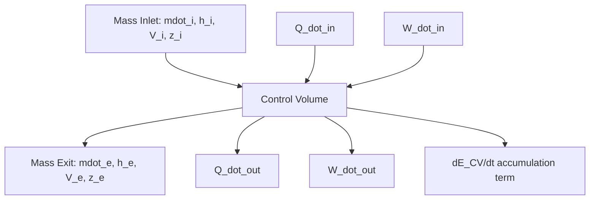

## Energy Balance for Control Volumes

### Conceptual Overview

A **control volume (CV)** is a fixed or deformable region in space chosen for thermodynamic analysis, through whose boundary (the **control surface**) mass, heat, and work may cross. Unlike a closed system (fixed mass, no mass crossing the boundary), a control volume analysis is essential for devices with mass flow, such as turbines, compressors, pumps, nozzles, heat exchangers, and throttling valves.

The general energy balance for a control volume is a statement of the First Law of Thermodynamics extended to account for energy transported by flowing mass, in addition to heat and work interactions at the boundary.

### General Energy Balance (Unsteady Form)

For a control volume, the rate form of the energy balance is:

$$\dot{E}_{in} - \dot{E}_{out} = \frac{dE_{CV}}{dt}$$

Expanding the inflow and outflow terms to include heat, work, and energy carried by mass flow:

$$\dot{Q}_{in} - \dot{Q}_{out} + \dot{W}_{in} - \dot{W}_{out} + \sum_{in} \dot{m}_i \theta_i - \sum_{out} \dot{m}_e \theta_e = \frac{dE_{CV}}{dt}$$

where $\theta$ represents the total specific energy of the flowing stream (per unit mass):

$$\theta = h + \frac{V^2}{2} + gz$$

Here, $h$ is specific enthalpy, $\frac{V^2}{2}$ is specific kinetic energy, and $gz$ is specific potential energy. Enthalpy (rather than internal energy $u$) appears because it inherently accounts for the **flow work** ($Pv$) required to push mass across the control surface.

### Why Enthalpy Replaces Internal Energy Plus Flow Work

When mass enters or exits a control volume, work must be done to push that mass across the boundary against the local pressure. This **flow work** (or flow energy) per unit mass is:

$$w_{flow} = Pv$$

Combining this flow work with the internal energy of the flowing fluid produces enthalpy:

$$h = u + Pv$$

This combination is standard and appears automatically once mass-flow terms are included in the energy balance; it is not a separate additional term but embedded within $\theta$.

### Steady-Flow Energy Equation (SFEE)

Many practical devices (turbines, compressors, nozzles, heat exchangers) operate under **steady-flow conditions**, meaning:

1. No properties change with time at any point within the CV ($dE_{CV}/dt = 0$).
2. Mass flow rates in and out are constant and equal in total ($\sum \dot{m}_i = \sum \dot{m}_e$).
3. Fluid properties may vary spatially across the inlet/exit but not temporally.

Under these conditions, the energy balance reduces to the **Steady-Flow Energy Equation**:

$$\dot{Q}_{in} - \dot{Q}_{out} + \dot{W}_{in} - \dot{W}_{out} = \sum_{out} \dot{m}_e \left(h_e + \frac{V_e^2}{2} + gz_e\right) - \sum_{in} \dot{m}_i \left(h_i + \frac{V_i^2}{2} + gz_i\right)$$

For a **single-stream, steady-flow device** (one inlet, one exit, $\dot{m}_i = \dot{m}_e = \dot{m}$), this simplifies to the commonly used per-unit-mass form:

$$q - w = (h_e - h_i) + \frac{V_e^2 - V_i^2}{2} + g(z_e - z_i)$$

where $q = \dot{Q}_{net,in}/\dot{m}$ and $w = \dot{W}_{net,out}/\dot{m}$.

**Key Points**

- Kinetic and potential energy changes are frequently negligible for devices with large enthalpy changes (turbines, compressors, boilers, condensers), and are often dropped unless explicitly significant (as in nozzles/diffusers, where kinetic energy change is the entire point).
- Sign conventions must be applied consistently: heat input positive, work output positive, is the most common convention, though some texts use $Q_{net} = Q_{in} - Q_{out}$ and $W_{net} = W_{out} - W_{in}$ directly.

### Schematic of a General Control Volume (svg_diagram)

<svg xmlns="http://www.w3.org/2000/svg" viewBox="0 0 560 320">
<text x="280" y="24" text-anchor="middle" font-size="16" font-weight="bold" fill="#1a1a1a">Control Volume Energy and Mass Flows (svg_diagram)</text>
<rect x="180" y="90" width="200" height="140" rx="12" fill="#d8e2dc" stroke="#3a5a40" stroke-width="2" />
<text x="280" y="165" text-anchor="middle" font-size="15" font-weight="bold" fill="#1a1a1a">Control</text>
<text x="280" y="185" text-anchor="middle" font-size="15" font-weight="bold" fill="#1a1a1a">Volume</text>
<line x1="60" y1="140" x2="180" y2="140" stroke="#1a1a1a" stroke-width="2" marker-end="url(#a1)" />
<text x="65" y="130" font-size="13" fill="#1a1a1a">ṁᵢ, hᵢ, Vᵢ, zᵢ</text>
<line x1="380" y1="180" x2="500" y2="180" stroke="#1a1a1a" stroke-width="2" marker-end="url(#a1)" />
<text x="405" y="170" font-size="13" fill="#1a1a1a">ṁₑ, hₑ, Vₑ, zₑ</text>
<line x1="280" y1="90" x2="280" y2="40" stroke="#c1121f" stroke-width="2" marker-end="url(#a1)" />
<text x="290" y="65" font-size="13" fill="#c1121f">Q̇_in</text>
<line x1="330" y1="230" x2="330" y2="280" stroke="#1d3557" stroke-width="2" marker-end="url(#a1)" />
<text x="340" y="270" font-size="13" fill="#1d3557">Ẇ_out</text>
</svg>

### Application to Common Steady-Flow Devices

| Device | $\Delta$KE, $\Delta$PE | Work | Heat | Simplified Energy Balance |
| --- | --- | --- | --- | --- |
| Turbine | Negligible | $w_{out} > 0$ | Usually negligible/adiabatic | $w_{out} = h_i - h_e$ |
| Compressor/Pump | Negligible | $w_{in} > 0$ | Often negligible | $w_{in} = h_e - h_i$ |
| Nozzle | KE significant | None | Usually negligible | $\frac{V_e^2 - V_i^2}{2} = h_i - h_e$ |
| Diffuser | KE significant | None | Usually negligible | $\frac{V_i^2 - V_e^2}{2} = h_e - h_i$ |
| Heat Exchanger | Negligible | None | Significant | $q = h_e - h_i$ (per stream) |
| Throttling Valve | Negligible | None | Negligible (adiabatic) | $h_i \approx h_e$ |

For the **throttling valve**, the near-equality of inlet and exit enthalpy ($h_i \approx h_e$) is a special and frequently tested case: since $w = 0$, $q \approx 0$, and $\Delta KE, \Delta PE \approx 0$, the SFEE collapses to an isenthalpic process.

### Worked Example

**Example**

Steam enters an adiabatic turbine at $h_i = 3200\ \text{kJ/kg}$ with negligible velocity and exits at $h_e = 2400\ \text{kJ/kg}$ with a velocity of $V_e = 150\ \text{m/s}$. The mass flow rate is $\dot{m} = 5\ \text{kg/s}$. Determine the power output.

**Step 1 — Apply SFEE per unit mass** (adiabatic: $q = 0$; $\Delta PE$ negligible; $V_i \approx 0$):

$$-w = (h_e - h_i) + \frac{V_e^2 - V_i^2}{2}$$

$$w = (h_i - h_e) - \frac{V_e^2}{2}$$

**Step 2 — Substitute values** (convert $V_e^2/2$ from $\text{m}^2/\text{s}^2$ to $\text{kJ/kg}$ by dividing by 1000):

$$\frac{V_e^2}{2} = \frac{(150)^2}{2} = 11{,}250\ \text{J/kg} = 11.25\ \text{kJ/kg}$$

$$w = (3200 - 2400) - 11.25 = 788.75\ \text{kJ/kg}$$

**Step 3 — Total power output:**

$$\dot{W}_{out} = \dot{m} \cdot w = 5 \times 788.75 = 3943.75\ \text{kW} \approx 3.94\ \text{MW}$$

**Step 4 — Interpretation:** The kinetic energy term contributes only about 1.4% to the total work here, illustrating why $\Delta KE$ is frequently neglected in turbine analysis unless exit velocities are unusually large. [Inference: the magnitude of this contribution is problem-specific and should not be assumed negligible without checking, particularly for nozzles or high-velocity exhaust applications.]

### Multiple-Inlet, Multiple-Exit Systems

For control volumes with multiple streams (e.g., mixing chambers, feedwater heaters), the full steady-flow balance retains the summation form:

$$\dot{Q}_{net,in} + \dot{W}_{net,in} = \sum_{out} \dot{m}_e \theta_e - \sum_{in} \dot{m}_i \theta_i$$

combined with **conservation of mass** at steady state:

$$\sum_{in} \dot{m}_i = \sum_{out} \dot{m}_e$$

Both equations must be solved simultaneously in problems involving mixing of streams at different states, since the exit state depends on the mass-weighted mixture of enthalpies from all inlets.

### Unsteady (Transient) Control Volume Analysis

For processes where properties within the CV change with time (e.g., charging/discharging a tank), the full unsteady form must be retained and integrated over the time interval $\Delta t$:

$$Q_{in} - Q_{out} + W_{in} - W_{out} + \sum_{in} m_i \theta_i - \sum_{out} m_e \theta_e = (m_2 u_2 - m_1 u_1)_{CV}$$

Note that the **CV energy content** uses internal energy $u$ (since mass residing inside the CV does no flow work), while the **entering/exiting streams** use $\theta$ (built on enthalpy $h$), since they do perform flow work at the boundary. [Inference: this distinction — internal energy for CV contents vs. enthalpy for boundary-crossing streams — is a frequent source of error in transient problems and warrants careful attention during setup.]

### Cycle-Level Representation

### Practical Implications and Design Notes

- **Sign convention discipline**: Because CV problems frequently involve both heat and work crossing the boundary simultaneously (unlike many closed-system problems), consistent sign convention is critical; textbook variation on this point is common and should be verified against the specific reference in use.
- **Idealization assumptions**: The steady-flow assumption is an idealization; real devices experience startup/shutdown transients, but once operating conditions stabilize, the SFEE provides excellent accuracy for design-point analysis.
- **Reference state consistency**: Enthalpy values from steam tables or ideal-gas tables must be drawn from a single consistent reference state for a given calculation; mixing tables with different reference datums silently introduces error. [Unverified: the exact reference states used vary by table/source and should be checked against the specific dataset used in a given problem.]

**Related Topics**

- Conservation of Mass for Control Volumes (Continuity Equation)
- First Law Analysis of Closed Systems
- Steady-Flow Devices: Turbines, Compressors, Nozzles, Throttling Valves
- Ideal Gas and Incompressible Substance Enthalpy Models
- Transient (Uniform-Flow) Processes: Tank Charging and Discharging
- Second-Law Analysis of Control Volumes (Entropy Balance, Exergy Destruction)