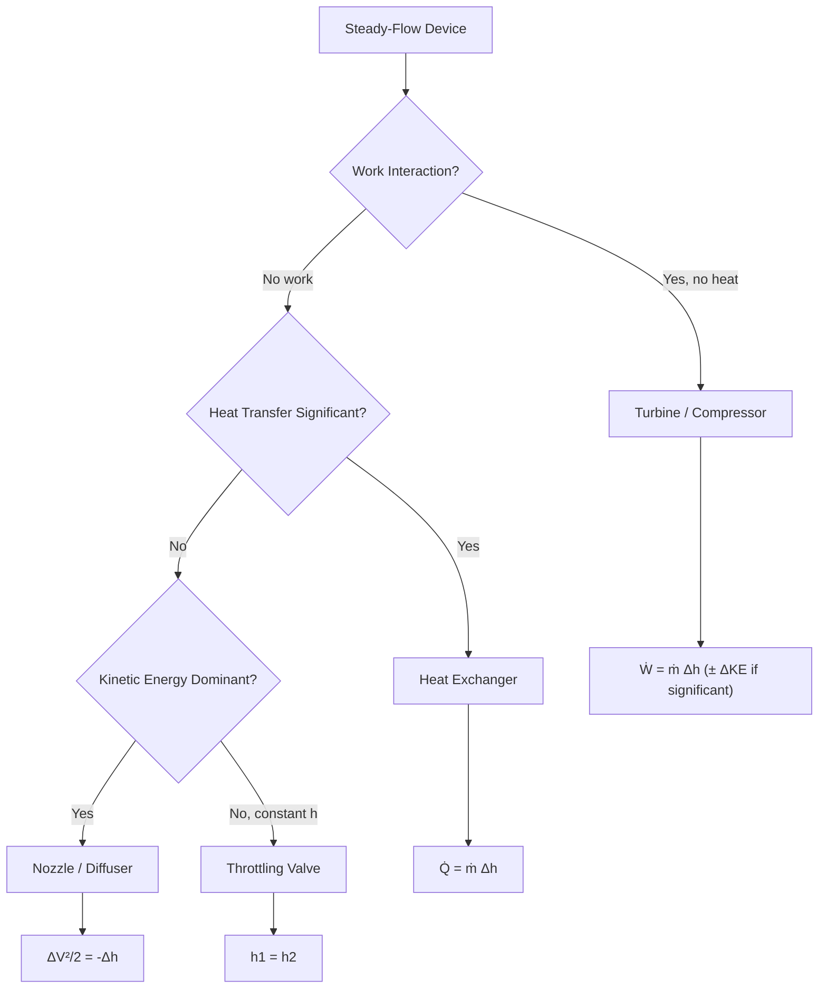

## The Steady-Flow Energy Equation

### Definition and Physical Basis

The Steady-Flow Energy Equation (SFEE) is the control-volume form of the First Law of Thermodynamics applied to open systems in which mass crosses the system boundary. It governs devices such as turbines, compressors, nozzles, heat exchangers, and pumps, where fluid flows continuously into and out of a control volume while the properties at any fixed point within that volume do not change with time.

"Steady flow" implies two conditions hold simultaneously:

- **No property changes with time** at any point in the control volume ($\partial/\partial t = 0$ for all properties)
- **Mass flow rate in equals mass flow rate out** ($\dot{m}_{in} = \dot{m}_{out} = \dot{m}$), so no mass accumulates inside the control volume

Under these conditions, the total energy content of the control volume itself remains constant, even though energy continuously flows through it.

### Derivation from the General Energy Balance

The general First Law for a control volume states that the rate of energy change inside equals the net rate of energy transfer in via heat, work, and mass flow:

$$\frac{dE_{cv}}{dt} = \dot{Q} - \dot{W} + \sum \dot{m}_{in}\theta_{in} - \sum \dot{m}_{out}\theta_{out}$$

where $\theta$ represents the specific energy carried by the flowing fluid, which includes internal energy, flow work (pressure-volume work needed to push mass across the boundary), kinetic energy, and potential energy:

$$\theta = u + pv + \frac{V^2}{2} + gz$$

The combination $u + pv$ defines specific enthalpy, $h$. Substituting this and applying the steady-flow condition ($dE_{cv}/dt = 0$) collapses the equation to a balance between energy entering and leaving with the flow streams, heat, and work.

### The Standard Form

For a single-inlet, single-outlet steady-flow device, the SFEE is most commonly written on a rate basis as:

$$\dot{Q} - \dot{W} = \dot{m}\left[(h_2 - h_1) + \frac{V_2^2 - V_1^2}{2} + g(z_2 - z_1)\right]$$

**Key Points**

- Subscript 1 denotes the inlet state, subscript 2 the outlet state
- $\dot{Q}$ is the net rate of heat transfer *into* the control volume (positive when heat is added)
- $\dot{W}$ is the net rate of work done *by* the control volume (positive when work is delivered, e.g., by a turbine)
- $h$ already incorporates flow work, so no separate $pv$ term appears
- Kinetic energy uses velocity $V$ at the inlet/outlet cross-section (bulk average, not molecular velocity)
- Potential energy uses elevation $z$ relative to an arbitrary but consistent datum

On a per-unit-mass basis, dividing through by $\dot{m}$:

$$q - w = (h_2 - h_1) + \frac{V_2^2 - V_1^2}{2} + g(z_2 - z_1)$$

where $q = \dot{Q}/\dot{m}$ and $w = \dot{W}/\dot{m}$ are heat and work per unit mass flowing through the device.

### General Multi-Inlet, Multi-Outlet Form

For control volumes with several streams entering and leaving (e.g., a mixing chamber or multi-stream heat exchanger):

$$\dot{Q} - \dot{W} = \sum_{out} \dot{m}_e\left(h_e + \frac{V_e^2}{2} + gz_e\right) - \sum_{in} \dot{m}_i\left(h_i + \frac{V_i^2}{2} + gz_i\right)$$

combined with steady-flow mass conservation:

$$\sum \dot{m}_i = \sum \dot{m}_e$$

### Simplifications for Common Devices

Most engineering devices allow one or more terms to be neglected, producing simplified working equations.

#### Turbines and Compressors

Elevation change is negligible; kinetic energy change is often small relative to enthalpy change (though not always negligible for gas turbines):

$$\dot{W} = \dot{m}(h_1 - h_2) \quad \text{(turbine, adiabatic, } \dot{Q} \approx 0\text{)}$$

$$\dot{W}_{in} = \dot{m}(h_2 - h_1) \quad \text{(compressor, adiabatic)}$$

#### Nozzles and Diffusers

No work is done ($\dot{W} = 0$); heat transfer is negligible due to short residence time; elevation change is negligible. Kinetic energy is the dominant term:

$$\frac{V_2^2 - V_1^2}{2} = h_1 - h_2$$

This is used to compute exit velocity from a nozzle given the enthalpy drop.

#### Throttling Valves

No work, negligible heat transfer, negligible kinetic and potential energy change:

$$h_1 = h_2$$

Throttling is an isenthalpic process — internal energy and specific volume may change, but enthalpy is conserved.

#### Heat Exchangers

No work is done; kinetic and potential energy changes are negligible. For each fluid stream:

$$\dot{Q} = \dot{m}(h_{out} - h_{in})$$

For an adiabatic heat exchanger (heat lost by one stream equals heat gained by the other):

$$\dot{m}_{hot}(h_{in,hot} - h_{out,hot}) = \dot{m}_{cold}(h_{out,cold} - h_{in,cold})$$

#### Pumps

Similar to compressors but for incompressible liquids; often expressed using specific volume $v$ since $\Delta h \approx v\Delta p$ for incompressible flow with negligible temperature rise:

$$\dot{W}_{in} = \dot{m}\,v(p_2 - p_1)$$

### Sign Convention Table

| Quantity | Positive Direction |
| --- | --- |
| $\dot{Q}$ | Heat transfer **into** the control volume |
| $\dot{W}$ | Work done **by** the control volume (output) |
| $h_2 - h_1$ | Enthalpy increase across the device |

**Note:** Some textbooks (particularly European conventions) define $\dot{W}$ as positive when work is done *on* the system. Always verify the sign convention stated in the specific reference before applying the equation. [Unverified — convention varies by textbook and region]

### Worked Example: Adiabatic Turbine

**Given:** Steam enters a turbine at $h_1 = 3500\ \text{kJ/kg}$ with velocity $V_1 = 50\ \text{m/s}$, and exits at $h_2 = 2300\ \text{kJ/kg}$ with velocity $V_2 = 180\ \text{m/s}$. Mass flow rate $\dot{m} = 15\ \text{kg/s}$. Elevation change and heat loss are negligible.

**Solution:**

Apply the SFEE with $\dot{Q} = 0$ and $\Delta pe = 0$:

$$\dot{W} = \dot{m}\left[(h_1 - h_2) - \frac{V_2^2 - V_1^2}{2}\right]$$

Compute the kinetic energy term:

$$\frac{V_2^2 - V_1^2}{2} = \frac{180^2 - 50^2}{2} = \frac{32400 - 2500}{2} = 14950\ \text{J/kg} = 14.95\ \text{kJ/kg}$$

Compute enthalpy drop:

$$h_1 - h_2 = 3500 - 2300 = 1200\ \text{kJ/kg}$$

Net specific work:

$$w = 1200 - 14.95 = 1185.05\ \text{kJ/kg}$$

Power output:

$$\dot{W} = 15 \times 1185.05 = 17775.75\ \text{kW} \approx 17.78\ \text{MW}$$

**Output**

$$\dot{W} \approx 17.78\ \text{MW}$$

This example illustrates that kinetic energy change, while often neglected, reduced the ideal enthalpy-based power estimate by about 1.25% in this case — significant enough to include in precision turbine analysis but sometimes dropped in first-pass estimates.

### Diagram: Generic Steady-Flow Control Volume

<svg xmlns="http://www.w3.org/2000/svg" viewBox="0 0 700 320" font-family="Arial, sans-serif">
<text x="350" y="25" font-size="16" font-weight="bold" text-anchor="middle">Steady-Flow Control Volume (svg_diagram)</text>
<rect x="220" y="80" width="260" height="140" fill="none" stroke="#333" stroke-width="2" rx="6" />
<text x="350" y="155" font-size="14" text-anchor="middle" fill="#333">Control Volume</text>
<text x="350" y="175" font-size="12" text-anchor="middle" fill="#666">(dE_cv/dt = 0)</text>
<line x1="60" y1="150" x2="220" y2="150" stroke="#1a73e8" stroke-width="3" marker-end="url(#arrow1)" />
<text x="140" y="135" font-size="13" text-anchor="middle" fill="#1a73e8">ṁ, h₁, V₁, z₁</text>
<text x="90" y="115" font-size="12" text-anchor="middle" fill="#1a73e8">State 1 (inlet)</text>
<line x1="480" y1="150" x2="640" y2="150" stroke="#e8710a" stroke-width="3" marker-end="url(#arrow1)" />
<text x="560" y="135" font-size="13" text-anchor="middle" fill="#e8710a">ṁ, h₂, V₂, z₂</text>
<text x="600" y="115" font-size="12" text-anchor="middle" fill="#e8710a">State 2 (outlet)</text>
<line x1="350" y1="80" x2="350" y2="20" stroke="#c00" stroke-width="2" marker-end="url(#arrow1)" />
<text x="380" y="50" font-size="13" fill="#c00">Q̇ (heat in)</text>
<line x1="350" y1="280" x2="350" y2="220" stroke="#0a8" stroke-width="2" marker-end="url(#arrow1)" />
<text x="380" y="270" font-size="13" fill="#0a8">Ẇ (work out)</text>
<text x="350" y="300" font-size="11" text-anchor="middle" fill="#555">Q̇ − Ẇ = ṁ[(h₂−h₁) + (V₂²−V₁²)/2 + g(z₂−z₁)]</text>

</svg>

### Diagram: Application Decision Flow

### Common Errors and Misconceptions

- **Confusing closed-system energy balance with SFEE**: The closed-system First Law ($\Delta U = Q - W$) does not include flow work or enthalpy; applying it to an open system omits the $pv$ term embedded in $h$
- **Forgetting flow work**: Students sometimes use internal energy $u$ instead of enthalpy $h$ for flowing streams, which omits the boundary work done in pushing fluid across the control surface
- **Neglecting kinetic energy inappropriately**: Valid for turbines/compressors in many cases, but invalid for nozzles/diffusers where KE change is the entire point of the device
- **Sign errors**: Mixing conventions for $\dot{W}$ (work done by vs. on the system) is one of the most frequent sources of numerical error [Unverified — frequency is anecdotal across engineering pedagogy, not a benchmarked statistic]

### Relationship to the General Energy Equation

The SFEE is a special case of the unsteady (transient) flow energy equation, which retains the $dE_{cv}/dt$ term for filling/emptying processes (e.g., charging a tank). Setting this term to zero, along with the steady mass flow condition, recovers the SFEE. The SFEE is therefore not a separate physical law but the First Law specialized to a particular set of operating conditions.

**Next Steps**

- The Unsteady-Flow (Transient) Energy Equation and tank charging/discharging problems
- Isentropic Efficiency of Turbines and Compressors
- Enthalpy and Ideal Gas Relations ($\Delta h = c_p \Delta T$)
- Nozzle and Diffuser Performance (velocity coefficient, choking conditions)
- The Second Law of Thermodynamics and Entropy Generation in Steady-Flow Devices
- Rankine and Brayton Cycle Analysis Using SFEE at Each Component