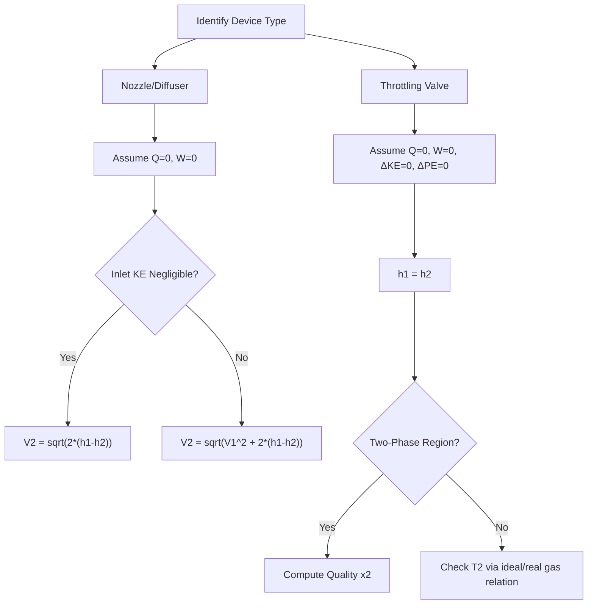

## Applications to Nozzles, Diffusers, and Throttling Devices

### Overview and Common Starting Point

Nozzles, diffusers, and throttling devices are all steady-flow devices analyzed using the Steady-Flow Energy Equation (SFEE), but each simplifies it differently based on its physical function. All three typically share these assumptions:

- No work interaction: $\dot{W} = 0$
- Negligible potential energy change: $g(z_2 - z_1) \approx 0$
- Often negligible or zero heat transfer due to short residence time and small surface area relative to flow rate

The general SFEE:

$$\dot{Q} - \dot{W} = \dot{m}\left[(h_2 - h_1) + \frac{V_2^2 - V_1^2}{2} + g(z_2 - z_1)\right]$$

reduces differently for each device depending on which energy term dominates.

### Nozzles

A nozzle is a device that increases the velocity of a fluid at the expense of pressure. Flow area decreases in the direction of flow (for subsonic flow).

#### Governing Equation

With $\dot{W} = 0$, $\dot{Q} \approx 0$ (adiabatic, justified by short transit time), and $\Delta pe = 0$:

$$0 = (h_2 - h_1) + \frac{V_2^2 - V_1^2}{2}$$

$$\frac{V_2^2 - V_1^2}{2} = h_1 - h_2$$

Solving for exit velocity:

$$V_2 = \sqrt{V_1^2 + 2(h_1 - h_2)}$$

**Key Points**

- Inlet velocity $V_1$ is often small enough to neglect relative to $V_2$, simplifying to $V_2 = \sqrt{2(h_1 - h_2)}$
- Enthalpy drop ($h_1 > h_2$) is converted directly into kinetic energy
- Pressure drops in the flow direction ($p_2 < p_1$)
- For ideal gases, $h_1 - h_2 = c_p(T_1 - T_2)$, so temperature also drops

#### Choked Flow [Inference — extension of standard compressible flow theory, included for completeness]

When a nozzle's exit pressure ratio drops below the critical pressure ratio, flow velocity at the throat reaches the local speed of sound and further downstream pressure reduction does not increase mass flow rate. This is a compressible-flow phenomenon that intersects with but extends beyond the basic energy balance.

### Diffusers

A diffuser is the functional reverse of a nozzle: it decreases fluid velocity and increases pressure. Flow area increases in the direction of flow (for subsonic flow).

#### Governing Equation

Same reduced form as the nozzle, but with the inequality reversed:

$$h_2 - h_1 = \frac{V_1^2 - V_2^2}{2}$$

Here $V_1 > V_2$, so kinetic energy is converted into enthalpy (and hence pressure and/or temperature rise).

**Key Points**

- Common application: jet engine inlets, where incoming high-velocity air is slowed and pressurized before entering the compressor
- Diffuser efficiency is often quantified by how closely the process approaches isentropic (reversible, adiabatic) compression
- Poor diffuser design leads to flow separation and pressure losses, reducing the ideal enthalpy recovery predicted by the energy balance alone [Behavior may vary with actual geometry and flow regime]

### Throttling Devices

A throttling device causes a sudden, significant pressure drop without producing useful work — examples include partially opened valves, capillary tubes, porous plugs, and expansion valves in refrigeration systems.

#### Governing Equation

With $\dot{W} = 0$, $\dot{Q} \approx 0$, and both $\Delta ke$ and $\Delta pe$ negligible (velocities are typically low and roughly equal on both sides):

$$0 = h_2 - h_1$$

$$h_1 = h_2$$

This defines throttling as an **isenthalpic process**.

**Key Points**

- Enthalpy is conserved, but the process is highly irreversible — entropy increases
- For an ideal gas, since $h = h(T)$ only, $h_1 = h_2$ implies $T_1 = T_2$ (no temperature change)
- For a real gas or a liquid-vapor mixture (e.g., refrigerants), throttling can produce a significant temperature drop — this is the **Joule-Thomson effect**, exploited in refrigeration cycles and gas liquefaction
- Throttling always causes an increase in specific volume and often produces flash evaporation if the fluid crosses into the two-phase region (e.g., refrigerant expansion valves)

#### Joule-Thomson Coefficient

The Joule-Thomson coefficient quantifies temperature change per unit pressure drop at constant enthalpy:

$$\mu_{JT} = \left(\frac{\partial T}{\partial p}\right)_h$$

- $\mu_{JT} > 0$: temperature decreases on throttling (cooling effect) — used in liquefaction
- $\mu_{JT} < 0$: temperature increases on throttling
- $\mu_{JT} = 0$: ideal gas behavior (no temperature change)

### Comparison Table

| Device | Purpose | Area Change (subsonic) | Energy Conversion | Governing Relation |
| --- | --- | --- | --- | --- |
| Nozzle | Increase velocity | Decreases | Enthalpy → Kinetic Energy | $V_2 = \sqrt{2(h_1-h_2)}$ |
| Diffuser | Decrease velocity, raise pressure | Increases | Kinetic Energy → Enthalpy | $h_2 - h_1 = (V_1^2-V_2^2)/2$ |
| Throttling Valve | Reduce pressure | N/A (flow restriction) | None (dissipative) | $h_1 = h_2$ |

### Worked Example 1: Nozzle Exit Velocity

**Given:** Air enters a nozzle at $h_1 = 400\ \text{kJ/kg}$ with $V_1 = 30\ \text{m/s}$, and exits at $h_2 = 320\ \text{kJ/kg}$.

**Solution:**

$$V_2 = \sqrt{V_1^2 + 2(h_1 - h_2)} = \sqrt{30^2 + 2(400 - 320) \times 1000}$$

$$V_2 = \sqrt{900 + 160000} = \sqrt{160900} \approx 401.1\ \text{m/s}$$

**Output**

$$V_2 \approx 401.1\ \text{m/s}$$

Note the unit conversion: enthalpy in kJ/kg must be converted to J/kg (×1000) to match velocity units in m/s.

### Worked Example 2: Refrigerant Throttling

**Given:** Refrigerant R-134a enters an expansion valve as saturated liquid at 800 kPa ($h_1 = 95.5\ \text{kJ/kg}$, approximate table value) and is throttled to 200 kPa.

**Solution:**

Since throttling is isenthalpic:

$$h_2 = h_1 = 95.5\ \text{kJ/kg}$$

At 200 kPa, this enthalpy value is checked against saturated liquid and vapor enthalpies at that pressure ($h_f$ and $h_g$ from refrigerant tables). If $h_f < h_2 < h_g$, the fluid exits as a two-phase liquid-vapor mixture, and the quality $x$ is found from:

$$x_2 = \frac{h_2 - h_{f,2}}{h_{g,2} - h_{f,2}}$$

**Conclusion**

This demonstrates the practical significance of throttling in vapor-compression refrigeration: the refrigerant cools and partially vaporizes purely due to the pressure drop, with no heat or work interaction, setting up the low-pressure evaporator inlet condition.

### Diagram: Energy Conversion Comparison

<svg xmlns="http://www.w3.org/2000/svg" viewBox="0 0 700 380" font-family="Arial, sans-serif">
<text x="350" y="25" font-size="16" font-weight="bold" text-anchor="middle">Nozzle vs Diffuser vs Throttle (svg_diagram)</text>

<text x="120" y="60" font-size="13" font-weight="bold" text-anchor="middle">Nozzle</text>

<polygon points="60,80 180,100 180,140 60,160" fill="`#dbe9ff`" stroke="`#1a73e8`" stroke-width="2" />

<text x="45" y="100" font-size="11" text-anchor="end" fill="`#1a73e8`">High h, Low V</text>

<text x="195" y="115" font-size="11" fill="`#1a73e8`">Low h, High V</text>

<text x="350" y="60" font-size="13" font-weight="bold" text-anchor="middle">Diffuser</text>

<polygon points="290,100 410,80 410,160 290,140" fill="`#ffe8d1`" stroke="`#e8710a`" stroke-width="2" />

<text x="275" y="100" font-size="11" text-anchor="end" fill="`#e8710a`">Low h, High V</text>

<text x="425" y="115" font-size="11" fill="`#e8710a`">High h, Low V</text>

<text x="580" y="60" font-size="13" font-weight="bold" text-anchor="middle">Throttle</text>

<rect x="530" y="90" width="100" height="60" fill="none" stroke="#333" stroke-width="2" />

<rect x="570" y="100" width="20" height="40" fill="#999" />

<text x="515" y="115" font-size="11" text-anchor="end" fill="#333">High p</text>

<text x="645" y="115" font-size="11" fill="#333">Low p</text>

<text x="580" y="170" font-size="11" text-anchor="middle" fill="#333">h1 = h2</text>

<line x1="30" y1="220" x2="670" y2="220" stroke="#ccc" stroke-width="1" />
<text x="350" y="250" font-size="12" text-anchor="middle" fill="#555">Nozzle: Δh → ΔKE (accelerate)</text>
<text x="350" y="270" font-size="12" text-anchor="middle" fill="#555">Diffuser: ΔKE → Δh (decelerate, pressurize)</text>
<text x="350" y="290" font-size="12" text-anchor="middle" fill="#555">Throttle: Δp only, h constant, irreversible</text>
</svg>

### Diagram: Analysis Procedure

### Common Errors and Misconceptions

- **Assuming throttling produces no property change at all**: Only enthalpy is conserved; pressure, temperature (for real fluids), specific volume, and entropy all change
- **Neglecting inlet velocity in a diffuser problem**: Diffusers exist specifically to convert significant inlet KE, so it can rarely be dropped the way it sometimes can for a nozzle's exit KE
- **Applying $\Delta h = c_p\Delta T$ during throttling for real gases or two-phase fluids**: This relation only holds for ideal gases; refrigerants and steam require property tables
- **Ignoring the two-phase check in throttling problems**: Failing to verify whether $h_2$ falls between $h_f$ and $h_g$ at the new pressure leads to incorrect assumption of single-phase output

**Next Steps**

- Compressible Flow Fundamentals and the Speed of Sound
- Isentropic Flow Through Converging-Diverging Nozzles
- The Joule-Thomson Effect and Gas Liquefaction Cycles
- Vapor-Compression Refrigeration Cycle Analysis
- Diffuser and Nozzle Efficiency (comparison to isentropic process)
- Property Tables and Two-Phase Region Interpolation