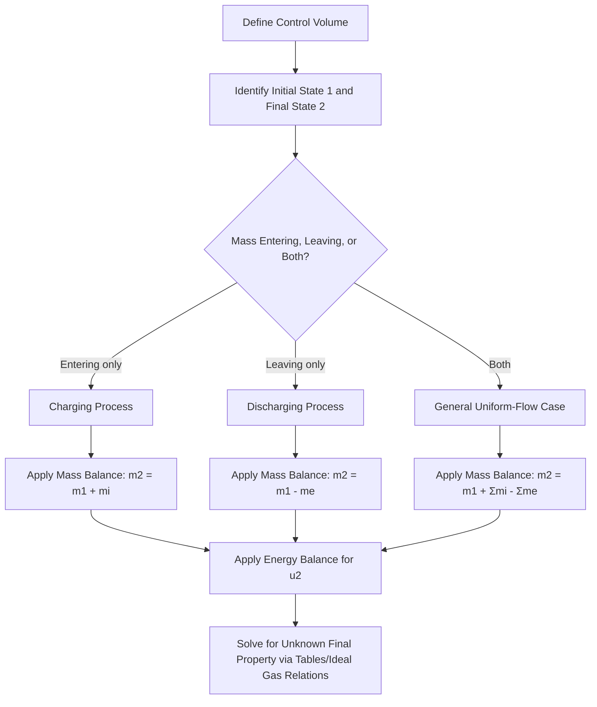

## Unsteady-Flow Processes

### Definition and Physical Basis

Unsteady-flow (also called transient-flow or uniform-flow) processes are open-system processes in which properties within the control volume, and/or the mass flow rates crossing its boundary, change with time. This contrasts with steady-flow processes, where these quantities remain constant. Common examples include charging or discharging a rigid tank, inflating a balloon, filling a cylinder, and venting a pressurized vessel.

Unlike steady-flow analysis, the control volume's total energy and mass content are **not constant** — they change over the duration of the process, so the energy balance must retain time-dependent (or process-integrated) terms rather than collapsing to a simple rate balance.

### General Unsteady-Flow Energy Balance

Starting from the general control-volume First Law:

$$\frac{dE_{cv}}{dt} = \dot{Q} - \dot{W} + \sum \dot{m}_{in}\theta_{in} - \sum \dot{m}_{out}\theta_{out}$$

Integrating over the time interval of the process ($t = 0$ to $t$) gives the **uniform-flow energy equation** in its integrated form:

$$Q - W + \sum_{in} m_i\left(h_i + \frac{V_i^2}{2} + gz_i\right) - \sum_{out} m_e\left(h_e + \frac{V_e^2}{2} + gz_e\right) = (m_2u_2 - m_1u_1)_{cv}$$

**Key Points**

- $Q$ and $W$ are total heat and work transferred during the entire process (not rates)
- $m_i$ and $m_e$ are total masses that entered and exited during the process (not flow rates)
- The right-hand side represents the net change in total internal energy stored in the control volume, from initial state 1 to final state 2
- Kinetic and potential energy terms for the inlet/outlet streams are frequently negligible in tank-filling problems and are often dropped
- The subscript convention: state 1 = initial condition of the control volume; state 2 = final condition of the control volume; $i$ = inlet stream; $e$ = exit stream — these are distinct from the control volume's own initial/final states

### Simplified Form (Negligible KE/PE)

For most engineering tank-filling and discharging problems, kinetic and potential energy of the flow streams are neglected:

$$Q - W + \sum m_ih_i - \sum m_eh_e = m_2u_2 - m_1u_1$$

### Mass Balance for Unsteady Flow

Companion to the energy balance, the mass balance over the same time interval:

$$m_2 - m_1 = \sum m_i - \sum m_e$$

This must be solved simultaneously with the energy equation, since $m_2$ (final mass in the control volume) is typically unknown.

### Underlying Assumption: Uniform-Flow Assumption

Because unsteady problems can be analytically complex if properties vary continuously in time and space, most textbook treatments invoke the **uniform-flow assumption**:

- At any instant, the state of the control volume is uniform throughout (spatially)
- The state of fluid crossing any inlet or exit is uniform and constant in time (though it may differ from the control volume state)

This assumption converts a genuinely continuous, spatially-varying problem into one solvable using bulk initial/final states and constant inlet/exit properties — a significant simplification that is standard in introductory thermodynamics. [Behavior may vary in high-fidelity or CFD-based transient analysis, where spatial gradients are explicitly resolved]

### Case 1: Charging a Rigid Tank (Filling)

A rigid, insulated tank initially containing mass $m_1$ (possibly evacuated, $m_1 = 0$) is charged from a supply line at constant state ($h_i$, constant).

**Assumptions:** $Q = 0$ (insulated), $W = 0$ (rigid tank, no boundary work, no shaft work), no exit stream ($m_e = 0$), negligible KE/PE.

Energy balance reduces to:

$$m_ih_i = m_2u_2 - m_1u_1$$

If the tank is initially evacuated ($m_1 = 0$):

$$m_2u_2 = m_ih_i \quad \Rightarrow \quad u_2 = h_i$$

**Key Points**

- The final specific internal energy inside the tank equals the specific enthalpy of the supply line — a frequently counterintuitive but well-established result
- For an ideal gas, since $u = c_vT$ and $h = c_pT$: $c_vT_2 = c_pT_i \Rightarrow T_2 = kT_i$ (where $k = c_p/c_v$)
- This means the final temperature in the tank is *higher* than the supply line temperature — a direct consequence of flow work done on the gas as it's pushed into the tank, with no corresponding energy removal

### Case 2: Discharging a Rigid Tank (Blowdown)

A rigid, insulated tank initially at high pressure discharges through a valve to the atmosphere or a lower-pressure region.

**Assumptions:** $Q = 0$, $W = 0$, no inlet stream ($m_i = 0$), negligible KE/PE.

Energy balance reduces to:

$$-m_eh_e = m_2u_2 - m_1u_1$$

Since $h_e$ (the specific enthalpy of the gas leaving) changes as the tank empties and its state changes, this equation typically requires a differential or numerical treatment for precise solutions, though average-value simplifications ($h_e \approx$ average of inlet/final states) are common in introductory problems. [Behavior may vary — exact analytical solution depends on whether $h_e$ is treated as time-varying or approximated as constant]

### Case 3: Charging with Simultaneous Heat Transfer or Work

If the tank is not insulated, or if boundary work occurs (e.g., a piston-cylinder receiving fluid while the piston moves), the full energy balance retains $Q$ and $W$ terms explicitly:

$$Q - W + m_ih_i - m_eh_e = m_2u_2 - m_1u_1$$

**Example:** A piston-cylinder device with a spring-loaded or constant-pressure piston being filled from a supply line while doing boundary work on the piston as it moves — both the flow work implicit in $h_i$ and the explicit boundary work $W = \int p\,dV$ must be accounted for separately.

### Comparison: Steady-Flow vs Unsteady-Flow

| Aspect | Steady-Flow (SFEE) | Unsteady-Flow |
| --- | --- | --- |
| $dE_{cv}/dt$ | Zero | Non-zero (integrated over process) |
| Mass in CV | Constant | Changes ($m_2 \neq m_1$ generally) |
| Equation form | Rate-based | Total-quantity (integrated) based |
| Typical use | Turbines, nozzles, heat exchangers | Tank filling/draining, balloon inflation |
| Property tracking | Fixed properties at each port | CV state evolves from state 1 to state 2 |

### Worked Example: Evacuated Tank Charged with Steam

**Given:** A rigid, insulated, initially evacuated tank is connected to a steam line carrying steam at 1 MPa, 300°C ($h_i = 3051.2\ \text{kJ/kg}$, typical superheated steam table value). The valve is opened and the tank fills until pressure equalizes with the line at 1 MPa.

**Solution:**

Since the tank is initially evacuated ($m_1 = 0$), insulated ($Q=0$), rigid ($W=0$):

$$u_2 = h_i = 3051.2\ \text{kJ/kg}$$

Looking up superheated steam tables at $p_2 = 1\ \text{MPa}$ for the state where $u_2 = 3051.2\ \text{kJ/kg}$, this internal energy value corresponds to a temperature higher than 300°C (approximately 456°C from standard steam tables) [Inference — exact table interpolation depends on the specific steam table used].

**Output**

$$u_2 = 3051.2\ \text{kJ/kg} \Rightarrow T_2 \approx 456°C \text{ (superheated above line temperature)}$$

**Conclusion**

The final gas temperature significantly exceeds the supply line temperature — this is the flow-work heating effect characteristic of tank-charging processes, and is a commonly tested conceptual result in thermodynamics coursework.

### Diagram: Charging vs Discharging Control Volume

<svg viewBox="0 0 700 340" xmlns="http://www.w3.org/2000/svg" font-family="Arial, sans-serif">
<text x="350" y="25" font-size="16" font-weight="bold" text-anchor="middle">Unsteady-Flow: Charging vs Discharging (svg_diagram)</text>
<!-- Charging -->

<text x="160" y="55" font-size="13" font-weight="bold" text-anchor="middle">Charging (Filling)</text>

<rect x="100" y="80" width="120" height="140" fill="none" stroke="#333" stroke-width="2" rx="4"/>

<text x="160" y="150" font-size="12" text-anchor="middle">m1 → m2</text>

<text x="160" y="170" font-size="11" text-anchor="middle" fill="#666">(m2 > m1)</text>

<line x1="20" y1="150" x2="100" y2="150" stroke="`#1a73e8`" stroke-width="3" marker-end="url(#arrowA)"/>

<text x="55" y="135" font-size="11" fill="`#1a73e8`">mi, hi</text>

<!-- Discharging -->

<text x="540" y="55" font-size="13" font-weight="bold" text-anchor="middle">Discharging (Blowdown)</text>

<rect x="480" y="80" width="120" height="140" fill="none" stroke="#333" stroke-width="2" rx="4"/>

<text x="540" y="150" font-size="12" text-anchor="middle">m1 → m2</text>

<text x="540" y="170" font-size="11" text-anchor="middle" fill="#666">(m2 < m1)</text>

<line x1="600" y1="150" x2="680" y2="150" stroke="`#e8710a`" stroke-width="3" marker-end="url(#arrowA)"/>

<text x="645" y="135" font-size="11" fill="`#e8710a`">me, he</text>

<defs>
<marker id="arrowA" markerWidth="10" markerHeight="10" refX="8" refY="3" orient="auto">
<path d="M0,0 L8,3 L0,6 Z" fill="context-stroke"/>
</marker>
</defs>

<text x="350" y="260" font-size="12" text-anchor="middle" fill="#555">Charging: mi·hi = m2u2 − m1u1</text>

<text x="350" y="285" font-size="12" text-anchor="middle" fill="#555">Discharging: −me·he = m2u2 − m1u1</text>

<text x="350" y="310" font-size="11" text-anchor="middle" fill="#888">(insulated, rigid, no work, negligible KE/PE)</text>

</svg>

### Diagram: Solution Procedure

### Common Errors and Misconceptions

- **Using steady-flow enthalpy balance instead of the correct unsteady internal-energy balance**: The control volume's final state is governed by $u_2$, not $h_2$ — enthalpy appears only for the streams crossing the boundary
- **Assuming final tank temperature equals supply line temperature**: A very common intuitive error; the flow-work contribution during charging causes $T_2 > T_i$ for ideal gases when the tank starts evacuated
- **Neglecting to solve the mass balance simultaneously**: The final mass $m_2$ is often unknown and requires the mass balance in tandem with the energy balance, not sequentially assumed
- **Applying constant $h_e$ during discharge without justification**: In blowdown processes, the properties of the exiting stream change continuously as the tank depressurizes; treating $h_e$ as constant is an approximation whose accuracy depends on the pressure/temperature range of the blowdown [Inference — approximation quality is problem-dependent and not universally quantified in introductory treatments]

**Next Steps**

- The Steady-Flow Energy Equation (contrast and derivation relationship)
- Ideal Gas Property Relations ($u = c_vT$, $h = c_pT$)
- Entropy Generation in Unsteady Processes (Second Law extension)
- Compressed Air Storage and Tank Charging Applications
- Transient Analysis of Piston-Cylinder Devices with Mass Flow
- Numerical/Differential Treatment of Variable Exit Enthalpy in Blowdown