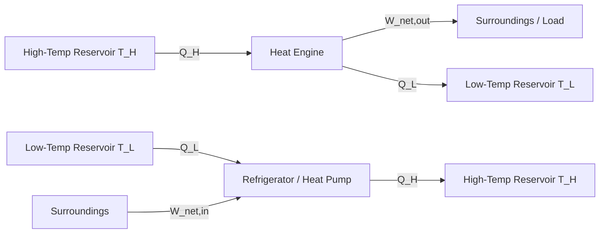

## Heat Engines, Refrigerators, and Heat Pumps

### Conceptual Overview

A heat engine, refrigerator, and heat pump are all cyclic devices that exchange heat with two thermal reservoirs while exchanging work with the surroundings. They are distinguished by the direction of energy flow and the purpose of the cycle.

- **Heat Engine**: Converts heat into net work output by transferring heat from a high-temperature reservoir to a low-temperature reservoir, rejecting a portion, and delivering the rest as work.
- **Refrigerator**: Uses work input to transfer heat from a low-temperature space to a high-temperature environment, with the objective of maintaining a cold space.
- **Heat Pump**: Uses work input to transfer heat from a low-temperature source to a high-temperature space, with the objective of heating that space.

All three operate on closed thermodynamic cycles, returning the working fluid to its initial state after each cycle, so that $\Delta U_{cycle} = 0$.

### Heat Engines

#### Basic Energy Balance

A heat engine absorbs heat $Q_H$ from a high-temperature reservoir at $T_H$, converts part of it to net work output $W_{net,out}$, and rejects the remainder $Q_L$ to a low-temperature reservoir at $T_L$.

Applying the First Law over a complete cycle:

$$W_{net,out} = Q_H - Q_L$$

#### Thermal Efficiency

Thermal efficiency $\eta_{th}$ measures the fraction of heat input converted to useful work:

$$\eta_{th} = \frac{W_{net,out}}{Q_H} = 1 - \frac{Q_L}{Q_H}$$

Since some heat rejection to the low-temperature reservoir is unavoidable (a consequence of the Second Law, specifically the Kelvin-Planck statement), $\eta_{th}$ is always less than 100% for any real or ideal heat engine operating between two finite-temperature reservoirs.

#### Kelvin-Planck Statement

The Kelvin-Planck statement of the Second Law asserts:

> It is impossible for any device operating on a cycle to receive heat from a single reservoir and produce a net amount of work.

This directly implies that every heat engine must reject some heat to a low-temperature reservoir; a heat engine with 100% thermal efficiency is a **Perpetual Motion Machine of the Second Kind (PMM2)**, which cannot exist.

#### Schematic (svg_diagram)

<svg xmlns="http://www.w3.org/2000/svg" viewBox="0 0 500 340">
<rect x="0" y="0" width="500" height="340" fill="none" />
<text x="250" y="24" text-anchor="middle" font-size="16" font-weight="bold" fill="#1a1a1a">Heat Engine Energy Flow (svg_diagram)</text>
<rect x="150" y="40" width="200" height="35" fill="#e8664c" stroke="#7a2e1f" stroke-width="1.5" />
<text x="250" y="63" text-anchor="middle" font-size="14" fill="#fff">High-Temp Reservoir, T_H</text>
<rect x="180" y="130" width="140" height="80" rx="10" fill="#f2c14e" stroke="#7a5c17" stroke-width="1.5" />
<text x="250" y="175" text-anchor="middle" font-size="15" font-weight="bold" fill="#1a1a1a">Heat Engine</text>
<rect x="150" y="265" width="200" height="35" fill="#4c8ee8" stroke="#1f3f7a" stroke-width="1.5" />
<text x="250" y="288" text-anchor="middle" font-size="14" fill="#fff">Low-Temp Reservoir, T_L</text>
<line x1="250" y1="75" x2="250" y2="130" stroke="#1a1a1a" stroke-width="2" marker-end="url(#arrow)" />
<text x="270" y="105" font-size="13" fill="#1a1a1a">Q_H</text>
<line x1="250" y1="210" x2="250" y2="265" stroke="#1a1a1a" stroke-width="2" marker-end="url(#arrow)" />
<text x="270" y="240" font-size="13" fill="#1a1a1a">Q_L</text>
<line x1="320" y1="170" x2="420" y2="170" stroke="#1a1a1a" stroke-width="2" marker-end="url(#arrow)" />
<text x="380" y="160" font-size="13" fill="#1a1a1a">W_net,out</text>
</svg>

### Refrigerators and Heat Pumps

#### Basic Energy Balance

Both refrigerators and heat pumps use work input $W_{net,in}$ to move heat from a cold reservoir at $T_L$ to a hot reservoir at $T_H$, which is the reverse direction of spontaneous heat transfer, requiring a work input to satisfy the Second Law.

The First Law over a cycle gives:

$$Q_H = Q_L + W_{net,in}$$

#### Coefficient of Performance (COP)

Because refrigerators and heat pumps have different objectives, "efficiency" is replaced with **Coefficient of Performance (COP)**, defined as the ratio of desired output to required input. COP values commonly exceed 1, since the device is transferring heat rather than converting it into a lower-grade form of energy.

**Refrigerator COP** (desired effect: heat removed from cold space, $Q_L$):

$$COP_R = \frac{Q_L}{W_{net,in}} = \frac{Q_L}{Q_H - Q_L}$$

**Heat Pump COP** (desired effect: heat delivered to hot space, $Q_H$):

$$COP_{HP} = \frac{Q_H}{W_{net,in}} = \frac{Q_H}{Q_H - Q_L}$$

**Relationship between the two COPs**, for the same cycle operating between the same two reservoirs:

$$COP_{HP} = COP_R + 1$$

This relation holds because $Q_H$ always exceeds $Q_L$ by exactly $W_{net,in}$, so the heat-pump numerator is always one work-unit larger than the refrigerator numerator for identical operating conditions.

#### Clausius Statement

The Clausius statement of the Second Law asserts:

> It is impossible to construct a device that operates in a cycle and produces no effect other than the transfer of heat from a lower-temperature body to a higher-temperature body.

This establishes that refrigerators and heat pumps cannot operate without a net work (or equivalent energy) input. A device violating this would be a different form of PMM2.

#### Schematic (svg_diagram)

<svg xmlns="http://www.w3.org/2000/svg" viewBox="0 0 500 340">
<text x="250" y="24" text-anchor="middle" font-size="16" font-weight="bold" fill="#1a1a1a">Refrigerator / Heat Pump Energy Flow (svg_diagram)</text>
<rect x="150" y="40" width="200" height="35" fill="#e8664c" stroke="#7a2e1f" stroke-width="1.5" />
<text x="250" y="63" text-anchor="middle" font-size="14" fill="#fff">High-Temp Reservoir, T_H</text>
<rect x="180" y="130" width="140" height="80" rx="10" fill="#8ecae6" stroke="#22577a" stroke-width="1.5" />
<text x="250" y="168" text-anchor="middle" font-size="14" font-weight="bold" fill="#1a1a1a">Refrigerator</text>
<text x="250" y="188" text-anchor="middle" font-size="14" font-weight="bold" fill="#1a1a1a">/ Heat Pump</text>
<rect x="150" y="265" width="200" height="35" fill="#4c8ee8" stroke="#1f3f7a" stroke-width="1.5" />
<text x="250" y="288" text-anchor="middle" font-size="14" fill="#fff">Low-Temp Reservoir, T_L</text>
<line x1="250" y1="130" x2="250" y2="75" stroke="#1a1a1a" stroke-width="2" marker-end="url(#arrow2)" />
<text x="270" y="105" font-size="13" fill="#1a1a1a">Q_H</text>
<line x1="250" y1="265" x2="250" y2="210" stroke="#1a1a1a" stroke-width="2" marker-end="url(#arrow2)" />
<text x="270" y="240" font-size="13" fill="#1a1a1a">Q_L</text>
<line x1="420" y1="170" x2="320" y2="170" stroke="#1a1a1a" stroke-width="2" marker-end="url(#arrow2)" />
<text x="380" y="160" font-size="13" fill="#1a1a1a">W_net,in</text>
</svg>

### Reversed Carnot Cycle as the Ideal Refrigeration/Heat Pump Cycle

The Carnot cycle, when run in reverse, provides the theoretical upper bound for COP between two fixed-temperature reservoirs, analogous to how the forward Carnot cycle bounds heat engine efficiency.

**Carnot (maximum) COP for a refrigerator:**

$$COP_{R,Carnot} = \frac{1}{\dfrac{T_H}{T_L} - 1} = \frac{T_L}{T_H - T_L}$$

**Carnot (maximum) COP for a heat pump:**

$$COP_{HP,Carnot} = \frac{1}{1 - \dfrac{T_L}{T_H}} = \frac{T_H}{T_H - T_L}$$

Here $T_H$ and $T_L$ must be expressed in absolute temperature units (Kelvin or Rankine). These Carnot COPs represent the performance of a totally reversible cycle and serve as the practical ceiling against which real refrigeration and heat pump cycles are benchmarked.

**Key Points**

- Real refrigerators and heat pumps always have $COP < COP_{Carnot}$ due to irreversibilities (friction, throttling, non-ideal heat transfer across finite temperature differences).
- As $T_H \to T_L$, both Carnot COPs approach values that make the device highly efficient; as the temperature difference $T_H - T_L$ increases, COP decreases, meaning refrigeration and heat pumping become harder (more work-intensive) with larger temperature spans.

### Worked Example

**Example**

A heat pump maintains a house at $T_H = 294\ \text{K}$ ($21^\circ\text{C}$) while extracting heat from outside air at $T_L = 273\ \text{K}$ ($0^\circ\text{C}$). The house loses heat at a rate of $\dot{Q}_H = 60{,}000\ \text{kJ/h}$.

**Step 1 — Carnot COP:**

$$COP_{HP,Carnot} = \frac{T_H}{T_H - T_L} = \frac{294}{294 - 273} = \frac{294}{21} \approx 14.0$$

**Step 2 — Minimum power input:**

$$\dot{W}_{net,in} = \frac{\dot{Q}_H}{COP_{HP,Carnot}} = \frac{60{,}000\ \text{kJ/h}}{14.0} \approx 4{,}286\ \text{kJ/h}$$

Converting to kW ($1\ \text{kW} = 3600\ \text{kJ/h}$):

$$\dot{W}_{net,in} \approx \frac{4{,}286}{3600} \approx 1.19\ \text{kW}$$

**Step 3 — Interpretation:** This 1.19 kW represents the theoretical minimum power input for a reversible heat pump under these conditions. Any real heat pump requires more power than this due to irreversibilities in the compressor, heat exchangers, and expansion device. [Inference: actual power draw depends on the specific refrigerant, compressor efficiency, and heat exchanger design, none of which are specified here.]

### Performance Comparison Table

| Device | Objective | Desired Quantity | Performance Metric | Formula |
| --- | --- | --- | --- | --- |
| Heat Engine | Produce work | $W_{net,out}$ | Thermal efficiency $\eta_{th}$ | $1 - Q_L/Q_H$ |
| Refrigerator | Remove heat from cold space | $Q_L$ | $COP_R$ | $Q_L / W_{net,in}$ |
| Heat Pump | Deliver heat to hot space | $Q_H$ | $COP_{HP}$ | $Q_H / W_{net,in}$ |

### Cycle Representation

### Practical Implications and Design Notes

- **Reverse Carnot as benchmark**: Manufacturers rate real refrigeration/HVAC equipment using COP or EER (Energy Efficiency Ratio), which is always compared against the theoretical Carnot ceiling for the given temperature lift.
- **Temperature lift sensitivity**: The COP of both refrigerators and heat pumps degrades steeply as the temperature difference $T_H - T_L$ grows, which explains why heat pumps lose effectiveness in very cold climates (large lift) and why refrigeration systems for deep-freeze applications consume disproportionately more power than standard refrigeration.
- **Dual-use devices**: A single vapor-compression cycle can function as either a refrigerator or a heat pump depending on which reservoir is the "useful" one — window air conditioners in "heat mode" and reversible heat pumps exploit this equivalence via a reversing valve. [Unverified: specific commercial implementation details vary by manufacturer and are not standardized across all reversible systems.]

**Related Topics**

- Carnot's Theorem and Carnot Corollaries
- The Kelvin-Planck and Clausius Statements (equivalence proof)
- Reversible vs. Irreversible Processes
- The Vapor-Compression Refrigeration Cycle
- Entropy Generation and the Clausius Inequality
- Second-Law (Exergy) Efficiency of Power and Refrigeration Cycles