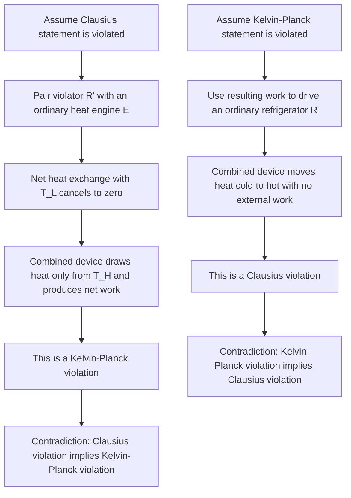

## Kelvin-Planck and Clausius Statements

### Conceptual Overview

The Second Law of Thermodynamics cannot be derived from the First Law; it is an independent empirical principle that establishes the *direction* in which natural processes proceed and identifies fundamental limitations on energy conversion that the First Law alone does not capture. Two classical statements — the **Kelvin-Planck statement** and the **Clausius statement** — express this law in terms of the impossibility of certain idealized devices. Though phrased differently (one concerning heat engines, the other concerning refrigerators/heat pumps), the two statements are logically equivalent: a violation of one necessarily implies a violation of the other.

### The Kelvin-Planck Statement

**Formal statement:**

> It is impossible for any device that operates on a cycle to receive heat from a single reservoir and produce a net amount of work.

This statement concerns **heat engines**. It does not forbid converting heat into work entirely — it forbids doing so with 100% efficiency in a cyclic device exchanging heat with only one thermal reservoir. Every real heat engine must reject some heat $Q_L$ to a second, lower-temperature reservoir; consequently:

$$\eta_{th} = 1 - \frac{Q_L}{Q_H} < 1 \quad \text{always, for } Q_L > 0$$

A hypothetical engine that violated this statement — converting 100% of absorbed heat into work with no rejection — is called a **Perpetual Motion Machine of the Second Kind (PMM2)**. Such a machine would not violate the First Law (energy is still conserved), which is why the Second Law is a separate, independent postulate.

**Key Points**

- The Kelvin-Planck statement applies specifically to *cyclic* devices; a non-cyclic process (e.g., isothermal expansion of an ideal gas) *can* convert 100% of heat input into work, but the working fluid does not return to its initial state, so the device cannot repeat the process indefinitely without violating the cycle condition.
- The statement implies that a heat engine requires **at least two reservoirs at different temperatures** to operate continuously.

### The Clausius Statement

**Formal statement:**

> It is impossible to construct a device that operates in a cycle and produces no effect other than the transfer of heat from a lower-temperature body to a higher-temperature body.

This statement concerns **refrigerators and heat pumps**. Heat does not spontaneously flow from cold to hot; doing so requires an external work (or equivalent energy) input. The phrase "no effect other than" is essential — heat can move from cold to hot *if* accompanied by another effect, such as work being consumed and dissipated elsewhere. A hypothetical refrigerator that moved heat from cold to hot without any work input would be a **PMM2 of the refrigeration kind**.

**Key Points**

- This does not contradict conduction/observation of heat naturally flowing hot to cold — that is the *spontaneous* direction. The Clausius statement forbids only the *unassisted reverse* transfer in a cyclic device.
- This is the theoretical justification for why refrigerators and air conditioners consume electrical power rather than operating "for free."

### Equivalence of the Two Statements

Although phrased around different devices, the Kelvin-Planck and Clausius statements are **logically equivalent**: violating either one permits construction of a device that violates the other. This is typically demonstrated by contradiction, using a combined-cycle argument.

#### Proof: Clausius Violation Implies Kelvin-Planck Violation

Assume a device $R'$ violates the Clausius statement: it transfers heat $Q_L$ from a cold reservoir $T_L$ to a hot reservoir $T_H$ with **no work input**.

Now pair $R'$ with an ordinary heat engine $E$ operating between the same two reservoirs, absorbing $Q_H$ from $T_H$ and rejecting $Q_L$ (the same magnitude that $R'$ delivers to $T_H$) to $T_L$, producing work $W = Q_H - Q_L$.

Consider the combined system ($E$ + $R'$) as a single device:

- Net heat exchanged with $T_L$: $E$ rejects $Q_L$ to it, $R'$ removes $Q_L$ from it → **net zero** interaction with $T_L$.
- Net heat exchanged with $T_H$: $E$ absorbs $Q_H$ from it, $R'$ delivers $Q_L$ to it → **net absorption of $(Q_H - Q_L)$** from $T_H$ only.
- Net work output: $W = Q_H - Q_L$, with **no net heat exchange with the cold reservoir**.

This combined device receives heat from a *single* reservoir ($T_H$) and produces net work with no other effect — a direct violation of the Kelvin-Planck statement. Hence, a violation of Clausius implies a violation of Kelvin-Planck.

#### Proof: Kelvin-Planck Violation Implies Clausius Violation (Sketch)

By a symmetric argument, assume a device $E'$ violates Kelvin-Planck: it absorbs $Q_H$ from $T_H$ and converts it entirely into work with no rejection. Use this work to drive an ordinary refrigerator $R$ operating between $T_L$ and $T_H$. The combined device ($E'$ + $R$) then transfers heat from $T_L$ to $T_H$ with no external work input (since the work is generated internally by $E'$ and fully consumed by $R$) — a violation of the Clausius statement.

**Conclusion:** Since each statement's violation implies the other's violation, the two statements are equivalent formulations of the same underlying physical law — the Second Law of Thermodynamics.

### Diagram: Clausius Violation Combined with a Heat Engine (svg_diagram)

<svg xmlns="http://www.w3.org/2000/svg" viewBox="0 0 600 380">
<text x="300" y="24" text-anchor="middle" font-size="15" font-weight="bold" fill="#1a1a1a">Equivalence Proof: Combined Device (svg_diagram)</text>
<rect x="200" y="40" width="200" height="35" fill="#e8664c" stroke="#7a2e1f" stroke-width="1.5" />
<text x="300" y="63" text-anchor="middle" font-size="13" fill="#fff">High-Temp Reservoir, T_H</text>
<rect x="150" y="120" width="120" height="70" rx="8" fill="#f2c14e" stroke="#7a5c17" stroke-width="1.5" />
<text x="210" y="160" text-anchor="middle" font-size="13" font-weight="bold" fill="#1a1a1a">Engine E</text>
<rect x="330" y="120" width="120" height="70" rx="8" fill="#8ecae6" stroke="#22577a" stroke-width="1.5" />
<text x="390" y="155" text-anchor="middle" font-size="13" font-weight="bold" fill="#1a1a1a">Violator R'</text>
<text x="390" y="172" text-anchor="middle" font-size="11" fill="#1a1a1a">(no work in)</text>
<rect x="200" y="290" width="200" height="35" fill="#4c8ee8" stroke="#1f3f7a" stroke-width="1.5" />
<text x="300" y="313" text-anchor="middle" font-size="13" fill="#fff">Low-Temp Reservoir, T_L</text>
<line x1="230" y1="75" x2="230" y2="120" stroke="#1a1a1a" stroke-width="2" marker-end="url(#ak)" />
<text x="235" y="100" font-size="12" fill="#1a1a1a">Q_H</text>
<line x1="210" y1="190" x2="230" y2="290" stroke="#1a1a1a" stroke-width="2" marker-end="url(#ak)" />
<text x="150" y="245" font-size="12" fill="#1a1a1a">Q_L (rejected)</text>
<line x1="390" y1="290" x2="390" y2="190" stroke="#1a1a1a" stroke-width="2" marker-end="url(#ak)" />
<text x="400" y="245" font-size="12" fill="#1a1a1a">Q_L (extracted)</text>
<line x1="370" y1="120" x2="350" y2="75" stroke="#1a1a1a" stroke-width="2" marker-end="url(#ak)" />
<text x="365" y="100" font-size="12" fill="#1a1a1a">Q_L</text>
<line x1="270" y1="150" x2="500" y2="150" stroke="#1a1a1a" stroke-width="2" marker-end="url(#ak)" />
<text x="450" y="140" font-size="12" fill="#1a1a1a">W = Q_H - Q_L</text>
</svg>

### Logical Flow of the Equivalence Argument

### Comparison Table

| Aspect | Kelvin-Planck Statement | Clausius Statement |
| --- | --- | --- |
| Device concerned | Heat engine | Refrigerator / heat pump |
| Forbidden outcome | 100% conversion of heat to work from a single reservoir | Heat transfer cold-to-hot with no work input |
| Consequence | $\eta_{th} < 1$ always | $COP$ requires nonzero $W_{net,in}$ |
| Violating machine | PMM2 (engine type) | PMM2 (refrigeration type) |
| Minimum reservoirs required | Two (different temperatures) | Two (different temperatures) |

### Worked Example

**Example**

A claimed refrigerator is advertised as removing $Q_L = 500\ \text{kJ}$ from a cold space and rejecting $Q_H = 500\ \text{kJ}$ to a hot space, with **zero work input**. Evaluate this claim against the Clausius statement.

**Step 1 — Check energy balance (First Law):** $Q_H = Q_L + W_{in} \Rightarrow 500 = 500 + W_{in} \Rightarrow W_{in} = 0$. The claim is consistent with the First Law (energy is conserved).

**Step 2 — Check Second Law (Clausius statement):** The device produces no effect other than transferring heat from a colder body to a hotter body, with zero work input. This is a direct violation of the Clausius statement.

**Step 3 — Conclusion:** The device is a Perpetual Motion Machine of the Second Kind (PMM2) and **cannot exist**, despite satisfying energy conservation. This illustrates why the First Law alone is an insufficient criterion for physical feasibility — the Second Law imposes an additional, independent constraint.

### Practical Implications and Design Notes

- **Diagnostic use**: These statements are primarily used as impossibility criteria — engineers use them to immediately reject any proposed cycle or device claim that would produce work from a single reservoir or move heat unassisted from cold to hot, without needing detailed cycle analysis.
- **Foundation for Carnot's Theorem**: The equivalence of these two statements underlies the proof of Carnot's theorem (no engine operating between two reservoirs can exceed the efficiency of a reversible engine operating between the same two reservoirs), since a hypothetical super-Carnot engine could be combined with a reversed Carnot engine to construct a Clausius violator.
- **Independence from First Law**: These statements cannot be derived mathematically from $\Delta U = Q - W$; they must be introduced as an additional empirical postulate, motivated by the universal observation that certain processes are irreversible in one direction only. [Inference: the ultimate physical justification for the Second Law traces to statistical mechanics and the tendency toward higher-probability microstates, though the classical statements here are presented independent of that microscopic foundation.]

**Related Topics**

- Carnot's Theorem and the Carnot Corollaries
- Reversible and Irreversible Processes
- Perpetual Motion Machines (First and Second Kind)
- The Reversed Carnot Cycle and Maximum COP
- Entropy and the Clausius Inequality
- The Increase-of-Entropy Principle