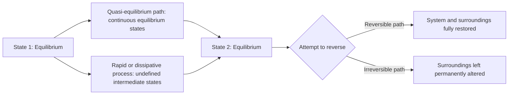

## Reversible and Irreversible Processes

### Conceptual Overview

A **reversible process** is an idealized process that, once completed, can be reversed such that both the system and its surroundings are restored to their exact original states with no net trace of the process having occurred. An **irreversible process** is any process that cannot be so reversed without leaving some permanent change in the surroundings. All real processes are irreversible to some degree; the reversible process is a theoretical limiting case that serves as a benchmark of maximum possible performance for any energy-conversion device.

### Formal Definition

A process is reversible if and only if, after it occurs, it is possible to return **both** the system and the surroundings to their initial states. This is a stricter requirement than merely returning the system alone to its initial state — a system can often be restored to its original state via some other process, but true reversibility demands that the surroundings show absolutely no evidence that anything happened.

$$\text{Reversible process} \iff \Delta S_{universe} = \Delta S_{system} + \Delta S_{surroundings} = 0$$

$$\text{Irreversible process} \Rightarrow \Delta S_{universe} > 0$$

This entropy-based criterion connects directly to the increase-of-entropy principle and provides the quantitative basis for identifying and ranking irreversibility.

### Sources of Irreversibility

Real processes deviate from reversibility due to several identifiable physical mechanisms:

1. **Friction** — mechanical friction between moving parts, or fluid friction (viscous dissipation) within a flowing fluid, converts organized mechanical energy into disorganized internal energy (heat), a process that cannot spontaneously reverse.
2. **Unrestrained (free) expansion** — a gas expanding into an evacuated space without doing work is inherently irreversible; no work is recovered, yet a compression process would require work input to reverse it.
3. **Heat transfer across a finite temperature difference** — heat spontaneously flows from a hot body to a cold body; reversing this (moving heat from cold to hot) requires external work input, per the Clausius statement, so ordinary heat transfer across $\Delta T > 0$ is irreversible.
4. **Mixing of two different substances** — spontaneous mixing (e.g., of two gases, or a solute into a solvent) increases entropy and cannot spontaneously unmix.
5. **Non-quasi-equilibrium compression or expansion** — rapid compression/expansion creates pressure and temperature gradients within the system (e.g., turbulence, pressure waves) that dissipate energy irreversibly.
6. **Electrical resistance (Joule heating)** — current flowing through a resistor irreversibly converts electrical energy into heat.
7. **Inelastic deformation of solids** — plastic (non-elastic) deformation dissipates mechanical energy as heat.
8. **Chemical reactions** — spontaneous reactions proceeding away from equilibrium are irreversible unless conducted infinitesimally close to equilibrium.

**Key Points**

- Irreversibilities can occur *internally* (within the system boundary, e.g., internal friction) or *externally* (at or outside the system boundary, e.g., heat transfer across a finite $\Delta T$ at the boundary).
- The presence of **any one** of these mechanisms is sufficient to render a process irreversible; a process must be free of *all* of them simultaneously to qualify as reversible.

### Internally Reversible vs. Totally (Externally) Reversible Processes

Because achieving true reversibility (zero irreversibility both inside and outside the system) is practically impossible, thermodynamics distinguishes two useful idealized categories:

- **Internally reversible process**: No irreversibilities occur *within* the system boundary during the process. The system passes through a series of equilibrium states (a quasi-equilibrium or quasi-static process), though irreversibilities may still exist in the surroundings (e.g., heat transfer across a finite $\Delta T$ at the boundary).
- **Totally (externally) reversible process**: No irreversibilities occur *either* within the system *or* in the surroundings. This requires that any heat transfer occur only across an infinitesimal temperature difference ($dT \to 0$), which is the idealization used in constructing cycles like the Carnot cycle.

A totally reversible process is necessarily internally reversible, but the converse does not hold — a process can be internally reversible while still involving external irreversibility (finite-$\Delta T$ heat transfer at the boundary).

### The Quasi-Equilibrium (Quasi-Static) Process

A **quasi-equilibrium process** is one conducted so slowly that the system remains infinitesimally close to thermodynamic equilibrium at every instant, allowing the entire process path to be represented as a continuous succession of equilibrium states on a property diagram (e.g., a $P$-$v$ or $T$-$s$ diagram).

$$W_{b} = \int_{1}^{2} P \, dV \quad \text{(valid only for quasi-equilibrium processes)}$$

This is the reason boundary work formulas require the quasi-equilibrium assumption: for a rapid, non-quasi-equilibrium process, the pressure is not uniform throughout the system, so a single system-wide $P$ cannot be meaningfully integrated against $dV$.

**Key Points**

- Quasi-equilibrium is a *necessary but not sufficient* condition for reversibility — a slow process can still involve friction or other dissipative effects and thus remain irreversible despite passing through near-equilibrium states.
- Real processes always occur at finite rates, so quasi-equilibrium is itself an idealization; it is approached but never perfectly achieved.

### Reversible Process as the Performance Benchmark

Reversible processes are of central engineering importance not because they are achievable, but because they establish the **theoretical upper bound** on the performance of real devices:

- **Heat engines**: No irreversible engine operating between two reservoirs can exceed the thermal efficiency of a reversible engine (Carnot engine) operating between the same two reservoirs.
- **Refrigerators/heat pumps**: No irreversible refrigeration cycle can exceed the COP of a reversible refrigeration cycle operating between the same two temperature limits.
- **Work-producing devices** (turbines): A reversible, adiabatic process delivers the *maximum possible* work output between two given end states.
- **Work-consuming devices** (compressors, pumps): A reversible, adiabatic process requires the *minimum possible* work input between two given end states.

This benchmarking role is why reversible cycles (Carnot, Ericsson, Stirling) appear throughout thermodynamic analysis despite being physically unattainable — they define the ceiling against which **second-law (isentropic) efficiency** of real components is measured.

### Diagram: Reversible vs. Irreversible Process Paths (svg_diagram)

<svg xmlns="http://www.w3.org/2000/svg" viewBox="0 0 560 320">
<text x="280" y="24" text-anchor="middle" font-size="15" font-weight="bold" fill="#1a1a1a">Process Paths on a P-V Diagram (svg_diagram)</text>
<line x1="80" y1="270" x2="480" y2="270" stroke="#1a1a1a" stroke-width="1.5" />
<line x1="80" y1="270" x2="80" y2="50" stroke="#1a1a1a" stroke-width="1.5" />
<text x="480" y="290" font-size="13" fill="#1a1a1a">V</text>
<text x="60" y="55" font-size="13" fill="#1a1a1a">P</text>
<path d="M 120 90 Q 250 160 400 230" fill="none" stroke="#2a9d8f" stroke-width="2.5" />
<circle cx="120" cy="90" r="4" fill="#2a9d8f" />
<circle cx="400" cy="230" r="4" fill="#2a9d8f" />
<text x="410" y="225" font-size="12" fill="#2a9d8f">State 2</text>
<text x="100" y="80" font-size="12" fill="#2a9d8f">State 1</text>
<text x="230" y="145" font-size="12" fill="#2a9d8f">Reversible path (well-defined)</text>
<path d="M 120 90 C 200 250, 320 60, 400 230" fill="none" stroke="#e76f51" stroke-width="2.5" stroke-dasharray="6,4" />
<text x="200" y="270" font-size="12" fill="#e76f51">Irreversible path (undefined intermediate states)</text>
</svg>

### Reversible Process Path vs. Irreversible Process Path

### Worked Example

**Example**

A gas in a piston-cylinder device is compressed from State 1 ($P_1 = 100\ \text{kPa}$, $V_1 = 0.5\ \text{m}^3$) to State 2 ($P_2 = 400\ \text{kPa}$, $V_2 = 0.15\ \text{m}^3$) by two different methods:

(a) Slowly, with the piston moving quasi-statically and negligible friction.

(b) Rapidly, with significant piston friction and turbulence in the gas.

**Analysis:**

For method (a), since the process is (assumed) internally reversible and quasi-equilibrium, boundary work can be computed directly by integrating $\int P \, dV$ along the known $P$-$V$ path, and this work represents the *minimum* work input required to achieve this compression.

For method (b), the actual work input $W_{actual}$ **exceeds** the reversible work $W_{rev}$ calculated in (a), because additional work is dissipated as friction and turbulent losses, converted irrecoverably into internal energy (heat) rather than being stored as useful boundary work on the gas:

$$W_{actual,in} = W_{rev,in} + W_{dissipated}, \quad W_{dissipated} > 0$$

**Conclusion:** Even though both processes connect the same two end states, the *reversible* path represents the theoretical minimum work requirement; any real (irreversible) path connecting the same states requires more work input than this ideal minimum. [Inference: the exact magnitude of $W_{dissipated}$ depends on the specific friction coefficients and flow turbulence characteristics of the real process, which are not quantified by the end-state properties alone.]

### Comparison Table

| Feature | Reversible Process | Irreversible Process |
| --- | --- | --- |
| Entropy generation, $S_{gen}$ | $= 0$ | $> 0$ |
| Achievability | Theoretical idealization only | All real processes |
| Path on property diagram | Well-defined, continuous | Often undefined/non-continuous |
| Boundary work formula $\int P\,dV$ | Valid (quasi-equilibrium) | Not directly valid |
| Performance role | Theoretical maximum (engines, turbines) / minimum (compressors, pumps) | Always worse than reversible benchmark |
| Restorability | System and surroundings fully restorable | Surroundings permanently altered |

### Practical Implications and Design Notes

- **Second-law (isentropic) efficiency**: Engineers quantify how closely a real adiabatic device (turbine, compressor, nozzle) approaches reversible performance using isentropic efficiency, defined relative to the reversible (isentropic) work for the same inlet state and exit pressure.
- **Irreversibility minimization as a design goal**: Since no process is perfectly reversible, practical engineering focuses on *minimizing* irreversibility (reducing friction, minimizing heat transfer across large $\Delta T$, avoiding unrestrained expansion) rather than achieving reversibility itself.
- **Entropy generation as a universal irreversibility measure**: The magnitude of $S_{gen}$ for a process provides a quantitative, unified metric for comparing the "degree" of irreversibility across different physical mechanisms (friction, heat transfer, mixing), which is exploited extensively in exergy (availability) analysis. [Unverified: specific numerical entropy-generation values are process- and system-specific and cannot be generalized without a defined process and property data.]

**Related Topics**

- The Increase-of-Entropy Principle and Entropy Generation
- The Carnot Cycle and Carnot's Theorem
- Isentropic Efficiency of Turbines, Compressors, and Nozzles
- Exergy (Availability) and Irreversibility Analysis
- Quasi-Equilibrium Boundary Work Calculations
- The Clausius Inequality