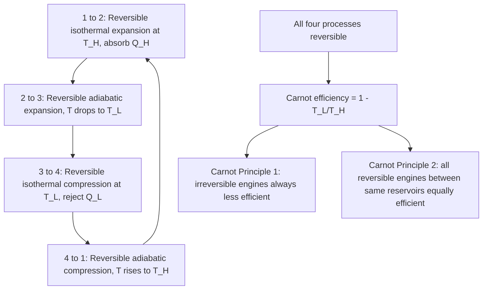

## The Carnot Cycle and Carnot Principles

### Conceptual Overview

The **Carnot cycle** is a theoretical thermodynamic cycle composed entirely of reversible processes, conceived by Sadi Carnot in 1824 as the idealized reference cycle for converting heat into work (or vice versa) between two fixed-temperature reservoirs. Because it consists solely of reversible processes, the Carnot cycle produces the maximum possible thermal efficiency (or COP) achievable by any cycle operating between the same two temperature limits — a result formalized in the **Carnot principles**.

### The Four Processes of the Carnot Cycle

The Carnot cycle, executed by a gas as the working fluid in a piston-cylinder device, consists of four internally reversible processes, alternating between isothermal and adiabatic:

1. **Process 1→2: Reversible isothermal expansion** at $T_H$. The gas expands slowly while in contact with a heat reservoir at $T_H$, absorbing heat $Q_H$ while doing work, with temperature held constant.
2. **Process 2→3: Reversible adiabatic expansion.** The gas is thermally isolated and continues expanding, doing work while its temperature drops from $T_H$ to $T_L$.
3. **Process 3→4: Reversible isothermal compression** at $T_L$. The gas is compressed while in contact with a reservoir at $T_L$, rejecting heat $Q_L$ while work is done on it, with temperature held constant.
4. **Process 4→1: Reversible adiabatic compression.** The gas is thermally isolated and compressed back to its initial state, with temperature rising from $T_L$ back to $T_H$.

**Key Points**

- All four processes are reversible: the isothermal steps require heat transfer across an *infinitesimal* temperature difference (an idealization), and the adiabatic steps involve no heat transfer and no friction.
- The cycle can be executed in reverse (4→3→2→1), in which case it functions as the **Reversed Carnot Cycle**, consuming work to move heat from $T_L$ to $T_H$ (the ideal refrigerator/heat pump cycle).

### P-V and T-s Diagram Representation (svg_diagram)

<svg xmlns="http://www.w3.org/2000/svg" viewBox="0 0 640 320">
<text x="320" y="24" text-anchor="middle" font-size="15" font-weight="bold" fill="#1a1a1a">Carnot Cycle: P-V and T-s Diagrams (svg_diagram)</text>

<line x1="60" y1="280" x2="280" y2="280" stroke="#1a1a1a" stroke-width="1.5" />
<line x1="60" y1="280" x2="60" y2="60" stroke="#1a1a1a" stroke-width="1.5" />
<text x="280" y="298" font-size="12" fill="#1a1a1a">V</text>
<text x="40" y="65" font-size="12" fill="#1a1a1a">P</text>
<path d="M 90 90 Q 150 100 210 140" fill="none" stroke="#e76f51" stroke-width="2.5" />
<path d="M 210 140 Q 230 190 250 230" fill="none" stroke="#2a9d8f" stroke-width="2.5" />
<path d="M 250 230 Q 190 250 130 245" fill="none" stroke="#457b9d" stroke-width="2.5" />
<path d="M 130 245 Q 100 190 90 90" fill="none" stroke="#2a9d8f" stroke-width="2.5" />

<text x="85" y="82" font-size="11" fill="`#1a1a1a`">1</text>

<text x="215" y="135" font-size="11" fill="`#1a1a1a`">2</text>

<text x="255" y="235" font-size="11" fill="`#1a1a1a`">3</text>

<text x="115" y="252" font-size="11" fill="`#1a1a1a`">4</text>

<line x1="360" y1="280" x2="580" y2="280" stroke="#1a1a1a" stroke-width="1.5" />
<line x1="360" y1="280" x2="360" y2="60" stroke="#1a1a1a" stroke-width="1.5" />
<text x="580" y="298" font-size="12" fill="#1a1a1a">s</text>
<text x="340" y="65" font-size="12" fill="#1a1a1a">T</text>
<line x1="390" y1="100" x2="530" y2="100" stroke="#e76f51" stroke-width="2.5" />
<line x1="530" y1="100" x2="530" y2="220" stroke="#2a9d8f" stroke-width="2.5" />
<line x1="530" y1="220" x2="390" y2="220" stroke="#457b9d" stroke-width="2.5" />
<line x1="390" y1="220" x2="390" y2="100" stroke="#2a9d8f" stroke-width="2.5" />

<text x="385" y="95" font-size="11" fill="`#1a1a1a`">1</text>

<text x="535" y="95" font-size="11" fill="`#1a1a1a`">2</text>

<text x="535" y="235" font-size="11" fill="`#1a1a1a`">3</text>

<text x="385" y="235" font-size="11" fill="`#1a1a1a`">4</text>

<text x="450" y="90" font-size="11" fill="`#e76f51`">T_H</text>

<text x="450" y="235" font-size="11" fill="`#457b9d`">T_L</text>

</svg>

On the $T$-$s$ diagram, the Carnot cycle forms a perfect rectangle: the two isothermal processes are horizontal lines (constant $T$), and the two adiabatic (isentropic) processes are vertical lines (constant $s$). This rectangular shape is the clearest visual representation of the cycle's defining reversibility.

### Carnot Efficiency

Because the isothermal heat transfer processes occur at constant temperature, the entropy change during heat absorption ($Q_H$ at $T_H$) exactly equals the negative of the entropy change during heat rejection ($Q_L$ at $T_L$), giving:

$$\frac{Q_H}{T_H} = \frac{Q_L}{T_L}$$

Substituting into the general thermal efficiency expression:

$$\eta_{th,Carnot} = 1 - \frac{Q_L}{Q_H} = 1 - \frac{T_L}{T_H}$$

where $T_L$ and $T_H$ **must be in absolute temperature units** (Kelvin or Rankine). This is the **Carnot efficiency**, representing the maximum possible thermal efficiency for *any* heat engine (reversible or irreversible) operating between reservoirs at $T_H$ and $T_L$.

### Reversed Carnot Cycle: Maximum COP

Running the cycle in reverse yields the theoretical maximum COP for refrigerators and heat pumps operating between the same two temperature limits:

$$COP_{R,Carnot} = \frac{T_L}{T_H - T_L}, \qquad COP_{HP,Carnot} = \frac{T_H}{T_H - T_L}$$

These follow directly from the same reservoir temperature ratio relationship, $Q_H/T_H = Q_L/T_L$, applied to the reversed cycle's energy balance.

### The Carnot Principles

Two corollaries follow directly from the Second Law (via the Kelvin-Planck/Clausius equivalence) and govern all heat engines operating between two fixed-temperature reservoirs:

**Carnot Principle 1:**

> The efficiency of an irreversible heat engine is always less than the efficiency of a reversible one operating between the same two reservoirs.

$$\eta_{th,irrev} < \eta_{th,rev} = \eta_{th,Carnot}$$

**Carnot Principle 2:**

> The efficiencies of all reversible heat engines operating between the same two reservoirs are equal, regardless of the working fluid, the specific reversible processes used, or the design of the engine.

$$\eta_{th,rev,1} = \eta_{th,rev,2} = 1 - \frac{T_L}{T_H} \quad \text{(for any two reversible engines between the same } T_H, T_L\text{)}$$

**Proof sketch (Principle 1, by contradiction):** Suppose an irreversible engine $I$ has $\eta_{th,I} > \eta_{th,Carnot}$. Use engine $I$ to drive a reversed Carnot refrigerator $R_C$ between the same two reservoirs. Because $I$ is more efficient, for the same $Q_H$ absorbed, $I$ produces more work than $R_C$ requires to move the same heat $Q_L$; the excess work, combined with the heat flows, can be shown to result in a net heat transfer from $T_L$ to $T_H$ with no net work input from outside the combined system — a violation of the Clausius statement. Hence, no irreversible engine can exceed the Carnot efficiency.

**Key Points**

- Carnot Principle 2 is the basis for stating that Carnot efficiency depends *only* on the two reservoir temperatures, never on the working substance (ideal gas, steam, refrigerant, etc.) or the specific mechanical design.
- These principles apply strictly to engines operating between exactly **two** fixed-temperature reservoirs; cycles involving heat exchange with a continuously varying temperature source (e.g., some real power plant heat sources) require more general analysis.

### Worked Example

**Example**

A proposed heat engine claims to operate between a furnace at $T_H = 1200\ \text{K}$ and a cooling reservoir at $T_L = 300\ \text{K}$, absorbing $Q_H = 800\ \text{kJ}$ and producing $W_{net} = 650\ \text{kJ}$. Evaluate the feasibility of this claim.

**Step 1 — Compute the claimed efficiency:**

$$\eta_{th,claimed} = \frac{W_{net}}{Q_H} = \frac{650}{800} = 0.8125 = 81.25\%$$

**Step 2 — Compute the Carnot efficiency limit for these reservoirs:**

$$\eta_{th,Carnot} = 1 - \frac{T_L}{T_H} = 1 - \frac{300}{1200} = 1 - 0.25 = 0.75 = 75\%$$

**Step 3 — Compare:** The claimed efficiency (81.25%) exceeds the Carnot efficiency limit (75%) for these reservoir temperatures.

**Step 4 — Conclusion:** By Carnot Principle 1, no engine — reversible or irreversible — can exceed the Carnot efficiency between two fixed reservoirs. The claim is **thermodynamically infeasible** and violates the Second Law, regardless of engine design, working fluid, or mechanical innovation claimed. [Inference: this conclusion follows strictly from the given temperatures and heat/work values; no other physical justification could render this specific claim valid.]

### Cycle Structure and Consequences

### Comparison Table: Carnot vs. Real Engine Behavior

| Property | Carnot (Ideal) Engine | Real Engine |
| --- | --- | --- |
| Processes | 4 reversible (2 isothermal, 2 adiabatic) | Irreversible (friction, finite-$\Delta T$ heat transfer, turbulence) |
| Efficiency dependence | Only on $T_H$, $T_L$ | Depends on design, working fluid behavior, irreversibilities |
| Efficiency value | $1 - T_L/T_H$ (upper bound) | Always $< \eta_{th,Carnot}$ |
| Achievability | Never achieved in practice | All actual heat engines |
| Working fluid effect | None (Principle 2) | Significant |

### Practical Implications and Design Notes

- **Benchmark for real cycles**: The Rankine, Brayton, and Otto cycles used in real power plants and engines are all evaluated relative to the Carnot efficiency ceiling for their respective operating temperature limits, even though none of them are Carnot cycles themselves (due to practical constraints on achieving pure isothermal heat transfer).
- **Motivation for high $T_H$, low $T_L$**: Since $\eta_{th,Carnot}$ increases as $T_H$ increases or $T_L$ decreases, real power plant design pushes toward the highest feasible boiler/turbine inlet temperatures and the lowest feasible condenser temperatures (limited by material constraints and ambient heat-sink temperature, respectively).
- **Practical unattainability**: The Carnot cycle's isothermal heat transfer steps require an infinitesimal temperature difference between the working fluid and the reservoir, which implies an infinitely slow process and, correspondingly, zero power output — a fundamental reason no real device implements a true Carnot cycle despite its theoretical importance. [Unverified: quantitative trade-offs between finite-time heat transfer rate and achievable efficiency are addressed by finite-time thermodynamics, a distinct extension not covered by the classical Carnot analysis presented here.]

**Related Topics**

- Kelvin-Planck and Clausius Statements
- Reversible and Irreversible Processes
- Heat Engines, Refrigerators, and Heat Pumps
- The Rankine Cycle and Real Power Plant Analysis
- The Brayton Cycle and Gas Turbine Analysis
- Entropy and the Clausius Inequality