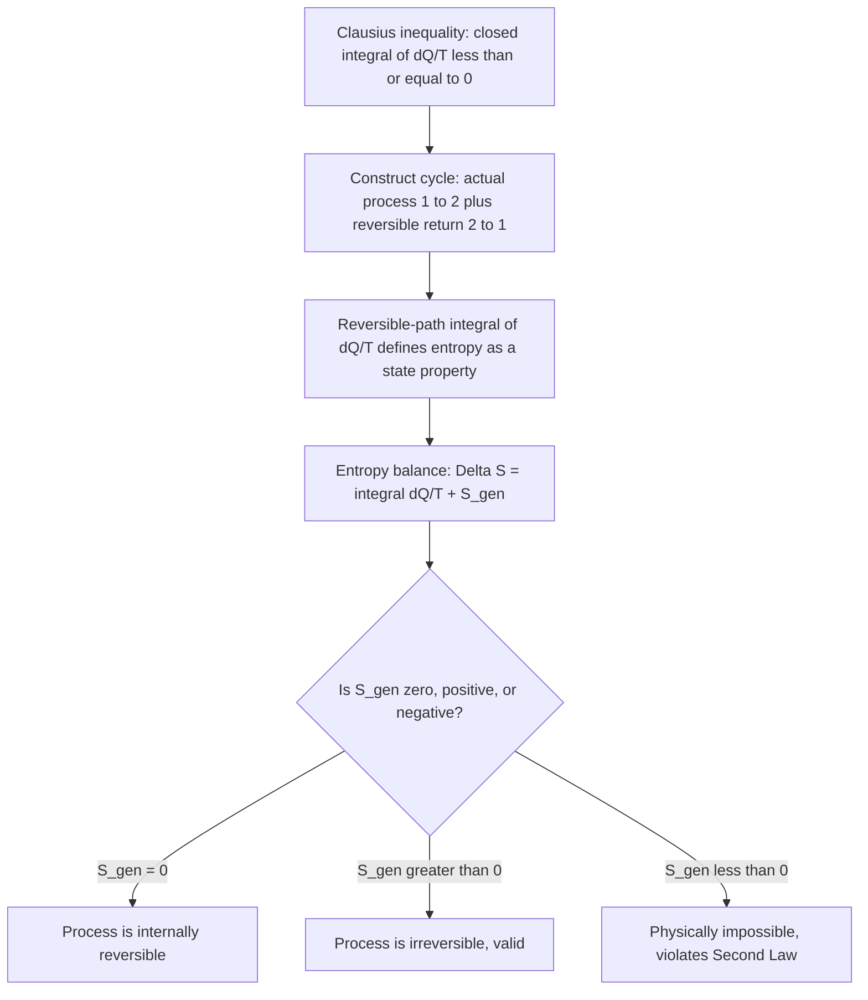

## Entropy as a Property and the Clausius Inequality

### Conceptual Overview

**Entropy** ($S$) is an extensive thermodynamic property that quantifies the degree of molecular disorder of a system and provides a rigorous, quantitative basis for the Second Law of Thermodynamics. Unlike heat and work, which are path functions, entropy is a **state (point) function** — its change between two states depends only on the end states, not on the path taken. The mathematical foundation for defining entropy as a property rests on the **Clausius inequality**, derived from analysis of reversible and irreversible cycles.

### The Clausius Inequality

The Clausius inequality is a corollary of the Second Law, stated as:

$$\oint \frac{\delta Q}{T} \leq 0$$

where the integral is evaluated around a complete thermodynamic cycle, $\delta Q$ represents a differential heat transfer, and $T$ is the absolute temperature of the system boundary at the location where $\delta Q$ crosses it. The equality holds for **reversible (or internally reversible) cycles**, and the strict inequality holds for **irreversible cycles**:

$$\oint \frac{\delta Q}{T} = 0 \quad \text{(reversible cycle)}$$

$$\oint \frac{\delta Q}{T} < 0 \quad \text{(irreversible cycle)}$$

**Proof sketch:** Consider any cycle interacting with a single reservoir at $T_R$ through a reversible Carnot engine (or refrigerator) as an intermediary that transfers heat $\delta Q$ to the system at the local boundary temperature $T$. Applying the Kelvin-Planck statement to the combined system (original cycle plus the auxiliary Carnot device) shows that the net work produced by the combination cannot be positive, which — after algebraic manipulation using the Carnot temperature ratio $\delta Q_R/T_R = \delta Q/T$ — leads directly to $\oint \delta Q/T \leq 0$.

**Key Points**

- The inequality applies to the *entire cycle*, not to individual processes within it.
- $T$ in the integral is always the absolute temperature at the **system boundary**, which may differ from the temperature deep within the system in the presence of internal irreversibilities.

### Defining Entropy as a Property

Since $\oint \delta Q/T = 0$ for any reversible cycle, the quantity $\delta Q/T$ integrated along a reversible path between two fixed states must yield a result **independent of the specific reversible path chosen** — this is precisely the mathematical signature of a state property. This allows entropy to be *defined* as:

$$dS = \left(\frac{\delta Q}{T}\right)_{int\ rev}$$

$$\Delta S = S_2 - S_1 = \int_{1}^{2} \left(\frac{\delta Q}{T}\right)_{int\ rev}$$

The subscript "int rev" emphasizes that this integral must be evaluated along an **internally reversible path** connecting states 1 and 2 — even if the actual process between these states was irreversible. Because $\Delta S$ depends only on the end states, any convenient internally reversible path may be substituted for the purpose of calculation.

**Key Points**

- Entropy has SI units of $\text{kJ/K}$ (total) or $\text{kJ/(kg·K)}$ (specific, $s$).
- Because $S$ is a property, $\Delta S$ can be computed between any two states regardless of whether the actual process connecting them was reversible or irreversible — only the *calculation method* requires a reversible path substitute.

### The Increase-of-Entropy Principle

Applying the Clausius inequality to a cycle composed of an actual (possibly irreversible) process from state 1 to state 2, followed by an internally reversible process back from state 2 to state 1, and combining with the entropy definition, yields the general **entropy balance for a closed system**:

$$S_2 - S_1 \geq \int_{1}^{2} \frac{\delta Q}{T}$$

Rewriting with an explicit entropy generation term $S_{gen}$ (which absorbs the inequality as an equality):

$$\Delta S_{system} = \int_{1}^{2} \frac{\delta Q}{T} + S_{gen}, \qquad S_{gen} \geq 0$$

where $S_{gen} = 0$ for internally reversible processes and $S_{gen} > 0$ for irreversible processes. $S_{gen}$ can never be negative — this is the mathematical statement of the **increase-of-entropy principle**.

For an **isolated system** (no heat or mass crossing the boundary, $\delta Q = 0$):

$$\Delta S_{isolated} = S_{gen} \geq 0$$

Since the universe (system + surroundings) can be treated as an isolated system, this generalizes to:

$$\Delta S_{universe} = \Delta S_{system} + \Delta S_{surroundings} \geq 0$$

**Key Points**

- $S_{gen} \geq 0$ is often regarded as the most general and powerful mathematical statement of the Second Law, encompassing the Kelvin-Planck and Clausius statements as special cases.
- Entropy of an isolated system can only increase or, in the reversible limiting case, remain constant — it can never decrease.
- Entropy of a *non-isolated* system **can** decrease (e.g., by rejecting heat), but only if the surroundings' entropy increases by at least as much, keeping $\Delta S_{universe} \geq 0$.

### Diagram: Reversible Cycle Construction for the Inequality (svg_diagram)

<svg xmlns="http://www.w3.org/2000/svg" viewBox="0 0 560 320">
<text x="280" y="24" text-anchor="middle" font-size="15" font-weight="bold" fill="#1a1a1a">Clausius Inequality Cycle Construction (svg_diagram)</text>
<path d="M 150 90 Q 280 140 410 190" fill="none" stroke="#e76f51" stroke-width="2.5" stroke-dasharray="6,4" />
<text x="230" y="130" font-size="12" fill="#e76f51">Actual process (possibly irreversible), 1 to 2</text>
<path d="M 410 190 Q 280 240 150 90" fill="none" stroke="#2a9d8f" stroke-width="2.5" />
<text x="220" y="255" font-size="12" fill="#2a9d8f">Internally reversible process, 2 to 1</text>
<circle cx="150" cy="90" r="5" fill="#1a1a1a" />
<text x="120" y="80" font-size="13" fill="#1a1a1a">State 1</text>
<circle cx="410" cy="190" r="5" fill="#1a1a1a" />
<text x="420" y="185" font-size="13" fill="#1a1a1a">State 2</text>

<text x="150" y="300" font-size="13" fill="`#1a1a1a`">∮ δQ/T ≤ 0 around the full cycle (1→2→1)</text>

</svg>

### Worked Example

**Example**

A closed system undergoes a process from State 1 to State 2 while exchanging heat with a reservoir at a constant $T_R = 500\ \text{K}$. During the actual process, the system receives $Q = 300\ \text{kJ}$. Using an internally reversible path between the same two states, the entropy change is calculated as $\Delta S = 0.75\ \text{kJ/K}$. Determine whether the actual process is reversible or irreversible, and find the entropy generated.

**Step 1 — Apply the entropy balance:**

$$\Delta S = \int_1^2 \frac{\delta Q}{T} + S_{gen}$$

**Step 2 — Compute the heat-transfer term** (reservoir at constant $T_R$, so $\delta Q/T$ integrates simply):

$$\int_1^2 \frac{\delta Q}{T} = \frac{Q}{T_R} = \frac{300\ \text{kJ}}{500\ \text{K}} = 0.60\ \text{kJ/K}$$

**Step 3 — Solve for entropy generation:**

$$S_{gen} = \Delta S - \frac{Q}{T_R} = 0.75 - 0.60 = 0.15\ \text{kJ/K}$$

**Step 4 — Interpret the result:** Since $S_{gen} = 0.15\ \text{kJ/K} > 0$, the actual process is **irreversible**. Had $S_{gen}$ come out to zero, the process would have been (internally) reversible; a negative value would have indicated an impossible process, violating the Second Law. [Inference: the source of this irreversibility (friction, internal turbulence, unrestrained expansion, etc.) cannot be identified from the given data alone — only its magnitude.]

### Comparison Table

| Condition | Clausius Inequality Result | Entropy Generation $S_{gen}$ | Physical Interpretation |
| --- | --- | --- | --- |
| $\oint \delta Q/T = 0$ | Equality | $S_{gen} = 0$ | Reversible cycle |
| $\oint \delta Q/T < 0$ | Strict inequality | $S_{gen} > 0$ | Irreversible cycle |
| $\oint \delta Q/T > 0$ | — | $S_{gen} < 0$ | Impossible (violates Second Law) |

### Entropy Balance Logic Flow

### Practical Implications and Design Notes

- **Universal applicability**: The entropy balance with $S_{gen} \geq 0$ applies to *any* system (closed, open, isolated) and *any* process, making it the most general operational form of the Second Law used in engineering analysis, more broadly applicable than the Kelvin-Planck or Clausius statements individually.
- **Path-independence enables tabulated property data**: Because entropy is a property, its values can be tabulated as a function of other state properties (e.g., steam tables, refrigerant tables), allowing $\Delta S$ to be looked up directly from end-state data without needing to know or reconstruct the actual process path.
- **Entropy generation as a design diagnostic**: In practice, $S_{gen}$ calculated for a given component (turbine, heat exchanger, mixing chamber) serves as a direct, quantifiable measure of the irreversibility (and associated lost work potential) in that component, forming the basis of exergy destruction analysis in second-law-based design optimization. [Unverified: the specific numerical entropy generation attributable to individual mechanisms, such as friction versus heat transfer, within a real component typically requires more detailed modeling than the bulk entropy balance alone provides.]

**Related Topics**

- Reversible and Irreversible Processes
- The Increase-of-Entropy Principle (Isolated Systems)
- Entropy Change of Pure Substances, Ideal Gases, and Incompressible Substances
- The T-ds Relations
- Isentropic Processes and Isentropic Efficiency
- Exergy (Availability) and Entropy Generation Analysis