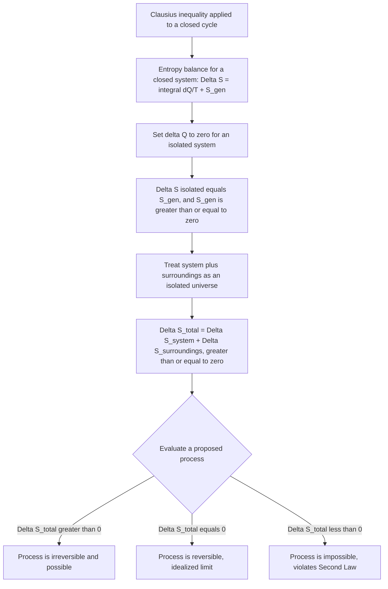

## The Increase-of-Entropy Principle

### Conceptual Overview

The **increase-of-entropy principle** is the generalized statement that the total entropy of an isolated system (or, equivalently, of the system plus its surroundings) can never decrease over time — it either increases (for irreversible processes) or remains constant (for reversible processes). This principle is the most operationally useful and universally applicable form of the Second Law, since it applies to *any* system undergoing *any* process, without requiring the process to be cast in terms of a cycle, a heat engine, or a refrigerator.

### Derivation from the Entropy Balance

Starting from the general closed-system entropy balance (derived from the Clausius inequality):

$$\Delta S_{system} = \int_{1}^{2} \frac{\delta Q}{T} + S_{gen}, \qquad S_{gen} \geq 0$$

Consider an **isolated system** — one that exchanges neither heat, work, nor mass with its surroundings ($\delta Q = 0$ across its boundary). The heat-transfer integral vanishes identically, leaving:

$$\Delta S_{isolated} = S_{gen} \geq 0$$

Since $S_{gen}$ can never be negative (this is the mathematical content of the Second Law established via the Clausius inequality), the entropy of an isolated system can only increase or, in the limiting reversible case, stay the same:

$$S_2 \geq S_1 \quad \text{(isolated system)}$$

### Extension to System Plus Surroundings

Most practical systems are not isolated — they exchange heat and/or work with their surroundings. However, the **combination of a system and its immediate surroundings** can always be treated as an isolated system (an "extended system" or "universe" for the process in question), because nothing crosses the combined boundary. Applying the increase-of-entropy principle to this combination gives:

$$\Delta S_{total} = \Delta S_{system} + \Delta S_{surroundings} \geq 0$$

$$S_{gen} = \Delta S_{total} \geq 0$$

This form is the one most commonly applied in engineering entropy analysis, since it allows evaluation of a non-isolated system's process by explicitly accounting for the entropy change of both the system and everything it thermally or mechanically interacts with (typically modeled as thermal energy reservoirs).

**Key Points**

- $\Delta S_{system}$ alone **can** be negative (e.g., a system rejecting heat, or being compressed) — this does not violate the Second Law.
- $\Delta S_{surroundings}$ **can** also be negative in some cases (e.g., a reservoir supplying heat to the system).
- Only the **sum**, $\Delta S_{total}$, is constrained to be non-negative; this sum is precisely the entropy generated, $S_{gen}$, during the process.

### Interpreting $S_{gen}$ as a Measure of Irreversibility

The magnitude of $S_{gen}$ provides a direct, quantitative measure of the "degree" of irreversibility of a process:

$$S_{gen} = 0 \implies \text{process is internally reversible}$$

$$S_{gen} > 0 \implies \text{process is irreversible; larger } S_{gen} \implies \text{greater irreversibility}$$

$$S_{gen} < 0 \implies \text{impossible process (violates the Second Law)}$$

This makes $S_{gen}$ a universal diagnostic tool: any proposed process, cycle, or device can be checked for physical feasibility simply by calculating $\Delta S_{total}$ for the system and its surroundings and verifying that the result is non-negative.

**Key Points**

- Entropy generation is **not** a property of a system or state — it is a quantity associated with a *process*, dependent on the specific irreversibilities present (friction, finite-$\Delta T$ heat transfer, mixing, etc.).
- $S_{gen}$ is always evaluated for a specified system boundary; enlarging the boundary to include more of the surroundings can change how the irreversibility is apportioned, but the *total* $S_{gen}$ for a correctly defined isolated (universe) boundary is invariant.

### Diagram: System, Surroundings, and Total Entropy Change (svg_diagram)

<svg xmlns="http://www.w3.org/2000/svg" viewBox="0 0 560 320">
<text x="280" y="24" text-anchor="middle" font-size="15" font-weight="bold" fill="#1a1a1a">System + Surroundings as an Isolated Universe (svg_diagram)</text>
<rect x="60" y="60" width="440" height="220" rx="14" fill="none" stroke="#1a1a1a" stroke-width="2" stroke-dasharray="8,5" />
<text x="280" y="50" text-anchor="middle" font-size="13" fill="#1a1a1a">Isolated boundary (no mass, heat, or work crosses)</text>
<rect x="200" y="120" width="160" height="100" rx="10" fill="#f2c14e" stroke="#7a5c17" stroke-width="1.5" />
<text x="280" y="165" text-anchor="middle" font-size="13" font-weight="bold" fill="#1a1a1a">System</text>
<text x="280" y="185" text-anchor="middle" font-size="12" fill="#1a1a1a">ΔS_system</text>

<text x="100" y="170" font-size="12" fill="`#1a1a1a`">Surroundings</text>

<text x="100" y="190" font-size="12" fill="`#1a1a1a`">ΔS_surroundings</text>

<line x1="200" y1="170" x2="120" y2="170" stroke="#1a1a1a" stroke-width="2" marker-end="url(#ai)" />
<text x="410" y="290" font-size="13" font-weight="bold" fill="#1a1a1a">ΔS_total = ΔS_sys + ΔS_surr = S_gen ≥ 0</text>
</svg>

### Worked Example

**Example**

A $50\ \text{kg}$ metal block at $T_1 = 800\ \text{K}$ is quenched by immersion in a large reservoir of water maintained at a constant $T_{res} = 300\ \text{K}$. The block loses heat and cools to $T_2 = 300\ \text{K}$. The block has specific heat $c = 0.45\ \text{kJ/(kg·K)}$. Determine the total entropy generated during this process.

**Step 1 — Heat released by the block:**

$$Q = mc(T_1 - T_2) = 50 \times 0.45 \times (800 - 300) = 11{,}250\ \text{kJ}$$

**Step 2 — Entropy change of the block** (using $ds = c\, dT/T$ for an incompressible solid, integrated from $T_1$ to $T_2$):

$$\Delta S_{block} = mc \ln\frac{T_2}{T_1} = 50 \times 0.45 \times \ln\frac{300}{800} = 22.5 \times (-0.9808) \approx -22.07\ \text{kJ/K}$$

**Step 3 — Entropy change of the reservoir** (constant temperature, so $\Delta S = Q/T$; reservoir *gains* the heat lost by the block):

$$\Delta S_{surr} = \frac{Q}{T_{res}} = \frac{11{,}250}{300} = 37.5\ \text{kJ/K}$$

**Step 4 — Total entropy generated:**

$$S_{gen} = \Delta S_{block} + \Delta S_{surr} = -22.07 + 37.5 = 15.43\ \text{kJ/K}$$

**Step 5 — Interpretation:** Since $S_{gen} = 15.43\ \text{kJ/K} > 0$, the quenching process is confirmed irreversible, consistent with physical expectation — heat transfer across the large finite temperature difference between the $800\ \text{K}$ block and the $300\ \text{K}$ reservoir is a classic source of irreversibility. [Inference: the specific numerical entropy generation value depends on the idealized constant-reservoir-temperature assumption; a finite reservoir would show a smaller, temperature-dependent $\Delta S_{surr}$ requiring integration rather than the direct $Q/T$ shortcut used here.]

### Comparison Table: Applying the Principle Across System Types

| System Type | Entropy Balance Form | Constraint |
| --- | --- | --- |
| Isolated system | $\Delta S = S_{gen}$ | $S_{gen} \geq 0$ |
| Closed system (heat transfer only) | $\Delta S = \int \delta Q/T + S_{gen}$ | $S_{gen} \geq 0$ |
| System + surroundings ("universe") | $\Delta S_{total} = \Delta S_{sys} + \Delta S_{surr}$ | $\Delta S_{total} \geq 0$ |
| Adiabatic, internally reversible process | $\Delta S_{system} = 0$ | Isentropic process |

### Logical Structure of the Principle

### Practical Implications and Design Notes

- **Feasibility screening tool**: Before undertaking detailed cycle or device analysis, engineers often perform a quick $\Delta S_{total}$ check on a proposed process; a negative result immediately rules out the process without needing further analysis.
- **Isentropic processes as an idealized reference**: The special case $\Delta S_{system} = 0$ for an adiabatic, internally reversible process defines the *isentropic* process, used as the ideal reference for the performance of turbines, compressors, and nozzles via isentropic efficiency.
- **Connection to lost work and exergy destruction**: The entropy generated during a process is directly proportional to the **exergy (useful work potential) destroyed**, via the Gouy-Stodola relation $X_{destroyed} = T_0 S_{gen}$, where $T_0$ is the temperature of the surroundings — making entropy generation the thermodynamic root cause of all "lost work" in real engineering systems. [Unverified: application of the Gouy-Stodola relation requires a well-defined dead-state temperature $T_0$, and specific numerical exergy-destruction values are system- and boundary-definition-dependent.]

**Related Topics**

- Entropy as a Property and the Clausius Inequality
- Reversible and Irreversible Processes
- Isentropic Processes and Isentropic Efficiency
- Entropy Balance for Control Volumes
- Exergy (Availability) Analysis and the Gouy-Stodola Theorem
- Entropy Change of Pure Substances, Ideal Gases, and Incompressible Substances