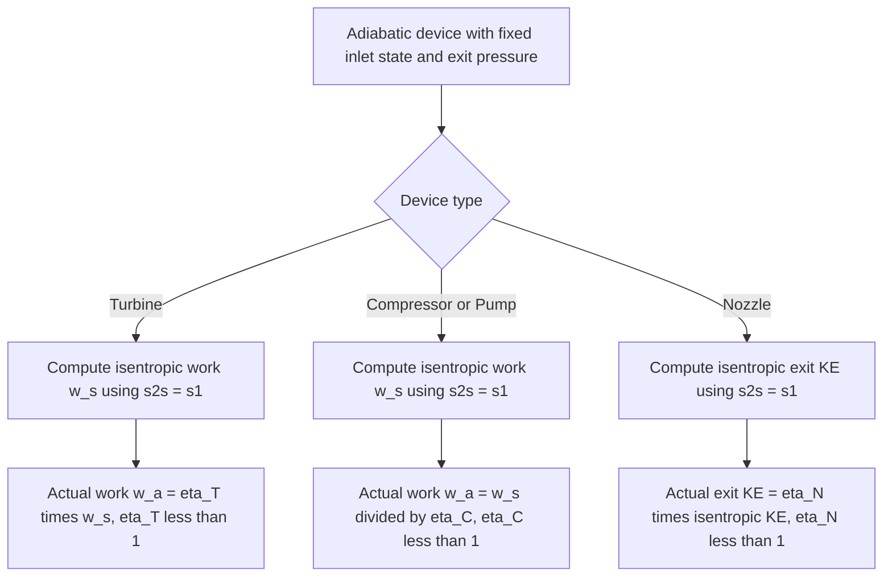

## Isentropic Processes and Isentropic Efficiencies

### Conceptual Overview

An **isentropic process** is a process during which the entropy of the system remains constant ($\Delta s = 0$, or $s_2 = s_1$). It is the direct consequence of a process being both **adiabatic** ($\delta Q = 0$) and **internally reversible** ($S_{gen} = 0$) simultaneously. Isentropic processes serve as the idealized reference against which the performance of real, irreversible adiabatic devices — turbines, compressors, nozzles, pumps — is measured, via the **isentropic efficiency**.

### Derivation: Why Adiabatic + Internally Reversible Implies Isentropic

Starting from the general closed-system entropy balance:

$$\Delta S_{system} = \int_{1}^{2} \frac{\delta Q}{T} + S_{gen}$$

If the process is **adiabatic**, $\delta Q = 0$ everywhere, eliminating the heat-transfer integral. If the process is also **internally reversible**, $S_{gen} = 0$. Both conditions together yield:

$$\Delta S_{system} = 0 \quad \Rightarrow \quad s_2 = s_1$$

**Key Points**

- Adiabatic **alone** is not sufficient for isentropic — an adiabatic but irreversible process (e.g., a real turbine with internal friction) still has $S_{gen} > 0$, so $s_2 > s_1$ even without heat transfer.
- Internally reversible **alone** is not sufficient either — an internally reversible process *with* heat transfer generally changes entropy, since $\int \delta Q/T \neq 0$ unless $\delta Q = 0$.
- Isentropic processes are represented as **vertical lines** on a $T$-$s$ or $h$-$s$ (Mollier) diagram, since $s$ is constant throughout.

### Ideal Gas Isentropic Relations

For an ideal gas with constant specific heats undergoing an isentropic process, the $T$-$ds$ relations reduce to closed-form relationships among $T$, $P$, and $v$:

$$\left(\frac{T_2}{T_1}\right)_{s=const} = \left(\frac{P_2}{P_1}\right)^{(k-1)/k} = \left(\frac{v_1}{v_2}\right)^{k-1}$$

$$\left(\frac{P_2}{P_1}\right)_{s=const} = \left(\frac{v_1}{v_2}\right)^{k}$$

where $k = c_p/c_v$ is the specific heat ratio. These are the standard **isentropic ideal-gas relations**, valid strictly for constant $c_p$, $c_v$ (cold-air-standard assumption); for variable specific heats, relative pressure ($P_r$) and relative specific volume ($v_r$) functions tabulated against temperature are used instead.

### Isentropic Efficiency: General Concept

Real adiabatic devices are never perfectly reversible; friction, flow separation, and other irreversibilities cause the actual exit state to deviate from the ideal isentropic exit state for the same inlet conditions and exit pressure. **Isentropic efficiency** ($\eta_s$) quantifies how closely a real device approaches this ideal:

$$\eta_s = \frac{\text{Actual performance}}{\text{Isentropic (ideal) performance}}$$

The precise definition of "performance" (work output, work input, or kinetic energy) depends on the device type, since the desired quantity differs between work-producing and work-consuming devices.

### Isentropic Efficiency of Turbines

For an adiabatic turbine, the desired output is work; a real turbine produces **less** work than an isentropic turbine operating between the same inlet state and the same exit pressure, because irreversibilities consume some of the available energy.

$$\eta_T = \frac{w_{a}}{w_{s}} = \frac{h_1 - h_{2a}}{h_1 - h_{2s}}$$

where subscript $a$ denotes the actual exit state and $s$ denotes the isentropic exit state (same inlet, same exit pressure, $s_{2s} = s_1$). Since irreversibility always reduces the actual work output relative to the ideal, $\eta_T < 1$ (typically $0.70$–$0.90$ for well-designed turbines).

### Isentropic Efficiency of Compressors and Pumps

For adiabatic compressors and pumps, the desired output is achieving a target pressure rise with **minimum work input**; a real (irreversible) compressor requires **more** work than the isentropic case for the same inlet state and exit pressure.

$$\eta_C = \frac{w_s}{w_a} = \frac{h_{2s} - h_1}{h_{2a} - h_1}$$

Note the definition is **inverted** relative to the turbine case (ideal over actual, rather than actual over ideal), because the ideal (isentropic) work represents the *minimum* required, and the efficiency should still fall below 1 for a real, irreversible device: $\eta_C < 1$ (typically $0.75$–$0.85$).

### Isentropic Efficiency of Nozzles

For an adiabatic nozzle, the desired output is exit kinetic energy; a real nozzle produces **less** exit kinetic energy than an isentropic nozzle for the same inlet state and exit pressure, since friction within the nozzle dissipates some of the available enthalpy drop.

$$\eta_N = \frac{V_{2a}^2/2}{V_{2s}^2/2} = \frac{h_1 - h_{2a}}{h_1 - h_{2s}}$$

assuming negligible inlet velocity in both cases; $\eta_N$ typically ranges from $0.90$–$0.99$ for well-designed nozzles.

**Key Points**

- All isentropic efficiencies compare the actual and isentropic devices at the **same inlet state and same exit pressure** — the exit *temperature* and *entropy* differ between the real and ideal cases, but the exit pressure is held identical by definition.
- On an $h$-$s$ diagram, the actual exit state for a turbine or compressor always lies to the **right** of the isentropic exit state (higher entropy), since $s_{2a} > s_{2s} = s_1$ for any irreversible adiabatic process.

### Diagram: h-s Diagram for Turbine Isentropic Efficiency (svg_diagram)

<svg xmlns="http://www.w3.org/2000/svg" viewBox="0 0 560 340">
<text x="280" y="24" text-anchor="middle" font-size="15" font-weight="bold" fill="#1a1a1a">Turbine Expansion on an h-s Diagram (svg_diagram)</text>
<line x1="80" y1="290" x2="480" y2="290" stroke="#1a1a1a" stroke-width="1.5" />
<line x1="80" y1="290" x2="80" y2="50" stroke="#1a1a1a" stroke-width="1.5" />
<text x="480" y="310" font-size="13" fill="#1a1a1a">s</text>
<text x="60" y="55" font-size="13" fill="#1a1a1a">h</text>
<circle cx="180" cy="80" r="5" fill="#1a1a1a" />
<text x="150" y="65" font-size="13" fill="#1a1a1a">State 1 (inlet)</text>
<line x1="180" y1="80" x2="180" y2="230" stroke="#2a9d8f" stroke-width="2.5" />
<circle cx="180" cy="230" r="5" fill="#2a9d8f" />
<text x="190" y="235" font-size="13" fill="#2a9d8f">State 2s (isentropic exit)</text>
<path d="M 180 80 Q 260 160 320 200" fill="none" stroke="#e76f51" stroke-width="2.5" />
<circle cx="320" cy="200" r="5" fill="#e76f51" />
<text x="330" y="200" font-size="13" fill="#e76f51">State 2a (actual exit)</text>
<line x1="180" y1="80" x2="380" y2="80" stroke="#457b9d" stroke-width="1" stroke-dasharray="4,3" />
<line x1="180" y1="230" x2="380" y2="230" stroke="#457b9d" stroke-width="1" stroke-dasharray="4,3" />
<line x1="320" y1="200" x2="380" y2="200" stroke="#457b9d" stroke-width="1" stroke-dasharray="4,3" />

<text x="390" y="85" font-size="12" fill="`#1a1a1a`">h1</text>

<text x="390" y="205" font-size="12" fill="`#1a1a1a`">h2a</text>

<text x="390" y="235" font-size="12" fill="`#1a1a1a`">h2s</text>

</svg>

### Worked Example

**Example**

Steam enters a turbine at $h_1 = 3500\ \text{kJ/kg}$, $s_1 = 6.9\ \text{kJ/(kg·K)}$. It expands adiabatically to $P_2 = 10\ \text{kPa}$. For this exit pressure, the isentropic exit enthalpy (at $s_{2s} = s_1 = 6.9\ \text{kJ/(kg·K)}$) is found from steam tables to be $h_{2s} = 2100\ \text{kJ/kg}$. If the turbine's isentropic efficiency is $\eta_T = 0.85$, determine the actual work output and the actual exit enthalpy.

**Step 1 — Isentropic work (ideal case):**

$$w_s = h_1 - h_{2s} = 3500 - 2100 = 1400\ \text{kJ/kg}$$

**Step 2 — Actual work using isentropic efficiency:**

$$w_a = \eta_T \times w_s = 0.85 \times 1400 = 1190\ \text{kJ/kg}$$

**Step 3 — Actual exit enthalpy** (from $w_a = h_1 - h_{2a}$):

$$h_{2a} = h_1 - w_a = 3500 - 1190 = 2310\ \text{kJ/kg}$$

**Step 4 — Interpretation:** The actual exit enthalpy ($2310\ \text{kJ/kg}$) is higher than the isentropic exit enthalpy ($2100\ \text{kJ/kg}$), consistent with the expectation that irreversibility leaves more energy in the exiting fluid (as internal energy/entropy) rather than converting it to shaft work. The actual exit entropy $s_{2a}$ (obtainable from steam tables at $P_2 = 10\ \text{kPa}$ and $h_{2a} = 2310\ \text{kJ/kg}$) would be found to exceed $s_1$, confirming $S_{gen} > 0$ for this process. [Inference: whether the exit state is saturated, superheated, or a two-phase mixture at $2310\ \text{kJ/kg}$ and $10\ \text{kPa}$ depends on the specific steam table data and is not determined by the given values alone.]

### Comparison Table

| Device | Desired Quantity | Efficiency Definition | Actual vs. Isentropic | Typical Range |
| --- | --- | --- | --- | --- |
| Turbine | Work output | $w_a / w_s$ | $w_a < w_s$ | 0.70–0.90 |
| Compressor / Pump | Work input | $w_s / w_a$ | $w_a > w_s$ | 0.75–0.85 |
| Nozzle | Exit kinetic energy | $KE_a / KE_s$ | $KE_a < KE_s$ | 0.90–0.99 |

### Isentropic Efficiency Decision Logic

### Practical Implications and Design Notes

- **Standard tool for real cycle analysis**: Isentropic efficiencies are the primary mechanism by which real Rankine and Brayton cycle analyses incorporate irreversibility into turbine and compressor performance, since analyzing every microscopic friction/turbulence mechanism directly is impractical.
- **Manufacturer-supplied values**: In practice, $\eta_T$, $\eta_C$, and $\eta_N$ are typically supplied by equipment manufacturers based on empirical testing rather than derived from first principles, reflecting design quality, blade geometry, and manufacturing tolerances. [Unverified: specific numerical efficiency values are equipment- and manufacturer-dependent and cannot be generalized beyond the typical ranges cited.]
- **Compounding effect in multi-stage cycles**: Because isentropic efficiencies less than 1 reduce turbine work output and increase compressor work input simultaneously, their combined effect on net cycle work and overall thermal efficiency is more significant than either effect considered in isolation — a key reason multi-stage compression/expansion with intercooling/reheating is used to manage cumulative irreversibility in large-scale power and propulsion systems.

**Related Topics**

- Entropy as a Property and the Clausius Inequality
- The Increase-of-Entropy Principle
- Steady-Flow Energy Equation for Turbines, Compressors, and Nozzles
- The Rankine Cycle with Irreversibilities
- The Brayton Cycle with Irreversibilities
- Exergy (Availability) and Second-Law Efficiency