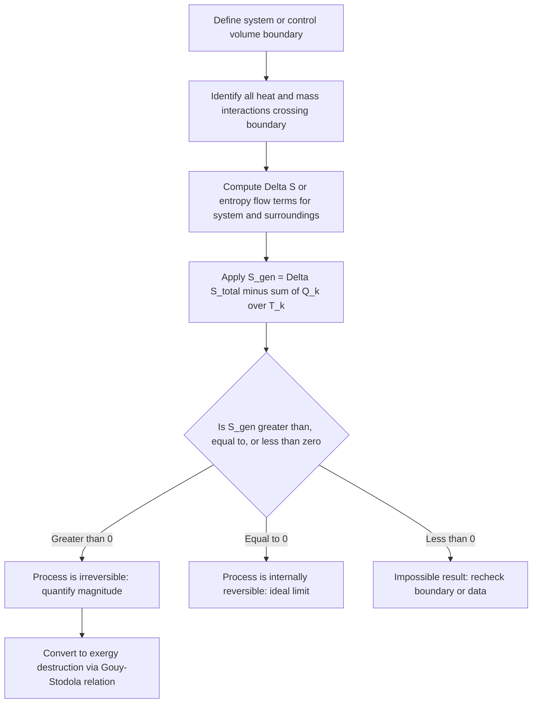

## Entropy Generation and Irreversibility

### Conceptual Overview

**Entropy generation** ($S_{gen}$) is the quantitative measure of irreversibility associated with a thermodynamic process, representing the entropy created *within* a system and its immediate surroundings as a direct consequence of non-ideal (irreversible) behavior. While the increase-of-entropy principle establishes that $S_{gen} \geq 0$ as a universal constraint, this topic focuses on the **practical calculation and interpretation** of $S_{gen}$ across closed systems, control volumes, and specific irreversibility mechanisms — establishing entropy generation as the central bridging concept between the Second Law and exergy (availability) analysis.

### General Entropy Generation Relations

**Closed system:**

$$S_{gen} = \Delta S_{system} - \sum \frac{Q_k}{T_k}$$

where $Q_k$ is the heat transfer across the portion of the boundary at absolute temperature $T_k$ (allowing for heat exchange with multiple reservoirs at different temperatures).

**Control volume (steady-flow):**

$$\dot{S}_{gen} = \sum_{out} \dot{m}_e s_e - \sum_{in} \dot{m}_i s_i - \sum \frac{\dot{Q}_k}{T_k}$$

For steady flow, the control volume's own entropy does not change with time ($dS_{CV}/dt = 0$), so $\dot{S}_{gen}$ depends only on the net entropy transported out by mass flow minus the entropy transferred in via heat.

**Isolated system / system-plus-surroundings:**

$$S_{gen} = \Delta S_{total} = \Delta S_{system} + \Delta S_{surroundings} \geq 0$$

**Key Points**

- $S_{gen}$ is always calculated for a **specified boundary**; the same physical process can yield different apportionments of entropy generation between "system" and "surroundings" depending on where the boundary is drawn, though the total for a sufficiently enlarged (isolated) boundary is fixed.
- Entropy generation is a **process quantity**, not a state property — it cannot be tabulated as a function of state alone, unlike entropy itself.

### Entropy Generation by Irreversibility Mechanism

Each physical source of irreversibility contributes identifiable, separately quantifiable entropy generation:

**1. Heat transfer across a finite temperature difference.** For heat $Q$ transferred from a hot reservoir at $T_H$ to a cold reservoir at $T_L$ (with no work interaction):

$$S_{gen} = \frac{Q}{T_L} - \frac{Q}{T_H} = Q\left(\frac{1}{T_L} - \frac{1}{T_H}\right) > 0 \quad \text{for } T_H > T_L$$

This shows explicitly that $S_{gen}$ increases with the magnitude of the temperature difference $T_H - T_L$ — the larger the mismatch, the greater the irreversibility for a given heat duty.

**2. Friction (mechanical or fluid).** Frictional work $W_{friction}$ dissipated as heat at a boundary temperature $T$ generates entropy directly:

$$S_{gen,friction} = \frac{W_{friction}}{T}$$

**3. Unrestrained (free) expansion.** For an ideal gas expanding freely (no work, no heat, $\Delta U = 0$, so $\Delta T = 0$) from $V_1$ to $V_2$:

$$S_{gen} = \Delta S = mR \ln\frac{V_2}{V_1} > 0$$

**4. Mixing of dissimilar substances or streams at different states.** Entropy generation from adiabatic mixing (e.g., two streams of the same ideal gas at different temperatures, or two different gases) is computed as the difference between the entropy of the mixed final state and the sum of entropies of the separate initial streams; this is always positive for any non-trivial mixing process.

**Key Points**

- These mechanisms are **additive** in many practical analyses: the total entropy generation for a complex real process (e.g., a throttling valve with friction plus heat loss to ambient) can often be approximated as the sum of the entropy generation contributions from each identifiable mechanism, though care must be taken to avoid double-counting when mechanisms interact.
- Heat-transfer-driven entropy generation is often the dominant term in large industrial heat exchangers, motivating the emphasis on minimizing approach temperature differences in heat exchanger design.

### Diagram: Entropy Generation Sources in a Control Volume (svg_diagram)

<svg xmlns="http://www.w3.org/2000/svg" viewBox="0 0 560 340">
<text x="280" y="24" text-anchor="middle" font-size="15" font-weight="bold" fill="#1a1a1a">Sources of Entropy Generation in a CV (svg_diagram)</text>
<rect x="180" y="100" width="200" height="140" rx="12" fill="#d8e2dc" stroke="#3a5a40" stroke-width="2" />
<text x="280" y="175" text-anchor="middle" font-size="14" font-weight="bold" fill="#1a1a1a">Control Volume</text>
<text x="280" y="195" text-anchor="middle" font-size="12" fill="#1a1a1a">S_gen accumulates here</text>

<text x="60" y="90" font-size="12" fill="`#e76f51`">Friction / dissipation</text>

<line x1="130" y1="95" x2="180" y2="130" stroke="`#e76f51`" stroke-width="2" marker-end="url(#ae)" />

<text x="60" y="270" font-size="12" fill="`#457b9d`">Finite-ΔT heat transfer</text>

<line x1="150" y1="260" x2="200" y2="230" stroke="`#457b9d`" stroke-width="2" marker-end="url(#ae)" />

<text x="410" y="90" font-size="12" fill="`#2a9d8f`">Unrestrained expansion</text>

<line x1="440" y1="95" x2="380" y2="130" stroke="`#2a9d8f`" stroke-width="2" marker-end="url(#ae)" />

<text x="410" y="270" font-size="12" fill="`#e9c46a`">Mixing of streams</text>

<line x1="430" y1="260" x2="380" y2="225" stroke="`#e9c46a`" stroke-width="2" marker-end="url(#ae)" />

</svg>

### Worked Example

**Example**

A steam turbine operates adiabatically, with steam entering at $s_1 = 6.60\ \text{kJ/(kg·K)}$ and exiting at $s_2 = 6.75\ \text{kJ/(kg·K)}$, at a steady mass flow rate $\dot{m} = 8\ \text{kg/s}$. Determine the rate of entropy generation and comment on the physical significance.

**Step 1 — Apply the steady-flow entropy generation equation** (adiabatic, so $\dot{Q} = 0$; single inlet/exit):

$$\dot{S}_{gen} = \dot{m}(s_2 - s_1) - 0 = \dot{m}(s_2 - s_1)$$

**Step 2 — Substitute values:**

$$\dot{S}_{gen} = 8 \times (6.75 - 6.60) = 8 \times 0.15 = 1.2\ \text{kW/K}$$

**Step 3 — Interpretation:** Since $\dot{S}_{gen} = 1.2\ \text{kW/K} > 0$, the turbine's expansion process is confirmed irreversible — consistent with the turbine's isentropic efficiency being less than 100%. This entropy generation rate can be directly converted to a rate of **exergy destruction** using the Gouy-Stodola relation, $\dot{X}_{destroyed} = T_0 \dot{S}_{gen}$, providing a quantitative measure of the lost work potential attributable specifically to this turbine's internal irreversibilities. [Inference: the specific irreversibility mechanisms responsible (blade friction, flow separation, leakage) cannot be individually isolated from the bulk entropy generation value alone; this would require more detailed internal flow modeling.]

### Comparison Table: Entropy Generation Mechanisms

| Mechanism | Formula | Depends Primarily On |
| --- | --- | --- |
| Finite-$\Delta T$ heat transfer | $Q(1/T_L - 1/T_H)$ | Temperature difference $T_H - T_L$ |
| Friction | $W_{friction}/T$ | Magnitude of dissipated work |
| Unrestrained expansion | $mR\ln(V_2/V_1)$ | Volume ratio |
| Mixing | Difference of mixture and component entropies | Composition/temperature differences of streams |
| Throttling | $S_{gen} = \dot m (s_2 - s_1)$, with $h_1 \approx h_2$ | Pressure drop across the valve |

### Entropy Generation Analysis Workflow

### Practical Implications and Design Notes

- **Component-level irreversibility ranking**: In complex systems (power plants, refrigeration systems), calculating $S_{gen}$ separately for each major component (boiler, turbine, condenser, pump) identifies which components contribute most to overall system irreversibility, directly guiding where design improvements yield the greatest thermodynamic benefit.
- **Trade-off between heat exchanger size and entropy generation**: Reducing the temperature difference driving heat transfer lowers $S_{gen}$ (per the finite-$\Delta T$ formula) but requires a larger heat transfer surface area for the same heat duty, creating a classic economic-thermodynamic trade-off in heat exchanger design.
- **Entropy generation minimization as a design philosophy**: This concept, often termed "entropy generation minimization" or "finite-time thermodynamics" in advanced treatments, formalizes the practice of optimizing a system's overall design specifically to minimize total $S_{gen}$ subject to practical constraints (size, cost, materials), rather than only maximizing raw thermal efficiency. [Unverified: the specific quantitative trade-off curves and optimization methods used in entropy generation minimization vary substantially by application and are not detailed by the basic entropy generation relations alone.]

**Related Topics**

- The Increase-of-Entropy Principle
- Isentropic Processes and Isentropic Efficiencies
- Exergy (Availability): Definition and Physical Significance
- The Gouy-Stodola Theorem and Exergy Destruction
- Second-Law (Exergetic) Efficiency
- Exergy Balance for Closed Systems and Control Volumes