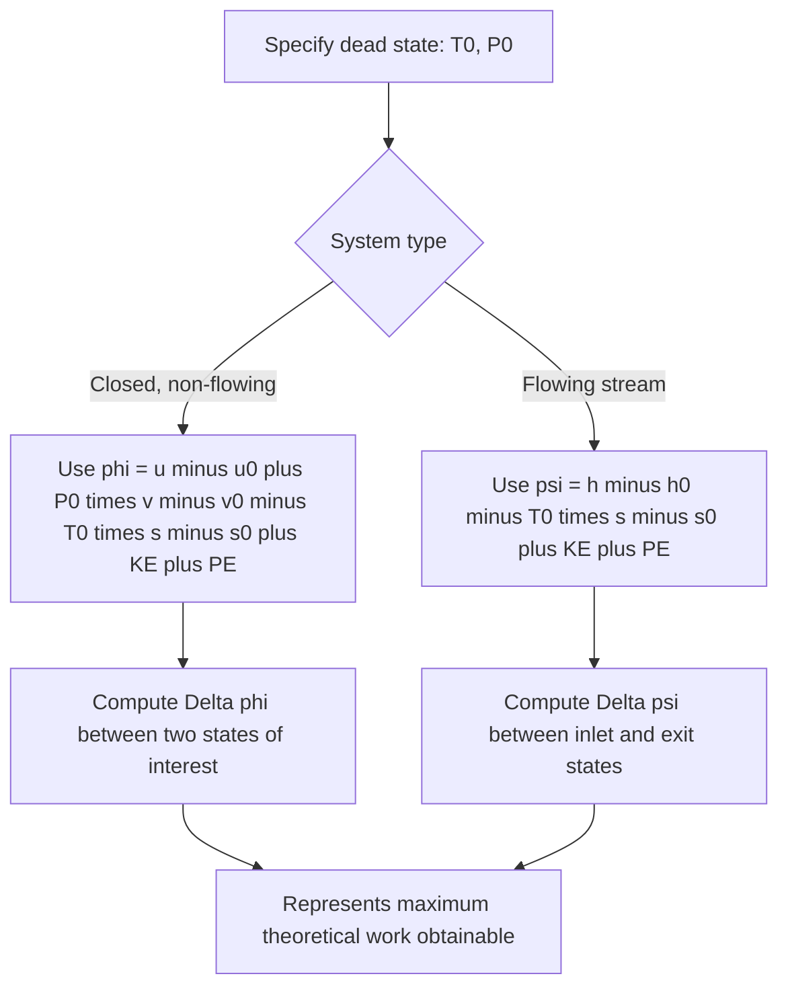

## Exergy of a System and of a Flow Stream

### Conceptual Overview

**Exergy** (also called **availability** or **available energy**) is the maximum theoretical useful work that can be extracted from a system as it is brought into complete thermodynamic equilibrium with a specified reference environment, called the **dead state**. Unlike energy, which is conserved (First Law), exergy is **not conserved** — it is destroyed whenever a process involves irreversibility, and this destruction is directly proportional to entropy generation. Exergy analysis provides a "quality" measure of energy, distinguishing high-quality (highly convertible-to-work) energy from low-quality (less convertible) energy, even when both have identical energy content.

### The Dead State

The **dead state** is the reference condition at which a system is in complete mechanical, thermal, and chemical equilibrium with its surroundings — at ambient pressure $P_0$ and ambient temperature $T_0$, with no unbalanced potentials, kinetic energy, or chemical reactivity relative to the environment. Properties evaluated at the dead state are denoted with subscript 0 ($u_0$, $h_0$, $s_0$, $v_0$).

At the dead state, a system has **zero exergy** — no further work can be extracted from it relative to the environment, since it can no longer spontaneously interact with the surroundings to produce work.

**Key Points**

- $T_0$ and $P_0$ are typically taken as standard atmospheric conditions (e.g., $25°\text{C}$, $100\ \text{kPa}$) unless otherwise specified for a given analysis.
- This treatment addresses **thermomechanical exergy** (based on $T$, $P$, KE, PE); chemical exergy, which accounts for departures from chemical equilibrium with the environment, is a distinct extension not covered here.

### Exergy of a Closed System (Non-Flow Exergy)

For a stationary closed system, the exergy $\Phi$ (or specific exergy $\phi$) represents the maximum useful work obtainable as the system moves from its current state to the dead state, accounting for the fact that any volume change work done *against* the atmosphere (at $P_0$) is not usable/recoverable:

$$\phi = (u - u_0) + P_0(v - v_0) - T_0(s - s_0) + \frac{V^2}{2} + gz$$

For a **closed system undergoing a process** from state 1 to state 2 (not necessarily to the dead state), the **exergy change** is:

$$\Delta\phi = \phi_2 - \phi_1 = (u_2 - u_1) + P_0(v_2 - v_1) - T_0(s_2 - s_1) + \frac{V_2^2 - V_1^2}{2} + g(z_2 - z_1)$$

**Key Points**

- The term $P_0(v - v_0)$ subtracts the portion of boundary work that is "wasted" pushing back the atmosphere and cannot be captured as useful work.
- The term $-T_0(s - s_0)$ reflects that entropy above the dead-state value represents energy that is less available for conversion to work, weighted by the ambient temperature.

### Exergy of a Flow Stream (Flow Exergy)

For a fluid stream crossing a control surface (as in turbines, compressors, heat exchangers), the relevant quantity is **flow exergy** ($\psi$), which additionally accounts for the flow work ($Pv$) associated with pushing the stream across the boundary — analogous to how enthalpy extends internal energy for flowing streams:

$$\psi = (h - h_0) - T_0(s - s_0) + \frac{V^2}{2} + gz$$

For a **flow process** between an inlet state 1 and exit state 2, the **flow exergy change** (per unit mass) is:

$$\Delta\psi = \psi_2 - \psi_1 = (h_2 - h_1) - T_0(s_2 - s_1) + \frac{V_2^2 - V_1^2}{2} + g(z_2 - z_1)$$

**Key Points**

- Flow exergy uses enthalpy $h$ in place of the combination $u + P_0 v$ used in closed-system exergy — this parallels the same substitution ($u \to h$) that occurs when moving from closed-system to control-volume energy analysis.
- $\Delta\psi$ (not $\psi$ alone) is typically the quantity of direct engineering interest, since most components (turbines, compressors, heat exchangers) are analyzed based on the change in flow exergy between inlet and exit, not the absolute exergy relative to the dead state.

### Diagram: Exergy Relative to the Dead State (svg_diagram)

<svg xmlns="http://www.w3.org/2000/svg" viewBox="0 0 560 320">
<text x="280" y="24" text-anchor="middle" font-size="15" font-weight="bold" fill="#1a1a1a">Exergy as Distance from the Dead State (svg_diagram)</text>
<circle cx="150" cy="150" r="60" fill="#f2c14e" stroke="#7a5c17" stroke-width="2" />
<text x="150" y="145" text-anchor="middle" font-size="13" font-weight="bold" fill="#1a1a1a">System</text>
<text x="150" y="163" text-anchor="middle" font-size="12" fill="#1a1a1a">State 1 (T, P, V, z)</text>
<circle cx="420" cy="150" r="60" fill="#8ecae6" stroke="#22577a" stroke-width="2" />
<text x="420" y="145" text-anchor="middle" font-size="13" font-weight="bold" fill="#1a1a1a">Dead State</text>
<text x="420" y="163" text-anchor="middle" font-size="12" fill="#1a1a1a">T0, P0</text>
<line x1="220" y1="150" x2="350" y2="150" stroke="#1a1a1a" stroke-width="2.5" marker-end="url(#aex)" />
<text x="230" y="135" font-size="13" font-weight="bold" fill="#1a1a1a">Maximum useful work = Exergy (φ or ψ)</text>
</svg>

### Worked Example

**Example**

Steam enters a device at $h_1 = 3200\ \text{kJ/kg}$, $s_1 = 6.90\ \text{kJ/(kg·K)}$ and exits at $h_2 = 2700\ \text{kJ/kg}$, $s_2 = 7.10\ \text{kJ/(kg·K)}$. Kinetic and potential energy changes are negligible. The dead-state temperature is $T_0 = 298\ \text{K}$. Determine the flow exergy change between inlet and exit.

**Step 1 — Apply the flow exergy change formula** (KE, PE negligible):

$$\Delta\psi = (h_2 - h_1) - T_0(s_2 - s_1)$$

**Step 2 — Substitute values:**

$$\Delta\psi = (2700 - 3200) - 298 \times (7.10 - 6.90)$$

$$\Delta\psi = -500 - 298 \times 0.20 = -500 - 59.6 = -559.6\ \text{kJ/kg}$$

**Step 3 — Interpretation:** The flow exergy decreases by $559.6\ \text{kJ/kg}$ as the steam passes through the device. This value represents the maximum theoretical work per unit mass that could have been extracted from this enthalpy/entropy change under fully reversible conditions relative to the given dead state. If the actual work extracted by a real turbine performing this same expansion were less than this value (which it necessarily would be for a real, irreversible device), the difference represents **exergy destroyed** due to irreversibility within the device. [Inference: the specific actual work output is not determined by the exergy change alone; it requires either a stated actual work value or an isentropic efficiency to complete the comparison.]

### Comparison Table: Closed-System vs. Flow Exergy

| Aspect | Closed-System Exergy ($\phi$) | Flow Exergy ($\psi$) |
| --- | --- | --- |
| Applies to | Fixed-mass, non-flowing system | Flowing stream crossing a control surface |
| Core energy term | $u - u_0$ | $h - h_0$ |
| Flow work adjustment | $+P_0(v - v_0)$ (explicit) | Embedded within $h$ (implicit) |
| Entropy term | $-T_0(s - s_0)$ | $-T_0(s - s_0)$ |
| Typical use case | Piston-cylinder devices, rigid tanks | Turbines, compressors, nozzles, heat exchangers |

### Exergy Determination Workflow

### Practical Implications and Design Notes

- **Basis for second-law efficiency**: Flow exergy change forms the denominator (or reference) for second-law (exergetic) efficiency calculations, which compare actual useful work extracted to the maximum theoretical exergy change available — a more rigorous performance metric than energy-based (First Law) efficiency alone.
- **Dead-state sensitivity**: Because exergy is defined *relative to* the dead state, the numerical exergy value of a given system state changes if $T_0$ or $P_0$ is redefined (e.g., different ambient conditions in different climates or seasons); however, exergy *destruction* during a process (tied to $S_{gen}$) is a more robust process-level quantity than absolute exergy values. [Unverified: the specific sensitivity of absolute exergy values to dead-state assumptions depends on the magnitude of $T - T_0$ and $P - P_0$ for the states involved and is not universal across all systems.]
- **High vs. low quality energy**: Exergy analysis explains why, for example, high-temperature heat is more "valuable" than the same quantity of low-temperature heat — the high-temperature heat carries substantially more exergy (convertibility to work) despite identical energy content, a distinction invisible to First Law accounting alone.

**Related Topics**

- Entropy Generation and Irreversibility
- The Gouy-Stodola Theorem and Exergy Destruction
- Exergy Balance for Closed Systems and Control Volumes
- Second-Law (Exergetic) Efficiency
- Exergy Analysis of Steady-Flow Devices
- Reversible Work and Irreversibility in Flow Processes