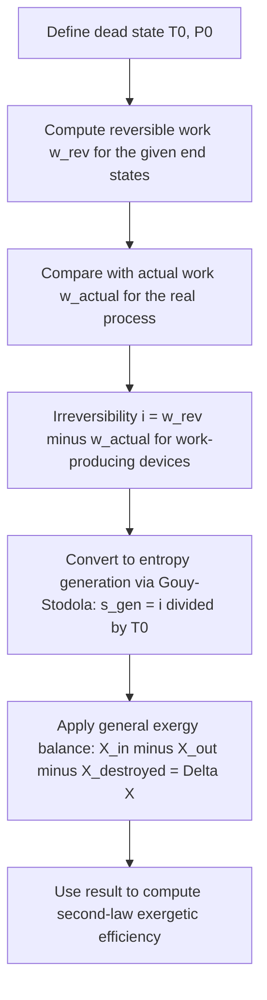

## Reversible Work and the Exergy Balance

### Conceptual Overview

**Reversible work** ($W_{rev}$) is the maximum useful work output (or minimum useful work input) obtainable as a system undergoes a specified process between two given states, if that process were executed in a totally reversible manner while allowing heat exchange only with the surrounding environment at $T_0$. The **exergy balance** is the general accounting framework — analogous to the energy balance (First Law) and entropy balance (Second Law) — that tracks exergy transfer, exergy destruction, and net exergy change for a system, providing a unified quantitative tool for identifying and locating irreversibility throughout a thermal system.

### Reversible Work

For a **closed system** undergoing a process from state 1 to state 2 while exchanging heat only with the environment at $T_0$, the reversible work is:

$$W_{rev} = (u_1 - u_2) - T_0(s_1 - s_2) - P_0(v_1 - v_2) + \frac{V_1^2 - V_2^2}{2} + g(z_1 - z_2)$$

expressed here in an "output-positive" convention. For a **control volume** in steady flow with a single inlet and exit, the corresponding reversible work (per unit mass) is:

$$w_{rev} = (h_1 - h_2) - T_0(s_1 - s_2) + \frac{V_1^2 - V_2^2}{2} + g(z_1 - z_2)$$

**Key Points**

- $W_{rev}$ is **not** the same as the isentropic work used in isentropic efficiency calculations: isentropic work assumes no heat transfer at all (adiabatic + reversible), while reversible work explicitly allows heat exchange with the environment at $T_0$ as part of achieving full reversibility.
- $W_{rev}$ represents the theoretical **best-case performance ceiling** for the specified end states, serving as the benchmark for second-law (exergetic) efficiency, just as isentropic work serves as the benchmark for isentropic efficiency.

### Irreversibility (Exergy Destroyed)

The **irreversibility** ($I$), also called **exergy destroyed** ($X_{destroyed}$), quantifies the gap between the theoretical reversible work and the actual work delivered (or consumed) by a real process:

$$I = W_{rev,out} - W_{actual,out} \quad \text{(work-producing devices)}$$

$$I = W_{actual,in} - W_{rev,in} \quad \text{(work-consuming devices)}$$

This irreversibility is directly related to entropy generation via the **Gouy-Stodola theorem**:

$$I = X_{destroyed} = T_0 S_{gen}$$

This relation is one of the most important results connecting Second Law entropy analysis to First Law-compatible work/energy accounting: it converts an abstract entropy generation value (in $\text{kJ/K}$) into a concrete lost-work value (in $\text{kJ}$), expressed in the same units as useful work.

**Key Points**

- $I \geq 0$ always, since $S_{gen} \geq 0$ and $T_0 > 0$ (absolute temperature); $I = 0$ only for a totally reversible process.
- $I$ represents work potential that is permanently lost — it cannot be recovered by any subsequent process, since it has already been converted to entropy (disorder) rather than remaining as organized, extractable work potential.

### The General Exergy Balance

Analogous to the energy balance ($E_{in} - E_{out} = \Delta E_{system}$) and entropy balance, the **exergy balance** for a closed system over a process is:

$$X_{in} - X_{out} - X_{destroyed} = \Delta X_{system}$$

Exergy transfer accompanies both heat and work interactions, but is treated differently for each:

**Exergy transfer by heat** (heat $Q$ crossing a boundary at temperature $T$, exchanged with environment at $T_0$):

$$X_{heat} = \left(1 - \frac{T_0}{T}\right) Q$$

This is precisely the Carnot factor — the maximum fraction of heat $Q$ convertible to work by a reversible engine operating between $T$ and $T_0$.

**Exergy transfer by work** (boundary work against atmosphere at $P_0$ is excluded, since it does not represent usable work):

$$X_{work} = W_{useful} = W - P_0(V_2 - V_1) \quad \text{(closed system, boundary work case)}$$

For non-boundary work (shaft work, electrical work), all of the work is usable exergy transfer: $X_{work} = W$.

**Exergy transfer by mass flow** (for control volumes): accounted for via the flow exergy $\psi$ of the entering/exiting streams.

Combining these, the full exergy balance for a closed system becomes:

$$\sum \left(1 - \frac{T_0}{T_k}\right) Q_k - \left[W - P_0(V_2 - V_1)\right] - X_{destroyed} = X_2 - X_1$$

**Key Points**

- Unlike the energy balance, the exergy balance includes an explicit **destruction** term, reflecting that exergy — unlike energy — is not conserved.
- $X_{destroyed} = T_0 S_{gen}$ links this balance directly back to the entropy generation calculated via the Second Law entropy balance, making the two frameworks fully consistent.

### Diagram: Exergy Balance Structure (svg_diagram)

<svg xmlns="http://www.w3.org/2000/svg" viewBox="0 0 560 320">
<text x="280" y="24" text-anchor="middle" font-size="15" font-weight="bold" fill="#1a1a1a">Exergy Balance for a System (svg_diagram)</text>
<rect x="200" y="110" width="160" height="100" rx="10" fill="#f2c14e" stroke="#7a5c17" stroke-width="1.5" />
<text x="280" y="155" text-anchor="middle" font-size="13" font-weight="bold" fill="#1a1a1a">System</text>
<text x="280" y="175" text-anchor="middle" font-size="12" fill="#1a1a1a">Delta X_system</text>
<line x1="60" y1="140" x2="200" y2="140" stroke="#2a9d8f" stroke-width="2.5" marker-end="url(#axb)" />
<text x="30" y="128" font-size="12" fill="#2a9d8f">X_in (heat, work, mass)</text>
<line x1="360" y1="180" x2="500" y2="180" stroke="#e76f51" stroke-width="2.5" marker-end="url(#axb)" />
<text x="365" y="200" font-size="12" fill="#e76f51">X_out (heat, work, mass)</text>
<line x1="280" y1="210" x2="280" y2="280" stroke="#c1121f" stroke-width="2.5" stroke-dasharray="6,4" marker-end="url(#axb)" />
<text x="200" y="300" font-size="12" font-weight="bold" fill="#c1121f">X_destroyed = T0 · S_gen</text>
</svg>

### Worked Example

**Example**

A steady-flow turbine receives steam and produces an actual work output of $w_{actual} = 850\ \text{kJ/kg}$. Analysis of the inlet and exit states (accounting for enthalpy, entropy, and negligible KE/PE changes) shows the reversible work for the same end states, evaluated with $T_0 = 300\ \text{K}$, is $w_{rev} = 1000\ \text{kJ/kg}$. Determine the irreversibility and the rate of entropy generation for a mass flow rate of $\dot{m} = 10\ \text{kg/s}$.

**Step 1 — Compute irreversibility per unit mass** (work-producing device):

$$i = w_{rev} - w_{actual} = 1000 - 850 = 150\ \text{kJ/kg}$$

**Step 2 — Convert to entropy generation using the Gouy-Stodola relation:**

$$s_{gen} = \frac{i}{T_0} = \frac{150}{300} = 0.50\ \text{kJ/(kg·K)}$$

**Step 3 — Total rates for the given mass flow:**

$$\dot{I} = \dot{m} \cdot i = 10 \times 150 = 1500\ \text{kW}$$

$$\dot{S}_{gen} = \dot{m} \cdot s_{gen} = 10 \times 0.50 = 5.0\ \text{kW/K}$$

**Step 4 — Interpretation:** The turbine destroys $1500\ \text{kW}$ of exergy (lost work potential) due to internal irreversibilities, corresponding to an entropy generation rate of $5.0\ \text{kW/K}$. This $1500\ \text{kW}$ represents power that could theoretically have been extracted as additional useful work had the process been executed reversibly between the same end states — it is permanently unrecoverable, not merely inefficiently used. [Inference: the specific physical source of this irreversibility (blade friction, flow separation, leakage) cannot be determined from the bulk exergy balance alone.]

### Comparison Table: Energy, Entropy, and Exergy Balances

| Balance Type | General Form | Conserved? | Key Distinguishing Term |
| --- | --- | --- | --- |
| Energy (First Law) | $E_{in} - E_{out} = \Delta E$ | Yes | None (strictly conserved) |
| Entropy (Second Law) | $\Delta S = \int \delta Q/T + S_{gen}$ | No (generated, $S_{gen} \geq 0$) | $S_{gen}$ |
| Exergy | $X_{in} - X_{out} - X_{destroyed} = \Delta X$ | No (destroyed, $X_{destroyed} \geq 0$) | $X_{destroyed} = T_0 S_{gen}$ |

### Exergy Balance Application Workflow

### Practical Implications and Design Notes

- **Locating losses precisely**: Applying the exergy balance component-by-component across an entire power plant or refrigeration cycle (boiler, turbine, condenser, pump, etc.) reveals exactly where and how much exergy is destroyed at each stage, information that a purely energy-based (First Law) analysis cannot provide, since energy is conserved everywhere by definition.
- **Guides targeted design improvement**: Because $X_{destroyed} = T_0 S_{gen}$ converts entropy generation into directly comparable work-equivalent units across dissimilar components (a throttling valve, a combustor, a heat exchanger), engineers can rank components by their exergy destruction to prioritize design improvements where they yield the greatest practical benefit.
- **Distinction from energy loss**: A component with small energy loss (e.g., a well-insulated throttling valve, where no heat is lost to the surroundings) can nonetheless have very large exergy destruction, since throttling is an inherently irreversible process (large entropy generation) even without any heat transfer — a classic illustration of why exergy analysis captures inefficiencies invisible to energy balances alone. [Unverified: the specific magnitude of exergy destruction in throttling depends on the particular pressure drop and fluid properties involved and is not universal.]

**Related Topics**

- Exergy of a System and of a Flow Stream
- Entropy Generation and Irreversibility
- The Gouy-Stodola Theorem
- Second-Law (Exergetic) Efficiency
- Exergy Analysis of Steady-Flow Devices (Turbines, Compressors, Heat Exchangers, Throttling Valves)
- Minimum Work of Compression and Maximum Work of Expansion