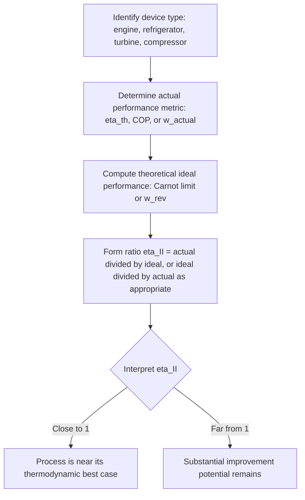

## Second-Law (Exergetic) Efficiency

### Conceptual Overview

**Second-law efficiency** ($\eta_{II}$), also called **exergetic efficiency**, measures the actual performance of a device or process relative to its **reversible (ideal) performance** for the same end states, rather than relative to a simple energy input as First Law (thermal) efficiency does. While First Law efficiency answers "how much of the energy input became useful output," second-law efficiency answers the more discriminating question: "how close did this process come to its true thermodynamic best-case, accounting for the quality of energy involved?" This distinction allows meaningful performance comparison across dissimilar devices and processes in a way that First Law efficiency cannot provide.

### Motivation: Why First Law Efficiency Is Insufficient

A First Law thermal efficiency of, say, $30\%$ for a heat engine reveals nothing about how that $30\%$ compares to the maximum efficiency thermodynamically possible for the same reservoir temperatures. A $30\%$ efficient engine operating between reservoirs where the Carnot limit is $32\%$ is performing excellently (very close to the theoretical best), while the same $30\%$ efficiency for reservoirs with a Carnot limit of $75\%$ indicates substantial room for improvement. First Law efficiency alone cannot distinguish these two very different engineering situations — second-law efficiency was developed specifically to address this gap.

**Key Points**

- First Law efficiency treats all energy as equally valuable; second-law efficiency accounts for the fact that energy has varying "quality" (convertibility to work), which depends on the temperature/state at which it is available relative to the environment.
- A device can have a high First Law efficiency but a low second-law efficiency, or vice versa, depending on how close its performance sits relative to the theoretical (reversible) ceiling for its specific operating conditions.

### General Definition of Second-Law Efficiency

The general form of second-law efficiency is:

$$\eta_{II} = \frac{\text{Exergy recovered (or useful exergy output)}}{\text{Exergy supplied (or exergy input)}}$$

Equivalently, and often more directly computable:

$$\eta_{II} = \frac{W_{actual}}{W_{rev}} \quad \text{(work-producing devices)}$$

$$\eta_{II} = \frac{W_{rev}}{W_{actual}} \quad \text{(work-consuming devices)}$$

where $W_{rev}$ is the reversible work between the same specified end states, computed as covered in reversible work analysis. Because $W_{rev}$ represents the absolute theoretical maximum (or minimum) achievable, $\eta_{II} \leq 1$ (or $100\%$) always, with equality only for a totally reversible process.

**Key Points**

- $\eta_{II} = 1$ corresponds to a totally reversible process (zero exergy destruction); $\eta_{II} < 1$ indicates the fraction of theoretical performance actually achieved.
- Unlike isentropic efficiency (which compares against an adiabatic, isentropic ideal), second-law efficiency compares against the reversible-work ideal, which may include beneficial heat exchange with the environment at $T_0$ — making $\eta_{II}$ the more fundamentally rigorous benchmark.

### Second-Law Efficiency for Heat Engines

For a heat engine, the appropriate comparison is between the actual thermal efficiency and the Carnot efficiency for the same reservoir temperatures:

$$\eta_{II} = \frac{\eta_{th}}{\eta_{th,Carnot}} = \frac{\eta_{th}}{1 - T_L/T_H}$$

This directly answers "what fraction of the maximum possible (Carnot) efficiency does this engine actually achieve?"

### Second-Law Efficiency for Refrigerators and Heat Pumps

Analogously, for refrigeration and heat pump cycles, second-law efficiency compares the actual COP to the Carnot (maximum) COP for the same reservoir temperatures:

$$\eta_{II} = \frac{COP_R}{COP_{R,Carnot}} \quad \text{or} \quad \eta_{II} = \frac{COP_{HP}}{COP_{HP,Carnot}}$$

### Second-Law Efficiency for Work-Producing and Work-Consuming Devices

For general steady-flow devices (turbines, compressors, pumps) where exergy change ($\Delta\psi$) rather than a simple Carnot ratio is the relevant comparison:

**Turbines (work-producing):**

$$\eta_{II} = \frac{w_{actual}}{\psi_1 - \psi_2} = \frac{w_{actual}}{w_{rev}}$$

**Compressors and pumps (work-consuming):**

$$\eta_{II} = \frac{\psi_2 - \psi_1}{w_{actual}} = \frac{w_{rev}}{w_{actual}}$$

**Key Points**

- These formulations use flow exergy change $\Delta\psi$ as the theoretical benchmark, directly connecting second-law efficiency to the exergy balance framework.
- For adiabatic devices with negligible KE/PE, this often reduces closely to comparisons involving isentropic efficiency, but the two are **not identical** in general, since $w_{rev}$ (reversible work, allowing heat exchange with $T_0$) can differ from $w_s$ (isentropic work, strictly adiabatic).

### Diagram: First Law vs. Second Law Efficiency Comparison (svg_diagram)

<svg xmlns="http://www.w3.org/2000/svg" viewBox="0 0 560 320">
<text x="280" y="24" text-anchor="middle" font-size="15" font-weight="bold" fill="#1a1a1a">First-Law vs Second-Law Efficiency (svg_diagram)</text>

<text x="150" y="60" text-anchor="middle" font-size="13" font-weight="bold" fill="`#1a1a1a`">Engine A</text>

<rect x="80" y="80" width="140" height="30" fill="`#e0e0e0`" stroke="`#1a1a1a`" />

<rect x="80" y="80" width="42" height="30" fill="`#2a9d8f`" />

<text x="150" y="125" text-anchor="middle" font-size="12" fill="`#1a1a1a`">η_th = 30%, η_II = 94%</text>

<text x="150" y="142" text-anchor="middle" font-size="11" fill="`#1a1a1a`">(Carnot limit ≈ 32%)</text>

<text x="410" y="60" text-anchor="middle" font-size="13" font-weight="bold" fill="`#1a1a1a`">Engine B</text>

<rect x="340" y="80" width="140" height="30" fill="`#e0e0e0`" stroke="`#1a1a1a`" />

<rect x="340" y="80" width="42" height="30" fill="`#e76f51`" />

<text x="410" y="125" text-anchor="middle" font-size="12" fill="`#1a1a1a`">η_th = 30%, η_II = 40%</text>

<text x="410" y="142" text-anchor="middle" font-size="11" fill="`#1a1a1a`">(Carnot limit = 75%)</text>

<text x="280" y="200" text-anchor="middle" font-size="13" fill="`#1a1a1a`">Identical First-Law efficiency, very different</text>

<text x="280" y="220" text-anchor="middle" font-size="13" fill="`#1a1a1a`">Second-Law efficiency — Engine A is far closer to its ideal limit</text>

</svg>

### Worked Example

**Example**

Two heat engines are compared:

- **Engine A** operates between $T_H = 500\ \text{K}$ and $T_L = 340\ \text{K}$, with an actual thermal efficiency $\eta_{th,A} = 30\%$.
- **Engine B** operates between $T_H = 1500\ \text{K}$ and $T_L = 375\ \text{K}$, with the same actual thermal efficiency $\eta_{th,B} = 30\%$.

Determine the second-law efficiency of each and compare their actual performance quality.

**Step 1 — Carnot efficiency limits:**

$$\eta_{th,Carnot,A} = 1 - \frac{340}{500} = 1 - 0.68 = 0.32 = 32\%$$

$$\eta_{th,Carnot,B} = 1 - \frac{375}{1500} = 1 - 0.25 = 0.75 = 75\%$$

**Step 2 — Second-law efficiencies:**

$$\eta_{II,A} = \frac{0.30}{0.32} = 0.9375 = 93.75\%$$

$$\eta_{II,B} = \frac{0.30}{0.75} = 0.40 = 40\%$$

**Step 3 — Interpretation:** Despite identical First Law thermal efficiencies ($30\%$ for both), Engine A is achieving $93.75\%$ of its theoretical maximum performance, while Engine B is achieving only $40\%$ of its own theoretical maximum. Engine A is, in a rigorous thermodynamic sense, the far superior design — it is much closer to what is physically achievable given its operating temperatures — even though a First Law comparison alone would incorrectly suggest the two engines perform identically. [Inference: this comparison addresses thermodynamic performance quality only; practical factors such as capital cost, engine size, and application suitability would require additional non-thermodynamic considerations not addressed here.]

### Comparison Table: First-Law vs. Second-Law Efficiency

| Aspect | First-Law Efficiency ($\eta_{th}$) | Second-Law Efficiency ($\eta_{II}$) |
| --- | --- | --- |
| Basis of comparison | Energy input vs. useful energy output | Actual performance vs. reversible (ideal) performance |
| Accounts for energy quality | No | Yes |
| Maximum possible value | Less than 100% (Carnot-limited) | 100% (achieved only if totally reversible) |
| Useful for | Basic energy accounting | Identifying true improvement potential, comparing dissimilar systems |
| Can mask design quality | Yes (as shown in worked example) | No — directly reveals closeness to ideal |

### Second-Law Efficiency Evaluation Workflow

### Practical Implications and Design Notes

- **Fair comparison across dissimilar systems**: Second-law efficiency enables meaningful comparison between, for example, a low-temperature geothermal power plant and a high-temperature combined-cycle gas plant, even though their First Law efficiencies differ enormously due to fundamentally different Carnot limits — second-law efficiency reveals which plant is actually closer to exploiting its available thermodynamic potential.
- **Identifying genuine improvement opportunity**: A process with low second-law efficiency signals meaningful room for design improvement (better heat exchanger design, reduced friction, improved insulation), while a process already near $\eta_{II} = 1$ has little room left for improvement regardless of how modest its First Law efficiency might appear.
- **Complement, not replacement, for First Law analysis**: Second-law efficiency does not replace energy balances and First Law efficiency in design work — it supplements them, providing the "how good is this, really" context that raw energy accounting cannot supply on its own. [Unverified: specific benchmark second-law efficiency values across different industrial equipment categories vary by source and are not standardized into a single universal reference table.]

**Related Topics**

- Reversible Work and the Exergy Balance
- Exergy of a System and of a Flow Stream
- The Carnot Cycle and Carnot Principles
- Entropy Generation and Irreversibility
- Isentropic Processes and Isentropic Efficiencies
- Exergy Analysis of Steady-Flow Devices