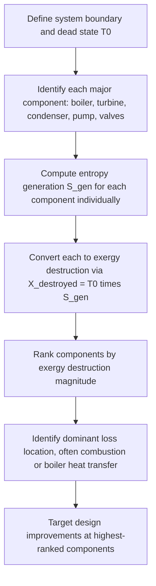

## Exergy Destruction in Power System Components

### Conceptual Overview

Every real power-generating system — steam power plants, gas turbine plants, combined cycles, refrigeration and heat pump systems — consists of individual components (boilers, turbines, compressors, condensers, heat exchangers, throttling devices, combustion chambers) each of which destroys a portion of the exergy supplied to the overall system due to internal irreversibilities. Component-level exergy destruction analysis applies the general exergy balance and Gouy-Stodola relation ($X_{destroyed} = T_0 S_{gen}$) to each component individually, producing a detailed map of where thermodynamic losses actually occur across a complete power system — information that aggregate First Law (energy) accounting cannot provide, since energy is conserved and shows no "loss" at all within any component.

### General Approach to Component-Level Exergy Destruction

For any steady-flow component, exergy destruction is computed from the steady-flow exergy balance:

$$\dot{X}_{destroyed} = T_0 \dot{S}_{gen} = T_0\left[\sum_{out} \dot{m}_e s_e - \sum_{in} \dot{m}_i s_i - \sum \frac{\dot{Q}_k}{T_k}\right]$$

Applied systematically component-by-component, this produces an **exergy destruction breakdown** for the entire system, which — combined with the exergy supplied to the system as a whole (e.g., fuel exergy or heat source exergy) — allows calculation of each component's individual contribution to total system exergy loss.

**Key Points**

- The sum of all component-level exergy destructions, plus any exergy leaving the system unused (e.g., exergy of the exhaust or condenser reject heat), must equal the total exergy input to the system — this provides an internal consistency check on the analysis.
- Components with **no moving parts and no heat transfer** (e.g., throttling valves, adiabatic mixing chambers) can still have substantial exergy destruction, since throttling and mixing are inherently irreversible processes independent of mechanical friction.

### Boilers / Combustion Chambers / Heat Exchangers (External Heat Addition)

Exergy destruction in a boiler or heat exchanger arises primarily from heat transfer across the finite temperature difference between the hot source (combustion gases) and the working fluid (water/steam):

$$\dot{X}_{destroyed,boiler} = T_0\left(\dot{m}_{fluid}(s_2 - s_1) - \frac{\dot{Q}_{in}}{T_{source}}\right)$$

Combustion chambers additionally destroy substantial exergy due to the highly irreversible nature of combustion itself (a chemical reaction proceeding far from equilibrium), typically representing the **single largest exergy destruction location** in fossil-fuel and gas-turbine power systems. [Unverified: the specific fraction of total system exergy destroyed in combustion varies substantially by fuel type, equivalence ratio, and combustor design, and is not a fixed universal value.]

### Turbines and Compressors

Exergy destruction in turbines and compressors arises from internal irreversibilities (blade friction, flow separation, tip leakage), directly related to the deviation from isentropic behavior captured in isentropic efficiency:

$$\dot{X}_{destroyed,turbine} = T_0 \dot{m}(s_2 - s_1) = \dot{m}\, T_0 \left[\frac{(1-\eta_T)(h_1 - h_{2s})}{T_0}\right]_{\text{approx., for small deviations}}$$

More directly and generally, using the actual entropy rise:

$$\dot{X}_{destroyed} = T_0 \dot{m}(s_{2,actual} - s_1)$$

**Key Points**

- Higher isentropic efficiency directly translates to lower exergy destruction for turbines and compressors, making this one of the more intuitive links between conventional performance metrics and exergy analysis.
- Multi-stage compression with intercooling reduces cumulative exergy destruction compared to single-stage compression to the same overall pressure ratio, by keeping the compression process closer to isothermal (lower average temperature during compression reduces irreversibility for a given pressure rise).

### Condensers and Heat Rejection

Condensers destroy exergy through heat transfer across a finite temperature difference to the cooling medium (cooling water or ambient air), and additionally represent a location where exergy is **permanently lost** to the environment (rejected heat at near-ambient temperature carries very little remaining exergy, since it is close to the dead state):

$$\dot{X}_{destroyed,condenser} = T_0\left(\frac{\dot{Q}_{out}}{T_{cooling\ medium}} - \frac{\dot{Q}_{out}}{T_{condensing}}\right)$$

**Key Points**

- Even though condensers typically reject a **large fraction of the energy** input to a power cycle (often 40–60% for steam Rankine cycles), the **exergy** associated with this rejected heat is comparatively small, because the heat is rejected near ambient temperature $T_0$ — illustrating the key distinction between energy loss and exergy loss.

### Throttling Valves

Throttling is a classic example of a process with **zero heat transfer, zero work, and zero net energy change** ($h_1 \approx h_2$), yet **substantial exergy destruction**, since the pressure drop is achieved through an inherently irreversible flow restriction:

$$\dot{X}_{destroyed,throttle} = T_0 \dot{m}(s_2 - s_1), \quad s_2 > s_1 \text{ always, since } h_1 = h_2 \text{ and } P_2 < P_1$$

### Diagram: Exergy Flow Through a Simple Steam Power Plant (svg_diagram)

<svg xmlns="http://www.w3.org/2000/svg" viewBox="0 0 620 340">
<text x="310" y="24" text-anchor="middle" font-size="15" font-weight="bold" fill="#1a1a1a">Exergy Destruction Map: Simple Rankine Plant (svg_diagram)</text>
<rect x="60" y="130" width="110" height="60" rx="8" fill="#e8664c" stroke="#7a2e1f" stroke-width="1.5" />
<text x="115" y="165" text-anchor="middle" font-size="12" fill="#fff">Boiler</text>
<rect x="220" y="130" width="110" height="60" rx="8" fill="#f2c14e" stroke="#7a5c17" stroke-width="1.5" />
<text x="275" y="165" text-anchor="middle" font-size="12" fill="#1a1a1a">Turbine</text>
<rect x="380" y="130" width="110" height="60" rx="8" fill="#4c8ee8" stroke="#1f3f7a" stroke-width="1.5" />
<text x="435" y="165" text-anchor="middle" font-size="12" fill="#fff">Condenser</text>
<rect x="540" y="130" width="60" height="60" rx="8" fill="#8ecae6" stroke="#22577a" stroke-width="1.5" />
<text x="570" y="165" text-anchor="middle" font-size="11" fill="#1a1a1a">Pump</text>
<line x1="170" y1="160" x2="220" y2="160" stroke="#1a1a1a" stroke-width="2" marker-end="url(#axd)" />
<line x1="330" y1="160" x2="380" y2="160" stroke="#1a1a1a" stroke-width="2" marker-end="url(#axd)" />
<line x1="490" y1="160" x2="540" y2="160" stroke="#1a1a1a" stroke-width="2" marker-end="url(#axd)" />
<path d="M 570 130 Q 570 90 60 90 Q 60 90 60 130" fill="none" stroke="#1a1a1a" stroke-width="2" marker-end="url(#axd)" />

<text x="115" y="220" text-anchor="middle" font-size="11" fill="`#c1121f`">X_destroyed: largest</text>

<text x="275" y="220" text-anchor="middle" font-size="11" fill="`#c1121f`">X_destroyed: moderate</text>

<text x="435" y="220" text-anchor="middle" font-size="11" fill="`#c1121f`">X_destroyed: small (but energy loss large)</text>

<text x="570" y="220" text-anchor="middle" font-size="11" fill="`#c1121f`">X_destroyed: minor</text>

</svg>

### Worked Example

**Example**

A simplified steam power plant has the following component-level entropy generation rates: Boiler $\dot{S}_{gen,boiler} = 3.2\ \text{kW/K}$, Turbine $\dot{S}_{gen,turbine} = 0.8\ \text{kW/K}$, Condenser $\dot{S}_{gen,condenser} = 1.5\ \text{kW/K}$, Pump $\dot{S}_{gen,pump} = 0.05\ \text{kW/K}$. Using $T_0 = 298\ \text{K}$, determine the exergy destruction in each component and identify the largest loss location.

**Step 1 — Apply the Gouy-Stodola relation to each component:**

$$\dot{X}_{destroyed,boiler} = 298 \times 3.2 = 953.6\ \text{kW}$$

$$\dot{X}_{destroyed,turbine} = 298 \times 0.8 = 238.4\ \text{kW}$$

$$\dot{X}_{destroyed,condenser} = 298 \times 1.5 = 447.0\ \text{kW}$$

$$\dot{X}_{destroyed,pump} = 298 \times 0.05 = 14.9\ \text{kW}$$

**Step 2 — Total exergy destruction:**

$$\dot{X}_{destroyed,total} = 953.6 + 238.4 + 447.0 + 14.9 = 1653.9\ \text{kW}$$

**Step 3 — Interpretation:** The **boiler** is the single largest source of exergy destruction ($953.6\ \text{kW}$, roughly $58\%$ of the total), consistent with the general expectation that heat addition across a large finite temperature difference (combustion gases to water/steam) is typically the dominant irreversibility source in a steam power plant. The pump contributes negligibly. This ranking directs engineering attention specifically toward improving heat transfer effectiveness in the boiler (e.g., reducing pinch-point temperature differences, improving heat exchanger surface design) as the highest-value target for efficiency improvement. [Inference: these specific numerical values are illustrative; actual component-level entropy generation for a real plant would require detailed thermodynamic state data at every component boundary.]

### Comparison Table: Typical Relative Exergy Destruction by Component (Illustrative Steam Plant)

| Component | Typical Relative Exergy Destruction | Primary Irreversibility Mechanism |
| --- | --- | --- |
| Boiler / Combustor | Largest (often 50-70% of total) | Finite-ΔT heat transfer; combustion irreversibility |
| Condenser | Moderate-to-large (energy loss large, exergy loss smaller) | Finite-ΔT heat rejection near ambient |
| Turbine | Moderate | Blade friction, flow non-idealities |
| Pump | Small | Minor frictional losses |
| Throttling valve (if present) | Can be significant despite no heat/work | Irreversible pressure drop |

[Unverified: these relative proportions are illustrative and representative of common steam power plant configurations; specific numerical breakdowns vary substantially with plant design, fuel type, and operating conditions.]

### Exergy Destruction Analysis Workflow

### Practical Implications and Design Notes

- **Combustion and heat addition as priority targets**: In fossil-fuel power systems, combustion chambers and boilers consistently rank as the dominant exergy destruction sources, motivating research into technologies (e.g., combined cycles, cogeneration, advanced combustion techniques) that better match the temperature profile of heat addition to the temperature profile of the working fluid, thereby reducing the finite-$\Delta T$ irreversibility.
- **Combined cycles as an exergy-destruction mitigation strategy**: Combined-cycle power plants (gas turbine topping cycle + steam Rankine bottoming cycle) achieve higher overall exergetic efficiency in part by using the still-substantial exergy remaining in gas turbine exhaust (rather than rejecting it directly to the environment) to drive a second power cycle, reducing the exergy that would otherwise be destroyed or wasted.
- **Distinguishing avoidable from unavoidable destruction**: Advanced exergy analysis methods (beyond the scope of the basic component breakdown presented here) further split exergy destruction into "avoidable" and "unavoidable" portions, helping engineers distinguish genuine improvement opportunities from destruction inherent to unavoidable technical constraints. [Unverified: the avoidable/unavoidable split methodology is a more advanced technique and its specific quantitative application is context- and system-dependent, not detailed by the standard exergy balance alone.]

**Related Topics**

- Second-Law (Exergetic) Efficiency
- Reversible Work and the Exergy Balance
- The Gouy-Stodola Theorem and Exergy Destruction
- The Rankine Cycle and Real Power Plant Analysis
- Combined Gas-Steam Power Cycles
- Cogeneration and Combined Heat and Power Systems