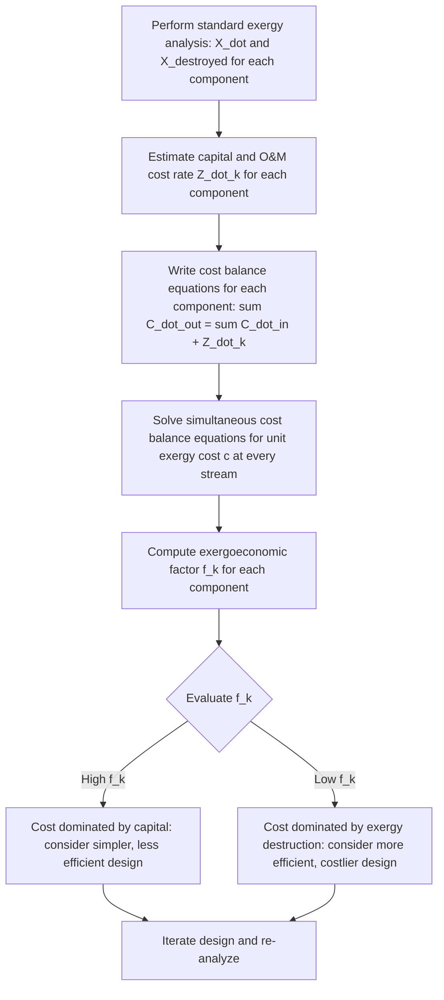

## Introduction to Exergoeconomics

### Conceptual Overview

**Exergoeconomics** is the discipline that combines exergy (Second Law-based thermodynamic) analysis with economic cost accounting to determine the actual monetary cost of each exergy stream within a thermal system, and to identify the cost formation process throughout the plant. While conventional (First Law) cost accounting allocates costs based on energy content or mass flow, exergoeconomics allocates cost based on **exergy content**, since exergy represents the true thermodynamic value (work potential) of a stream — providing a rigorous, physically meaningful basis for costing, rather than an arbitrary accounting convention.

### Motivation: Why Combine Exergy with Economics

Purely thermodynamic (exergy) analysis identifies *where* and *how much* exergy is destroyed in a system, but it cannot by itself indicate whether reducing a particular component's exergy destruction is **economically justified** — since design changes that reduce irreversibility (e.g., larger heat exchangers, more efficient turbines) typically require greater capital investment. Exergoeconomics addresses this gap by simultaneously tracking:

1. The **thermodynamic** cost of inefficiency (exergy destroyed, and the exergy-based unit cost of that destruction).
2. The **economic** cost of the equipment and operation that produces or processes each exergy stream (capital investment, operating and maintenance costs).

This dual accounting enables genuine cost-based optimization: a component should be improved only if the economic value of the exergy saved exceeds the additional capital and operating cost required to achieve that improvement.

**Key Points**

- Exergoeconomics is distinct from simple "energy costing" (allocating fuel cost by energy content) because it recognizes that different forms and qualities of energy carry different intrinsic economic value, proportional to their exergy content rather than their raw energy content.
- The field is sometimes referred to under related names including **thermoeconomics** (a broader term) and specific methodologies such as **SPECO** (Specific Exergy Costing).

### The Cost Balance Equation

For each component $k$ in a system, an exergoeconomic **cost balance** is written, analogous to the exergy balance but tracking monetary cost rate ($\dot{C}$, typically in $/hr) rather than exergy rate directly:

$$\sum_{out} \dot{C}_{e,k} + \dot{C}_{w,k} = \sum_{in} \dot{C}_{i,k} + \dot{C}_{q,k} + \dot{Z}_k$$

where:

- $\dot{C}_{e,k}$: cost rate associated with exergy streams leaving component $k$
- $\dot{C}_{i,k}$: cost rate associated with exergy streams entering component $k$
- $\dot{C}_{w,k}$, $\dot{C}_{q,k}$: cost rates associated with work and heat interactions
- $\dot{Z}_k$: cost rate associated with capital investment (amortized) and operating/maintenance expenses for component $k$

Each exergy stream's cost rate is expressed as the product of its **average cost per unit exergy** ($c$, in $/kJ or $/kWh) and its exergy rate ($\dot{X}$):

$$\dot{C} = c \cdot \dot{X}$$

**Key Points**

- The unit exergy cost $c$ generally **increases** as a stream passes through components with exergy destruction, since the fixed cost of that destroyed exergy must be redistributed onto the remaining, useful exergy output — a central and often counterintuitive insight of exergoeconomics.
- Solving the full set of cost balance equations across all components of a system (along with auxiliary equations for components with multiple outputs, such as cogeneration units) yields the unit cost of every stream in the plant, including the final product streams (e.g., cost per kWh of electricity, cost per unit of process steam).

### The Exergoeconomic (Cost) Factor

A key diagnostic quantity in exergoeconomics is the **exergoeconomic factor** ($f_k$), which indicates whether a component's total cost is dominated by capital/investment cost or by the cost associated with its exergy destruction:

$$f_k = \frac{\dot{Z}_k}{\dot{Z}_k + c_{F,k}\dot{X}_{destroyed,k}}$$

where $c_{F,k}$ is the average unit cost of exergy at the "fuel" (input) side of the component.

**Interpretation:**

- **High $f_k$** (close to 1): The component's cost is dominated by capital investment, suggesting that a less expensive, potentially less thermodynamically efficient design may be economically justified.
- **Low $f_k$** (close to 0): The component's cost is dominated by the cost of its exergy destruction (thermodynamic inefficiency), suggesting that investing in a more efficient (though more expensive) design is likely economically justified.

**Key Points**

- This factor directly operationalizes the fundamental design trade-off between capital cost and thermodynamic efficiency, converting it into a single comparative metric usable across dissimilar components.
- Exergoeconomic analysis is typically performed iteratively: an initial design is analyzed, components with unfavorable $f_k$ values are identified, redesigned, and the analysis repeated, forming the basis of structured **exergoeconomic optimization**.

### Diagram: Exergoeconomic Cost Flow Through a Component (svg_diagram)

<svg viewBox="0 0 560 300" xmlns="http://www.w3.org/2000/svg">
<text x="280" y="24" text-anchor="middle" font-size="15" font-weight="bold" fill="#1a1a1a">Exergoeconomic Cost Balance for a Component (svg_diagram)</text>
<rect x="200" y="100" width="160" height="100" rx="10" fill="#f2c14e" stroke="#7a5c17" stroke-width="1.5"/>
<text x="280" y="145" text-anchor="middle" font-size="13" font-weight="bold" fill="#1a1a1a">Component k</text>
<text x="280" y="165" text-anchor="middle" font-size="11" fill="#1a1a1a">Z_dot_k (capital + O&M)</text>
<line x1="60" y1="130" x2="200" y2="130" stroke="#2a9d8f" stroke-width="2.5" marker-end="url(#axc)"/>
<text x="30" y="118" font-size="12" fill="#2a9d8f">C_dot_in = c_in · X_dot_in</text>
<line x1="360" y1="170" x2="500" y2="170" stroke="#e76f51" stroke-width="2.5" marker-end="url(#axc)"/>
<text x="365" y="190" font-size="12" fill="#e76f51">C_dot_out = c_out · X_dot_out</text>
<line x1="280" y1="100" x2="280" y2="50" stroke="#c1121f" stroke-width="2" stroke-dasharray="5,4" marker-end="url(#axc)"/>
<text x="290" y="75" font-size="11" fill="#c1121f">Z_dot_k enters cost balance</text>

<text x="280" y="255" text-anchor="middle" font-size="12" fill="`#1a1a1a`">c_out generally exceeds c_in due to exergy destruction within k</text>

<defs>
<marker id="axc" markerWidth="10" markerHeight="10" refX="8" refY="3" orient="auto" markerUnits="strokeWidth">
<path d="M0,0 L0,6 L9,3 z" fill="#1a1a1a"/>
</marker>
</defs>
</svg>

### Worked Example

**Example**

A simplified heat exchanger has an entering exergy rate $\dot{X}_{in} = 500\ \text{kW}$ at a unit cost $c_{in} = 0.02\ \text{\$/kWh}$, exergy destruction within the component of $\dot{X}_{destroyed} = 40\ \text{kW}$, exiting exergy rate $\dot{X}_{out} = 460\ \text{kW}$, and an amortized capital/O&M cost rate $\dot{Z} = 3\ \text{\$/hr}$. Determine the unit cost of the exiting exergy stream, assuming all exergy destruction cost is charged to the exiting product stream.

**Step 1 — Cost rate entering:**

$$\dot{C}_{in} = c_{in} \times \dot{X}_{in} = 0.02 \times 500 = 10\ \text{\$/hr}$$

**Step 2 — Apply the cost balance** (no separate heat/work streams; all input cost plus capital cost is charged to the single exit stream):

$$\dot{C}_{out} = \dot{C}_{in} + \dot{Z} = 10 + 3 = 13\ \text{\$/hr}$$

**Step 3 — Unit cost of the exiting stream:**

$$c_{out} = \frac{\dot{C}_{out}}{\dot{X}_{out}} = \frac{13\ \text{\$/hr}}{460\ \text{kW}} \approx 0.02826\ \text{\$/kWh}$$

**Step 4 — Interpretation:** The unit exergy cost rises from $0.02\ \text{\$/kWh}$ entering to approximately $0.02826\ \text{\$/kWh}$ exiting — an increase of roughly $41\%$ — even though only $8\%$ of the exergy ($40\ \text{kW}$ of $500\ \text{kW}$) was destroyed. This illustrates the characteristic exergoeconomic result that the *cost* penalty from exergy destruction can be disproportionately larger than the raw *exergy* percentage lost, because the fixed capital cost $\dot{Z}$ must also be recovered entirely from the smaller remaining exergy stream. [Inference: the assumption that the full destruction cost and capital cost are charged entirely to the single product stream is a simplification appropriate for this single-input, single-output example; multi-product components require additional allocation rules, such as those defined in the SPECO methodology.]

### Comparison Table: Exergy Analysis vs. Exergoeconomic Analysis

| Aspect | Exergy Analysis Alone | Exergoeconomic Analysis |
| --- | --- | --- |
| Quantity tracked | Exergy rate ($\dot{X}$), exergy destruction | Cost rate ($\dot{C}$), unit exergy cost ($c$) |
| Identifies | Where and how much thermodynamic loss occurs | Where loss is economically significant, and whether fixing it is cost-justified |
| Includes capital cost | No | Yes ($\dot{Z}_k$ term) |
| Optimization criterion | Minimize exergy destruction | Minimize total cost (capital + exergy destruction cost) |
| Key diagnostic metric | Exergy destruction ratio | Exergoeconomic factor $f_k$ |

### Exergoeconomic Analysis Workflow

### Practical Implications and Design Notes

- **Guides investment decisions, not just design decisions**: Exergoeconomics shifts the design question from "how do we minimize thermodynamic loss" to "how do we minimize total cost," which may sometimes favor accepting greater exergy destruction in a component if the capital savings outweigh the resulting cost of lost exergy — a nuance invisible to exergy analysis alone.
- **Applications in cogeneration cost allocation**: Exergoeconomics is particularly valuable in cogeneration (combined heat and power) systems, where a single plant produces multiple products (electricity and process heat) that must be assigned separate, defensible unit costs — a problem that energy-based allocation handles poorly, since electricity and heat have very different exergy content per unit of energy.
- **Foundational but evolving methodology**: Multiple distinct exergoeconomic methodologies exist (SPECO, Exergetic Cost Theory, Thermoeconomic Functional Analysis), which can yield somewhat different cost allocation results for components with multiple products, reflecting ongoing methodological development in the field rather than a single universally agreed-upon standard. [Unverified: the relative merits and specific numerical divergence between these competing methodologies for a given system are the subject of ongoing academic discussion and are not resolved by the introductory cost balance framework presented here.]

**Related Topics**

- Exergy Destruction in Power System Components
- Second-Law (Exergetic) Efficiency
- Reversible Work and the Exergy Balance
- Cogeneration and Combined Heat and Power Systems
- SPECO (Specific Exergy Costing) Methodology
- Life-Cycle Cost Analysis of Thermal Systems