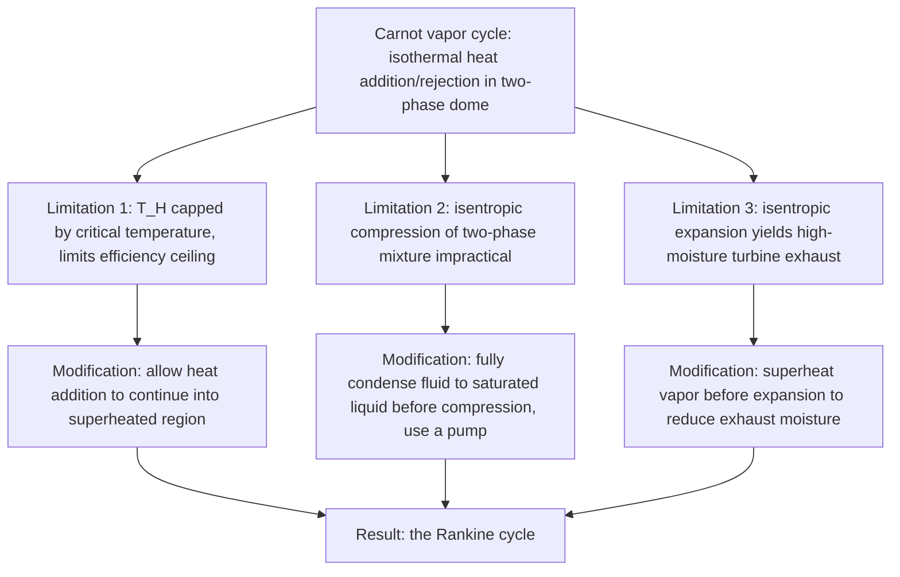

## The Carnot Vapor Cycle and Its Limitations

### Conceptual Overview

The **Carnot vapor cycle** is the direct application of the ideal Carnot cycle to a working fluid that undergoes phase change (a vapor, such as steam), executed within the two-phase (saturation) region of the fluid's property diagram. While the Carnot cycle represents the theoretical efficiency ceiling for any heat engine operating between two fixed temperatures, attempting to physically implement it using a condensable vapor exposes severe practical limitations, which historically motivated the development of the Rankine cycle as the practical alternative for real steam power plants.

### The Four Processes of the Carnot Vapor Cycle

Executed entirely within, or bounded by, the two-phase liquid-vapor dome on a $T$-$s$ diagram, the Carnot vapor cycle consists of:

1. **Process 1→2: Isothermal heat addition** at $T_H$, occurring during boiling (constant-pressure, constant-temperature vaporization within the two-phase dome, from saturated liquid or a two-phase mixture toward saturated vapor).
2. **Process 2→3: Isentropic expansion** through a turbine, with the working fluid partially condensing as it expands and cools from $T_H$ to $T_L$.
3. **Process 3→4: Isothermal heat rejection** at $T_L$, occurring during partial condensation (constant-pressure, constant-temperature condensation within the two-phase dome).
4. **Process 4→1: Isentropic compression**, returning the fluid (a two-phase liquid-vapor mixture) back to its initial state.

Because boiling and condensation occur at constant temperature for a pure substance at fixed pressure, Steps 1 and 3 can be executed isothermally simply by keeping the pressure constant within the two-phase region — this is the key feature that makes the Carnot vapor cycle appear, at first glance, more practically achievable than a Carnot cycle using a single-phase working fluid (like an ideal gas), where isothermal heat transfer would require continuously varying pressure.

### T-s Diagram Representation (svg_diagram)

<svg xmlns="http://www.w3.org/2000/svg" viewBox="0 0 560 340">
<text x="280" y="24" text-anchor="middle" font-size="15" font-weight="bold" fill="#1a1a1a">Carnot Vapor Cycle on a T-s Diagram (svg_diagram)</text>
<line x1="80" y1="290" x2="480" y2="290" stroke="#1a1a1a" stroke-width="1.5" />
<line x1="80" y1="290" x2="80" y2="50" stroke="#1a1a1a" stroke-width="1.5" />
<text x="480" y="308" font-size="13" fill="#1a1a1a">s</text>
<text x="60" y="55" font-size="13" fill="#1a1a1a">T</text>
<path d="M 130 270 Q 260 80 390 270" fill="none" stroke="#457b9d" stroke-width="1.5" stroke-dasharray="4,3" />
<text x="240" y="90" font-size="11" fill="#457b9d">Saturation dome</text>
<line x1="180" y1="140" x2="340" y2="140" stroke="#e76f51" stroke-width="2.5" />
<text x="200" y="130" font-size="12" fill="#e76f51">1 to 2: isothermal boiling at T_H</text>
<line x1="340" y1="140" x2="380" y2="240" stroke="#2a9d8f" stroke-width="2.5" />
<text x="345" y="195" font-size="11" fill="#2a9d8f">2 to 3: isentropic exp.</text>
<line x1="380" y1="240" x2="220" y2="240" stroke="#4c8ee8" stroke-width="2.5" />
<text x="240" y="255" font-size="12" fill="#4c8ee8">3 to 4: isothermal condensation at T_L</text>
<line x1="220" y1="240" x2="180" y2="140" stroke="#2a9d8f" stroke-width="2.5" />
<text x="150" y="195" font-size="11" fill="#2a9d8f">4 to 1: isentropic comp.</text>
<circle cx="180" cy="140" r="4" fill="#1a1a1a" />
<circle cx="340" cy="140" r="4" fill="#1a1a1a" />
<circle cx="380" cy="240" r="4" fill="#1a1a1a" />
<circle cx="220" cy="240" r="4" fill="#1a1a1a" />
<text x="165" y="130" font-size="11" fill="#1a1a1a">1</text>
<text x="345" y="130" font-size="11" fill="#1a1a1a">2</text>
<text x="385" y="255" font-size="11" fill="#1a1a1a">3</text>
<text x="200" y="255" font-size="11" fill="#1a1a1a">4</text>
</svg>

### Practical Limitations of the Carnot Vapor Cycle

Despite its theoretical appeal, three major practical obstacles prevent the Carnot vapor cycle from being implemented in real power plants:

**1. Limitation on maximum heat addition temperature ($T_H$).** For the heat addition process (1→2) to remain isothermal, it must occur entirely within the two-phase dome (below the critical point). However, the **critical temperature** of water is only $374.14°\text{C}$ ($647.3\ \text{K}$) — far lower than the temperatures achievable and desirable for high-efficiency heat addition using combustion gases (which can readily exceed $1000°\text{C}$). Restricting $T_H$ to below the critical temperature severely limits the achievable Carnot efficiency, since $\eta_{th,Carnot} = 1 - T_L/T_H$ improves directly with higher $T_H$.

**2. Isentropic compression of a two-phase mixture (Process 4→1).** Compressing a two-phase liquid-vapor mixture (state 4) back to a saturated liquid or two-phase state (state 1) via a compressor is **extremely difficult to achieve in practice**. Real compressors are designed to handle either a single-phase liquid (pumps) or a single-phase vapor (compressors) efficiently; a mixture of liquid droplets and vapor causes severe issues:

- Liquid droplets erode compressor/pump blades and internal components.
- The two-phase flow behavior is highly unpredictable and difficult to control with acceptable isentropic efficiency.
- Handling large volumetric flow rate changes as the mixture quality changes during compression is mechanically impractical.

**3. Isentropic expansion producing high-moisture turbine exhaust (Process 2→3).** As the vapor expands isentropically from state 2 (typically near or within the saturation dome) to state 3, it can produce a turbine exhaust with a very **low quality** (high liquid moisture content). Liquid droplets in a turbine's later stages cause:

- **Blade erosion** from droplet impact at high relative velocity, significantly reducing turbine component lifespan.
- **Reduced turbine isentropic efficiency**, since the presence of liquid droplets disrupts ideal vapor flow patterns.

**Key Points**

- Limitation 1 fundamentally caps the *theoretical* efficiency ceiling of any vapor cycle confined to the saturation dome.
- Limitations 2 and 3 are **equipment/mechanical** limitations, not thermodynamic ones — they explain why, even setting aside the temperature ceiling, no practical machinery exists to execute the compression and expansion processes as specified by the ideal cycle.

### Comparison Table: Carnot Vapor Cycle vs. Practical Requirements

| Process | Carnot Vapor Cycle Requirement | Practical Issue |
| --- | --- | --- |
| Heat addition (1→2) | Isothermal, confined to two-phase dome | Caps $T_H$ well below combustion gas temperatures |
| Expansion (2→3) | Isentropic, vapor to two-phase mixture | High-moisture turbine exhaust erodes blades |
| Heat rejection (3→4) | Isothermal, within two-phase dome | Achievable in practice (condensers do this routinely) |
| Compression (4→1) | Isentropic, two-phase mixture to saturated liquid/mixture | No practical pump/compressor handles two-phase flow well |

### Worked Example

**Example**

Compare the theoretical Carnot efficiency achievable if heat addition were confined below water's critical temperature ($T_H \leq 374.14°\text{C} = 647.3\ \text{K}$) versus a hypothetical scenario where heat addition could occur at a typical modern boiler superheat temperature of $T_H = 600°\text{C} = 873\ \text{K}$ (achievable only outside the two-phase dome, i.e., not compatible with the Carnot vapor cycle's isothermal-in-the-dome requirement), both rejecting heat at $T_L = 300\ \text{K}$.

**Step 1 — Carnot efficiency confined to below the critical point:**

$$\eta_{th,Carnot,confined} = 1 - \frac{300}{647.3} \approx 1 - 0.4635 = 0.5365 = 53.65\%$$

**Step 2 — Carnot efficiency at the higher (superheated) temperature:**

$$\eta_{th,Carnot,superheated} = 1 - \frac{300}{873} \approx 1 - 0.3437 = 0.6563 = 65.63\%$$

**Step 3 — Interpretation:** Restricting the Carnot vapor cycle to isothermal heat addition within the two-phase dome (below the critical temperature) sacrifices roughly 12 percentage points of theoretical efficiency compared to what would be achievable if heat addition could occur at higher, superheated temperatures. This quantifies the direct efficiency cost of Limitation 1, and is a primary motivation for the Rankine cycle's approach of allowing heat addition to continue into the superheated region (accepting non-isothermal heat addition) to exploit higher achievable temperatures. [Inference: this comparison isolates only the temperature-ceiling effect; it does not quantify the additional efficiency penalties that would arise from the compression and expansion mechanical limitations discussed separately.]

### Why These Limitations Motivate the Rankine Cycle

### Practical Implications and Design Notes

- **Historical and pedagogical role**: The Carnot vapor cycle is rarely, if ever, implemented in practice; its primary value is pedagogical and conceptual — establishing why the practical Rankine cycle deviates from the theoretical ideal in specific, well-motivated ways (full condensation before pumping, superheating before expansion).
- **The Rankine cycle as the direct practical response**: Each of the three limitations identified here maps directly onto a specific design feature of the Rankine cycle: full condensation to saturated liquid before pumping addresses Limitation 2 (allowing a simple liquid pump rather than a problematic two-phase compressor), and superheating the vapor before it enters the turbine addresses Limitation 3 (reducing exhaust moisture content) while also partially addressing Limitation 1 (allowing higher average heat addition temperature).
- **Trade-off accepted by the Rankine cycle**: By allowing non-isothermal heat addition (sensible heating of liquid, then boiling, then superheating), the Rankine cycle sacrifices the theoretical Carnot efficiency ceiling in exchange for practical achievability with real equipment — a deliberate, well-understood engineering trade-off rather than an oversight. [Unverified: the specific magnitude of efficiency sacrificed by this trade-off in a real plant depends on the specific boiler, condenser, and turbine design parameters and is not generalizable to a single universal value.]

**Related Topics**

- The Carnot Cycle and Carnot Principles
- The Simple Ideal Rankine Cycle
- Superheating and Reheating in the Rankine Cycle
- Isentropic Processes and Isentropic Efficiencies
- Turbine Blade Erosion and Moisture Content Limits
- Regenerative Rankine Cycles