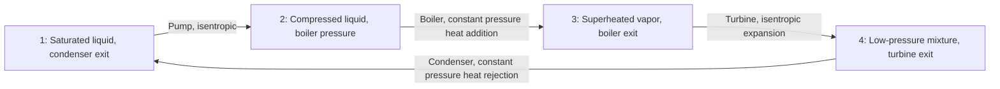

## The Ideal Rankine Cycle

### Conceptual Overview

The **ideal Rankine cycle** is the standard idealized thermodynamic cycle used to model steam (vapor) power plants, developed as the practical response to the mechanical limitations of the Carnot vapor cycle. It consists of four internally reversible processes, using a pump (rather than a two-phase compressor) to handle the working fluid as a liquid, and allowing heat addition to continue beyond the two-phase dome into the superheated vapor region.

### The Four Processes of the Ideal Rankine Cycle

1. **Process 1→2: Isentropic compression in a pump.** Saturated liquid at the condenser exit (state 1) is compressed to the boiler operating pressure by a pump, requiring a relatively small work input since the working fluid is an incompressible liquid.
2. **Process 2→3: Constant-pressure heat addition in a boiler.** The compressed liquid is heated at constant pressure, first as sensible heating of the liquid, then through phase change (boiling) at constant temperature, and typically continuing into the **superheated** vapor region, producing high-temperature, high-pressure superheated steam at the boiler exit (state 3).
3. **Process 3→4: Isentropic expansion in a turbine.** The superheated steam expands through a turbine, producing shaft work output, with pressure and temperature dropping to the condenser pressure.
4. **Process 4→1: Constant-pressure heat rejection in a condenser.** The turbine exhaust (typically a high-quality two-phase mixture) is fully condensed to saturated liquid at constant pressure, rejecting heat to a cooling medium (cooling water or ambient air).

**Key Points**

- The key distinguishing features relative to the Carnot vapor cycle are: (1) full condensation to saturated liquid before pumping (avoiding two-phase compression), and (2) heat addition extending into the superheated region (avoiding the temperature ceiling imposed by the critical point).
- All four processes are idealized as internally reversible; the pump and turbine are idealized as isentropic, and the boiler and condenser are idealized as achieving heat transfer at exactly constant pressure with no pressure drop.

### T-s Diagram Representation (svg_diagram)

<svg xmlns="http://www.w3.org/2000/svg" viewBox="0 0 560 340">
<text x="280" y="24" text-anchor="middle" font-size="15" font-weight="bold" fill="#1a1a1a">Ideal Rankine Cycle on a T-s Diagram (svg_diagram)</text>
<path d="M 130 270 Q 260 80 390 270" fill="none" stroke="#457b9d" stroke-width="1.5" stroke-dasharray="4,3" />
<text x="240" y="90" font-size="11" fill="#457b9d">Saturation dome</text>
<line x1="80" y1="290" x2="480" y2="290" stroke="#1a1a1a" stroke-width="1.5" />
<line x1="80" y1="290" x2="80" y2="50" stroke="#1a1a1a" stroke-width="1.5" />
<text x="480" y="308" font-size="13" fill="#1a1a1a">s</text>
<text x="60" y="55" font-size="13" fill="#1a1a1a">T</text>
<line x1="180" y1="245" x2="182" y2="140" stroke="#8ecae6" stroke-width="2.5" />
<text x="140" y="200" font-size="11" fill="#8ecae6">1 to 2: pump</text>
<path d="M 182 140 L 240 140 Q 340 100 420 80" fill="none" stroke="#e76f51" stroke-width="2.5" />
<text x="220" y="115" font-size="11" fill="#e76f51">2 to 3: boiler (heat + superheat)</text>
<path d="M 420 80 Q 400 180 350 240" fill="none" stroke="#2a9d8f" stroke-width="2.5" />
<text x="395" y="170" font-size="11" fill="#2a9d8f">3 to 4: turbine</text>
<line x1="350" y1="240" x2="180" y2="245" stroke="#4c8ee8" stroke-width="2.5" />
<text x="220" y="260" font-size="12" fill="#4c8ee8">4 to 1: condenser</text>
<circle cx="180" cy="245" r="4" fill="#1a1a1a" />
<circle cx="182" cy="140" r="4" fill="#1a1a1a" />
<circle cx="420" cy="80" r="4" fill="#1a1a1a" />
<circle cx="350" cy="240" r="4" fill="#1a1a1a" />
<text x="160" y="260" font-size="11" fill="#1a1a1a">1</text>
<text x="190" y="135" font-size="11" fill="#1a1a1a">2</text>
<text x="430" y="80" font-size="11" fill="#1a1a1a">3</text>
<text x="358" y="255" font-size="11" fill="#1a1a1a">4</text>
</svg>

### Energy Analysis (Steady-Flow Energy Equation Applied to Each Component)

Applying the steady-flow energy equation (negligible $\Delta KE$, $\Delta PE$) to each component:

**Pump (isentropic compression):**

$$w_{pump,in} = h_2 - h_1$$

For an incompressible liquid (constant specific volume $v_1$), this can be approximated directly without needing compressed-liquid tables:

$$w_{pump,in} \approx v_1(P_2 - P_1)$$

**Boiler (constant-pressure heat addition):**

$$q_{in} = h_3 - h_2$$

**Turbine (isentropic expansion):**

$$w_{turbine,out} = h_3 - h_4$$

**Condenser (constant-pressure heat rejection):**

$$q_{out} = h_4 - h_1$$

### Cycle Performance Metrics

**Net work output:**

$$w_{net} = w_{turbine,out} - w_{pump,in} = q_{in} - q_{out}$$

**Thermal efficiency:**

$$\eta_{th} = \frac{w_{net}}{q_{in}} = 1 - \frac{q_{out}}{q_{in}} = 1 - \frac{h_4 - h_1}{h_3 - h_2}$$

**Back work ratio (BWR):** the fraction of turbine work consumed internally by the pump —

$$BWR = \frac{w_{pump,in}}{w_{turbine,out}}$$

**Key Points**

- The back work ratio for a Rankine cycle is typically very small (often only a few percent), since pumping a liquid requires far less work than compressing a gas to the same pressure ratio — this is a major practical advantage of the Rankine cycle over gas power cycles (e.g., the Brayton cycle), where compressor work often consumes $40$–$50\%$ of turbine output.
- Unlike the Carnot efficiency, the Rankine cycle's thermal efficiency is **not** simply $1 - T_L/T_H$, because heat addition is not isothermal; efficiency must be computed via the enthalpy-based relations above using actual property data (steam tables).

### Worked Example

**Example**

A simple ideal Rankine cycle operates with a boiler pressure of $P_2 = P_3 = 3\ \text{MPa}$ (steam leaving the boiler as saturated vapor, $h_3 = 2804.2\ \text{kJ/kg}$, $s_3 = 6.1869\ \text{kJ/(kg·K)}$) and a condenser pressure of $P_1 = P_4 = 10\ \text{kPa}$ (saturated liquid at condenser exit, $h_1 = 191.81\ \text{kJ/kg}$, $v_1 = 0.001010\ \text{m}^3/\text{kg}$). At the condenser pressure, $s_f = 0.6492\ \text{kJ/(kg·K)}$, $s_{fg} = 7.4996\ \text{kJ/(kg·K)}$, $h_f = 191.81\ \text{kJ/kg}$, $h_{fg} = 2392.1\ \text{kJ/kg}$. Determine the cycle's thermal efficiency.

**Step 1 — Pump work** (incompressible liquid approximation):

$$w_{pump,in} = v_1(P_2 - P_1) = 0.001010 \times (3000 - 10) = 3.02\ \text{kJ/kg}$$

$$h_2 = h_1 + w_{pump,in} = 191.81 + 3.02 = 194.83\ \text{kJ/kg}$$

**Step 2 — Turbine exit quality** (isentropic expansion, $s_4 = s_3 = 6.1869\ \text{kJ/(kg·K)}$):

$$x_4 = \frac{s_4 - s_f}{s_{fg}} = \frac{6.1869 - 0.6492}{7.4996} = \frac{5.5377}{7.4996} \approx 0.7384$$

**Step 3 — Turbine exit enthalpy:**

$$h_4 = h_f + x_4 h_{fg} = 191.81 + 0.7384 \times 2392.1 \approx 191.81 + 1766.4 = 1958.2\ \text{kJ/kg}$$

**Step 4 — Heat input and heat rejected:**

$$q_{in} = h_3 - h_2 = 2804.2 - 194.83 = 2609.4\ \text{kJ/kg}$$

$$q_{out} = h_4 - h_1 = 1958.2 - 191.81 = 1766.4\ \text{kJ/kg}$$

**Step 5 — Thermal efficiency:**

$$\eta_{th} = 1 - \frac{q_{out}}{q_{in}} = 1 - \frac{1766.4}{2609.4} \approx 1 - 0.6771 = 0.3229 = 32.29\%$$

**Step 6 — Interpretation:** This cycle achieves roughly $32.3\%$ thermal efficiency, and the turbine exit quality of $x_4 \approx 0.738$ (about $26\%$ moisture by mass) is notably lower than the typically recommended minimum quality of about $90\%$ for avoiding excessive turbine blade erosion — indicating this specific pressure combination would benefit from superheating the boiler exit steam well above saturation, or from reheating, to raise turbine exit quality in a practical design. [Inference: whether this specific quality level is acceptable depends on turbine material selection and manufacturer design tolerances, which are not specified by the cycle's thermodynamic states alone.]

### Comparison Table: Rankine Cycle vs. Carnot Vapor Cycle

| Feature | Carnot Vapor Cycle | Ideal Rankine Cycle |
| --- | --- | --- |
| Compression device | Two-phase compressor (impractical) | Liquid pump (practical) |
| Heat addition | Isothermal, confined to two-phase dome | Constant-pressure; extends into superheated region |
| Maximum $T_H$ | Limited by critical temperature | Limited by boiler material/turbine inlet constraints (can exceed critical temperature at pressure) |
| Turbine exhaust moisture | High moisture, blade erosion risk | Improved via superheating, but may still require attention |
| Practical implementation | Not used in practice | Standard basis for real steam power plants |

### Rankine Cycle Component Flow

### Practical Implications and Design Notes

- **Foundation for real plant analysis**: The ideal Rankine cycle is the essential starting point for analyzing real steam power plants; real-plant deviations (turbine and pump isentropic efficiencies less than 1, pressure drops in the boiler/condenser, and other irreversibilities) are layered on top of this ideal framework rather than replacing it.
- **Superheating as standard practice**: Because turbine exit quality directly affects blade erosion and turbine efficiency, real Rankine cycles almost universally superheat the boiler exit steam well beyond saturation, both to raise average heat-addition temperature (improving efficiency) and to keep the isentropic expansion path further from the high-moisture region of the saturation dome.
- **Boiler and condenser pressure selection trade-offs**: Increasing boiler pressure raises average heat-addition temperature (improving efficiency) but tends to reduce turbine exit quality for a fixed condenser pressure; decreasing condenser pressure improves efficiency (lower $T_L$) but requires operating below atmospheric pressure and demands a large, well-designed condenser and cooling system. [Unverified: the specific optimal pressure combination for a given real design depends on turbine metallurgy, cooling water availability, and plant-specific economic constraints not captured by the ideal cycle analysis alone.]

**Related Topics**

- The Carnot Vapor Cycle and Its Limitations
- Superheating and Reheating in the Rankine Cycle
- Isentropic Processes and Isentropic Efficiencies
- The Rankine Cycle with Irreversibilities
- Regenerative Rankine Cycles
- Exergy Destruction in Power System Components