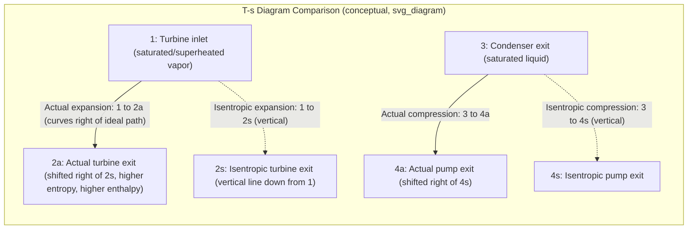

## Actual Vapor Power Cycles and Component Irreversibilities

### Overview

The ideal Rankine cycle assumes internally reversible processes: isentropic compression and expansion, and heat addition/rejection at constant pressure with no frictional pressure drops. Actual vapor power cycles deviate from this idealization because real components — pumps, boilers, turbines, condensers, and connecting piping — introduce irreversibilities. These deviations reduce the net work output and thermal efficiency below the ideal Rankine cycle values, and quantifying them is essential for realistic plant performance prediction.

### Sources of Irreversibility

**Fluid Friction**

- Causes pressure drops in the boiler, condenser, and piping between components.
- To maintain the required boiler pressure and turbine inlet pressure, the pump must do additional work to compensate for upstream pressure losses.
- Pressure drop in the condenser is typically small but still reduces the pressure difference available to the turbine, slightly increasing back pressure.

**Heat Loss to Surroundings**

- Piping and major components are not perfectly insulated; heat is lost from the working fluid to the ambient environment as steam travels between components.
- To compensate for this loss and still deliver the design turbine-inlet state, more heat must be transferred to the fluid in the boiler, lowering the cycle's overall thermal efficiency.

**Irreversibilities in the Turbine**

- Fluid friction, flow separation, and throttling losses within the turbine cause the actual expansion to deviate from the ideal isentropic (constant-entropy) process.
- The actual exit entropy is greater than the inlet entropy ($s_{2a} > s_1$), and the actual work extracted is less than the isentropic work.
- This is the single largest source of irreversibility in most vapor power plants.

**Irreversibilities in the Pump**

- Similar frictional effects occur during compression of the liquid, though the magnitude of pump work is small relative to turbine work, so its irreversibility has a comparatively minor effect on overall cycle efficiency.
- The actual pump work required exceeds the isentropic pump work.

**Other Losses**

- Bearing friction and windage losses (mechanical friction losses external to the working fluid).
- Air leakage into the condenser (which operates below atmospheric pressure), requiring venting.
- Losses associated with feedwater removal from the condenser (extraction pump losses).

### Isentropic Efficiencies of Turbine and Pump

Component performance is quantified using isentropic efficiency, comparing actual work to the work that would result from an ideal isentropic process between the same inlet and exit pressures.

**Turbine Isentropic Efficiency**

$$\eta_T = \frac{w_a}{w_s} = \frac{h_1 - h_{2a}}{h_1 - h_{2s}}$$

Where:

- $w_a$ = actual turbine work output
- $w_s$ = isentropic turbine work output
- $h_1$ = enthalpy at turbine inlet
- $h_{2a}$ = actual enthalpy at turbine exit
- $h_{2s}$ = enthalpy at turbine exit for isentropic expansion to the same exit pressure

Since the actual exit state lies to the right of the isentropic exit state on a $T$-$s$ or $h$-$s$ diagram (higher entropy, higher enthalpy at the same pressure), $h_{2a} > h_{2s}$, so $w_a < w_s$ and $\eta_T < 1$.

**Pump Isentropic Efficiency**

$$\eta_P = \frac{w_s}{w_a} = \frac{h_{2s} - h_1}{h_{2a} - h_1}$$

Where:

- $h_1$ = enthalpy at pump inlet
- $h_{2s}$ = enthalpy at pump exit for isentropic compression
- $h_{2a}$ = actual enthalpy at pump exit

Note the ratio is inverted relative to the turbine expression because for a work-consuming device, the isentropic case represents the *minimum* required work, so $\eta_P = w_s/w_a \leq 1$.

**[Confirmed]** These definitions and the direction of the inequality follow directly from the second law: entropy generation in an adiabatic, non-quasi-equilibrium process must be positive, so $s_{2a} > s_1$ for both the turbine and pump.

### T-s Diagram: Ideal vs. Actual Cycle

The horizontal displacement of the actual endpoint from the isentropic endpoint on a $T$-$s$ diagram is a direct visual representation of entropy generation within that component.

### SVG: Turbine Expansion — Ideal vs. Actual on h-s Diagram

<svg xmlns="http://www.w3.org/2000/svg" viewBox="0 0 640 420">
<text x="320" y="24" font-size="16" text-anchor="middle" font-family="sans-serif" font-weight="bold">Turbine Expansion: Ideal vs. Actual (h-s Diagram) (svg_diagram)</text>

<line x1="80" y1="360" x2="580" y2="360" stroke="black" stroke-width="2" />
<line x1="80" y1="360" x2="80" y2="60" stroke="black" stroke-width="2" />
<text x="330" y="395" font-size="14" text-anchor="middle" font-family="sans-serif">Entropy, s</text>
<text x="40" y="210" font-size="14" text-anchor="middle" font-family="sans-serif" transform="rotate(-90 40 210)">Enthalpy, h</text>

<circle cx="220" cy="100" r="5" fill="black" />
<text x="200" y="85" font-size="13" font-family="sans-serif">1 (inlet)</text>

<line x1="220" y1="100" x2="220" y2="280" stroke="blue" stroke-width="2" stroke-dasharray="6,4" />
<circle cx="220" cy="280" r="5" fill="blue" />
<text x="230" y="285" font-size="13" fill="blue" font-family="sans-serif">2s (isentropic exit)</text>

<path d="M 220 100 Q 300 200 340 260" stroke="red" stroke-width="2" fill="none" />
<circle cx="340" cy="260" r="5" fill="red" />
<text x="350" y="255" font-size="13" fill="red" font-family="sans-serif">2a (actual exit)</text>

<line x1="150" y1="100" x2="150" y2="280" stroke="blue" stroke-width="1" marker-end="url(#arrow)" />
<text x="90" y="195" font-size="12" fill="blue" font-family="sans-serif">w_s = h1-h2s</text>
<line x1="450" y1="100" x2="450" y2="260" stroke="red" stroke-width="1" />
<text x="460" y="185" font-size="12" fill="red" font-family="sans-serif">w_a = h1-h2a</text>

<line x1="80" y1="100" x2="220" y2="100" stroke="gray" stroke-width="1" stroke-dasharray="3,3" />
<line x1="80" y1="280" x2="220" y2="280" stroke="gray" stroke-width="1" stroke-dasharray="3,3" />
<line x1="80" y1="260" x2="340" y2="260" stroke="gray" stroke-width="1" stroke-dasharray="3,3" />

<text x="90" y="345" font-size="12" font-family="sans-serif" fill="gray">Note: 2a lies right of 2s due to entropy generation (irreversibility)</text>

</svg>

### Effect on Cycle Performance

**Net Work Output**

$$w_{net} = w_{T,a} - w_{P,a} = \eta_T (h_1 - h_{2s}) - \frac{h_{4s} - h_3}{\eta_P}$$

Both terms move in the direction that reduces net work: turbine output is scaled down by $\eta_T < 1$, and pump input is scaled up by dividing by $\eta_P < 1$.

**Thermal Efficiency**

$$\eta_{th} = \frac{w_{net}}{q_{in}}$$

Since $q_{in}$ (heat added in the boiler) typically increases slightly (to compensate for the higher actual pump exit enthalpy and heat losses) while $w_{net}$ decreases, actual cycle thermal efficiency is always lower than the corresponding ideal Rankine cycle efficiency operating between the same pressure limits.

**[Inference]** Typical turbine isentropic efficiencies in well-designed utility-scale steam turbines range roughly from 85–90%, and pump isentropic efficiencies are often higher (around 70–90% for smaller pumps, higher for large feedwater pumps), but exact values are unit- and manufacturer-specific and should be obtained from equipment specifications or test data rather than assumed universally.

### Worked Example

**Given:** A steam power plant operates on a Rankine cycle with boiler pressure 8 MPa, turbine inlet temperature 500°C, and condenser pressure 10 kPa. Turbine isentropic efficiency $\eta_T = 0.85$, pump isentropic efficiency $\eta_P = 0.80$.

**Step 1 — State 1 (turbine inlet):**

At 8 MPa, 500°C (superheated): $h_1 \approx 3399.5\ \text{kJ/kg}$, $s_1 \approx 6.7266\ \text{kJ/kg·K}$

**Step 2 — Isentropic turbine exit (State 2s):**

At 10 kPa, $s_{2s} = s_1 = 6.7266\ \text{kJ/kg·K}$

Using saturation data at 10 kPa: $s_f = 0.6493$, $s_{fg} = 7.5009\ \text{kJ/kg·K}$

$$x_{2s} = \frac{6.7266 - 0.6493}{7.5009} = 0.8102$$

$h_f = 191.83$, $h_{fg} = 2392.8\ \text{kJ/kg}$

$$h_{2s} = 191.83 + 0.8102(2392.8) = 2131.3\ \text{kJ/kg}$$

**Step 3 — Actual turbine work and exit enthalpy:**

$$w_{T,s} = h_1 - h_{2s} = 3399.5 - 2131.3 = 1268.2\ \text{kJ/kg}$$

$$w_{T,a} = \eta_T \times w_{T,s} = 0.85 \times 1268.2 = 1077.97\ \text{kJ/kg}$$

$$h_{2a} = h_1 - w_{T,a} = 3399.5 - 1077.97 = 2321.53\ \text{kJ/kg}$$

**Step 4 — Isentropic and actual pump work (State 3 to 4):**

$h_3 = h_f\ \text{at 10 kPa} = 191.83\ \text{kJ/kg}$, $v_3 = 0.001010\ \text{m}^3/\text{kg}$

$$w_{P,s} = v_3(P_4 - P_3) = 0.001010 \times (8000 - 10) = 8.07\ \text{kJ/kg}$$

$$w_{P,a} = \frac{w_{P,s}}{\eta_P} = \frac{8.07}{0.80} = 10.09\ \text{kJ/kg}$$

$$h_{4a} = h_3 + w_{P,a} = 191.83 + 10.09 = 201.92\ \text{kJ/kg}$$

**Step 5 — Net work and thermal efficiency:**

$$w_{net} = w_{T,a} - w_{P,a} = 1077.97 - 10.09 = 1067.88\ \text{kJ/kg}$$

$$q_{in} = h_1 - h_{4a} = 3399.5 - 201.92 = 3197.58\ \text{kJ/kg}$$

$$\eta_{th} = \frac{w_{net}}{q_{in}} = \frac{1067.88}{3197.58} = 0.3340 = 33.4\%$$

**Comparison:** The corresponding ideal Rankine cycle (with $\eta_T = \eta_P = 1$) for these same pressure limits would yield a thermal efficiency in the neighborhood of 38–40%. **[Inference]** The magnitude of this efficiency gap will vary depending on the exact steam tables and rounding used, but the qualitative result — actual efficiency meaningfully below ideal — is a direct and expected consequence of turbine irreversibility, which dominates the total exergy loss in this cycle.

### Entropy Generation and Exergy Destruction

Each irreversibility can be quantified in terms of entropy generation $s_{gen}$ and the associated exergy (availability) destruction:

$$x_{destroyed} = T_0 \, s_{gen}$$

where $T_0$ is the dead-state (ambient) temperature. For the turbine:

$$s_{gen,turbine} = s_{2a} - s_1$$

This framework allows engineers to rank components by their contribution to total lost work potential — in most Rankine cycle plants, the turbine and boiler heat-transfer process (due to large temperature differences between combustion gases and the working fluid) are the two largest sources of exergy destruction, generally exceeding pump and condenser losses by a wide margin.

### Practical Design Implications

- **Reheat and regeneration** are often introduced partly to improve efficiency but also to keep turbine exit steam quality high (above ~90%), reducing moisture-related blade erosion, which is itself a real-world manifestation of departure from ideal dry, single-phase isentropic expansion assumptions.
- **Multi-stage turbines** with intermediate reheating reduce the effective irreversibility per stage compared to a single large pressure-ratio expansion.
- **Feedwater heaters**, while primarily used for regenerative efficiency gains, also reduce the thermal stress and irreversibility associated with large temperature differences during boiler heat addition.
- **Condenser subcooling** (if present) is itself a minor irreversibility, since it wastes some potential to extract useful work, though it is often necessary to prevent pump cavitation.

### Common Mistakes and Clarifications

- **Confusing efficiency direction:** Students often invert the turbine and pump efficiency formulas. Remember: for a work-producing device (turbine), actual work is always less than or equal to isentropic work, so $\eta_T = w_a/w_s$. For a work-consuming device (pump), actual work required is always greater than or equal to isentropic work, so $\eta_P = w_s/w_a$.
- **Assuming isentropic efficiency accounts for heat loss:** Isentropic efficiency captures internal fluid-friction-type irreversibilities within the device only; external heat losses from piping are a separate accounting item added to $q_{in}$ or subtracted as parasitic losses elsewhere in the cycle.
- **Neglecting pump irreversibility as "negligible":** While numerically small compared to turbine effects, pump irreversibility is not zero and should be included in precise efficiency calculations, especially in feedwater systems with high-pressure boilers.

**Next Steps**

- Rankine Cycle with Reheat
- Regenerative Rankine Cycle (Open and Closed Feedwater Heaters)
- Second-Law (Exergy) Analysis of Vapor Power Cycles
- Cogeneration and Combined Heat-and-Power Cycles
- Binary Vapor Cycles
- Effect of Boiler and Condenser Pressure on Rankine Cycle Efficiency
- Turbine Blade Erosion and Moisture Separation Techniques