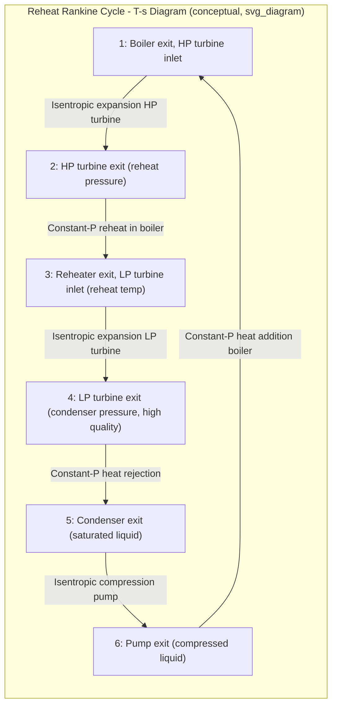

## The Reheat Rankine Cycle

### Overview

The reheat Rankine cycle is a modification of the ideal Rankine cycle designed to address two related problems: the limited efficiency gains available from simply raising boiler pressure alone, and the resulting excessive moisture content in the low-pressure turbine stages. In this cycle, steam expands partially through a high-pressure turbine, is returned to the boiler for reheating at constant pressure, and then expands through a low-pressure turbine to condenser pressure.

### Motivation

**Efficiency vs. Boiler Pressure Trade-off**

- Increasing boiler pressure increases the average temperature at which heat is added, which raises thermal efficiency (a consequence of the Carnot-like temperature dependence of cycle efficiency).
- However, at fixed turbine inlet temperature, increasing boiler pressure alone pushes the turbine exit state further into the two-phase (wet steam) region on a $T$-$s$ diagram, lowering exit quality $x$.

**Moisture Problem**

- Steam quality at turbine exit is generally kept above approximately 90% ($x \geq 0.90$) to limit liquid droplet impact erosion on turbine blades, particularly the last-stage blades where velocities are highest.
- **[Confirmed]** Excessive moisture content reduces turbine isentropic efficiency and accelerates mechanical wear (blade erosion, pitting) due to the impact of liquid droplets on rotating blades at high relative velocity.
- Reheat allows boiler pressure to be raised for efficiency gains while keeping final turbine exit quality within acceptable limits.

### Cycle Description and Processes

The reheat cycle modifies the basic four-process Rankine cycle into six processes:

| Process | Description | Component |
| --- | --- | --- |
| 1 → 2 | Isentropic expansion, high-pressure turbine | HP Turbine |
| 2 → 3 | Constant-pressure reheating | Boiler (reheater section) |
| 3 → 4 | Isentropic expansion, low-pressure turbine | LP Turbine |
| 4 → 5 | Constant-pressure heat rejection | Condenser |
| 5 → 6 | Isentropic compression | Pump |
| 6 → 1 | Constant-pressure heat addition | Boiler |

**Key State Points:**

- State 1: Boiler exit / HP turbine inlet (high pressure, high temperature superheated steam)
- State 2: HP turbine exit / reheater inlet (intermediate pressure, often still superheated or near-saturated)
- State 3: Reheater exit / LP turbine inlet (intermediate pressure, reheated to a temperature typically equal to or near the initial turbine inlet temperature)
- State 4: LP turbine exit / condenser inlet (condenser pressure, high quality wet steam)
- State 5: Condenser exit / pump inlet (saturated liquid)
- State 6: Pump exit / boiler inlet (compressed liquid)

### T-s Diagram Representation

### SVG: T-s Diagram of Reheat Cycle vs. Simple Rankine Cycle

<svg xmlns="http://www.w3.org/2000/svg" viewBox="0 0 680 460">
<text x="340" y="24" font-size="16" text-anchor="middle" font-family="sans-serif" font-weight="bold">Reheat Rankine Cycle on T-s Diagram (svg_diagram)</text>

<line x1="80" y1="400" x2="620" y2="400" stroke="black" stroke-width="2" />
<line x1="80" y1="400" x2="80" y2="50" stroke="black" stroke-width="2" />
<text x="350" y="430" font-size="14" text-anchor="middle" font-family="sans-serif">Entropy, s</text>
<text x="35" y="225" font-size="14" text-anchor="middle" font-family="sans-serif" transform="rotate(-90 35 225)">Temperature, T</text>

<path d="M 150 400 Q 300 80 450 400" stroke="gray" stroke-width="1.5" fill="none" stroke-dasharray="4,3" />
<text x="290" y="75" font-size="11" fill="gray" font-family="sans-serif">Saturation dome</text>

<circle cx="230" cy="100" r="5" fill="black" />
<text x="235" y="95" font-size="12" font-family="sans-serif">1</text>
<circle cx="290" cy="220" r="5" fill="black" />
<text x="295" y="215" font-size="12" font-family="sans-serif">2</text>
<circle cx="350" cy="150" r="5" fill="black" />
<text x="355" y="145" font-size="12" font-family="sans-serif">3</text>
<circle cx="400" cy="330" r="5" fill="black" />
<text x="405" y="325" font-size="12" font-family="sans-serif">4</text>
<circle cx="150" cy="360" r="5" fill="black" />
<text x="130" y="378" font-size="12" font-family="sans-serif">5</text>
<circle cx="150" cy="340" r="5" fill="black" />
<text x="120" y="335" font-size="12" font-family="sans-serif">6</text>

<line x1="230" y1="100" x2="290" y2="220" stroke="blue" stroke-width="2" />
<line x1="290" y1="220" x2="350" y2="150" stroke="red" stroke-width="2" />
<line x1="350" y1="150" x2="400" y2="330" stroke="blue" stroke-width="2" />
<line x1="400" y1="330" x2="150" y2="360" stroke="green" stroke-width="2" />
<line x1="150" y1="360" x2="150" y2="340" stroke="orange" stroke-width="2" />
<line x1="150" y1="340" x2="230" y2="100" stroke="purple" stroke-width="2" stroke-dasharray="2,2" />

<text x="440" y="200" font-size="11" fill="red" font-family="sans-serif">2→3: Reheat</text>

<text x="440" y="380" font-size="11" fill="green" font-family="sans-serif">4→5: Condensation</text>

<text x="440" y="70" font-size="11" fill="purple" font-family="sans-serif">6→1: Boiler heat addition</text>

<text x="90" y="420" font-size="11" fill="gray" font-family="sans-serif">Note: state 4 quality (x) is higher than without reheat</text>

</svg>

### Thermodynamic Analysis

**Heat Addition (two components):**

$$q_{in} = (h_1 - h_6) + (h_3 - h_2)$$

The first term is heat added in the primary boiler; the second is heat added in the reheater section.

**Turbine Work Output (two stages):**

$$w_{T,out} = (h_1 - h_2) + (h_3 - h_4)$$

**Pump Work Input:**

$$w_{P,in} = h_6 - h_5 = v_5(P_6 - P_5)$$

**Net Work:**

$$w_{net} = w_{T,out} - w_{P,in}$$

**Thermal Efficiency:**

$$\eta_{th} = \frac{w_{net}}{q_{in}} = 1 - \frac{q_{out}}{q_{in}}$$

where $q_{out} = h_4 - h_5$.

### Selecting the Reheat Pressure

The reheat pressure (the pressure at which steam is withdrawn from the HP turbine, sent back to the boiler, and returned to the LP turbine) is a key design decision.

**[Confirmed]** Analyses across a range of boiler and condenser pressures show that thermal efficiency is relatively insensitive to reheat pressure over a broad range, but a commonly cited guideline is to select the reheat pressure at approximately 1/4 of the original (maximum) boiler pressure, since this tends to nearly maximize the efficiency gain from reheat for typical operating conditions.

**Effect of Reheat Pressure Choice:**

- Too high a reheat pressure: limited improvement in exit quality, since the HP turbine expansion is too short to meaningfully change the LP turbine inlet state.
- Too low a reheat pressure: the reheat temperature may not adequately raise the average temperature of heat addition, reducing the efficiency benefit, and the LP turbine pressure ratio becomes excessively large.

**Practical constraint:** Reheat temperature is limited by materials and metallurgical constraints of the reheater tubing and turbine blading, generally set close to (and rarely exceeding) the initial turbine inlet temperature. **[Inference]** In modern utility boilers, reheat temperatures are commonly matched to or set very close to the primary superheat temperature (a common design target is 540–600°C in supercritical units), though exact values depend on plant-specific metallurgy and are set by the manufacturer's design specification, not a universal constant.

### Worked Example

**Given:** A reheat Rankine cycle operates with boiler pressure 15 MPa, turbine inlet temperature 600°C. Steam expands in the HP turbine to 3 MPa, is reheated to 600°C, then expands in the LP turbine to a condenser pressure of 10 kPa. Assume isentropic turbines and pump.

**State 1 (15 MPa, 600°C):**

$h_1 \approx 3583.1\ \text{kJ/kg}$, $s_1 \approx 6.6796\ \text{kJ/kg·K}$

**State 2 (3 MPa, $s_2 = s_1 = 6.6796$):**

At 3 MPa, this entropy corresponds to superheated steam. Interpolating steam tables:

$h_2 \approx 3115.3\ \text{kJ/kg}$ (approximate, superheated region at 3 MPa)

**State 3 (3 MPa, 600°C, reheated):**

$h_3 \approx 3682.8\ \text{kJ/kg}$, $s_3 \approx 7.5085\ \text{kJ/kg·K}$

**State 4 (10 kPa, $s_4 = s_3 = 7.5085$):**

At 10 kPa: $s_f = 0.6493$, $s_{fg} = 7.5009$

$$x_4 = \frac{7.5085 - 0.6493}{7.5009} = 0.9145$$

$h_f = 191.83$, $h_{fg} = 2392.8$

$$h_4 = 191.83 + 0.9145(2392.8) = 2380.3\ \text{kJ/kg}$$

**State 5 (10 kPa, saturated liquid):**

$h_5 = 191.83\ \text{kJ/kg}$, $v_5 = 0.001010\ \text{m}^3/\text{kg}$

**State 6 (pump exit):**

$$w_{P,in} = v_5(P_6 - P_5) = 0.001010 \times (15000 - 10) = 15.14\ \text{kJ/kg}$$

$$h_6 = h_5 + w_{P,in} = 191.83 + 15.14 = 206.97\ \text{kJ/kg}$$

**Turbine Work:**

$$w_{HP} = h_1 - h_2 = 3583.1 - 3115.3 = 467.8\ \text{kJ/kg}$$

$$w_{LP} = h_3 - h_4 = 3682.8 - 2380.3 = 1302.5\ \text{kJ/kg}$$

$$w_{T,total} = 467.8 + 1302.5 = 1770.3\ \text{kJ/kg}$$

**Net Work:**

$$w_{net} = 1770.3 - 15.14 = 1755.16\ \text{kJ/kg}$$

**Heat Input:**

$$q_{in} = (h_1 - h_6) + (h_3 - h_2) = (3583.1 - 206.97) + (3682.8 - 3115.3)$$

$$q_{in} = 3376.13 + 567.5 = 3943.63\ \text{kJ/kg}$$

**Thermal Efficiency:**

$$\eta_{th} = \frac{1755.16}{3943.63} = 0.4451 = 44.5\%$$

**Comparison with No Reheat:** Without reheat, expanding directly from 15 MPa, 600°C to 10 kPa would produce an exit quality significantly below 0.90 (often around 0.75–0.80 depending on exact table values), which is unacceptable for turbine longevity. **[Inference]** The specific efficiency improvement from adding reheat (commonly cited as a few percentage points in textbook comparisons) depends heavily on the chosen reheat pressure and the specific boiler/condenser pressure limits, so exact percentage gains should be calculated case-by-case rather than assumed as a fixed universal figure.

### Effect on Turbine Exit Quality

The primary practical benefit demonstrated in the worked example: exit quality $x_4 = 0.9145$ (91.45%) exceeds the common 90% threshold, whereas a non-reheat cycle at the same pressure limits would likely fall below it. This directly reduces blade erosion risk in the last LP turbine stages.

### Double Reheat

Some very high-pressure supercritical and ultra-supercritical plants employ **double reheat** (two reheat stages), which:

- Further increases average temperature of heat addition and thermal efficiency.
- Further improves final turbine exit quality.
- **[Inference]** Double reheat is generally justified only in very large, high-pressure utility plants (often ultra-supercritical, above ~24 MPa) where the marginal efficiency gain offsets the added capital cost and piping/control complexity; the specific economic threshold depends on unit size, fuel cost, and plant lifetime, so this is a case-specific design and economic decision rather than a fixed engineering rule.

### Common Mistakes and Clarifications

- **Confusing reheat with regeneration:** Reheat returns steam to the boiler between turbine stages to raise its temperature back up before further expansion; regeneration (feedwater heating) extracts steam to preheat the boiler feedwater. They serve different purposes and are often used together but are not the same modification.
- **Assuming reheat always significantly increases efficiency:** The efficiency improvement from reheat alone is typically modest (a few percentage points); its primary practical justification is often the moisture-control benefit, with the efficiency gain being a secondary (though real) benefit.
- **Ignoring reheater pressure drop:** In actual plants, the reheat piping and reheater tubes introduce a real pressure drop between the HP turbine exit and LP turbine inlet, which is neglected in the ideal cycle analysis above but should be included in actual cycle assessments (see Actual Vapor Power Cycles and Component Irreversibilities).

**Next Steps**

- Regenerative Rankine Cycle (Open and Closed Feedwater Heaters)
- Reheat–Regenerative Rankine Cycle Combined Analysis
- Supercritical and Ultra-Supercritical Steam Cycles
- Turbine Exit Quality and Blade Erosion Mitigation
- Second-Law (Exergy) Analysis Applied to Reheat Cycles
- Combined Gas–Steam (Combined Cycle) Power Plants