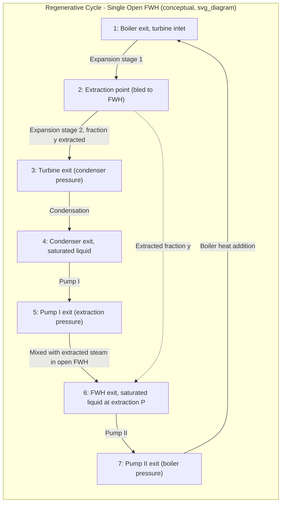

## The Regenerative Rankine Cycle

### Overview

The regenerative Rankine cycle improves thermal efficiency by preheating boiler feedwater using steam extracted from the turbine at one or more intermediate stages, rather than relying solely on the boiler to raise feedwater temperature from condenser conditions to saturation temperature. This raises the average temperature at which heat is externally supplied to the working fluid, directly increasing cycle thermal efficiency, analogous in spirit to the Carnot cycle's regeneration concept.

### Motivation

**The Problem in the Simple Rankine Cycle**

- In the ideal Rankine cycle, feedwater leaves the pump as a subcooled/compressed liquid at a temperature well below the boiler's saturation temperature.
- Heat added in the boiler to raise this feedwater to saturation temperature occurs at relatively low temperature, which lowers the average temperature of heat addition and, therefore, thermal efficiency (since $\eta_{th}$ is fundamentally tied to the average temperatures of heat addition and rejection).

**Regeneration Concept**

- By extracting a fraction of the steam partway through its expansion in the turbine and using it to preheat the feedwater before it enters the boiler, the external heat source (furnace) only needs to supply heat over a smaller temperature range, closer to the boiler's saturation temperature.
- This mimics — without fully achieving — the Carnot cycle's efficiency advantage of adding heat entirely at the maximum cycle temperature.

### Feedwater Heater Types

**Open (Direct-Contact) Feedwater Heaters**

- Extracted steam mixes directly with the feedwater in a mixing chamber.
- Both streams leave at a common exit state (typically saturated liquid at the extraction pressure).
- Requires a pump on each side (before and after each open heater) since the mixed stream and feedwater are at different pressures — practically, this increases piping and pump complexity.
- Simple and provides efficient heat transfer (direct mixing) but requires an additional pump per heater.

**Closed Feedwater Heaters**

- Heat is transferred from extracted steam to feedwater without the two streams mixing, typically using shell-and-tube heat exchanger construction.
- Feedwater and extracted steam can be at different pressures since they never mix directly.
- Extracted steam condenses on the shell side and is typically routed either backward to a lower-pressure heater/condenser via a trap, or forward using a small pump to join the main feedwater line.
- More complex and costly than open heaters but avoids the need for a separate pump at every stage, since a single main feedwater pump can often be used.

### Comparison Table

| Feature | Open FWH | Closed FWH |
| --- | --- | --- |
| Mixing | Direct mixing of streams | No mixing (heat exchanger) |
| Pressure equalization | Required (same exit pressure) | Not required |
| Pumps needed | One per heater stage | Often one main feedwater pump |
| Heat transfer effectiveness | High (direct contact) | Lower (finite $\Delta T$, approach temperature) |
| Cost and complexity | Lower per unit, more pumps overall | Higher per unit, simpler piping |
| Common use | Deaerating heater (also removes dissolved gases) | Most other extraction stages |

### Cycle with a Single Open Feedwater Heater — Process Description

### SVG: Regenerative Cycle with Open Feedwater Heater (Schematic)

<svg xmlns="http://www.w3.org/2000/svg" viewBox="0 0 700 480">
<text x="350" y="24" font-size="16" text-anchor="middle" font-family="sans-serif" font-weight="bold">Regenerative Cycle with Open Feedwater Heater (svg_diagram)</text>

<rect x="280" y="50" width="140" height="60" fill="none" stroke="black" stroke-width="2" />
<text x="350" y="85" font-size="13" text-anchor="middle" font-family="sans-serif">Boiler</text>

<polygon points="460,60 460,100 560,120 560,40" fill="none" stroke="black" stroke-width="2" />
<text x="500" y="85" font-size="13" text-anchor="middle" font-family="sans-serif">Turbine</text>

<line x1="510" y1="90" x2="510" y2="180" stroke="red" stroke-width="2" />
<text x="520" y="150" font-size="11" fill="red" font-family="sans-serif">Extraction (y)</text>

<rect x="480" y="220" width="120" height="60" fill="none" stroke="black" stroke-width="2" />
<text x="540" y="255" font-size="13" text-anchor="middle" font-family="sans-serif">Condenser</text>

<circle cx="450" cy="330" r="20" fill="none" stroke="black" stroke-width="2" />
<text x="450" y="335" font-size="10" text-anchor="middle" font-family="sans-serif">Pump I</text>

<rect x="330" y="300" width="100" height="60" fill="none" stroke="black" stroke-width="2" />
<text x="380" y="325" font-size="12" text-anchor="middle" font-family="sans-serif">Open</text>
<text x="380" y="340" font-size="12" text-anchor="middle" font-family="sans-serif">FWH</text>

<circle cx="300" cy="200" r="20" fill="none" stroke="black" stroke-width="2" />
<text x="300" y="205" font-size="10" text-anchor="middle" font-family="sans-serif">Pump II</text>

<line x1="420" y1="80" x2="460" y2="80" stroke="blue" stroke-width="2" />
<line x1="560" y1="80" x2="600" y2="80" stroke="blue" stroke-width="2" />
<line x1="600" y1="80" x2="600" y2="250" stroke="blue" stroke-width="2" />
<line x1="600" y1="250" x2="600" y2="250" stroke="blue" stroke-width="2" />
<line x1="510" y1="120" x2="510" y2="180" stroke="red" stroke-width="2" />
<line x1="510" y1="180" x2="430" y2="320" stroke="red" stroke-width="2" />
<line x1="480" y1="250" x2="450" y2="250" stroke="blue" stroke-width="2" />
<line x1="450" y1="250" x2="450" y2="310" stroke="blue" stroke-width="2" />
<line x1="450" y1="350" x2="430" y2="350" stroke="blue" stroke-width="2" />
<line x1="330" y1="330" x2="300" y2="330" stroke="blue" stroke-width="2" />
<line x1="300" y1="330" x2="300" y2="220" stroke="blue" stroke-width="2" />
<line x1="300" y1="180" x2="300" y2="80" stroke="blue" stroke-width="2" />
<line x1="300" y1="80" x2="280" y2="80" stroke="blue" stroke-width="2" />

<text x="150" y="400" font-size="11" fill="gray" font-family="sans-serif">Blue: main feedwater/steam flow | Red: extracted steam</text>

</svg>

### Mass and Energy Balance — Single Open Feedwater Heater

Define the extraction fraction $y$ as the fraction of total boiler steam flow extracted at the intermediate pressure.

**Energy balance on the open FWH** (mixing chamber, adiabatic, steady flow):

$$y \, h_6 + (1-y) h_5 = h_7$$

Solving for $y$:

$$y = \frac{h_7 - h_5}{h_6 - h_5}$$

Where (using consistent labeling with the process list above):

- $h_5$ = enthalpy of main feedwater entering the FWH (from Pump I, at extraction pressure)
- $h_6$ = enthalpy of extracted steam entering the FWH
- $h_7$ = enthalpy of saturated liquid leaving the FWH (at extraction pressure)

**Turbine Work Output (per unit total mass flow):**

$$w_{T,out} = (h_1 - h_6) + (1-y)(h_6 - h_3)$$

Where $h_1$ is the turbine inlet enthalpy, $h_6$ is enthalpy at the extraction point, and $h_3$ is the enthalpy at the final turbine exit (condenser pressure). *(Note: label overlap with FWH exit state is avoided by using process-specific subscripts in full derivations — always define a clear state-numbering convention for each specific problem.)*

**Pump Work (both pumps, per unit mass through each):**

$$w_{P,in} = (1-y)(h_{P1,out} - h_{P1,in}) + (h_{P2,out} - h_{P2,in})$$

**Heat Input:**

$$q_{in} = h_1 - h_{boiler,inlet}$$

**Thermal Efficiency:**

$$\eta_{th} = \frac{w_{net}}{q_{in}} = \frac{w_{T,out} - w_{P,in}}{q_{in}}$$

**[Confirmed]** This regenerative structure always increases thermal efficiency relative to the simple Rankine cycle operating between the same maximum and minimum pressures, because it raises the average temperature of heat addition without changing the average temperature of heat rejection.

### Worked Example — Single Open Feedwater Heater

**Given:** Boiler pressure 10 MPa, turbine inlet temperature 500°C, condenser pressure 10 kPa, extraction (open FWH) pressure 1 MPa.

**State 1 (10 MPa, 500°C):**

$h_1 = 3373.7\ \text{kJ/kg}$, $s_1 = 6.5966\ \text{kJ/kg·K}$

**State 2 (1 MPa, $s_2 = s_1$, extraction point):**

At 1 MPa, this is superheated steam. Interpolating: $h_2 \approx 2903.2\ \text{kJ/kg}$ (approximate)

**State 3 (10 kPa, $s_3 = s_1 = 6.5966$):**

$s_f = 0.6493$, $s_{fg} = 7.5009$ at 10 kPa

$$x_3 = \frac{6.5966 - 0.6493}{7.5009} = 0.7930$$

$h_f = 191.83$, $h_{fg} = 2392.8$

$$h_3 = 191.83 + 0.7930(2392.8) = 2089.4\ \text{kJ/kg}$$

**State 4 (10 kPa, saturated liquid):**

$h_4 = 191.83\ \text{kJ/kg}$, $v_4 = 0.001010\ \text{m}^3/\text{kg}$

**State 5 (Pump I exit, 1 MPa):**

$$w_{P1} = v_4(1000 - 10) = 0.001010 \times 990 = 1.00\ \text{kJ/kg}$$

$$h_5 = 191.83 + 1.00 = 192.83\ \text{kJ/kg}$$

**State 6 (FWH exit, saturated liquid at 1 MPa):**

$h_6 = 762.81\ \text{kJ/kg}$, $v_6 = 0.001127\ \text{m}^3/\text{kg}$

**Extraction Fraction:**

$$y = \frac{h_6 - h_5}{h_2 - h_5} = \frac{762.81 - 192.83}{2903.2 - 192.83} = \frac{569.98}{2710.37} = 0.2103$$

**State 7 (Pump II exit, 10 MPa):**

$$w_{P2} = v_6(10000 - 1000) = 0.001127 \times 9000 = 10.14\ \text{kJ/kg}$$

$$h_7 = 762.81 + 10.14 = 772.95\ \text{kJ/kg}$$

**Turbine Work:**

$$w_{T} = (h_1 - h_2) + (1-y)(h_2 - h_3)$$

$$w_{T} = (3373.7 - 2903.2) + (1 - 0.2103)(2903.2 - 2089.4)$$

$$w_{T} = 470.5 + (0.7897)(813.8) = 470.5 + 642.6 = 1113.1\ \text{kJ/kg}$$

**Pump Work (weighted by mass fraction):**

$$w_{P} = (1-y)w_{P1} + w_{P2} = (0.7897)(1.00) + 10.14 = 10.93\ \text{kJ/kg}$$

**Net Work:**

$$w_{net} = 1113.1 - 10.93 = 1102.17\ \text{kJ/kg}$$

**Heat Input:**

$$q_{in} = h_1 - h_7 = 3373.7 - 772.95 = 2600.75\ \text{kJ/kg}$$

**Thermal Efficiency:**

$$\eta_{th} = \frac{1102.17}{2600.75} = 0.4238 = 42.4\%$$

**[Inference]** This value is notably higher than a comparable simple (non-regenerative) Rankine cycle at the same pressure limits (which would typically be several percentage points lower), though the exact numerical improvement depends on the chosen extraction pressure and the specific steam table data used, so it should always be verified against the specific problem's given data rather than assumed as a fixed constant.

### Multiple Feedwater Heaters

**[Confirmed]** Real utility power plants commonly use multiple regenerative feedwater heaters (often 5–8 stages, sometimes more) combining both open and closed types in series, since successive extraction stages provide progressively diminishing marginal efficiency gains per additional heater — the improvement from the first heater is the largest, with each subsequent heater contributing less.

**Typical Configuration:**

- One open (direct-contact) feedwater heater often also serves as a **deaerator**, removing dissolved oxygen and other non-condensable gases from the feedwater to reduce corrosion.
- Multiple closed feedwater heaters are placed at various extraction pressures both upstream and downstream of the deaerating heater.
- The deaerator's placement requires a main boiler feed pump downstream of it, since it needs to be at the intermediate pressure suitable for effective deaeration (commonly slightly above atmospheric).

**[Inference]** Diminishing returns typically limit the economically justified number of feedwater heater stages, since capital cost and increased plant complexity/maintenance eventually outweigh the shrinking efficiency benefit per additional stage; the exact optimal number depends on plant size, fuel cost, and economic analysis specific to each installation, not a fixed universal number.

### Ideal Regeneration and the Practical Limit

- In the theoretical limit of infinitely many extraction stages, the regenerative cycle asymptotically approaches the **Carnot cycle efficiency** for heat addition, since the feedwater is warmed in infinitesimal steps that trace the saturated liquid line rather than jumping discretely.
- This ideal limit (sometimes called "ideal regeneration") is never fully realized in practice due to the diminishing returns and cost of additional heat exchangers noted above.

### Common Mistakes and Clarifications

- **Forgetting that turbine work must be split by mass fraction:** After each extraction point, less mass flows through subsequent turbine stages. Failing to multiply by $(1-y)$, $(1-y_1-y_2)$, etc. for successive extractions is one of the most common calculation errors.
- **Confusing open FWH pressure matching requirement:** In an open FWH, both entering streams (extracted steam and feedwater from the previous pump) must be at the same pressure, since they physically mix; this dictates that the Pump I output pressure must equal the extraction pressure exactly.
- **Assuming closed FWH feedwater and steam reach the same exit temperature:** In practice, closed feedwater heaters have a finite **terminal temperature difference (TTD)** or **approach temperature**, meaning the feedwater exits at a temperature slightly below the saturation temperature of the extracted steam — an idealized closed FWH analysis (assuming zero approach temperature) somewhat overstates the achievable efficiency.
- **Neglecting the drain routing from closed FWHs:** Condensed extraction steam from a closed FWH must go somewhere — either cascaded backward to a lower-pressure heater/condenser via a trap, or pumped forward into the main feedwater line (a "drain pump" or "drain cooler" approach) — and this routing choice affects the exact energy balance.

**Next Steps**

- Reheat–Regenerative Rankine Cycle Combined Analysis
- Second-Law (Exergy) Analysis of Regenerative Cycles
- Cogeneration and Process Heat Applications
- Feedwater Heater Terminal Temperature Difference (TTD) and Drain Cooler Approach
- Deaerators and Boiler Feedwater Treatment
- Binary Vapor Cycles
- Combined Gas–Steam (Combined Cycle) Power Plants