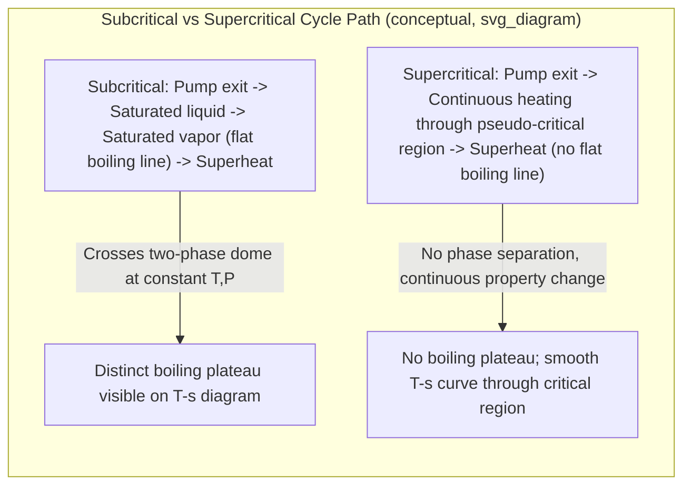

## Supercritical and Ultra-Supercritical Steam Cycles

### Overview

Supercritical and ultra-supercritical (USC) steam cycles operate at boiler pressures above the thermodynamic critical point of water (22.06 MPa, 373.95°C), eliminating the distinct liquid-vapor phase transition during heat addition. This allows significantly higher average temperatures of heat addition than subcritical (drum-type) boilers, directly increasing thermal efficiency in accordance with the general relationship between average heat-addition temperature and cycle efficiency.

### The Critical Point and Its Significance

**Critical Point of Water:**

$$P_{cr} = 22.06\ \text{MPa}, \quad T_{cr} = 373.95°\text{C} = 647.1\ \text{K}$$

**[Confirmed]** Above the critical pressure, there is no distinct boiling process — the working fluid transitions continuously from liquid-like to vapor-like density without crossing a two-phase saturation dome, since the distinction between liquid and vapor phases disappears at and above the critical point.

**Practical Implication:** A supercritical boiler does not require a steam drum to separate liquid and vapor phases (a mandatory component in subcritical drum boilers), since there is no two-phase mixture to separate. This fundamentally changes boiler design from drum-type to **once-through** construction.

### Classification of Steam Cycle Pressure/Temperature Regimes

| Classification | Typical Pressure | Typical Steam Temperature | Notes |
| --- | --- | --- | --- |
| Subcritical | < 22.06 MPa | Up to ~565°C | Drum-type boiler, conventional |
| Supercritical (SC) | 22.06–24 MPa | ~540–580°C | Once-through boiler |
| Ultra-Supercritical (USC) | ~24–31 MPa | ~580–620°C | Advanced alloys required |
| Advanced Ultra-Supercritical (A-USC) | > 31 MPa | > 700°C | Ni-based superalloys, R&D/demonstration stage |

**[Inference]** These pressure/temperature boundaries are commonly used industry classifications, but different organizations and countries draw the SC/USC/A-USC boundaries slightly differently; the numbers above represent typical ranges rather than a single universally standardized cutoff.

### T-s Diagram: Subcritical vs. Supercritical Heat Addition

### SVG: T-s Diagram Comparing Subcritical and Supercritical Heat Addition Paths

<svg xmlns="http://www.w3.org/2000/svg" viewBox="0 0 680 460">
<text x="340" y="24" font-size="16" text-anchor="middle" font-family="sans-serif" font-weight="bold">Subcritical vs. Supercritical Heat Addition (T-s Diagram) (svg_diagram)</text>

<line x1="80" y1="400" x2="620" y2="400" stroke="black" stroke-width="2" />
<line x1="80" y1="400" x2="80" y2="50" stroke="black" stroke-width="2" />
<text x="350" y="430" font-size="14" text-anchor="middle" font-family="sans-serif">Entropy, s</text>
<text x="35" y="225" font-size="14" text-anchor="middle" font-family="sans-serif" transform="rotate(-90 35 225)">Temperature, T</text>

<path d="M 150 400 Q 300 90 450 400" stroke="gray" stroke-width="1.5" fill="none" stroke-dasharray="4,3" />
<circle cx="300" cy="95" r="4" fill="gray" />
<text x="310" y="90" font-size="11" fill="gray" font-family="sans-serif">Critical point</text>

<path d="M 160 380 L 200 200 L 340 200 L 420 100" stroke="blue" stroke-width="2" fill="none" />
<text x="200" y="190" font-size="10" fill="blue" font-family="sans-serif">Boiling plateau (flat, constant T)</text>
<text x="150" y="415" font-size="11" fill="blue" font-family="sans-serif">Subcritical path (with boiling)</text>

<path d="M 170 380 Q 250 250 320 130 T 460 60" stroke="red" stroke-width="2" fill="none" />
<text x="330" y="55" font-size="11" fill="red" font-family="sans-serif">Supercritical path (smooth, no plateau)</text>

<text x="90" y="430" font-size="11" fill="gray" font-family="sans-serif">Note: supercritical path bypasses the two-phase dome entirely</text>

</svg>

### Boiler Design: Drum-Type vs. Once-Through

**Subcritical (Drum) Boiler:**

- Uses natural or forced water circulation through evaporator tubes.
- A steam drum separates saturated liquid (recirculated) from saturated vapor (sent to superheater).
- Circulation can be natural (density-driven) or assisted by circulation pumps.

**Supercritical (Once-Through) Boiler:**

- No steam drum; feedwater passes once through economizer, evaporator, and superheater sections in a single continuous pass.
- Requires precise feedwater flow control since there is no drum to buffer transient mismatches between feedwater flow and heat input.
- Common designs include the **Benson boiler** and **Sulzer boiler** (early once-through boiler concepts), refined into modern spiral-wound or vertical-tube once-through designs.
- **[Confirmed]** Because there is no recirculation loop, once-through boilers generally require higher water purity (very low dissolved solids) to prevent scale and deposit formation, since there is no drum blowdown mechanism to purge concentrated impurities.

### Efficiency Benefits

**[Confirmed]** Raising both boiler pressure and turbine inlet temperature increases the average temperature of heat addition, which — per the general thermal efficiency relationship $\eta_{th} = 1 - T_{L,avg}/T_{H,avg}$ (an idealized approximation analogous to Carnot reasoning) — increases achievable thermal efficiency.

**Typical Efficiency Gains (illustrative):**

| Cycle Type | Typical Net Plant Efficiency (LHV basis) |
| --- | --- |
| Subcritical | ~36–38% |
| Supercritical | ~38–40% |
| Ultra-supercritical | ~42–45% |
| Advanced ultra-supercritical (target) | ~46–50% |

**[Inference]** These efficiency ranges are commonly cited in industry literature and vary considerably based on specific plant configuration, cooling method (wet vs. dry cooling), ambient conditions, fuel type, and the number of reheat/regeneration stages employed; they should be treated as illustrative ranges rather than guaranteed values for any specific installation.

### Materials and Metallurgical Challenges

Higher pressures and temperatures impose severe demands on boiler tubes, headers, steam piping, and turbine components:

- **Creep resistance:** Materials must resist slow, time-dependent deformation under sustained high stress at elevated temperature.
- **Oxidation and corrosion resistance:** Steam-side oxidation and fireside corrosion both accelerate at higher temperatures.
- **Common materials progression:**
  - Subcritical: Carbon steel and low-alloy ferritic steels
  - Supercritical: Higher-grade ferritic-martensitic steels (e.g., T91/P91, T92/P92 grades)
  - Ultra-supercritical: Austenitic stainless steels and higher-nickel alloys for the hottest sections (superheater/reheater outlets, main steam piping)
  - Advanced ultra-supercritical: Nickel-based superalloys (e.g., Inconel-type alloys) for components exposed to temperatures above ~700°C

**[Inference]** The specific alloy selection for any given component and temperature range is governed by detailed engineering codes and standards (such as ASME Boiler and Pressure Vessel Code sections) and manufacturer-specific material qualification programs; the material families named above represent commonly referenced categories in the industry rather than a definitive specification for any particular plant.

### Turbine Design Considerations

- Higher inlet pressures result in smaller volumetric flow at the HP turbine inlet, often requiring smaller-diameter, higher-pressure-rated HP turbine casings and rotors.
- Reheat becomes essentially mandatory (often double reheat in advanced USC designs) both for efficiency and to manage turbine exit moisture, since higher boiler pressures alone would otherwise drive turbine exhaust quality unacceptably low (see The Reheat Rankine Cycle).
- Feedwater regeneration with many extraction stages (see The Regenerative Rankine Cycle) is standard practice in supercritical plants to maximize the efficiency benefit of the elevated steam conditions.

### Worked Example: Comparative Efficiency Impact

**Given:** Compare the ideal Rankine cycle thermal efficiency at two pressure/temperature combinations, both rejecting heat at 10 kPa (both simple cycles, no reheat, for illustrative comparison only):

**Case A — Subcritical:** 16.5 MPa, 550°C

**Case B — Supercritical:** 30 MPa, 600°C

**Case A:**

$h_1 \approx 3448.6\ \text{kJ/kg}$, $s_1 \approx 6.4502\ \text{kJ/kg·K}$ (approximate values at 16.5 MPa, 550°C)

At 10 kPa, $s_f = 0.6493$, $s_{fg} = 7.5009$:

$$x_2 = \frac{6.4502 - 0.6493}{7.5009} = 0.7733$$

$$h_2 = 191.83 + 0.7733(2392.8) = 2042.5\ \text{kJ/kg}$$

$$w_T \approx h_1 - h_2 = 3448.6 - 2042.5 = 1406.1\ \text{kJ/kg}$$

Pump work is small (~17 kJ/kg at this pressure); approximate net work $\approx 1389\ \text{kJ/kg}$

$$q_{in} \approx h_1 - h_4 \approx 3448.6 - 209 = 3239.6\ \text{kJ/kg}$$

$$\eta_{th,A} \approx \frac{1389}{3239.6} \approx 42.9\%$$

**Case B (supercritical, 30 MPa, 600°C):**

$h_1 \approx 3502.0\ \text{kJ/kg}$ (approximate — properties above critical pressure require supercritical steam tables/correlations), $s_1 \approx 6.2331\ \text{kJ/kg·K}$ (approximate)

At 10 kPa:

$$x_2 = \frac{6.2331 - 0.6493}{7.5009} = 0.7444$$

$$h_2 = 191.83 + 0.7444(2392.8) = 1973.8\ \text{kJ/kg}$$

$$w_T \approx 3502.0 - 1973.8 = 1528.2\ \text{kJ/kg}$$

Pump work at 30 MPa is larger (~30 kJ/kg); approximate net work $\approx 1498\ \text{kJ/kg}$

$$q_{in} \approx 3502.0 - 222 = 3280.0\ \text{kJ/kg}$$

$$\eta_{th,B} \approx \frac{1498}{3280.0} \approx 45.7\%$$

**[Unverified]** The specific enthalpy and entropy values used for Case B (30 MPa, 600°C) are approximate, since precise supercritical steam properties require detailed steam table interpolation or an IAPWS-IF97 formulation lookup rather than simple saturation-based estimation; these figures illustrate the expected direction and rough magnitude of efficiency improvement rather than serving as precise reference values. In practice, always consult full steam property tables or software (e.g., NIST REFPROP, IAPWS-IF97 implementations) for supercritical state properties.

### Environmental and Economic Drivers

- **[Confirmed]** Higher thermal efficiency directly reduces fuel consumption and $CO_2$ emissions per unit of electricity generated, which has been a primary driver for supercritical and ultra-supercritical plant deployment, particularly in coal-fired generation where efficiency gains have outsized emissions benefits.
- Higher capital costs (due to advanced materials and more complex once-through boiler control systems) are typically justified over the plant's operating lifetime through fuel savings, particularly in regions with high fuel costs or carbon pricing mechanisms.
- **[Inference]** The economic payback period for the incremental capital cost of USC over subcritical technology depends heavily on fuel prices, capacity factor, and local regulatory/carbon-pricing context, and therefore varies significantly by region and is not reducible to a single generalized figure.

### Control System Implications

- Once-through boilers require tighter, more responsive feedwater flow and firing rate control since there is no drum providing thermal/hydraulic buffering.
- **[Inference]** This typically necessitates more sophisticated coordinated boiler-turbine control strategies (including advanced feedforward and model-based control approaches) compared to simpler drum-boiler control schemes, though specific control architecture varies by boiler manufacturer and plant vintage.

### Common Mistakes and Clarifications

- **Assuming "supercritical" means higher temperature only:** Supercriticality is defined by pressure exceeding the critical pressure (22.06 MPa); temperature must also typically be elevated for the fluid to remain single-phase throughout the boiler, but the defining threshold for the cycle classification is the pressure exceeding $P_{cr}$.
- **Assuming standard saturated steam tables apply directly:** Once pressure exceeds the critical pressure, there is no saturation temperature/pressure pairing — property evaluation must use single-phase (compressed liquid-like to supercritical vapor-like) correlations valid at supercritical conditions, not the standard two-phase saturation tables.
- **Confusing supercritical steam cycles with supercritical $CO_2$ cycles:** These are distinct technologies — supercritical steam cycles use water/steam as the working fluid at supercritical pressure, while supercritical $CO_2$ (sCO2) cycles use carbon dioxide as the working fluid in a fundamentally different (often closed Brayton-type) cycle configuration; they should not be conflated despite the shared term "supercritical."

**Next Steps**

- Advanced Ultra-Supercritical (A-USC) Technology and Materials R&D
- Supercritical CO2 (sCO2) Power Cycles
- Reheat–Regenerative Rankine Cycle Combined Analysis
- Boiler Feedwater Purity and Once-Through Boiler Water Chemistry
- Combined Gas–Steam (Combined Cycle) Power Plants
- IAPWS-IF97 Steam Property Formulation