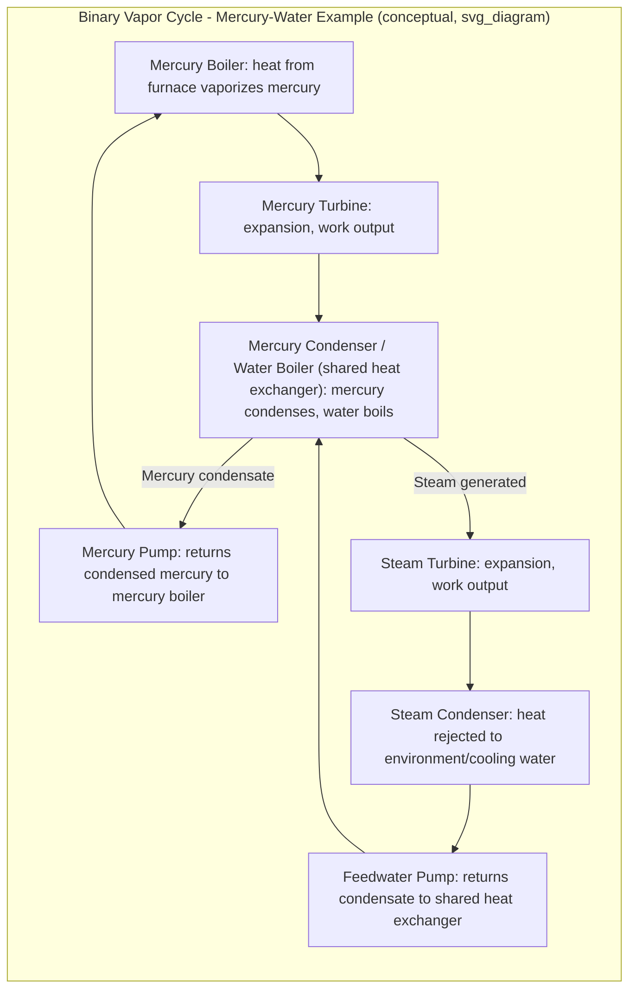

## Binary Vapor Cycles

### Overview

A binary vapor cycle combines two separate power cycles, each using a different working fluid, thermally coupled so that the heat rejected by the topping (high-temperature) cycle serves as the heat input to the bottoming (low-temperature) cycle. This configuration exploits the favorable thermodynamic properties of different fluids across different temperature ranges, achieving higher overall thermal efficiency than a single-fluid cycle could achieve across the same overall temperature span.

### Motivation: Limitations of Water as a Single Working Fluid

**Why Water Alone Is Imperfect Across the Full Temperature Range**

- Water has highly favorable properties (abundant, non-toxic, well-characterized, chemically stable) but its thermodynamic properties are not ideal across the *entire* range from very high temperatures down to ambient heat-rejection temperatures.
- **At high temperatures:** Water's critical point (374°C, 22.06 MPa) limits how much of the heat addition process can occur at high average temperature without requiring extremely high pressures, and even supercritical steam requires expensive high-pressure boiler and turbine designs (see Supercritical and Ultra-Supercritical Steam Cycles).
- **At low temperatures (heat rejection):** Water's saturation pressure at typical ambient condenser temperatures (e.g., 30–40°C) is very low (a few kPa), requiring the condenser and low-pressure turbine stages to operate under a deep vacuum, which introduces air in-leakage concerns and large specific volumes (requiring very large last-stage turbine blades and condenser surface area).

**The Binary Cycle Solution**

- Pair water with a second fluid whose properties are better suited to the high-temperature end of the cycle — historically **mercury** was the classic example used in early 20th-century binary vapor cycle research and limited commercial deployment.
- The topping fluid handles the high-temperature portion of heat addition and rejects its "waste" heat at a temperature still high enough to boil water effectively; the water (steam) bottoming cycle then handles the lower-temperature portion of the overall cycle, including final heat rejection to the environment.

### Classic Mercury-Water Binary Cycle

**[Confirmed]** The mercury-water binary vapor cycle was investigated and, in a small number of installations, commercially operated in the early-to-mid 20th century (notably in the United States, e.g., the Kearny/South Meadow-type mercury-steam plants) because mercury's vapor pressure characteristics allow relatively low-pressure boiling at high temperatures — mercury has a much higher saturation temperature than water at moderate pressures, and a correspondingly higher critical temperature.

**Mercury's Favorable High-Temperature Properties:**

- High saturation temperature at practical, moderate pressures allows heat addition at high temperature without requiring extreme boiler pressures the way superheated/supercritical steam would.
- Mercury's low specific volume in the vapor phase at these operating conditions permits smaller turbine and piping dimensions for a given power output.

**Mercury's Drawbacks (Why the Concept Was Abandoned):**

- **[Confirmed]** Mercury is highly toxic, and the environmental, health, and safety hazards associated with its handling, potential leakage, and disposal were major factors that led to the discontinuation of mercury-based binary vapor cycles in commercial power generation.
- Mercury is also costly and chemically reactive with certain materials, complicating material selection for piping and turbine components.
- **[Inference]** Modern power engineering has moved away from mercury-based cycles entirely due to these toxicity and handling concerns; the concept today survives primarily as a historical case study illustrating the binary cycle principle rather than as an active area of new plant deployment.

### Cycle Configuration and Schematic

### SVG: Binary Vapor Cycle Schematic (Topping and Bottoming Cycles)

<svg xmlns="http://www.w3.org/2000/svg" viewBox="0 0 700 480">
<text x="350" y="24" font-size="16" text-anchor="middle" font-family="sans-serif" font-weight="bold">Binary Vapor Cycle: Topping and Bottoming Cycles (svg_diagram)</text>

<rect x="80" y="60" width="140" height="50" fill="none" stroke="black" stroke-width="2" />
<text x="150" y="90" font-size="12" text-anchor="middle" font-family="sans-serif">Topping Fluid Boiler</text>

<polygon points="240,65 240,105 320,120 320,50" fill="none" stroke="black" stroke-width="2" />
<text x="270" y="90" font-size="11" text-anchor="middle" font-family="sans-serif">Topping</text>
<text x="270" y="102" font-size="11" text-anchor="middle" font-family="sans-serif">Turbine</text>

<rect x="330" y="150" width="180" height="80" fill="none" stroke="black" stroke-width="3" />
<text x="420" y="180" font-size="12" text-anchor="middle" font-family="sans-serif">Shared Heat Exchanger</text>
<text x="420" y="195" font-size="11" text-anchor="middle" font-family="sans-serif">(Topping fluid condenses,</text>
<text x="420" y="208" font-size="11" text-anchor="middle" font-family="sans-serif">water boils)</text>

<circle cx="150" cy="200" r="20" fill="none" stroke="black" stroke-width="2" />
<text x="150" y="205" font-size="10" text-anchor="middle" font-family="sans-serif">Pump A</text>

<polygon points="550,155 550,195 630,215 630,135" fill="none" stroke="black" stroke-width="2" />
<text x="580" y="180" font-size="11" text-anchor="middle" font-family="sans-serif">Steam</text>
<text x="580" y="192" font-size="11" text-anchor="middle" font-family="sans-serif">Turbine</text>

<rect x="530" y="280" width="120" height="60" fill="none" stroke="black" stroke-width="2" />
<text x="590" y="315" font-size="12" text-anchor="middle" font-family="sans-serif">Condenser</text>

<circle cx="450" cy="340" r="20" fill="none" stroke="black" stroke-width="2" />
<text x="450" y="345" font-size="10" text-anchor="middle" font-family="sans-serif">Pump B</text>

<line x1="220" y1="85" x2="240" y2="85" stroke="orange" stroke-width="2" />
<line x1="320" y1="85" x2="380" y2="85" stroke="orange" stroke-width="2" />
<line x1="380" y1="85" x2="380" y2="150" stroke="orange" stroke-width="2" />
<line x1="380" y1="230" x2="380" y2="260" stroke="orange" stroke-width="2" />
<line x1="380" y1="260" x2="150" y2="260" stroke="orange" stroke-width="2" />
<line x1="150" y1="260" x2="150" y2="220" stroke="orange" stroke-width="2" />
<line x1="150" y1="180" x2="150" y2="110" stroke="orange" stroke-width="2" />

<line x1="470" y1="175" x2="550" y2="175" stroke="blue" stroke-width="2" />
<line x1="630" y1="175" x2="670" y2="175" stroke="blue" stroke-width="2" />
<line x1="670" y1="175" x2="670" y2="310" stroke="blue" stroke-width="2" />
<line x1="670" y1="310" x2="650" y2="310" stroke="blue" stroke-width="2" />
<line x1="530" y1="310" x2="450" y2="310" stroke="blue" stroke-width="2" />
<line x1="450" y1="310" x2="450" y2="360" stroke="blue" stroke-width="2" />
<line x1="450" y1="360" x2="420" y2="360" stroke="blue" stroke-width="2" />
<line x1="420" y1="360" x2="420" y2="230" stroke="blue" stroke-width="2" />

<text x="100" y="400" font-size="11" fill="orange" font-family="sans-serif">Orange: Topping cycle (e.g., mercury)</text>

<text x="100" y="415" font-size="11" fill="blue" font-family="sans-serif">Blue: Bottoming cycle (steam/water)</text>

</svg>

### Thermodynamic Rationale

**Effective Widening of the Temperature Span**

By splitting the total temperature range into two segments handled by two different fluids, each fluid operates closer to its own thermodynamically favorable region:

$$\eta_{th,overall} \text{ can exceed } \eta_{th,single-fluid}$$

for the same overall maximum and minimum temperature limits, because each sub-cycle's average heat-addition temperature can be raised (for the topping cycle) or its average heat-rejection temperature effectively utilized more fully (through the coupling), compared to forcing one fluid to span the entire range.

**Overall Efficiency Relationship**

For a binary cycle with topping cycle efficiency $\eta_1$ and bottoming cycle efficiency $\eta_2$, and where all heat rejected by the topping cycle becomes the heat input to the bottoming cycle:

$$\eta_{overall} = \eta_1 + \eta_2(1 - \eta_1)$$

This shows that the overall efficiency exceeds either individual cycle's efficiency, since the bottoming cycle recovers additional useful work from the topping cycle's rejected heat, which would otherwise be entirely wasted in a single-fluid configuration.

**[Confirmed]** This combined-efficiency relationship follows directly from an energy balance treating the topping cycle's rejected heat as the bottoming cycle's heat input, assuming no losses in the coupling heat exchanger; any additional heat exchanger irreversibility (finite approach temperature difference) reduces the achievable overall efficiency below this idealized value.

### Alternative and Modern Binary/Combined Fluid Concepts

**[Inference]** While mercury-water binary vapor cycles are now primarily of historical interest, the underlying *principle* — cascading two different working fluids to better match property characteristics to different temperature ranges — persists conceptually in several modern technologies, though these are generally not called "binary vapor cycles" in current terminology:

- **Organic Rankine Cycle (ORC) bottoming cycles:** Used to recover low-grade waste heat (e.g., from gas turbine exhaust or industrial processes) using organic working fluids with favorable low-temperature boiling characteristics, conceptually similar in spirit (cascading fluids across a temperature range) though architecturally distinct from the classic mercury-water binary cycle.
- **Combined-cycle gas-steam plants:** Pair a gas turbine (Brayton cycle, air/combustion gas working fluid) topping cycle with a steam Rankine bottoming cycle recovering exhaust heat via a heat recovery steam generator (HRSG) — this is technically a combined cycle using two different *cycle types* (Brayton and Rankine) rather than two vapor cycles with the same cycle architecture, but shares the cascading heat-recovery philosophy.
- **Kalina cycle:** Uses an ammonia-water mixture (rather than two entirely separate fluid loops) as a single working fluid whose composition is varied to improve heat transfer matching during boiling and condensation — a related but distinct approach to improving cycle efficiency through fluid property optimization.

### Desirable Working Fluid Properties for a Topping Fluid

For a working fluid to be well-suited as the topping fluid in a binary vapor cycle, it should ideally exhibit:

- **High critical temperature:** Allows heat addition at high temperature without requiring supercritical pressures.
- **Moderate saturation pressure at high temperature:** Avoids the need for extremely thick-walled, expensive high-pressure boiler components.
- **Low saturation pressure at the coupling (condensing) temperature:** Should not require deep vacuum operation at the temperature where it transfers heat to the bottoming fluid.
- **Chemical stability and compatibility with construction materials** at operating temperatures.
- **Low toxicity, low cost, and manageable environmental/safety profile** — the property that ultimately disqualified mercury for continued use.
- **[Speculation]** No working fluid perfectly satisfies all these criteria simultaneously for a water-coupled topping cycle at commercially attractive cost and safety profiles, which is a primary reason binary vapor cycles (in the classic sense) have not seen widespread modern adoption, unlike combined gas-steam cycles which achieve similar cascading benefits using a fundamentally different (combustion-gas-based) topping medium that avoids the toxicity and fluid-handling challenges of a closed-loop topping vapor.

### Worked Example — Overall Efficiency Calculation

**Given:** A binary vapor cycle has a topping cycle (Fluid A) with thermal efficiency $\eta_1 = 0.30$, and a bottoming steam cycle (Fluid B) with thermal efficiency $\eta_2 = 0.35$, where all rejected heat from the topping cycle transfers to the bottoming cycle.

**Calculate overall efficiency:**

$$\eta_{overall} = \eta_1 + \eta_2(1 - \eta_1)$$

$$\eta_{overall} = 0.30 + 0.35(1 - 0.30) = 0.30 + 0.35(0.70) = 0.30 + 0.245 = 0.545$$

$$\eta_{overall} = 54.5\%$$

**Interpretation:** This overall efficiency (54.5%) exceeds both individual cycle efficiencies (30% and 35%), demonstrating the fundamental thermodynamic benefit of the binary/cascaded configuration. **[Confirmed]** This result is a direct mathematical consequence of the combined-efficiency formula and correctly illustrates why cascading cycles is thermodynamically advantageous, though it assumes ideal heat transfer coupling (no exergy loss in the intermediate heat exchanger), which in practice would reduce the achievable value somewhat.

### Practical and Historical Limitations

- **Coupling heat exchanger irreversibility:** Any real heat exchanger transferring heat from the condensing topping fluid to the boiling bottoming fluid requires a finite temperature difference to drive heat transfer, which is itself a source of entropy generation and reduces the ideal efficiency benefit calculated above.
- **Capital cost and complexity:** Operating two entirely separate fluid loops, each with its own pumps, piping, and turbine, roughly doubles much of the plant's mechanical complexity compared to a single-fluid cycle.
- **Fluid-specific hazards:** As demonstrated by mercury, the topping fluid's handling, toxicity, and environmental risk profile can outweigh the thermodynamic benefits, particularly as regulatory and safety standards have become more stringent since the mid-20th century.

### Common Mistakes and Clarifications

- **Confusing binary vapor cycles with combined-cycle (gas-steam) plants:** A true binary vapor cycle uses two separate *vapor* power cycles (historically both Rankine-type, using two different condensable working fluids); a combined-cycle plant pairs a *gas turbine* (Brayton, non-condensing working fluid) with a steam bottoming cycle — related in philosophy but architecturally and terminologically distinct.
- **Assuming binary vapor cycles are a current mainstream technology:** They are largely a historical concept today, primarily discussed for its educational value in illustrating cascaded-cycle thermodynamics rather than as an actively deployed modern power generation technology.
- **Overestimating achievable overall efficiency:** The combined efficiency formula assumes ideal (lossless) heat transfer between the two cycles; real coupling heat exchangers introduce a finite approach temperature and associated irreversibility that reduces the practically achievable overall efficiency below the idealized formula's result.

**Next Steps**

- Combined Gas-Steam (Combined Cycle) Power Plants
- Organic Rankine Cycle (ORC) for Waste Heat Recovery
- Kalina Cycle and Zeotropic Mixture Working Fluids
- Cogeneration and Combined Heat-and-Power Systems
- Second-Law (Exergy) Analysis of Cascaded Cycles
- Working Fluid Selection Criteria for Power Cycles