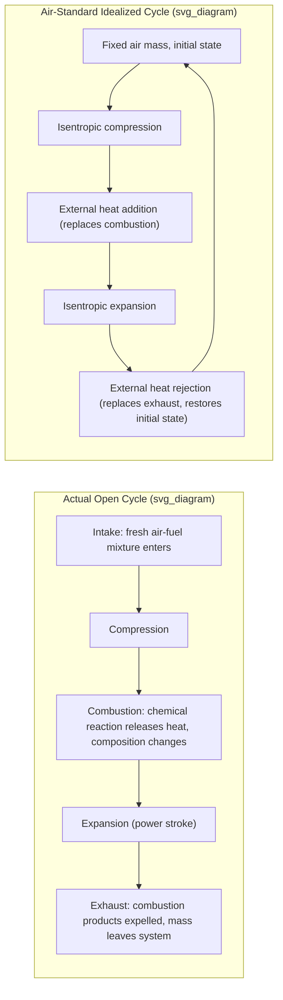

## Air-Standard Assumptions

### Overview

Air-standard assumptions form a set of simplifications used to analyze internal combustion engine and gas turbine cycles without the mathematical complexity of dealing with actual combustion chemistry, variable working fluid composition, and open-cycle mass exchange with the atmosphere. By treating the working fluid as air behaving as an ideal gas throughout a closed cycle, these assumptions allow gas power cycles to be analyzed using straightforward ideal-gas thermodynamic relations while still capturing the essential performance trends of real engines.

### The Need for Simplification

**Real Internal Combustion Engine Complexity**

Actual gas power cycles (spark-ignition engines, diesel engines, gas turbines) involve:

- Combustion chemistry with changing chemical composition (fuel + air → combustion products) rather than a fixed working fluid.
- Heat release through actual chemical reaction rather than an idealized external heat-addition process.
- Intake and exhaust processes that involve replacing the working fluid (an open system with mass crossing the boundary) rather than a fixed mass in a closed cycle.
- Working fluid properties that vary significantly with temperature and composition throughout the cycle.

**[Confirmed]** Modeling all of this complexity in full detail is computationally and analytically demanding, which is why simplified air-standard models are used for introductory and comparative thermodynamic cycle analysis, trading some accuracy for tractability while still capturing the qualitative and approximate quantitative behavior of real cycles.

### The Four Air-Standard Assumptions

**1. Fixed Amount of Air as the Working Fluid**

- The working fluid is assumed to be a fixed mass of air circulating in a closed loop throughout the entire cycle.
- Air is treated as an ideal gas throughout.
- This eliminates the need to model intake and exhaust as separate open-system mass-transfer processes; instead, the exhaust and intake strokes are replaced by a fictitious constant-volume (or otherwise idealized) heat-rejection process that returns the air to its initial state, closing the cycle.

**2. Combustion Process Replaced by an External Heat-Addition Process**

- The actual combustion process (fuel oxidation releasing chemical energy) is replaced by an equivalent heat-transfer process from an external source, delivering the same amount of energy to the working fluid.
- This avoids the need to track fuel chemistry, air-fuel ratio effects on combustion, and reaction kinetics.

**3. Exhaust (Blowdown) Process Replaced by a Heat-Rejection Process**

- The actual exhaust process, wherein hot combustion products are expelled and replaced by fresh intake air, is replaced by an idealized heat-rejection process that restores the working fluid to its initial thermodynamic state, closing the cycle as if it were a genuinely closed system.

**4. All Processes Are Internally Reversible**

- Compression and expansion strokes are assumed to occur without friction, turbulence, or other internal irreversibilities — treated as isentropic (reversible and adiabatic) processes unless a specific process step is otherwise defined as a reversible heat-addition or heat-rejection process.

### Table Summary

| Assumption | What It Replaces | Simplification Achieved |
| --- | --- | --- |
| Fixed working fluid (air) | Changing composition due to combustion products | Enables ideal-gas property relations throughout |
| External heat addition | Actual fuel combustion | Avoids combustion chemistry and reaction kinetics |
| External heat rejection | Exhaust/intake (blowdown) process | Converts open cycle into an equivalent closed cycle |
| Internally reversible processes | Real friction, turbulence, and other losses | Enables isentropic relations for compression/expansion |

### The Cold-Air-Standard Assumption (Further Simplification)

A further refinement, often applied alongside the basic air-standard assumptions, is the **cold-air-standard assumption**:

- Specific heats ($c_p$, $c_v$) are assumed **constant**, evaluated at room temperature (typically 25°C or 300 K), rather than varying with temperature as they do in real gases at combustion-relevant temperatures.
- This allows use of simple constant-specific-heat ideal-gas relations (e.g., $Pv = RT$, $\Delta u = c_v \Delta T$, $\Delta h = c_p \Delta T$) and closed-form isentropic relations, rather than requiring variable-specific-heat data tables (such as air property tables that account for $c_p(T)$).

**[Confirmed]** The cold-air-standard assumption introduces additional inaccuracy relative to the (non-cold) air-standard assumption alone, since real specific heats of air increase measurably with temperature — this means cold-air-standard analysis tends to be reasonably accurate at modest temperature ranges but progressively less accurate as the cycle's maximum temperature increases significantly above room temperature, which is common in most practical internal combustion and gas turbine applications.

### Visual Summary: Real Cycle vs. Air-Standard Idealization

### Why This Matters for Cycle Analysis

**[Confirmed]** With air-standard assumptions in place, gas power cycles (Otto, Diesel, Dual, Brayton, and others) can be represented as fully closed thermodynamic cycles composed entirely of well-defined ideal-gas processes (isentropic compression, constant-volume or constant-pressure heat addition, isentropic expansion, and constant-volume or constant-pressure heat rejection), enabling direct application of the first law and ideal-gas property relations to compute work, heat transfer, and thermal efficiency in closed analytical form.

This is directly analogous to how the ideal Rankine cycle (see Vapor Power Cycles chapter) simplifies real vapor power plant behavior by assuming internally reversible processes — air-standard assumptions play the equivalent simplifying role for gas power cycles, substituting idealized processes for the complex real behavior of combustion and gas exchange.

### Quantifying the Approximation: Illustrative Comparison

**Given:** Compare $c_p$ values used in cold-air-standard analysis versus actual temperature-dependent air properties.

**Cold-air-standard (constant, evaluated at 300 K):**

$$c_p = 1.005\ \text{kJ/kg·K}, \quad c_v = 0.718\ \text{kJ/kg·K}, \quad k = c_p/c_v = 1.4$$

**Actual air properties at elevated temperature (e.g., 1000 K):**

$$c_p \approx 1.142\ \text{kJ/kg·K}$$

**[Confirmed]** This represents an increase of approximately 13-14% in $c_p$ from the room-temperature value used in cold-air-standard analysis, which illustrates why cold-air-standard results for maximum-temperature-sensitive quantities (such as peak cycle temperature, heat addition, and derived efficiency) can diverge noticeably from results obtained using variable-specific-heat (air-standard, non-cold) property tables, particularly for cycles with high peak temperatures such as gas turbine Brayton cycles.

**Practical Implication:** For cycles with modest temperature swings, cold-air-standard analysis provides reasonably accurate qualitative and approximate quantitative results with minimal computational effort. For cycles with large temperature increases (common in real engines, where peak temperatures can exceed 1500–2000 K), the full air-standard analysis using variable specific heat data (from ideal-gas air tables) provides improved accuracy, though even this retains all the other idealizations (fixed working fluid, external heat transfer replacing combustion, internal reversibility).

### Limitations and What Air-Standard Analysis Cannot Capture

- **Actual combustion effects:** Flame propagation speed, incomplete combustion, and combustion-related emissions are entirely absent from air-standard models, since combustion is replaced by an abstract heat-addition process.
- **Fuel-air ratio effects on working fluid properties:** Real combustion products have different specific heats and molecular weights than pure air, an effect the air-standard assumption ignores by treating the working fluid as pure air throughout.
- **Actual mechanical friction and heat losses:** The internal reversibility assumption means air-standard cycle efficiencies represent an theoretical upper bound relative to any given cycle's actual, irreversible counterpart — analogous to how the ideal Rankine cycle overstates achievable efficiency relative to actual vapor power cycles with component irreversibilities.
- **[Inference]** Because of these omissions, air-standard cycle analysis is best understood as a tool for comparative and trend analysis (e.g., how does compression ratio affect efficiency, how does cycle configuration affect performance) rather than as a precise predictive tool for the exact efficiency or output of a specific real engine; real engine performance prediction typically requires more detailed combustion modeling, computational fluid dynamics, or empirical correlations validated against test data.

### Common Mistakes and Clarifications

- **Confusing "air-standard" with "cold-air-standard":** Air-standard assumptions alone still permit temperature-varying specific heats (using variable-property air tables); the *cold*-air-standard assumption is an additional, separate simplification that fixes specific heats at room-temperature values. Not all air-standard analyses are cold-air-standard analyses.
- **Assuming air-standard cycles predict real engine efficiency accurately:** Air-standard analysis produces idealized upper-bound efficiency estimates; actual engines always perform below these values due to real combustion inefficiencies, mechanical friction, heat losses, and non-ideal gas exchange processes.
- **Forgetting that the working fluid is treated as unchanging:** Some students incorrectly attempt to account for changing air-fuel-ratio-dependent properties within an air-standard analysis; by definition, the air-standard assumption treats the working fluid as fixed, pure air throughout the entire idealized cycle.
- **Using cold-air-standard property values at high cycle temperatures without acknowledging the resulting error:** Since real specific heats increase with temperature, cold-air-standard results systematically understate actual heat capacity effects at high temperature, which can lead to non-trivial deviations in calculated peak temperatures and cycle efficiency for high-temperature-ratio cycles.

**Next Steps**

- The Carnot Cycle Applied to Gas Power Systems
- The Otto Cycle (Spark-Ignition Engines)
- The Diesel Cycle (Compression-Ignition Engines)
- The Dual Cycle
- The Brayton Cycle (Gas Turbines)
- Variable Specific Heat Analysis Using Ideal-Gas Air Tables
- Mean Effective Pressure and Engine Performance Parameters