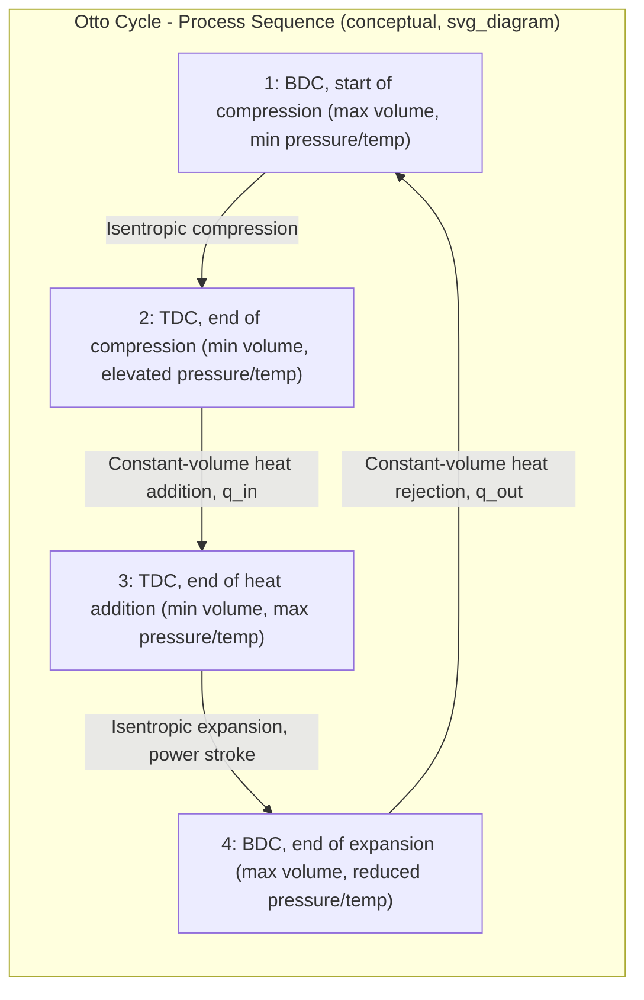

## The Otto Cycle

### Overview

The Otto cycle is the idealized air-standard cycle that models the thermodynamic processes occurring in spark-ignition (SI) internal combustion engines — the type of engine found in most gasoline-fueled automobiles. It approximates the real four-stroke (or two-stroke) SI engine cycle using four internally reversible processes acting on a fixed mass of air, applying the air-standard assumptions (see Air-Standard Assumptions).

### Real Engine Cycle vs. Idealized Otto Cycle

**Actual Four-Stroke Spark-Ignition Engine Cycle:**

1. Intake stroke: air-fuel mixture drawn into the cylinder.
2. Compression stroke: piston compresses the mixture.
3. Spark ignition and combustion: rapid, nearly constant-volume combustion near top dead center (TDC).
4. Power (expansion) stroke: hot combustion gases expand, pushing the piston and delivering work.
5. Exhaust stroke: combustion products expelled from the cylinder.

**Idealized Otto Cycle (Air-Standard):**

The Otto cycle replaces this with four idealized processes on a closed system of air:

| Process | Description | Nature |
| --- | --- | --- |
| 1 → 2 | Isentropic compression | Reversible, adiabatic |
| 2 → 3 | Constant-volume heat addition | Replaces combustion |
| 3 → 4 | Isentropic expansion | Reversible, adiabatic (power stroke) |
| 4 → 1 | Constant-volume heat rejection | Replaces exhaust/intake process |

**[Confirmed]** The key idealization distinguishing the Otto cycle from other gas power cycles is that heat addition (replacing combustion) is modeled as occurring at **constant volume**, reflecting the fact that in a real SI engine, combustion occurs very rapidly while the piston is near top dead center, so the volume changes only slightly during the actual combustion event.

### P-v and T-s Diagrams

### SVG: P-v Diagram of the Otto Cycle

<svg xmlns="http://www.w3.org/2000/svg" viewBox="0 0 640 460">
<text x="320" y="24" font-size="16" text-anchor="middle" font-family="sans-serif" font-weight="bold">Otto Cycle on P-v Diagram (svg_diagram)</text>

<line x1="90" y1="400" x2="580" y2="400" stroke="black" stroke-width="2" />
<line x1="90" y1="400" x2="90" y2="50" stroke="black" stroke-width="2" />
<text x="330" y="430" font-size="14" text-anchor="middle" font-family="sans-serif">Specific Volume, v</text>
<text x="45" y="225" font-size="14" text-anchor="middle" font-family="sans-serif" transform="rotate(-90 45 225)">Pressure, P</text>

<circle cx="480" cy="360" r="5" fill="black" />
<text x="490" y="375" font-size="13" font-family="sans-serif">1 (BDC)</text>
<circle cx="180" cy="250" r="5" fill="black" />
<text x="140" y="240" font-size="13" font-family="sans-serif">2 (TDC)</text>
<circle cx="180" cy="80" r="5" fill="black" />
<text x="140" y="75" font-size="13" font-family="sans-serif">3 (TDC)</text>
<circle cx="480" cy="180" r="5" fill="black" />
<text x="490" y="175" font-size="13" font-family="sans-serif">4 (BDC)</text>

<path d="M 480 360 Q 280 340 180 250" stroke="blue" stroke-width="2" fill="none" />
<text x="280" y="330" font-size="11" fill="blue" font-family="sans-serif">1→2: Isentropic compression</text>
<line x1="180" y1="250" x2="180" y2="80" stroke="red" stroke-width="2" />
<text x="130" y="165" font-size="11" fill="red" font-family="sans-serif">2→3: Heat addition (const. v)</text>
<path d="M 180 80 Q 380 100 480 180" stroke="green" stroke-width="2" fill="none" />
<text x="300" y="105" font-size="11" fill="green" font-family="sans-serif">3→4: Isentropic expansion</text>
<line x1="480" y1="180" x2="480" y2="360" stroke="purple" stroke-width="2" />
<text x="490" y="270" font-size="11" fill="purple" font-family="sans-serif">4→1: Heat rejection (const. v)</text>

<text x="150" y="420" font-size="11" fill="gray" font-family="sans-serif">v2 = v3 (TDC, min volume) | v1 = v4 (BDC, max volume)</text>

</svg>

### Key Parameters

**Compression Ratio**

$$r = \frac{v_1}{v_2} = \frac{v_4}{v_3}$$

The compression ratio is the ratio of the volume at the start of compression (bottom dead center, BDC) to the volume at the end of compression (top dead center, TDC). It is the single most influential design parameter governing Otto cycle thermal efficiency.

**Cutoff Ratio:** Not applicable to the Otto cycle (this parameter is specific to the Diesel cycle, where heat addition occurs at constant pressure over a finite volume change).

### Thermal Efficiency

Applying the first law to each process (using cold-air-standard assumptions: constant specific heats):

**Heat Addition (2→3, constant volume):**

$$q_{in} = c_v(T_3 - T_2)$$

**Heat Rejection (4→1, constant volume):**

$$q_{out} = c_v(T_4 - T_1)$$

**Thermal Efficiency:**

$$\eta_{th} = 1 - \frac{q_{out}}{q_{in}} = 1 - \frac{T_4 - T_1}{T_3 - T_2}$$

Using the isentropic relations for processes 1→2 and 3→4 (both isentropic, with the same volume ratio $r$):

$$\frac{T_2}{T_1} = \left(\frac{v_1}{v_2}\right)^{k-1} = r^{k-1}$$

$$\frac{T_3}{T_4} = \left(\frac{v_4}{v_3}\right)^{k-1} = r^{k-1}$$

Substituting and simplifying, the thermal efficiency reduces to a function of compression ratio alone:

$$\boxed{\eta_{th,Otto} = 1 - \frac{1}{r^{k-1}}}$$

Where:

- $r$ = compression ratio
- $k$ = specific heat ratio ($c_p/c_v$), approximately 1.4 for cold-air-standard air

**[Confirmed]** This closed-form efficiency expression is a well-established, directly-derived result from applying the isentropic relations and first law to the four defined Otto cycle processes under cold-air-standard assumptions; it demonstrates that Otto cycle efficiency depends **only** on compression ratio $r$ and specific heat ratio $k$, and is independent of the amount of heat added (i.e., independent of how "hard" the engine is operating, in the idealized model).

### Effect of Compression Ratio on Efficiency

$$\eta_{th}$$ increases monotonically with $r$, but with diminishing returns at higher compression ratios.

| Compression Ratio $r$ | $\eta_{th}$ (with $k=1.4$) |
| --- | --- |
| 6 | 51.2% |
| 8 | 56.5% |
| 10 | 60.2% |
| 12 | 63.0% |
| 14 | 65.2% |

**[Confirmed]** The rate of efficiency improvement per unit increase in compression ratio diminishes as $r$ increases, since the efficiency expression's dependence on $r$ is through $r^{1-k}$, a function with a decreasing derivative magnitude as $r$ grows — this diminishing-returns behavior is a directly observable mathematical property of the efficiency equation itself.

### Practical Limit on Compression Ratio: Engine Knock

**[Confirmed]** In real spark-ignition engines, compression ratio cannot be increased without bound because higher compression ratios raise the end-of-compression temperature and pressure of the air-fuel mixture, increasing the likelihood of **autoignition (engine knock)** — uncontrolled, premature combustion of the end-gas ahead of the spark-initiated flame front, which causes characteristic knocking noise, reduces efficiency, and can cause engine damage if severe or sustained.

**[Inference]** Practical compression ratios for conventional gasoline spark-ignition engines are commonly in the range of roughly 8 to 12, though the specific achievable limit depends on fuel octane rating, engine design (combustion chamber geometry, cooling), and whether knock-mitigation technologies (such as knock sensors with ignition timing retard, or direct injection cooling effects) are employed; higher-octane fuels and advanced engine designs can support somewhat higher compression ratios, so this range should be treated as a general guideline rather than a fixed universal limit.

### Mean Effective Pressure (MEP)

The mean effective pressure is a useful performance metric representing the constant pressure that, if acting on the piston for the entire power stroke, would produce the same net work as the actual cycle:

$$MEP = \frac{w_{net}}{v_1 - v_2}$$

This allows comparison of engines of different displacement (size) on a common basis, since MEP normalizes net work output by swept volume.

### Worked Example

**Given:** An Otto cycle has a compression ratio of $r = 8$. At the start of compression, $T_1 = 300\ \text{K}$, $P_1 = 100\ \text{kPa}$. Heat added during the constant-volume process is $q_{in} = 800\ \text{kJ/kg}$. Use cold-air-standard assumptions with $k = 1.4$, $c_v = 0.718\ \text{kJ/kg·K}$.

**Step 1 — State 2 (after isentropic compression):**

$$T_2 = T_1 \, r^{k-1} = 300 \times 8^{0.4} = 300 \times 2.297 = 689.1\ \text{K}$$

**Step 2 — State 3 (after constant-volume heat addition):**

$$q_{in} = c_v(T_3 - T_2) \implies T_3 = T_2 + \frac{q_{in}}{c_v} = 689.1 + \frac{800}{0.718} = 689.1 + 1114.2 = 1803.3\ \text{K}$$

**Step 3 — State 4 (after isentropic expansion, same volume ratio $r$):**

$$T_4 = \frac{T_3}{r^{k-1}} = \frac{1803.3}{2.297} = 785.1\ \text{K}$$

**Step 4 — Heat rejected:**

$$q_{out} = c_v(T_4 - T_1) = 0.718 \times (785.1 - 300) = 0.718 \times 485.1 = 348.3\ \text{kJ/kg}$$

**Step 5 — Net work and thermal efficiency:**

$$w_{net} = q_{in} - q_{out} = 800 - 348.3 = 451.7\ \text{kJ/kg}$$

$$\eta_{th} = \frac{w_{net}}{q_{in}} = \frac{451.7}{800} = 0.5646 = 56.5\%$$

**Verification using the direct formula:**

$$\eta_{th} = 1 - \frac{1}{r^{k-1}} = 1 - \frac{1}{2.297} = 1 - 0.4353 = 0.5647 = 56.5\%$$

The two methods agree (minor rounding difference), confirming the consistency of the derived efficiency expression with direct first-law application.

### Effect on Peak Pressure and Temperature

The Otto cycle's constant-volume heat addition means that, for a given amount of heat added, the peak cycle temperature and pressure (state 3) are highly sensitive to compression ratio, since higher $r$ raises $T_2$ (the starting point for heat addition) before the same $q_{in}$ is added. This has practical implications for material and knock-limit considerations at high compression ratios, as noted above.

### Effect of Specific Heat Ratio $k$

**[Confirmed]** Otto cycle efficiency increases with increasing $k$ for a fixed compression ratio, since $\eta_{th} = 1 - r^{1-k}$ is an increasing function of $k$ for $r > 1$. This is why monatomic or diatomic gases with higher $k$ values (closer to 1.67 or 1.4, respectively) would theoretically yield higher Otto cycle efficiency at a given compression ratio than a gas with a lower $k$ — though air's $k \approx 1.4$ (diatomic-dominated) is the standard reference value used in air-standard Otto cycle analysis.

### Comparison with Actual SI Engine Performance

**[Inference]** Actual spark-ignition engine thermal efficiencies are considerably lower than idealized Otto cycle predictions at the same compression ratio, since real engines experience combustion irreversibilities (finite-time, non-instantaneous combustion rather than idealized constant-volume heat addition), heat losses to cylinder walls, friction, and incomplete combustion — typical real-world SI engine brake thermal efficiencies are commonly in the range of roughly 25–35%, substantially below the idealized cold-air-standard Otto cycle efficiency of 55–60% computed for typical compression ratios, though specific values depend heavily on engine design, operating point, and measurement basis (indicated vs. brake efficiency).

### Common Mistakes and Clarifications

- **Confusing the Otto cycle with the Diesel cycle:** The defining distinction is the heat-addition process — Otto cycle heat addition occurs at **constant volume** (modeling spark-ignition combustion), while Diesel cycle heat addition occurs at **constant pressure** (modeling compression-ignition combustion with a finite injection/burn duration). This single difference changes the efficiency formula and the relative efficiency comparison at equal compression ratios.
- **Assuming efficiency depends on the amount of heat added:** Under cold-air-standard assumptions, Otto cycle thermal efficiency is a function of compression ratio and $k$ *only* — it does not depend on $q_{in}$, T_1, or the specific temperatures involved, a frequently surprising but mathematically correct result of the idealization.
- **Ignoring the practical knock limit when suggesting "just increase compression ratio":** While the formula shows efficiency monotonically increasing with $r$, real engine design must respect fuel octane rating and knock limits, meaning arbitrarily high compression ratios are not achievable in practice with conventional spark-ignition combustion.
- **Applying the simple $r^{k-1}$ relation with non-constant specific heats:** The compact efficiency formula $\eta_{th} = 1 - r^{1-k}$ relies on the cold-air-standard (constant specific heat) assumption; a full air-standard analysis with variable specific heats requires using ideal-gas air tables (with relative pressure/volume functions) rather than this closed-form expression.

**Next Steps**

- The Diesel Cycle (Compression-Ignition Engines)
- The Dual Cycle
- Mean Effective Pressure and Engine Performance Parameters
- Engine Knock and Octane Rating
- Variable Specific Heat Analysis Using Ideal-Gas Air Tables
- The Brayton Cycle (Gas Turbines)
- Second-Law (Exergy) Analysis of the Otto Cycle