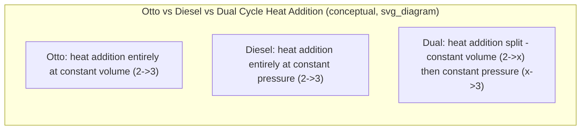

## The Diesel and Dual Cycles

### Overview

The Diesel cycle is the idealized air-standard cycle modeling compression-ignition (CI) engines, where fuel is injected into already-hot compressed air and combustion occurs progressively as fuel is injected, rather than being initiated instantaneously by a spark. The Dual cycle (also called the mixed or limited-pressure cycle) is a further refinement that models heat addition as occurring partly at constant volume and partly at constant pressure, providing a more realistic approximation of actual compression-ignition combustion behavior than either the Otto or Diesel cycle alone.

### The Diesel Cycle

**Physical Basis**

- In compression-ignition engines, only air (no fuel) is compressed during the compression stroke, reaching a temperature high enough to auto-ignite fuel upon injection — no spark plug is required.
- Fuel injection begins near top dead center and continues over a finite crank angle interval, during which combustion occurs progressively as fuel is injected and burned.
- **[Confirmed]** Because injection and combustion occur over a finite duration during which the piston continues to move away from TDC, the idealized Diesel cycle models this combustion process as occurring at **constant pressure** rather than constant volume, distinguishing it from the Otto cycle's constant-volume heat addition.

**Diesel Cycle Processes**

| Process | Description |
| --- | --- |
| 1 → 2 | Isentropic compression |
| 2 → 3 | Constant-pressure heat addition (models fuel injection/combustion) |
| 3 → 4 | Isentropic expansion |
| 4 → 1 | Constant-volume heat rejection |

### Diesel Cycle Key Parameters

**Compression Ratio:**

$$r = \frac{v_1}{v_2}$$

**Cutoff Ratio:**

$$r_c = \frac{v_3}{v_2}$$

The cutoff ratio represents the ratio of volumes at the end and beginning of the constant-pressure heat-addition process — physically, it reflects how long fuel injection continues (in terms of volume/crank-angle swept) before combustion is considered complete.

### Diesel Cycle Thermal Efficiency

**Heat Addition (2→3, constant pressure):**

$$q_{in} = c_p(T_3 - T_2)$$

**Heat Rejection (4→1, constant volume):**

$$q_{out} = c_v(T_4 - T_1)$$

**Thermal Efficiency:**

$$\eta_{th} = 1 - \frac{q_{out}}{q_{in}} = 1 - \frac{c_v(T_4-T_1)}{c_p(T_3-T_2)}$$

Using the isentropic and cutoff ratio relations, this reduces to:

$$\boxed{\eta_{th,Diesel} = 1 - \frac{1}{r^{k-1}} \left[\frac{r_c^k - 1}{k(r_c - 1)}\right]}$$

**[Confirmed]** This closed-form expression follows from combining the isentropic relations for processes 1→2 and 3→4 with the constant-pressure and constant-volume energy balances for the heat addition and rejection processes, under cold-air-standard assumptions.

**The Bracketed Term:** The term $\left[\frac{r_c^k - 1}{k(r_c-1)}\right]$ is always **greater than 1** for $r_c > 1$, meaning that at the **same compression ratio**, the Diesel cycle is always less efficient than the Otto cycle:

$$\eta_{th,Diesel} < \eta_{th,Otto} \quad \text{(at equal compression ratio } r\text{)}$$

**[Confirmed]** This is a well-established comparative result: the bracketed cutoff-ratio-dependent term approaches 1 as $r_c \to 1$ (in which limit the Diesel cycle efficiency formula converges to the Otto cycle formula), and exceeds 1 for any $r_c > 1$, so at identical compression ratios, spreading heat addition over a finite volume change (constant pressure) is inherently less efficient than adding the same heat instantaneously at minimum volume (constant volume), which extracts more work from the isentropic expansion since expansion begins from a lower initial volume.

**Practical Context:** Despite this per-compression-ratio disadvantage, real diesel engines achieve **higher** overall efficiency than gasoline engines in practice because diesel engines operate at substantially higher compression ratios (since they compress only air, without the risk of pre-ignition/knock that limits SI engine compression ratios), more than compensating for the theoretical Diesel-vs-Otto disadvantage at equal $r$.

### The Dual Cycle

**Motivation**

**[Confirmed]** Real compression-ignition combustion does not occur purely at constant volume (as idealized in the Otto cycle) or purely at constant pressure (as idealized in the Diesel cycle) — actual diesel engine combustion typically begins with a rapid, nearly constant-volume pressure rise (from the initial, rapidly-burning portion of injected fuel that had time to premix before ignition) followed by a slower, more nearly constant-pressure burn as the remaining injected fuel combusts progressively. The Dual cycle (also called the mixed cycle or limited-pressure cycle) captures both phases.

**Dual Cycle Processes**

| Process | Description |
| --- | --- |
| 1 → 2 | Isentropic compression |
| 2 → x | Constant-volume heat addition (first combustion phase) |
| x → 3 | Constant-pressure heat addition (second combustion phase) |
| 3 → 4 | Isentropic expansion |
| 4 → 1 | Constant-volume heat rejection |

### Visual Comparison of All Three Cycles

### SVG: P-v Diagram Comparing Otto, Diesel, and Dual Cycles

<svg xmlns="http://www.w3.org/2000/svg" viewBox="0 0 680 480">
<text x="340" y="24" font-size="16" text-anchor="middle" font-family="sans-serif" font-weight="bold">Heat Addition: Otto vs. Diesel vs. Dual Cycle (svg_diagram)</text>

<line x1="90" y1="420" x2="600" y2="420" stroke="black" stroke-width="2" />
<line x1="90" y1="420" x2="90" y2="50" stroke="black" stroke-width="2" />
<text x="345" y="450" font-size="14" text-anchor="middle" font-family="sans-serif">Specific Volume, v</text>
<text x="45" y="235" font-size="14" text-anchor="middle" font-family="sans-serif" transform="rotate(-90 45 235)">Pressure, P</text>

<circle cx="200" cy="280" r="5" fill="black" />
<text x="150" y="270" font-size="12" font-family="sans-serif">2 (TDC)</text>

<line x1="200" y1="280" x2="200" y2="90" stroke="blue" stroke-width="2" />
<circle cx="200" cy="90" r="5" fill="blue" />
<text x="130" y="85" font-size="12" fill="blue" font-family="sans-serif">3 (Otto, const. v)</text>

<line x1="200" y1="280" x2="340" y2="280" stroke="red" stroke-width="2" />
<circle cx="340" cy="280" r="5" fill="red" />
<text x="345" y="300" font-size="12" fill="red" font-family="sans-serif">3 (Diesel, const. P)</text>

<line x1="200" y1="280" x2="200" y2="150" stroke="green" stroke-width="2" />
<circle cx="200" cy="150" r="5" fill="green" />
<text x="130" y="145" font-size="12" fill="green" font-family="sans-serif">x (Dual, const. v)</text>
<line x1="200" y1="150" x2="290" y2="150" stroke="green" stroke-width="2" />
<circle cx="290" cy="150" r="5" fill="green" />
<text x="295" y="140" font-size="12" fill="green" font-family="sans-serif">3 (Dual, const. P)</text>

<text x="120" y="440" font-size="11" fill="gray" font-family="sans-serif">All three share the same state 1 (BDC) and state 2 (TDC, end of compression)</text>

</svg>

### Dual Cycle Key Parameter: Pressure Ratio

**Pressure Ratio (constant-volume phase):**

$$r_p = \frac{P_x}{P_2}$$

**Cutoff Ratio (constant-pressure phase):**

$$r_c = \frac{v_3}{v_x}$$

### Dual Cycle Thermal Efficiency

**Heat Addition (two phases):**

$$q_{in} = c_v(T_x - T_2) + c_p(T_3 - T_x)$$

**Heat Rejection:**

$$q_{out} = c_v(T_4 - T_1)$$

**Thermal Efficiency (closed form):**

$$\boxed{\eta_{th,Dual} = 1 - \frac{1}{r^{k-1}} \left[\frac{r_p r_c^k - 1}{(r_p - 1) + k r_p(r_c - 1)}\right]}$$

**[Confirmed]** This expression correctly reduces to the Otto cycle efficiency formula when $r_c \to 1$ (no constant-pressure phase, i.e., all heat added at constant volume), and reduces to the Diesel cycle efficiency formula when $r_p \to 1$ (no constant-volume phase, i.e., all heat added at constant pressure) — this consistency check confirms the Dual cycle as the more general model encompassing both limiting cases.

### Comparative Efficiency Ranking (at equal compression ratio and equal heat input)

**[Confirmed]** For the same compression ratio $r$ and the same total heat input $q_{in}$, the three cycles rank as:

$$\eta_{th,Otto} > \eta_{th,Dual} > \eta_{th,Diesel}$$

This ordering reflects the general principle that, for fixed heat input and compression ratio, concentrating heat addition earlier (at smaller volume, i.e., more toward constant-volume behavior) extracts more work from the subsequent expansion, since the working fluid reaches a higher pressure and performs more expansion work when heat is added at minimum volume rather than spread over an increasing volume.

### Worked Example — Diesel Cycle

**Given:** A Diesel cycle has compression ratio $r=18$, cutoff ratio $r_c = 2$. At the start of compression, $T_1 = 300\ \text{K}$. Use cold-air-standard properties: $k=1.4$.

**Step 1 — Temperature after isentropic compression:**

$$T_2 = T_1 \, r^{k-1} = 300 \times 18^{0.4} = 300 \times 3.178 = 953.4\ \text{K}$$

**Step 2 — Temperature after constant-pressure heat addition:**

$$T_3 = T_2 \, r_c = 953.4 \times 2 = 1906.8\ \text{K}$$

**Step 3 — Efficiency using the closed-form expression:**

$$\eta_{th} = 1 - \frac{1}{r^{k-1}}\left[\frac{r_c^k - 1}{k(r_c-1)}\right]$$

$$\eta_{th} = 1 - \frac{1}{3.178}\left[\frac{2^{1.4} - 1}{1.4(2-1)}\right]$$

$$2^{1.4} = 2.639$$

$$\eta_{th} = 1 - \frac{1}{3.178}\left[\frac{2.639-1}{1.4}\right] = 1 - \frac{1}{3.178} \times \frac{1.639}{1.4} = 1 - \frac{1}{3.178} \times 1.171$$

$$\eta_{th} = 1 - 0.3684 = 0.6316 = 63.2\%$$

**Comparison:** For an Otto cycle at the same compression ratio $r=18$:

$$\eta_{th,Otto} = 1 - \frac{1}{r^{k-1}} = 1 - \frac{1}{3.178} = 1 - 0.3146 = 0.6854 = 68.5\%$$

This confirms $\eta_{th,Diesel} < \eta_{th,Otto}$ at the same compression ratio, as expected from the general comparative result. **[Inference]** However, since real diesel engines routinely operate at compression ratios in this range (often 14–22) — well above the practical knock-limited range for spark-ignition engines (typically 8–12, see The Otto Cycle) — actual diesel engines achieve higher real-world efficiency than gasoline engines despite this per-compression-ratio theoretical disadvantage; exact comparative efficiencies depend on specific engine designs and operating conditions.

### Worked Example — Dual Cycle

**Given:** A Dual cycle has $r=16$, pressure ratio $r_p = 1.5$, cutoff ratio $r_c=1.4$, $T_1 = 300\ \text{K}$, $k=1.4$.

**Step 1 — Isentropic compression:**

$$T_2 = 300 \times 16^{0.4} = 300 \times 3.031 = 909.3\ \text{K}$$

**Step 2 — Constant-volume heat addition:**

$$T_x = T_2 \, r_p = 909.3 \times 1.5 = 1363.95\ \text{K}$$

**Step 3 — Constant-pressure heat addition:**

$$T_3 = T_x \, r_c = 1363.95 \times 1.4 = 1909.5\ \text{K}$$

**Step 4 — Efficiency using the closed-form Dual cycle expression:**

$$\eta_{th} = 1 - \frac{1}{r^{k-1}}\left[\frac{r_p r_c^k - 1}{(r_p-1)+kr_p(r_c-1)}\right]$$

$$r_c^k = 1.4^{1.4} = 1.5518$$

$$\text{Numerator: } r_p r_c^k - 1 = 1.5 \times 1.5518 - 1 = 2.3277 - 1 = 1.3277$$

$$\text{Denominator: } (r_p - 1) + kr_p(r_c-1) = (1.5-1) + 1.4(1.5)(1.4-1) = 0.5 + 2.1 \times 0.4 = 0.5+0.84 = 1.34$$

$$\eta_{th} = 1 - \frac{1}{3.031}\left[\frac{1.3277}{1.34}\right] = 1 - \frac{1}{3.031}(0.9908) = 1 - 0.3269 = 0.6731 = 67.3\%$$

**Verification of limiting behavior:** As expected, this Dual cycle result (67.3%) falls between a comparable Diesel cycle result and the Otto cycle result (68.5%) at the same compression ratio, consistent with the general ranking $\eta_{Otto} > \eta_{Dual} > \eta_{Diesel}$.

### Practical Relevance

**[Confirmed]** The Dual cycle is widely regarded as providing a more realistic representation of actual compression-ignition (and even some modern high-speed direct-injection) engine combustion behavior than either the pure Otto or pure Diesel idealization alone, since it captures the empirically observed two-phase combustion behavior (rapid premixed-burn phase followed by slower mixing-controlled combustion) common in real diesel engines.

**[Inference]** Modern high-speed direct-injection (HSDI) diesel engines, particularly those using common-rail fuel injection with multiple injection events (pilot, main, and sometimes post injections), may exhibit combustion behavior that departs even further from any of these three idealized cycles; the Dual cycle remains a widely used educational and comparative tool but is understood to be a simplification rather than a precise model of any specific modern engine's combustion profile.

### Common Mistakes and Clarifications

- **Assuming Diesel engines are always less efficient than gasoline engines:** The theoretical result ($\eta_{Diesel} < \eta_{Otto}$ at equal $r$) applies only when compression ratios are equal. In practice, diesel engines exploit their higher achievable compression ratios (since air-only compression avoids knock) to achieve superior real-world efficiency compared to gasoline engines.
- **Confusing cutoff ratio with compression ratio:** Compression ratio $r = v_1/v_2$ describes the overall volume reduction during compression; cutoff ratio $r_c = v_3/v_2$ (Diesel) or $v_3/v_x$ (Dual) describes only the volume change during the constant-pressure portion of heat addition — these are distinct parameters governing different parts of the cycle.
- **Forgetting the Dual cycle requires two heat-addition parameters:** Unlike Otto (needs only $r$) or Diesel (needs $r$ and $r_c$), the Dual cycle requires three parameters ($r$, $r_p$, and $r_c$) to be fully specified, since it has an additional intermediate state (state $x$) not present in the simpler cycles.
- **Misapplying the limiting-case check:** When verifying a Dual cycle formula reduces correctly to Otto or Diesel limits, ensure the correct ratio is set to 1 ($r_c \to 1$ for the Otto limit, $r_p \to 1$ for the Diesel limit) — reversing these will not produce the correct consistency check.

**Next Steps**

- The Otto Cycle (Spark-Ignition Engines)
- Mean Effective Pressure and Engine Performance Parameters
- Variable Specific Heat Analysis Using Ideal-Gas Air Tables
- Common-Rail Direct Fuel Injection Systems
- The Brayton Cycle (Gas Turbines)
- Comparative Second-Law (Exergy) Analysis of Otto, Diesel, and Dual Cycles