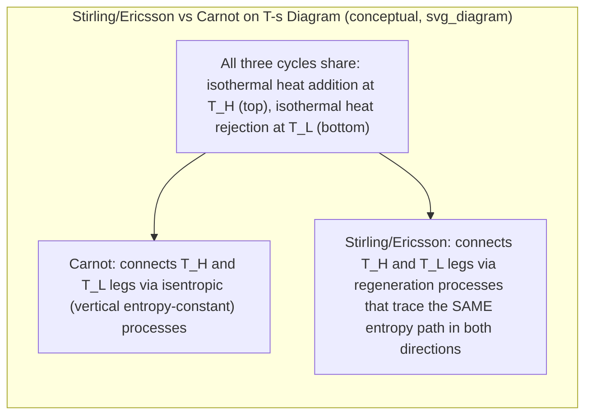

## The Stirling and Ericsson Cycles

### Overview

The Stirling and Ericsson cycles are idealized gas power cycles notable for achieving the same thermal efficiency as the Carnot cycle when operating between the same two temperature limits — a result not achieved by the Otto, Diesel, or Dual cycles. Both cycles accomplish this through the use of **regeneration**, an internal heat-exchange process that recovers and reuses heat within the cycle itself, allowing heat addition and rejection to occur entirely at the two extreme (maximum and minimum) temperatures, mimicking the Carnot cycle's defining characteristic.

### The Stirling Cycle

**Process Description**

| Process | Description |
| --- | --- |
| 1 → 2 | Isothermal heat addition (at $T_H$, maximum temperature) |
| 2 → 3 | Constant-volume regeneration (internal heat transfer, temperature drops from $T_H$ to $T_L$) |
| 3 → 4 | Isothermal heat rejection (at $T_L$, minimum temperature) |
| 4 → 1 | Constant-volume regeneration (internal heat transfer, temperature rises from $T_L$ to $T_H$) |

**[Confirmed]** The two constant-volume processes are not heat-addition or heat-rejection processes exchanging heat with external reservoirs — instead, they involve heat being transferred internally within the cycle, from the working fluid during process 2→3 (as it cools) to the working fluid during process 4→1 (as it is reheated), via an internal component called a **regenerator**.

### The Ericsson Cycle

**Process Description**

| Process | Description |
| --- | --- |
| 1 → 2 | Isothermal heat addition (at $T_H$) |
| 2 → 3 | Constant-pressure regeneration (temperature drops from $T_H$ to $T_L$) |
| 3 → 4 | Isothermal heat rejection (at $T_L$) |
| 4 → 1 | Constant-pressure regeneration (temperature rises from $T_L$ to $T_H$) |

**[Confirmed]** The Ericsson cycle is structurally analogous to the Stirling cycle, with the key distinction that the regeneration processes occur at **constant pressure** rather than constant volume.

### T-s Diagram Comparison: Stirling, Ericsson, and Carnot

**[Confirmed]** On a T-s diagram, the Stirling and Ericsson cycles appear as a **rectangle** — identical in shape to the Carnot cycle's rectangular T-s representation — because both isothermal processes occur at constant temperature (horizontal lines on a T-s diagram) and both regeneration processes trace the exact same path in T-s space in both directions (since the heat given up during cooling in one regeneration leg is precisely the heat picked up during heating in the other, ideally with zero net entropy generation in an ideal regenerator).

### SVG: T-s Diagram of the Stirling Cycle

<svg xmlns="http://www.w3.org/2000/svg" viewBox="0 0 640 420">
<text x="320" y="24" font-size="16" text-anchor="middle" font-family="sans-serif" font-weight="bold">Stirling Cycle on T-s Diagram (svg_diagram)</text>

<line x1="90" y1="360" x2="580" y2="360" stroke="black" stroke-width="2" />
<line x1="90" y1="360" x2="90" y2="60" stroke="black" stroke-width="2" />
<text x="335" y="390" font-size="14" text-anchor="middle" font-family="sans-serif">Entropy, s</text>
<text x="45" y="210" font-size="14" text-anchor="middle" font-family="sans-serif" transform="rotate(-90 45 210)">Temperature, T</text>

<line x1="180" y1="100" x2="450" y2="100" stroke="red" stroke-width="2" />
<text x="250" y="90" font-size="12" fill="red" font-family="sans-serif">1→2: Isothermal heat addition (T_H)</text>
<line x1="450" y1="100" x2="450" y2="300" stroke="green" stroke-width="2" stroke-dasharray="6,3" />
<text x="460" y="200" font-size="12" fill="green" font-family="sans-serif">2→3: Regeneration (cooling)</text>
<line x1="450" y1="300" x2="180" y2="300" stroke="blue" stroke-width="2" />
<text x="230" y="320" font-size="12" fill="blue" font-family="sans-serif">3→4: Isothermal heat rejection (T_L)</text>
<line x1="180" y1="300" x2="180" y2="100" stroke="purple" stroke-width="2" stroke-dasharray="6,3" />
<text x="90" y="200" font-size="12" fill="purple" font-family="sans-serif">4→1: Regeneration (heating)</text>
<circle cx="180" cy="100" r="4" fill="black" />
<text x="160" y="90" font-size="11" font-family="sans-serif">1</text>
<circle cx="450" cy="100" r="4" fill="black" />
<text x="460" y="90" font-size="11" font-family="sans-serif">2</text>
<circle cx="450" cy="300" r="4" fill="black" />
<text x="460" y="315" font-size="11" font-family="sans-serif">3</text>
<circle cx="180" cy="300" r="4" fill="black" />
<text x="160" y="315" font-size="11" font-family="sans-serif">4</text>
</svg>

### The Role of the Regenerator

**Concept**

A regenerator is a thermal storage device (often a matrix of metal mesh, wires, or porous material with high heat capacity) placed within the working fluid flow path. It temporarily absorbs and stores heat rejected by the working fluid during one process, then releases that same heat back to the working fluid during a later process in the cycle.

**Ideal Regenerator Assumption**

**[Confirmed]** For the Stirling and Ericsson cycles to achieve Carnot-equivalent efficiency, the regenerator must operate with 100% effectiveness — meaning it transfers exactly the amount of heat rejected during the cooling regeneration leg back to the working fluid during the heating regeneration leg, with no external heat loss and no finite-temperature-difference irreversibility. Under this ideal assumption, no external heat transfer occurs during the regeneration processes, only heat addition (at $T_H$) and heat rejection (at $T_L$) require external heat exchange with the two thermal reservoirs.

### Thermal Efficiency

**[Confirmed]** Under the ideal regenerator assumption, both the Stirling and Ericsson cycles achieve:

$$\boxed{\eta_{th,Stirling} = \eta_{th,Ericsson} = \eta_{th,Carnot} = 1 - \frac{T_L}{T_H}}$$

This equality arises because, with perfect regeneration, all external heat transfer occurs isothermally at exactly $T_H$ (addition) and exactly $T_L$ (rejection) — the same two-temperature heat-exchange condition that defines Carnot cycle efficiency, regardless of the specific processes (isentropic for Carnot, constant-volume or constant-pressure regeneration for Stirling/Ericsson) connecting the two isothermal legs.

### Worked Example

**Given:** A Stirling cycle engine operates with $T_H = 900\ \text{K}$ and $T_L = 300\ \text{K}$, using an ideal regenerator.

**Thermal Efficiency:**

$$\eta_{th} = 1 - \frac{T_L}{T_H} = 1 - \frac{300}{900} = 1 - 0.3333 = 0.6667 = 66.7\%$$

**Comparison with Carnot Cycle at the same temperature limits:**

$$\eta_{th,Carnot} = 1 - \frac{300}{900} = 66.7\%$$

The results are identical, confirming the theoretical equivalence between the ideal Stirling cycle and the Carnot cycle operating between the same two temperature reservoirs.

**[Inference]** This result assumes a perfectly effective (100%) regenerator with no heat loss to the surroundings, no pressure drop through the regenerator matrix, and no other internal irreversibilities; achieving this ideal performance in a physical device is not possible, so this efficiency represents a theoretical upper bound analogous to the Carnot cycle's own idealized, unachievable status as a practical engine benchmark.

### Practical Realization: Real Stirling Engines

**[Confirmed]** Unlike the Carnot cycle (which has never been practically realized as a working engine due to the impracticality of purely isentropic and isothermal heat-transfer processes at finite power output), the **Stirling engine** is a real, physically constructed and operating type of external combustion engine based on the Stirling cycle principle, historically dating to Robert Stirling's original 1816 patent.

**Key Features of Real Stirling Engines:**

- External heat source: heat is supplied from outside the working fluid's containment (unlike internal combustion engines), allowing flexibility in heat source (can use combustion of virtually any fuel, concentrated solar heat, radioisotope decay heat, or waste heat).
- Closed-cycle operation: the same working fluid (often helium, hydrogen, or air) is repeatedly cycled rather than being exhausted and replaced.
- Real regenerators achieve high but imperfect effectiveness (not 100%), and real engines experience friction, imperfect heat transfer rates (finite-time, finite-temperature-difference heat exchange), and mechanical losses.
- **[Inference]** Real Stirling engines achieve efficiencies well below the ideal cycle prediction, though specific achieved efficiencies vary substantially by design (kinematic vs. free-piston configurations, working fluid choice, operating temperature range, and heat exchanger design), so no single efficiency figure should be treated as representative of all Stirling engine implementations; efficiency data for specific engine designs should be obtained from manufacturer or published test specifications.

**Applications:**

- **[Inference]** Modern and historical applications of Stirling engines include certain submarine propulsion systems (air-independent propulsion), some concentrated solar power (dish-Stirling) systems, select combined heat-and-power (CHP) micro-generation units, and specialized applications such as cryocoolers (a reversed Stirling cycle used for refrigeration/cooling rather than power production) — but Stirling engines have not achieved widespread mainstream adoption for general power generation, largely due to challenges in achieving high specific power output, cost-competitive manufacturing, and durable, effective regenerator and seal designs at commercial scale.

### The Ericsson Cycle: Practical Note

**[Confirmed]** The Ericsson cycle, proposed by John Ericsson, shares the same theoretical Carnot-equivalent efficiency result as the Stirling cycle but uses constant-pressure regeneration instead of constant-volume regeneration.

**[Inference]** The Ericsson cycle is generally considered to be conceptually related to certain closed-cycle gas turbine configurations employing intercooling, reheating, and regeneration (which similarly aim to approach isothermal-like compression and expansion through multi-stage intercooled compression and reheated expansion, combined with regenerative heat exchange) — this connection is often noted in thermodynamics textbooks as an educational bridge between the idealized Ericsson cycle and practical multi-stage gas turbine cycle improvements (see Brayton Cycle with Intercooling, Reheating, and Regeneration), though a real closed Ericsson-cycle engine akin to the physically-realized Stirling engine is much less common in practice.

### Comparative Summary Table

| Feature | Stirling Cycle | Ericsson Cycle | Carnot Cycle |
| --- | --- | --- | --- |
| Heat addition process | Isothermal | Isothermal | Isothermal |
| Heat rejection process | Isothermal | Isothermal | Isothermal |
| Connecting processes | Constant volume (regeneration) | Constant pressure (regeneration) | Isentropic |
| Requires regenerator | Yes | Yes | No |
| Ideal thermal efficiency | $1 - T_L/T_H$ | $1 - T_L/T_H$ | $1 - T_L/T_H$ |
| Physically realized as an engine | Yes (Stirling engines) | Rarely as a direct implementation | No (theoretical benchmark only) |

### Why Regeneration Enables Carnot-Equivalent Efficiency

**[Confirmed]** The key insight is that regeneration eliminates the need for external heat exchange during the two connecting processes (constant volume for Stirling, constant pressure for Ericsson), confining all *external* heat transfer to the two isothermal legs at $T_H$ and $T_L$. Since Carnot efficiency depends only on the temperatures at which external heat is added and rejected — not on the specific processes connecting those two isothermal legs — any cycle that manages to add and reject heat entirely at $T_H$ and $T_L$ (with no external heat transfer elsewhere) will match Carnot efficiency between those limits, regardless of the intermediate process shapes.

### Common Mistakes and Clarifications

- **Assuming Stirling/Ericsson cycles are impractical like Carnot:** Unlike the Carnot cycle, the Stirling cycle has been successfully implemented in real, functioning engines (Stirling engines) for over two centuries, even though achieving the full ideal efficiency remains impossible in practice due to imperfect regeneration and other real-world losses.
- **Forgetting the regenerator's role is internal, not an external heat sink or source:** The heat exchanged during the regeneration legs (2→3 and 4→1) does not count toward $q_{in}$ or $q_{out}$ in the external heat-transfer sense — it's internally recycled, which is precisely why these processes don't detract from the ideal efficiency the way an inefficient external heat-rejection process would.
- **Confusing regenerator effectiveness with cycle efficiency:** A regenerator's effectiveness (how much of the ideal heat transfer it actually achieves, typically expressed as a percentage) is a separate metric from overall cycle thermal efficiency; a real engine with a regenerator of less than 100% effectiveness will have both external heat transfer occurring at non-ideal locations *and* reduced overall efficiency compared to the idealized cycle prediction.
- **Assuming any regenerative gas turbine is "an Ericsson cycle engine":** While closed-cycle regenerative gas turbines with intercooling and reheating conceptually approach Ericsson cycle behavior as the number of intercooling/reheating stages increases toward infinity, a standard single-stage regenerative Brayton cycle gas turbine (see Brayton Cycle chapter topics) is a related but distinct, less idealized cycle and should not be equated directly with the Ericsson cycle itself.

**Next Steps**

- The Carnot Cycle Applied to Gas Power Systems
- The Brayton Cycle (Gas Turbines)
- Brayton Cycle with Intercooling, Reheating, and Regeneration
- Regenerator Effectiveness in Gas Turbine Cycles
- Stirling Engine Design Configurations (Alpha, Beta, Gamma)
- Concentrated Solar Power: Dish-Stirling Systems
- Cryocoolers (Reversed Stirling Cycle Applications)