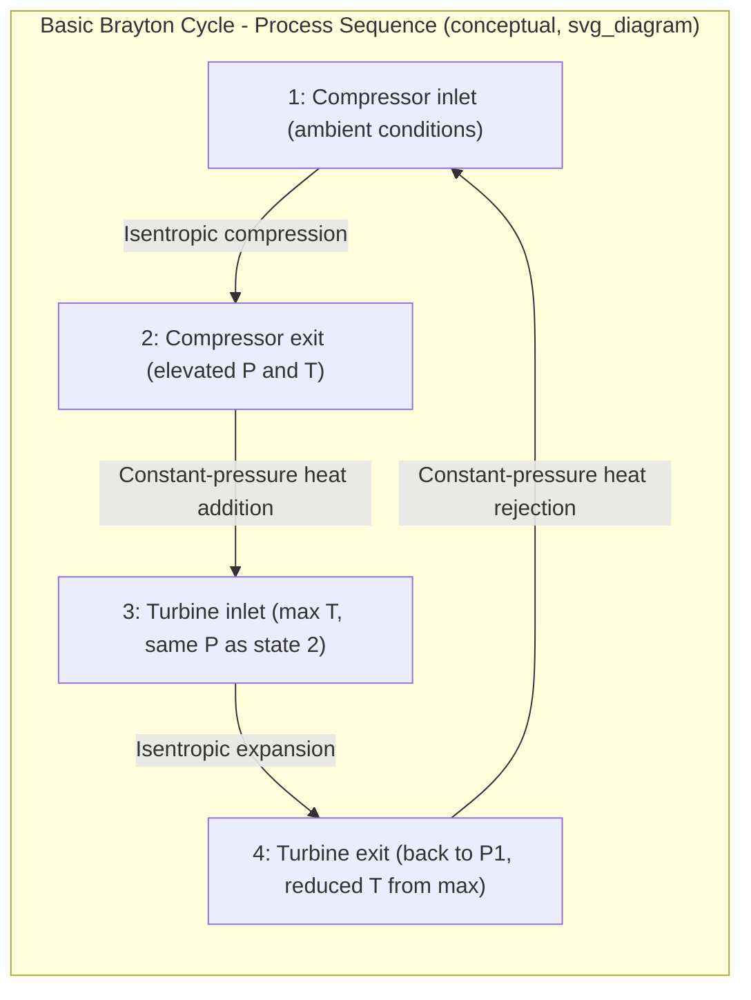

## The Brayton Cycle

### Overview

The Brayton cycle is the idealized air-standard cycle that models gas turbine engines, used in aircraft propulsion, land-based power generation, and marine propulsion. Unlike the Otto and Diesel cycles (which model reciprocating piston engines with constant-volume or constant-pressure heat addition and volume-based compression ratios), the Brayton cycle involves continuous-flow compression and expansion through rotating turbomachinery (compressors and turbines), with heat addition and rejection both occurring at **constant pressure**.

### Basic Brayton Cycle Configuration

**Open vs. Closed Cycle Representation**

- **Open cycle (actual gas turbines):** Air is drawn from the atmosphere, compressed, mixed with fuel and combusted, expanded through the turbine, and exhausted back to the atmosphere — a genuinely open thermodynamic system.
- **Closed cycle (idealized, air-standard):** Applying air-standard assumptions (see Air-Standard Assumptions), the combustion process is replaced by an external constant-pressure heat-addition process, and the exhaust/intake process is replaced by an external constant-pressure heat-rejection process, closing the cycle for analysis purposes.

### Basic Brayton Cycle Processes

| Process | Description | Component |
| --- | --- | --- |
| 1 → 2 | Isentropic compression | Compressor |
| 2 → 3 | Constant-pressure heat addition | Combustor (replaces actual combustion) |
| 3 → 4 | Isentropic expansion | Turbine |
| 4 → 1 | Constant-pressure heat rejection | Replaces exhaust (or heat exchanger, if closed cycle) |

### T-s and P-v Diagram Representation

### SVG: T-s Diagram of the Basic Brayton Cycle

<svg xmlns="http://www.w3.org/2000/svg" viewBox="0 0 640 440">
<text x="320" y="24" font-size="16" text-anchor="middle" font-family="sans-serif" font-weight="bold">Basic Brayton Cycle on T-s Diagram (svg_diagram)</text>

<line x1="90" y1="380" x2="580" y2="380" stroke="black" stroke-width="2" />
<line x1="90" y1="380" x2="90" y2="60" stroke="black" stroke-width="2" />
<text x="335" y="410" font-size="14" text-anchor="middle" font-family="sans-serif">Entropy, s</text>
<text x="45" y="220" font-size="14" text-anchor="middle" font-family="sans-serif" transform="rotate(-90 45 220)">Temperature, T</text>

<circle cx="200" cy="340" r="5" fill="black" />
<text x="160" y="330" font-size="12" font-family="sans-serif">1</text>
<circle cx="200" cy="180" r="5" fill="black" />
<text x="160" y="170" font-size="12" font-family="sans-serif">2</text>
<circle cx="420" cy="90" r="5" fill="black" />
<text x="430" y="85" font-size="12" font-family="sans-serif">3</text>
<circle cx="420" cy="250" r="5" fill="black" />
<text x="430" y="245" font-size="12" font-family="sans-serif">4</text>

<line x1="200" y1="340" x2="200" y2="180" stroke="blue" stroke-width="2" />
<text x="80" y="260" font-size="11" fill="blue" font-family="sans-serif">1→2: Isentropic compression</text>
<path d="M 200 180 Q 300 130 420 90" stroke="red" stroke-width="2" fill="none" />
<text x="270" y="115" font-size="11" fill="red" font-family="sans-serif">2→3: Const.-P heat addition</text>
<line x1="420" y1="90" x2="420" y2="250" stroke="green" stroke-width="2" />
<text x="430" y="170" font-size="11" fill="green" font-family="sans-serif">3→4: Isentropic expansion</text>
<path d="M 420 250 Q 320 300 200 340" stroke="purple" stroke-width="2" fill="none" />
<text x="250" y="335" font-size="11" fill="purple" font-family="sans-serif">4→1: Const.-P heat rejection</text>
</svg>

### Key Parameter: Pressure Ratio

$$r_p = \frac{P_2}{P_1}$$

The pressure ratio (compressor pressure ratio) is the primary design parameter governing Brayton cycle thermal efficiency, playing an analogous role to compression ratio in the Otto cycle.

### Thermal Efficiency

**Heat Addition (2→3, constant pressure):**

$$q_{in} = c_p(T_3 - T_2)$$

**Heat Rejection (4→1, constant pressure):**

$$q_{out} = c_p(T_4 - T_1)$$

**Thermal Efficiency:**

$$\eta_{th} = 1 - \frac{q_{out}}{q_{in}} = 1 - \frac{T_4 - T_1}{T_3 - T_2}$$

Using the isentropic relations for processes 1→2 and 3→4 (both isentropic, connecting the same two pressure levels $P_1$ and $P_2$):

$$\frac{T_2}{T_1} = \left(\frac{P_2}{P_1}\right)^{(k-1)/k} = r_p^{(k-1)/k}$$

Substituting and simplifying:

$$\boxed{\eta_{th,Brayton} = 1 - \frac{1}{r_p^{(k-1)/k}}}$$

**[Confirmed]** This closed-form expression, analogous in structure to the Otto cycle efficiency formula, shows that under cold-air-standard assumptions, Brayton cycle thermal efficiency depends **only** on the pressure ratio $r_p$ and specific heat ratio $k$ — independent of the maximum cycle temperature or the amount of heat added, a directly derived mathematical consequence of the isentropic relations combined with the first law applied to the four defined processes.

### Effect of Pressure Ratio on Efficiency

| Pressure Ratio $r_p$ | $\eta_{th}$ (with $k=1.4$) |
| --- | --- |
| 5 | 36.9% |
| 10 | 48.2% |
| 15 | 53.9% |
| 20 | 57.6% |
| 25 | 60.3% |

**[Confirmed]** Efficiency increases monotonically with pressure ratio, with diminishing returns at higher $r_p$, mirroring the mathematical behavior seen in the Otto cycle's dependence on compression ratio.

### Back-Work Ratio: A Distinguishing Feature of the Brayton Cycle

**[Confirmed]** A defining characteristic of gas turbine (Brayton) cycles, not shared by reciprocating engine cycles like Otto or Diesel, is that a substantial fraction of the turbine's work output is consumed internally by the compressor, since compressing a gas requires significantly more specific work than compressing a liquid (as in the Rankine cycle's pump) due to the much larger specific volume of gases.

**Back-Work Ratio (BWR):**

$$BWR = \frac{w_{compressor,in}}{w_{turbine,out}}$$

**[Confirmed]** Typical back-work ratios for gas turbines are considerably higher than the equivalent ratio in vapor power cycles (where pump work is typically only 1-2% of turbine work) — gas turbine back-work ratios commonly range from roughly 40% to 80% of gross turbine output, meaning a large fraction of the turbine's gross work output must be diverted just to drive the compressor, leaving a comparatively small net work output relative to the gross work produced by the turbine.

**Practical Implication:** This high back-work ratio makes gas turbine cycle net work and efficiency considerably more sensitive to compressor and turbine isentropic efficiencies than vapor power cycles are to pump efficiency, since even modest inefficiencies in either turbomachine are amplified when subtracting two large, comparable-magnitude work terms to obtain a smaller net result.

### Worked Example

**Given:** A Brayton cycle has a pressure ratio $r_p = 8$. Air enters the compressor at $T_1 = 300\ \text{K}$, $P_1 = 100\ \text{kPa}$. Turbine inlet temperature is $T_3 = 1300\ \text{K}$. Use cold-air-standard properties: $k=1.4$, $c_p = 1.005\ \text{kJ/kg·K}$.

**Step 1 — Temperature after isentropic compression:**

$$T_2 = T_1 \, r_p^{(k-1)/k} = 300 \times 8^{0.2857} = 300 \times 1.8114 = 543.4\ \text{K}$$

**Step 2 — Temperature after isentropic expansion (same pressure ratio):**

$$T_4 = \frac{T_3}{r_p^{(k-1)/k}} = \frac{1300}{1.8114} = 717.6\ \text{K}$$

**Step 3 — Compressor work input:**

$$w_{C,in} = c_p(T_2 - T_1) = 1.005 \times (543.4 - 300) = 1.005 \times 243.4 = 244.6\ \text{kJ/kg}$$

**Step 4 — Turbine work output:**

$$w_{T,out} = c_p(T_3 - T_4) = 1.005 \times (1300 - 717.6) = 1.005 \times 582.4 = 585.3\ \text{kJ/kg}$$

**Step 5 — Net work:**

$$w_{net} = w_{T,out} - w_{C,in} = 585.3 - 244.6 = 340.7\ \text{kJ/kg}$$

**Step 6 — Back-work ratio:**

$$BWR = \frac{244.6}{585.3} = 0.4179 = 41.8\%$$

**Step 7 — Heat input:**

$$q_{in} = c_p(T_3 - T_2) = 1.005 \times (1300 - 543.4) = 1.005 \times 756.6 = 760.4\ \text{kJ/kg}$$

**Step 8 — Thermal efficiency:**

$$\eta_{th} = \frac{w_{net}}{q_{in}} = \frac{340.7}{760.4} = 0.4481 = 44.8\%$$

**Verification using the closed-form formula:**

$$\eta_{th} = 1 - \frac{1}{r_p^{(k-1)/k}} = 1 - \frac{1}{1.8114} = 1 - 0.5520 = 0.4480 = 44.8\%$$

The two methods agree, confirming consistency.

### Optimum Pressure Ratio for Maximum Net Work

**[Confirmed]** For a fixed compressor inlet temperature $T_1$ and fixed turbine inlet temperature $T_3$, there exists a specific pressure ratio that **maximizes net work output** (as opposed to maximizing thermal efficiency, which increases monotonically with $r_p$ and has no interior maximum). This distinction between efficiency-maximizing and work-maximizing pressure ratios is unique to the Brayton cycle among the basic air-standard cycles.

$$r_{p,opt} = \left(\frac{T_3}{T_1}\right)^{\frac{k}{2(k-1)}}$$

**[Confirmed]** This result arises because, while efficiency (a ratio of work to heat) continues improving at all higher $r_p$, net specific work (a difference of two increasing quantities, turbine work and compressor work) reaches a maximum at an intermediate pressure ratio, since compressor work increases at higher $r_p$ toward eventually consuming an increasingly large share of turbine output.

**Worked Sub-Example — Optimum Pressure Ratio:**

Using the same conditions as above ($T_1 = 300\ \text{K}$, $T_3 = 1300\ \text{K}$, $k=1.4$):

$$r_{p,opt} = \left(\frac{1300}{300}\right)^{\frac{1.4}{2(0.4)}} = (4.333)^{1.75}$$

$$r_{p,opt} = 4.333^{1.75} \approx 10.85$$

**[Inference]** This indicates that for this specific $T_1$/$T_3$ combination, a pressure ratio near 10.85 would maximize net specific work output, which differs from (and is generally lower than) the pressure ratio that would continue to increase thermal efficiency indefinitely — practical gas turbine designs must balance this trade-off, often favoring higher pressure ratios for efficiency in stationary power generation while other applications may prioritize specific power output (work per unit mass flow) more heavily, since higher specific work reduces the required mass flow rate (and thus engine/equipment size) for a given power output.

### Deviation of Actual Gas Turbine Cycles from the Ideal

**[Confirmed]** Real gas turbines deviate from the ideal Brayton cycle due to:

- **Compressor and turbine irreversibilities**, quantified via isentropic efficiencies analogous to those discussed for vapor power cycle turbines and pumps (see Actual Vapor Power Cycles and Component Irreversibilities), typically expressed as $\eta_C$ and $\eta_T$.
- **Pressure drops** in the combustor and ducting, reducing the effective pressure ratio available to the turbine relative to the compressor's output pressure.
- **Variable specific heats**, since actual combustion gas temperatures at turbine inlet are far above room temperature, making the cold-air-standard assumption progressively less accurate at the high temperatures typical of modern gas turbines (often 1300–1700 K turbine inlet temperature in advanced designs).

**[Inference]** Modern industrial and aeroderivative gas turbines commonly report simple-cycle thermal efficiencies in the range of roughly 35–42%, considerably influenced by turbine inlet temperature capability (often limited by blade materials and cooling technology) and compressor/turbine component efficiencies achieved through modern aerodynamic design; exact efficiency figures are manufacturer- and model-specific and should be obtained from published performance specifications rather than assumed from the idealized cycle analysis alone.

### Modifications to Improve Brayton Cycle Performance

Several established modifications improve upon the basic Brayton cycle, each addressed in more detail in dedicated topics:

- **Regeneration:** Uses turbine exhaust heat (which is still relatively hot) to preheat compressor discharge air before it enters the combustor, reducing required fuel heat input for a given turbine inlet temperature.
- **Intercooling:** Splits compression into multiple stages with cooling between stages, reducing total compressor work input (since cooler air requires less work to compress to a given pressure).
- **Reheating:** Splits expansion into multiple turbine stages with reheating (additional heat addition) between stages, increasing total turbine work output.
- **Combined intercooling, reheating, and regeneration:** Used together, these modifications can substantially increase both net work output and thermal efficiency relative to the basic Brayton cycle, approaching the theoretical Ericsson cycle behavior as the number of intercooling/reheating stages increases (see The Stirling and Ericsson Cycles).

### Common Mistakes and Clarifications

- **Confusing pressure ratio with compression ratio:** The Brayton cycle's defining parameter is the **pressure ratio** $r_p = P_2/P_1$ (since compression and expansion occur through continuous-flow turbomachinery, not piston displacement), whereas the Otto/Diesel cycles use a **volume-based compression ratio** $r = v_1/v_2$. These are conceptually parallel but numerically and physically distinct parameters.
- **Assuming higher pressure ratio always means better performance:** While thermal efficiency increases monotonically with $r_p$, net specific work output does not — it peaks at an intermediate optimum pressure ratio (as derived above), so pressure ratio selection in real gas turbine design involves balancing efficiency, specific work, and other practical constraints (compressor stage count, turbine blade cooling requirements, cost).
- **Neglecting the significance of back-work ratio:** Unlike vapor power cycles where pump work is nearly negligible, Brayton cycle net work and efficiency are strongly sensitive to compressor and turbine component efficiencies precisely because of the high back-work ratio; small percentage-point changes in either component's isentropic efficiency can produce disproportionately large changes in net cycle output.
- **Applying cold-air-standard results uncritically at high turbine inlet temperatures:** Modern gas turbines operate at turbine inlet temperatures far above the room-temperature basis of cold-air-standard properties; for accurate quantitative analysis at these conditions, variable specific heat data (ideal-gas air tables) should be used rather than the simple constant-$k$ formulas presented here for illustrative purposes.

**Next Steps**

- The Brayton Cycle with Regeneration
- Brayton Cycle with Intercooling, Reheating, and Regeneration
- Gas Turbines for Aircraft Propulsion (Jet Propulsion Cycles)
- Combined Gas-Steam (Combined Cycle) Power Plants
- Variable Specific Heat Analysis Using Ideal-Gas Air Tables
- Compressor and Turbine Isentropic Efficiency in Gas Turbine Cycles
- Second-Law (Exergy) Analysis of the Brayton Cycle