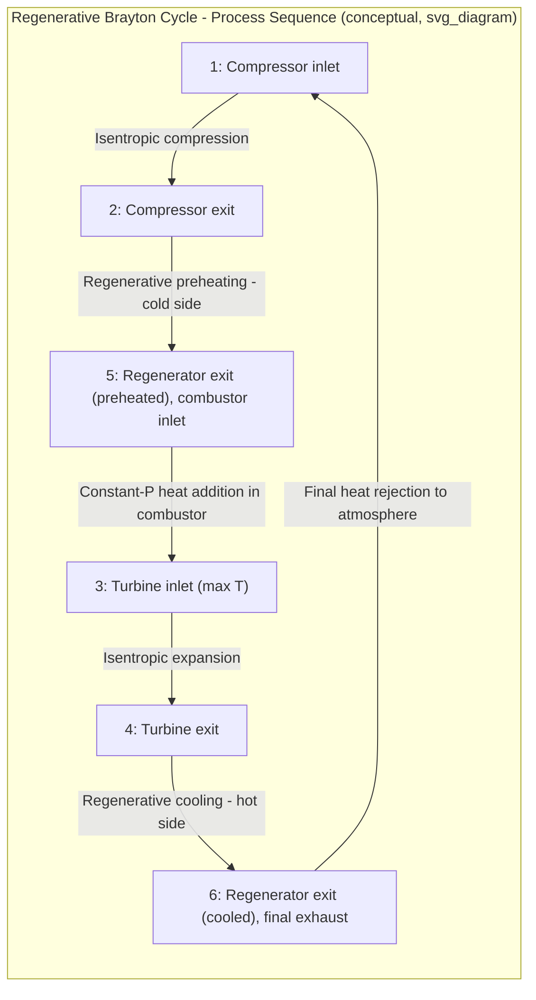
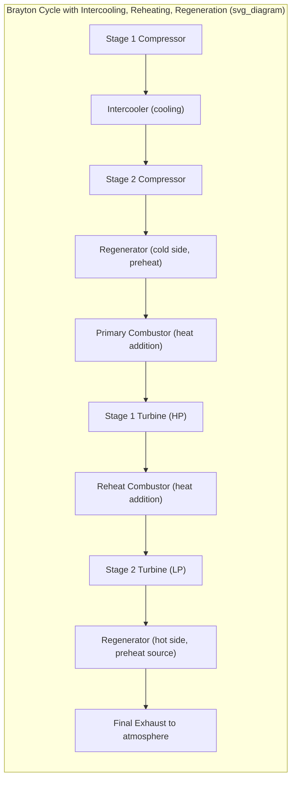

## Brayton Cycle with Regeneration, Intercooling, and Reheating

### Overview

The basic Brayton cycle can be substantially improved through three established modifications — regeneration, intercooling, and reheating — each targeting a different inefficiency in the basic cycle. Applied individually or in combination, these modifications increase thermal efficiency, net work output, or both, and collectively represent the conceptual bridge between the basic Brayton cycle and the theoretical Ericsson cycle limit (see The Stirling and Ericsson Cycles).

### Regeneration in the Brayton Cycle

**Motivation**

**[Confirmed]** In the basic Brayton cycle, turbine exhaust gas (state 4) is typically still considerably hotter than the compressor discharge air (state 2), since the turbine expands from a much higher temperature than the compressor's exit temperature at a comparable pressure ratio. This represents a recoverable temperature difference: rather than rejecting this heat directly to the atmosphere, it can be used to preheat compressor discharge air before it enters the combustor.

**Regenerator (Recuperator) Operation**

A regenerator is a heat exchanger that transfers heat from the hot turbine exhaust stream to the cooler compressor discharge stream, without the two streams mixing.

**Regenerator Effectiveness**

$$\varepsilon = \frac{q_{regen,actual}}{q_{regen,max}} = \frac{h_5 - h_2}{h_4 - h_2}$$

Where (using standard state numbering: 1=compressor inlet, 2=compressor exit, 5=regenerator exit on the cold side/combustor inlet, 4=turbine exit):

- $h_5$ = actual enthalpy of compressor discharge air after regenerative preheating
- $h_2$ = enthalpy of compressor discharge air before regeneration
- $h_4$ = enthalpy of turbine exhaust (maximum possible heat source temperature)

**[Confirmed]** Effectiveness values for real regenerators typically range from approximately 0.6 to 0.9 (60-90%), since achieving effectiveness closer to 1.0 (100%) requires increasingly large and costly heat exchanger surface area, representing a design trade-off between capital cost and efficiency benefit — the maximum theoretical effectiveness of 1.0 would require an infinitely large heat exchanger.

### Regenerative Brayton Cycle: Effect on Efficiency

$$\eta_{th,regen} = 1 - \left(\frac{T_1}{T_3}\right) r_p^{(k-1)/k}$$

**[Confirmed]** Unlike the basic Brayton cycle (where efficiency increases monotonically with pressure ratio), the regenerative Brayton cycle's efficiency formula shows that **efficiency decreases with increasing pressure ratio** for a fixed $T_1/T_3$ ratio, because higher pressure ratios raise compressor discharge temperature $T_2$ closer to turbine exhaust temperature $T_4$, reducing the temperature difference available for regeneration and therefore its benefit.

**Practical Implication:** Regeneration is most beneficial at **lower** pressure ratios, where the temperature gap between $T_2$ and $T_4$ remains large; at sufficiently high pressure ratios, $T_2$ can approach or even exceed $T_4$, at which point regeneration provides no benefit or is not physically possible (since heat cannot flow from a cooler to a hotter stream).

### T-s Diagram: Regenerative Brayton Cycle

### SVG: T-s Diagram Showing Regeneration Region

<svg xmlns="http://www.w3.org/2000/svg" viewBox="0 0 640 440">
<text x="320" y="24" font-size="16" text-anchor="middle" font-family="sans-serif" font-weight="bold">Regenerative Brayton Cycle on T-s Diagram (svg_diagram)</text>
<line x1="90" y1="380" x2="580" y2="380" stroke="black" stroke-width="2" />
<line x1="90" y1="380" x2="90" y2="60" stroke="black" stroke-width="2" />
<text x="335" y="410" font-size="14" text-anchor="middle" font-family="sans-serif">Entropy, s</text>
<text x="45" y="220" font-size="14" text-anchor="middle" font-family="sans-serif" transform="rotate(-90 45 220)">Temperature, T</text>
<circle cx="200" cy="340" r="5" fill="black" />
<text x="160" y="330" font-size="12" font-family="sans-serif">1</text>
<circle cx="200" cy="230" r="5" fill="black" />
<text x="160" y="220" font-size="12" font-family="sans-serif">2</text>
<circle cx="200" cy="150" r="5" fill="black" />
<text x="150" y="145" font-size="12" font-family="sans-serif">5 (preheated)</text>
<circle cx="420" cy="90" r="5" fill="black" />
<text x="430" y="85" font-size="12" font-family="sans-serif">3</text>
<circle cx="420" cy="190" r="5" fill="black" />
<text x="430" y="185" font-size="12" font-family="sans-serif">4</text>
<circle cx="420" cy="280" r="5" fill="black" />
<text x="430" y="295" font-size="12" font-family="sans-serif">6 (cooled)</text>
<line x1="200" y1="340" x2="200" y2="230" stroke="blue" stroke-width="2" />
<line x1="200" y1="230" x2="200" y2="150" stroke="orange" stroke-width="2" stroke-dasharray="5,3" />
<text x="205" y="195" font-size="10" fill="orange" font-family="sans-serif">Regen preheat</text>
<path d="M 200 150 Q 300 110 420 90" stroke="red" stroke-width="2" fill="none" />
<line x1="420" y1="90" x2="420" y2="190" stroke="green" stroke-width="2" />
<line x1="420" y1="190" x2="420" y2="280" stroke="orange" stroke-width="2" stroke-dasharray="5,3" />
<text x="430" y="240" font-size="10" fill="orange" font-family="sans-serif">Regen cooling</text>
<path d="M 420 280 Q 320 320 200 340" stroke="purple" stroke-width="2" fill="none" />

<text x="90" y="410" font-size="11" fill="gray" font-family="sans-serif">Orange dashed segments: internal heat exchange within regenerator</text>

</svg>

### Intercooling

**Motivation**

**[Confirmed]** Compressor work input increases with the temperature of the gas being compressed, since specific work for a given pressure ratio scales with inlet temperature for an isentropic (or polytropic) compression process. By cooling the working fluid partway through compression (between stages), subsequent compression work is reduced, decreasing total compressor work input for a given overall pressure ratio.

**Multi-Stage Compression with Intercooling**

- Compression is split into two (or more) stages with an intercooler (heat exchanger, often cooled by ambient air or water) placed between stages.
- The intercooler cools the partially compressed gas back down, ideally to (or close to) the original compressor inlet temperature $T_1$, before it enters the next compression stage.

**Optimal Intercooling Pressure**

**[Confirmed]** For two-stage compression with intercooling to the same inlet temperature, minimum total compressor work is achieved when the pressure ratio is split **equally** between the two stages:

$$\frac{P_x}{P_1} = \frac{P_2}{P_x} \implies P_x = \sqrt{P_1 P_2}$$

Where $P_x$ is the intermediate (intercooling) pressure.

**Effect on Net Work and Efficiency**

**[Confirmed]** Intercooling **increases net work output** (by reducing compressor work), but considered alone (without also adding regeneration), intercooling actually **decreases thermal efficiency** — because while less work is required to compress, more heat must be added in the combustor to reach the same turbine inlet temperature $T_3$ from a lower post-intercooling compressor discharge temperature, and this heat addition penalty typically outweighs the work-input benefit in terms of the efficiency ratio.

**[Inference]** This counterintuitive efficiency result (intercooling alone reduces efficiency despite increasing net work) is a commonly emphasized teaching point in gas turbine cycle analysis, precisely because it illustrates that intercooling's primary benefit in isolation is increased specific work output (useful for reducing engine size for a given power output) rather than improved thermal efficiency; the combination with regeneration is what restores and typically improves overall efficiency, as discussed below.

### Reheating

**Motivation**

**[Confirmed]** Analogous to intercooling on the compression side, reheating on the expansion side splits turbine expansion into two (or more) stages, with a reheat combustor between stages adding heat to raise the gas temperature back up before further expansion. Since turbine specific work output for a given pressure ratio increases with the temperature of the gas being expanded, reheating between turbine stages increases the total specific work extracted for the same overall pressure ratio.

**Optimal Reheat Pressure**

**[Confirmed]** For two-stage expansion with reheating back to the same maximum temperature $T_3$, maximum total turbine work is achieved when the pressure ratio is split **equally** between the two stages:

$$\frac{P_3}{P_y} = \frac{P_y}{P_4} \implies P_y = \sqrt{P_3 P_4}$$

Where $P_y$ is the intermediate (reheat) pressure.

**Effect on Net Work and Efficiency**

**[Confirmed]** Similarly to intercooling, reheating alone **increases net work output** (by increasing total turbine work), but considered in isolation, reheating **decreases thermal efficiency**, since more total heat must be added (both in the primary combustor and the reheat combustor) to achieve the increased work output, and this additional heat requirement outweighs the increased work benefit in the efficiency ratio.

### The Combination: Intercooling + Reheating + Regeneration

**[Confirmed]** While intercooling alone and reheating alone both individually reduce thermal efficiency (despite each increasing net work), when **both are combined with regeneration**, the overall cycle can achieve **both increased net work output and increased thermal efficiency** simultaneously, relative to the basic Brayton cycle.

**Why the Combination Works**

- Intercooling reduces the compressor discharge temperature ($T_2$ becomes lower than in a single-stage compression to the same overall pressure ratio).
- Reheating increases the turbine exhaust temperature ($T_4$ becomes higher than in a single-stage expansion from the same overall pressure ratio).
- This combination **widens the temperature gap** between turbine exhaust and compressor discharge, which directly increases the potential benefit available from regeneration (since regenerator effectiveness and heat recovery both improve when there's a larger temperature difference to exploit).
- The additional heat recovered via regeneration offsets the increased heat-addition requirement that intercooling and reheating each individually introduce, allowing the combined cycle to realize both benefits.

### Cycle Diagram: Combined Configuration

### Limiting Case: Approaching the Ericsson Cycle

**[Confirmed]** As the number of intercooling stages during compression and reheating stages during expansion approaches infinity (with ideal, perfectly effective intercooling and reheating at every stage, and an ideally effective regenerator), the Brayton cycle with intercooling, reheating, and regeneration approaches the theoretical **Ericsson cycle** in the limit — compression approaches a fully isothermal process (via infinitely many infinitesimal compression-and-cooling steps), and expansion similarly approaches a fully isothermal process, matching the Ericsson cycle's structure of isothermal heat addition/rejection connected by constant-pressure regeneration legs (see The Stirling and Ericsson Cycles).

### Worked Example

**Given:** A gas turbine cycle uses two-stage compression with intercooling (overall pressure ratio 16, split equally), two-stage expansion with reheating (same overall pressure ratio, split equally), and an ideal regenerator ($\varepsilon = 1.0$, for illustrative simplicity). $T_1 = 300\ \text{K}$ (compressor inlet and intercooling return temperature), $T_3 = 1400\ \text{K}$ (turbine inlet and reheat return temperature). Use cold-air-standard properties: $k=1.4$, $c_p=1.005\ \text{kJ/kg·K}$.

**Step 1 — Stage pressure ratios:**

$$r_{p,stage} = \sqrt{16} = 4$$

**Step 2 — Compressor stage temperatures (equal work per stage, returning to $T_1$ after intercooling):**

$$T_2 = T_1 \, r_{p,stage}^{(k-1)/k} = 300 \times 4^{0.2857} = 300 \times 1.4860 = 445.8\ \text{K}$$

(Both compression stages have identical temperature rise, since each has the same pressure ratio and same inlet temperature after intercooling.)

**Total compressor work (two stages):**

$$w_{C,total} = 2 \times c_p(T_2 - T_1) = 2 \times 1.005 \times (445.8 - 300) = 2 \times 146.5 = 293.0\ \text{kJ/kg}$$

**Step 3 — Turbine stage temperatures (equal work per stage, returning to $T_3$ after reheat):**

$$T_4 = \frac{T_3}{r_{p,stage}^{(k-1)/k}} = \frac{1400}{1.4860} = 942.1\ \text{K}$$

**Total turbine work (two stages):**

$$w_{T,total} = 2 \times c_p(T_3 - T_4) = 2 \times 1.005 \times (1400-942.1) = 2 \times 460.2 = 920.4\ \text{kJ/kg}$$

**Step 4 — Net work:**

$$w_{net} = 920.4 - 293.0 = 627.4\ \text{kJ/kg}$$

**Step 5 — Heat input with ideal regeneration:**

With ideal regeneration, the regenerator raises the compressor discharge temperature ($T_2 = 445.8\ \text{K}$) up to the final turbine exhaust temperature ($T_4 = 942.1\ \text{K}$) before entering the primary combustor, and the reheat combustor separately adds heat between the two turbine stages.

$$q_{primary} = c_p(T_3 - T_4) = 1.005 \times (1400 - 942.1) = 460.2\ \text{kJ/kg}$$

(since with ideal regeneration, combustor inlet temperature equals $T_4$)

$$q_{reheat} = c_p(T_3 - T_x)$$

where $T_x$ is the HP turbine exit temperature, equal to $T_4$ by the equal-stage-work symmetry in this example, so:

$$q_{reheat} = c_p(1400 - 942.1) = 460.2\ \text{kJ/kg}$$

$$q_{in,total} = 460.2 + 460.2 = 920.4\ \text{kJ/kg}$$

**Step 6 — Thermal efficiency:**

$$\eta_{th} = \frac{w_{net}}{q_{in}} = \frac{627.4}{920.4} = 0.6816 = 68.2\%$$

**Comparison:** A basic (non-modified) Brayton cycle at the same overall pressure ratio ($r_p=16$) would achieve:

$$\eta_{th,basic} = 1 - \frac{1}{16^{0.2857}} = 1 - \frac{1}{2.2087} = 1-0.4527=0.5473=54.7\%$$

**[Inference]** This substantial efficiency improvement (68.2% vs. 54.7% in this idealized example) illustrates the significant theoretical benefit of combining intercooling, reheating, and (especially) regeneration, though this specific numerical comparison assumes an idealized regenerator with 100% effectiveness and equally split, ideal intercooling/reheating stages; real implementations with finite regenerator effectiveness (typically 60-90%) and real component irreversibilities would show a smaller, though still meaningful, efficiency improvement over the basic cycle.

### Practical Applications and Trade-offs

**[Confirmed]** Combined intercooled, reheated, and regenerative gas turbine cycles are used in certain industrial and marine gas turbine applications where the added complexity, weight, and cost of additional heat exchangers and multiple compression/expansion stages is justified by the efficiency and/or specific power benefits.

**[Inference]** These configurations are less common in aircraft propulsion applications, where weight and volume constraints heavily penalize the additional heat exchangers (intercoolers, reheat combustors, regenerators) required, making simpler cycle configurations generally preferred for that specific application; stationary power generation and certain marine propulsion applications are more tolerant of the added equipment mass and complexity, making them more common contexts for these advanced cycle configurations.

### Common Mistakes and Clarifications

- **Assuming intercooling or reheating alone improves efficiency:** Both modifications, applied individually without regeneration, actually *decrease* thermal efficiency despite increasing net work output — a frequently misunderstood point. The efficiency benefit only materializes when combined with regeneration.
- **Forgetting the equal-pressure-ratio-split rule is for minimum/maximum work, not maximum efficiency:** The equal-split rules for intercooling (minimizing compressor work) and reheating (maximizing turbine work) are optimality conditions for those specific individual objectives; the overall cycle efficiency optimization (considering regeneration as well) may call for different pressure-split choices in a more detailed, comprehensive optimization.
- **Assuming real regenerator effectiveness is 100%:** All formulas and examples using $\varepsilon = 1.0$ represent an idealized upper bound; real regenerator effectiveness (60-90%) should always be incorporated into practical cycle performance calculations via the regenerator effectiveness definition given above.
- **Neglecting that regeneration benefit shrinks at high pressure ratio:** As derived above, regenerative Brayton cycle efficiency actually *decreases* with increasing pressure ratio (opposite to the basic Brayton cycle's trend), so pairing regeneration with a very high pressure ratio design (chosen, e.g., to maximize basic-cycle efficiency) can be counterproductive if the higher pressure ratio eliminates the temperature gap regeneration depends on.

**Next Steps**

- The Brayton Cycle (Gas Turbines)
- The Stirling and Ericsson Cycles
- Combined Gas-Steam (Combined Cycle) Power Plants
- Regenerator Effectiveness and Heat Exchanger Sizing
- Gas Turbines for Aircraft Propulsion (Jet Propulsion Cycles)
- Second-Law (Exergy) Analysis of Advanced Brayton Cycle Configurations
- Compressor and Turbine Isentropic Efficiency in Multi-Stage Configurations