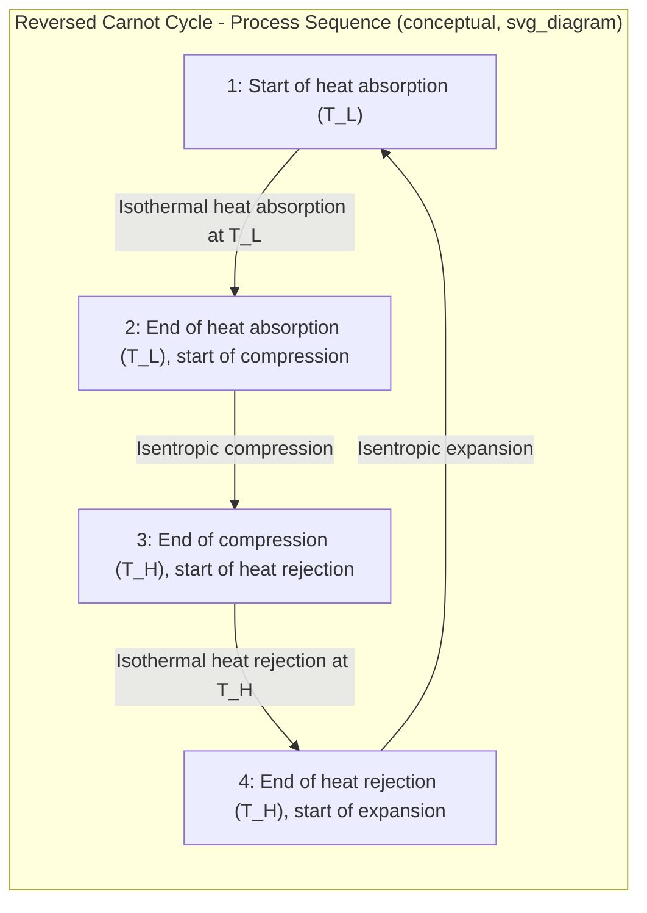

## The Reversed Carnot Cycle

### Overview

The reversed Carnot cycle is the Carnot cycle operated in the opposite direction — instead of producing net work by receiving heat from a high-temperature source and rejecting heat to a low-temperature sink, the reversed cycle **consumes** net work input to move heat from a low-temperature region to a high-temperature region. This is the theoretical ideal upon which refrigeration and heat pump cycle performance is benchmarked, playing the same idealized-upper-bound role for refrigeration cycles that the (forward) Carnot cycle plays for power cycles.

### The Direction Reversal

**[Confirmed]** Since all four processes of the Carnot cycle (isothermal heat addition, isentropic expansion, isothermal heat rejection, isentropic compression) are internally reversible, the entire cycle can be run in reverse: isentropic expansion becomes isentropic compression (and vice versa), and the heat that was added at high temperature is now rejected at high temperature, while the heat that was rejected at low temperature is now absorbed at low temperature. Net work, which was produced by the forward cycle, is now consumed by the reversed cycle.

### Reversed Carnot Cycle Processes

| Process | Description |
| --- | --- |
| 1 → 2 | Isothermal heat absorption at $T_L$ (from the refrigerated space or low-temperature reservoir) |
| 2 → 3 | Isentropic compression (temperature rises from $T_L$ to $T_H$) |
| 3 → 4 | Isothermal heat rejection at $T_H$ (to the high-temperature sink, e.g., ambient surroundings) |
| 4 → 1 | Isentropic expansion (temperature drops from $T_H$ to $T_L$) |

**[Confirmed]** This process sequence is the exact reverse of the forward Carnot power cycle's sequence, and traces the identical rectangular path on a T-s diagram, but traversed in the opposite (counterclockwise, when the forward cycle is clockwise) direction.

### T-s Diagram Representation

### SVG: T-s Diagram of the Reversed Carnot Cycle

<svg xmlns="http://www.w3.org/2000/svg" viewBox="0 0 640 420">
<text x="320" y="24" font-size="16" text-anchor="middle" font-family="sans-serif" font-weight="bold">Reversed Carnot Cycle on T-s Diagram (svg_diagram)</text>
<line x1="90" y1="360" x2="580" y2="360" stroke="black" stroke-width="2" />
<line x1="90" y1="360" x2="90" y2="60" stroke="black" stroke-width="2" />
<text x="335" y="390" font-size="14" text-anchor="middle" font-family="sans-serif">Entropy, s</text>
<text x="45" y="210" font-size="14" text-anchor="middle" font-family="sans-serif" transform="rotate(-90 45 210)">Temperature, T</text>
<line x1="180" y1="300" x2="450" y2="300" stroke="blue" stroke-width="2" />
<text x="220" y="320" font-size="12" fill="blue" font-family="sans-serif">1→2: Heat absorption (T_L)</text>
<line x1="450" y1="300" x2="450" y2="100" stroke="green" stroke-width="2" />
<text x="460" y="200" font-size="12" fill="green" font-family="sans-serif">2→3: Isentropic compression</text>
<line x1="450" y1="100" x2="180" y2="100" stroke="red" stroke-width="2" />
<text x="220" y="90" font-size="12" fill="red" font-family="sans-serif">3→4: Heat rejection (T_H)</text>
<line x1="180" y1="100" x2="180" y2="300" stroke="purple" stroke-width="2" />
<text x="90" y="200" font-size="12" fill="purple" font-family="sans-serif">4→1: Isentropic expansion</text>
<circle cx="180" cy="300" r="4" fill="black" />
<text x="160" y="315" font-size="11" font-family="sans-serif">1</text>
<circle cx="450" cy="300" r="4" fill="black" />
<text x="460" y="315" font-size="11" font-family="sans-serif">2</text>
<circle cx="450" cy="100" r="4" fill="black" />
<text x="460" y="90" font-size="11" font-family="sans-serif">3</text>
<circle cx="180" cy="100" r="4" fill="black" />
<text x="160" y="90" font-size="11" font-family="sans-serif">4</text>
</svg>

### Performance Metric: Coefficient of Performance (COP) — Not Efficiency

**[Confirmed]** Refrigeration and heat pump cycles are evaluated using **coefficient of performance (COP)** rather than thermal efficiency, because the desired output (heat transferred) can exceed the work input in magnitude — a ratio that would be nonsensical to call an "efficiency" (which conventionally cannot exceed 1 for a heat-engine-type ratio of useful output to input), but is entirely valid as a COP, which can and often does exceed 1.

**COP for Refrigeration (goal: remove heat from the cold space, $Q_L$):**

$$COP_R = \frac{Q_L}{W_{net,in}}$$

**COP for a Heat Pump (goal: deliver heat to the warm space, $Q_H$):**

$$COP_{HP} = \frac{Q_H}{W_{net,in}}$$

**Relationship Between the Two:**

$$COP_{HP} = COP_R + 1$$

**[Confirmed]** This relationship follows directly from the energy balance on the cycle ($Q_H = Q_L + W_{net,in}$), since dividing through by $W_{net,in}$ gives $COP_{HP} = COP_R + 1$ — a heat pump's COP is always exactly 1 greater than the refrigeration COP for the same cycle operating between the same two temperatures.

### Reversed Carnot Cycle COP

For the reversed Carnot cycle specifically, operating between temperatures $T_L$ and $T_H$:

$$\boxed{COP_{R,Carnot} = \frac{1}{T_H/T_L - 1} = \frac{T_L}{T_H - T_L}}$$

$$\boxed{COP_{HP,Carnot} = \frac{1}{1 - T_L/T_H} = \frac{T_H}{T_H - T_L}}$$

**[Confirmed]** These expressions represent the **maximum possible COP** achievable by any refrigeration or heat pump cycle operating between the same two fixed temperature limits $T_L$ and $T_H$ — directly analogous to how the forward Carnot cycle represents the maximum possible thermal efficiency between two temperature limits for a heat engine, this is a direct consequence of the second law of thermodynamics (specifically, the Carnot principles extended to refrigeration devices).

### Carnot Principles for Refrigeration Cycles

**[Confirmed]** Two key principles, analogous to the Carnot principles for heat engines, apply to refrigeration cycles:

1. The COP of an **irreversible** (real) refrigerator or heat pump is always less than the COP of a **reversible** (Carnot) refrigerator or heat pump operating between the same two temperature limits.
2. The COPs of all **reversible** refrigerators or heat pumps operating between the same two temperature limits are **equal**, regardless of the specific working fluid or cycle configuration details — this is why the reversed Carnot cycle COP formula, which depends only on $T_L$ and $T_H$, represents the universal upper bound for *any* reversible cycle between those temperatures, not merely for a cycle using a specific idealized process sequence.

### Effect of Temperature Difference on COP

**[Confirmed]** As the temperature difference $(T_H - T_L)$ decreases (i.e., the two reservoirs become closer in temperature), $COP_R$ and $COP_{HP}$ both increase without bound; conversely, as $(T_H - T_L)$ increases, COP decreases. This means refrigeration and heat pump systems become fundamentally less efficient (require more work input per unit of heat transferred) as they are required to maintain a larger temperature lift between the cold and hot reservoirs.

**Practical Implication:** This is why refrigeration and air conditioning systems become less efficient in more extreme ambient conditions (e.g., an air conditioner working harder, with reduced COP, on a very hot day when it must reject heat to a much hotter outdoor environment while maintaining the same cold indoor temperature), and why heat pump heating performance degrades in very cold climates (larger $T_H - T_L$ when outdoor temperature is far below the desired indoor temperature).

### Worked Example

**Given:** A reversed Carnot refrigerator maintains a refrigerated space at $T_L = 270\ \text{K}$ ($-3°C$) while rejecting heat to the surroundings at $T_H = 300\ \text{K}$ ($27°C$).

**Refrigeration COP:**

$$COP_R = \frac{T_L}{T_H - T_L} = \frac{270}{300-270} = \frac{270}{30} = 9.0$$

**Heat Pump COP (same cycle, opposite objective):**

$$COP_{HP} = COP_R + 1 = 9.0 + 1 = 10.0$$

**Verification using direct formula:**

$$COP_{HP} = \frac{T_H}{T_H-T_L} = \frac{300}{30} = 10.0$$

Consistent, as expected.

**Interpretation:** For every 1 kJ of work input, this ideal reversed Carnot refrigerator can remove 9 kJ of heat from the refrigerated space (if used as a refrigerator), or deliver 10 kJ of heat to a warm space (if used as a heat pump) — illustrating why COP values well above 1 are normal and expected for these devices, unlike thermal efficiency for heat engines.

### Worked Example — Effect of Increasing Temperature Lift

**Given:** The same refrigerator now must maintain $T_L = 250\ \text{K}$ (a colder, more demanding refrigeration target) while $T_H$ remains 300 K.

$$COP_R = \frac{250}{300-250} = \frac{250}{50} = 5.0$$

**Comparison:** COP dropped from 9.0 to 5.0 simply by lowering the target cold-space temperature by 20 K (increasing the temperature lift from 30 K to 50 K), illustrating the strong sensitivity of achievable COP to the required temperature span — this is a directly observable consequence of the COP formula's dependence on $(T_H - T_L)$ in the denominator.

### Why the Reversed Carnot Cycle Is Not Practically Implemented

**[Confirmed]** Just as the forward Carnot cycle is not used as a practical power cycle, the reversed Carnot cycle is not used as a practical refrigeration cycle, for closely related reasons:

- **Isothermal heat transfer processes require impractically slow operation** (or infinite heat exchanger area) to approach reversibility at finite heat transfer rates, since heat transfer at a finite rate across a finite temperature difference is inherently irreversible.
- **The isentropic compression process (2→3) is difficult to achieve practically when it must handle a two-phase (wet vapor) mixture**, since compressing a liquid-vapor mixture (rather than a single-phase vapor) is mechanically problematic for typical compressor designs (see below).
- **The isentropic expansion process (4→1)**, if implemented literally using a work-producing expansion device (such as a turbine), is generally impractical for the small-scale, intermittent nature of most refrigeration applications; a simple throttling valve is used instead in practical vapor-compression cycles, at the cost of introducing an irreversibility.

**[Confirmed]** These practical difficulties are precisely why the **vapor-compression refrigeration cycle** (using isentropic compression of superheated vapor only, constant-pressure heat rejection and absorption via phase change, and throttling instead of isentropic expansion) is used as the practical refrigeration cycle model, accepting some efficiency penalty relative to the ideal reversed Carnot cycle benchmark in exchange for mechanical practicality.

### Comparison Table: Reversed Carnot vs. Practical Vapor-Compression Cycle

| Feature | Reversed Carnot Cycle | Vapor-Compression Cycle |
| --- | --- | --- |
| Compression process | Isentropic compression of a two-phase mixture | Isentropic compression of superheated (or saturated) vapor only |
| Expansion process | Isentropic expansion (work-producing) | Throttling (irreversible, no work recovery) |
| Heat absorption | Isothermal (within two-phase region) | Constant pressure (isothermal within two-phase region, matches Carnot in this segment) |
| Heat rejection | Isothermal (within two-phase region) | Constant pressure (includes desuperheating, not purely isothermal) |
| COP | Maximum possible (theoretical benchmark) | Lower than reversed Carnot COP at same $T_L$, $T_H$ |
| Practical implementation | Not practically implemented | Standard practical refrigeration/AC/heat pump cycle |

### Role as a Benchmark

**[Confirmed]** Despite not being practically implemented, the reversed Carnot cycle serves an essential role as the theoretical performance benchmark against which real refrigeration and heat pump cycles (primarily the vapor-compression cycle) are compared, analogous to how the forward Carnot cycle benchmarks real heat engine and power cycle performance. A real cycle's COP relative to the reversed Carnot COP at the same temperature limits provides a measure of how closely the real cycle approaches the theoretical second-law limit.

### Common Mistakes and Clarifications

- **Calling COP an "efficiency":** COP is fundamentally different from thermal efficiency; it is a coefficient of performance that can and typically does exceed 1, whereas thermal efficiency (a heat engine metric) is always less than 1 for any real or ideal heat engine. Using the term "efficiency" for a refrigeration cycle's COP is a common but technically imprecise usage.
- **Confusing $COP_R$ and $COP_{HP}$:** These describe the same physical cycle evaluated against two different objectives (removing heat from a cold space vs. delivering heat to a warm space); always confirm which objective the question is asking about, since $COP_{HP}$ is always exactly 1 greater than $COP_R$ for the same cycle and temperatures.
- **Assuming COP increases without bound as work input increases:** COP is a fixed ratio determined by $T_L$ and $T_H$ for the reversed Carnot cycle (independent of the absolute magnitude of work input or heat transfer) — scaling up a Carnot refrigerator's size or work input does not change its COP, since COP depends only on the temperature limits, not on the scale of operation.
- **Assuming any reversible-looking refrigeration cycle achieves reversed Carnot COP:** Only a cycle operating with true isothermal heat transfer processes (heat transfer occurring at, or infinitesimally close to, the reservoir temperatures) and fully reversible compression/expansion achieves the reversed Carnot COP; real cycles with finite-temperature-difference heat exchange (evaporator/condenser operating below/above the reservoir temperatures to drive heat transfer) always achieve lower COP than the reversed Carnot benchmark at the same nominal reservoir temperatures.

**Next Steps**

- The Ideal Vapor-Compression Refrigeration Cycle
- Actual Vapor-Compression Cycles and Component Irreversibilities
- Second-Law Analysis of Refrigeration Cycles (Exergy Destruction)
- Heat Pump Systems and Applications
- Refrigerants and Their Thermodynamic Properties
- Cascade Refrigeration Systems