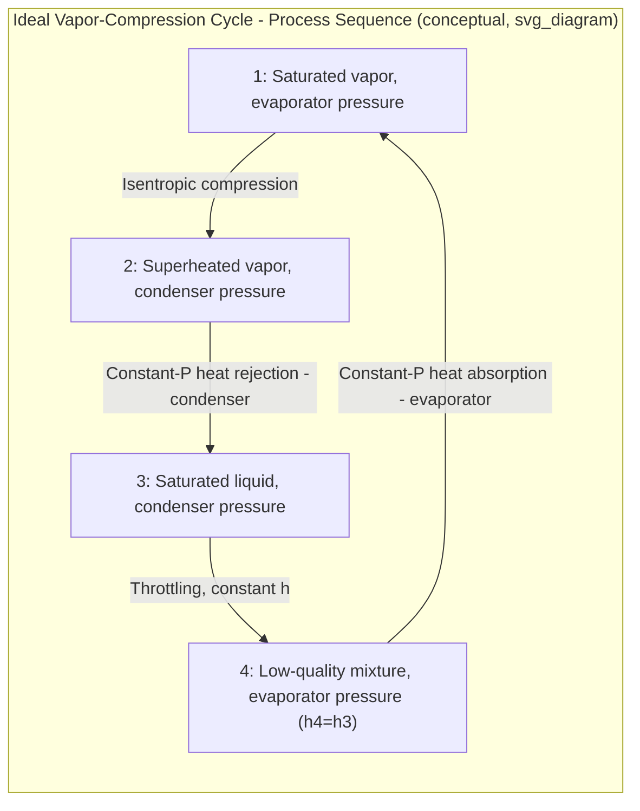

## The Ideal Vapor-Compression Refrigeration Cycle

### Overview

The ideal vapor-compression refrigeration cycle is the practical, physically realizable alternative to the reversed Carnot cycle (see The Reversed Carnot Cycle), forming the basis for the vast majority of real-world refrigeration, air conditioning, and heat pump systems. It replaces the Carnot cycle's problematic two-phase compression and work-producing expansion with, respectively, compression of vapor only and an irreversible throttling process, at the cost of a COP somewhat below the theoretical reversed Carnot maximum but with substantially greater mechanical practicality.

### Motivation: Fixing the Reversed Carnot Cycle's Practical Problems

**Problem 1 — Two-Phase Compression**

**[Confirmed]** Compressing a liquid-vapor mixture (as required in process 2→3 of the reversed Carnot cycle) is mechanically problematic for typical reciprocating or rotary compressors, since liquid droplets present in the suction gas can damage compressor valves, pistons, or other internal components (liquid slugging) — compressors are designed to handle single-phase vapor, not two-phase mixtures.

**Solution:** The vapor-compression cycle compresses only **superheated vapor** (or saturated vapor, in the idealized case), avoiding any liquid content at the compressor inlet.

**Problem 2 — Impractical Isentropic Expansion Device**

**[Confirmed]** Using a work-producing expansion device (such as a small turbine) to isentropically expand the working fluid from high pressure liquid to low pressure two-phase mixture (process 4→1 of the reversed Carnot cycle) is generally impractical for most refrigeration applications due to the small scale, cost, and complexity of such a device relative to the modest amount of work it would recover.

**Solution:** The vapor-compression cycle uses a simple **throttling valve** (or capillary tube, or thermostatic expansion valve) instead, accepting the inherent irreversibility of throttling (a constant-enthalpy process with associated entropy generation) in exchange for great mechanical simplicity and low cost.

### The Four Processes of the Ideal Vapor-Compression Cycle

| Process | Description | Component |
| --- | --- | --- |
| 1 → 2 | Isentropic compression (vapor only) | Compressor |
| 2 → 3 | Constant-pressure heat rejection (desuperheating + condensation) | Condenser |
| 3 → 4 | Throttling (constant enthalpy, irreversible) | Expansion valve |
| 4 → 1 | Constant-pressure heat absorption (evaporation) | Evaporator |

### State Point Descriptions

- **State 1:** Saturated vapor at evaporator pressure (compressor inlet) — the idealized entry condition for the "ideal" cycle; in practice, slight superheat is often introduced to protect the compressor (see Actual Vapor-Compression Cycles).
- **State 2:** Superheated vapor at condenser pressure (compressor exit) — temperature and pressure both elevated due to isentropic compression.
- **State 3:** Saturated liquid at condenser pressure (condenser exit) — the idealized exit condition, assuming heat rejection continues exactly to the saturated liquid line.
- **State 4:** Low-quality (mostly liquid) two-phase mixture at evaporator pressure (expansion valve exit / evaporator inlet) — same enthalpy as state 3, since throttling is a constant-enthalpy process.

### T-s and P-h Diagram Representation

### SVG: T-s Diagram of the Ideal Vapor-Compression Cycle

<svg xmlns="http://www.w3.org/2000/svg" viewBox="0 0 640 440">
<text x="320" y="24" font-size="16" text-anchor="middle" font-family="sans-serif" font-weight="bold">Ideal Vapor-Compression Cycle on T-s Diagram (svg_diagram)</text>
<line x1="90" y1="380" x2="580" y2="380" stroke="black" stroke-width="2" />
<line x1="90" y1="380" x2="90" y2="60" stroke="black" stroke-width="2" />
<text x="335" y="410" font-size="14" text-anchor="middle" font-family="sans-serif">Entropy, s</text>
<text x="45" y="220" font-size="14" text-anchor="middle" font-family="sans-serif" transform="rotate(-90 45 220)">Temperature, T</text>

<path d="M 160 380 Q 300 90 440 380" stroke="gray" stroke-width="1.5" fill="none" stroke-dasharray="4,3" />

<circle cx="300" cy="270" r="5" fill="black" />
<text x="310" y="290" font-size="12" font-family="sans-serif">1 (sat. vapor)</text>
<circle cx="360" cy="140" r="5" fill="black" />
<text x="370" y="130" font-size="12" font-family="sans-serif">2 (superheated)</text>
<circle cx="220" cy="140" r="5" fill="black" />
<text x="130" y="130" font-size="12" font-family="sans-serif">3 (sat. liquid)</text>
<circle cx="220" cy="270" r="5" fill="black" />
<text x="140" y="290" font-size="12" font-family="sans-serif">4 (two-phase)</text>

<line x1="300" y1="270" x2="360" y2="140" stroke="blue" stroke-width="2" />
<text x="330" y="200" font-size="10" fill="blue" font-family="sans-serif">1→2</text>
<line x1="360" y1="140" x2="220" y2="140" stroke="red" stroke-width="2" />
<text x="270" y="130" font-size="10" fill="red" font-family="sans-serif">2→3</text>
<line x1="220" y1="140" x2="220" y2="270" stroke="green" stroke-width="2" stroke-dasharray="5,3" />
<text x="150" y="200" font-size="10" fill="green" font-family="sans-serif">3→4 (throttling, irreversible)</text>
<line x1="220" y1="270" x2="300" y2="270" stroke="purple" stroke-width="2" />
<text x="240" y="290" font-size="10" fill="purple" font-family="sans-serif">4→1</text>

<text x="90" y="410" font-size="11" fill="gray" font-family="sans-serif">Dashed line (3→4): throttling shown as constant-h, entropy increases</text>

</svg>

### Comparison with the Reversed Carnot Cycle: Which Processes Match

**[Confirmed]** The ideal vapor-compression cycle intentionally matches the reversed Carnot cycle in two of its four processes but deliberately deviates in the other two:

| Process | Reversed Carnot | Vapor-Compression | Match? |
| --- | --- | --- | --- |
| Compression | Isentropic (two-phase to two-phase) | Isentropic (vapor to vapor) | Both isentropic, different starting phase |
| Heat rejection | Isothermal | Constant pressure (isothermal only during condensation, not during desuperheating) | Partial match |
| Expansion | Isentropic (work-producing) | Throttling (irreversible, no work recovery) | Deviates |
| Heat absorption | Isothermal | Constant pressure (isothermal during evaporation, matches exactly since evaporation occurs entirely within the two-phase region) | Matches |

**[Confirmed]** The two principal sources of departure from reversed Carnot performance are: (1) the superheating portion of the compression and heat-rejection processes (states 1→2 and the desuperheating portion of 2→3), during which heat rejection does not occur at a single constant temperature as the ideal Carnot cycle would require, and (2) the throttling process (3→4), which generates entropy and represents a genuine lost-work opportunity compared to the ideal isentropic expansion with work recovery.

### Energy Analysis

Applying the first law to each steady-flow component (per unit mass flow rate):

**Evaporator (Heat Absorption):**

$$q_L = h_1 - h_4$$

**Compressor (Work Input):**

$$w_{in} = h_2 - h_1$$

**Condenser (Heat Rejection):**

$$q_H = h_2 - h_3$$

**Expansion Valve (Throttling, no work, adiabatic):**

$$h_4 = h_3$$

### Coefficient of Performance

**Refrigeration COP:**

$$COP_R = \frac{q_L}{w_{in}} = \frac{h_1 - h_4}{h_2 - h_1}$$

**Heat Pump COP:**

$$COP_{HP} = \frac{q_H}{w_{in}} = \frac{h_2 - h_3}{h_2 - h_1}$$

**[Confirmed]** These COP values will always be **less than** the corresponding reversed Carnot COP calculated at the same evaporator and condenser temperatures, reflecting the real (though idealized-within-the-vapor-compression-model) irreversibilities inherent in the throttling process and the non-isothermal portions of heat rejection.

### Worked Example

**Given:** An ideal vapor-compression refrigeration cycle uses refrigerant R-134a. The evaporator operates at 200 kPa (saturation temperature approximately $-10.1°C$) and the condenser operates at 1200 kPa (saturation temperature approximately $46.3°C$).

**State 1 (saturated vapor, 200 kPa):**

$h_1 \approx 244.5\ \text{kJ/kg}$, $s_1 \approx 0.9377\ \text{kJ/kg·K}$

**State 2 (1200 kPa, $s_2 = s_1$, superheated):**

Interpolating R-134a superheated tables at 1200 kPa for $s = 0.9377\ \text{kJ/kg·K}$:

$h_2 \approx 278.0\ \text{kJ/kg}$ (approximate)

**State 3 (saturated liquid, 1200 kPa):**

$h_3 \approx 117.8\ \text{kJ/kg}$

**State 4 (throttled to 200 kPa, $h_4 = h_3$):**

$h_4 = 117.8\ \text{kJ/kg}$

**Refrigerating Effect:**

$$q_L = h_1 - h_4 = 244.5 - 117.8 = 126.7\ \text{kJ/kg}$$

**Compressor Work:**

$$w_{in} = h_2 - h_1 = 278.0 - 244.5 = 33.5\ \text{kJ/kg}$$

**Heat Rejected:**

$$q_H = h_2 - h_3 = 278.0 - 117.8 = 160.2\ \text{kJ/kg}$$

**Verification (energy balance):**

$$q_H = q_L + w_{in} = 126.7 + 33.5 = 160.2\ \text{kJ/kg} \checkmark$$

**Refrigeration COP:**

$$COP_R = \frac{126.7}{33.5} = 3.78$$

**Heat Pump COP:**

$$COP_{HP} = \frac{160.2}{33.5} = 4.78$$

**Comparison with Reversed Carnot COP** at the same temperature limits ($T_L \approx 263.05\ \text{K}$, $T_H \approx 319.45\ \text{K}$):

$$COP_{R,Carnot} = \frac{T_L}{T_H-T_L} = \frac{263.05}{319.45-263.05} = \frac{263.05}{56.4} = 4.66$$

**[Inference]** The vapor-compression cycle's actual COP (3.78) is meaningfully lower than the reversed Carnot benchmark (4.66) at the same nominal evaporator/condenser saturation temperatures, illustrating the real efficiency cost of the throttling irreversibility and non-isothermal heat rejection inherent in the practical cycle; the exact magnitude of this gap depends on the specific refrigerant and operating pressures, so it should be calculated case-by-case using accurate refrigerant property data rather than assumed as a fixed universal percentage.

### Refrigerant Selection Considerations

**[Confirmed]** The working fluid (refrigerant) used in a vapor-compression cycle must have thermodynamic properties suited to the desired operating temperature range — specifically, its saturation pressure at the desired evaporator temperature should be reasonably close to (ideally slightly above) atmospheric pressure to avoid excessively low sub-atmospheric evaporator pressures (which risk air/moisture infiltration into the system) while its saturation pressure at the desired condenser temperature should not be so high as to require excessively robust and costly high-pressure equipment.

**[Inference]** Refrigerant selection has evolved considerably over recent decades due to environmental regulations targeting ozone depletion potential (ODP) and global warming potential (GWP) of refrigerants — historically common refrigerants such as R-12 (a CFC) were phased out under the Montreal Protocol due to ozone depletion concerns, followed by transitional HFC refrigerants (such as R-134a) which, while having zero ODP, still carry significant GWP and are themselves subject to phase-down schedules under agreements such as the Kigali Amendment; current refrigerant trends favor lower-GWP alternatives (such as certain HFO refrigerants, R-32, R-1234yf, and natural refrigerants like $CO_2$, ammonia, or hydrocarbons), with specific regulatory requirements and available refrigerant choices varying by jurisdiction and application, so current refrigerant selection should always be verified against up-to-date regional regulations rather than assumed from historical practice.

### The P-h (Pressure-Enthalpy) Diagram: An Industry-Standard Tool

**[Confirmed]** While T-s diagrams are commonly used for educational cycle analysis, the refrigeration industry commonly uses **pressure-enthalpy (P-h) diagrams** for practical cycle analysis and refrigerant charge calculations, since on a P-h diagram, both the compressor work ($h_2-h_1$) and the refrigerating effect ($h_1-h_4$) and heat rejection ($h_2-h_3$) can all be read directly as horizontal distances along the enthalpy axis, and the throttling process (3→4) appears as a simple vertical line (since enthalpy is constant), making the cycle's key performance quantities visually and computationally straightforward to determine.

### Why "Ideal" — What This Model Still Assumes

**[Confirmed]** Despite addressing the two major practical flaws of the reversed Carnot cycle (two-phase compression and work-recovering expansion), the "ideal" vapor-compression cycle described here still retains several idealizations relative to actual refrigeration systems:

- Compression is assumed isentropic (i.e., the compressor is assumed internally reversible), whereas real compressors have isentropic efficiencies below 100%.
- No pressure drops are assumed in the evaporator, condenser, or connecting piping.
- The refrigerant is assumed to leave the evaporator as exactly saturated vapor (no superheat) and leave the condenser as exactly saturated liquid (no subcooling) — real systems commonly introduce deliberate superheat and subcooling for practical operational reasons.
- These further real-world deviations are addressed in the analysis of actual vapor-compression cycles.

### Common Mistakes and Clarifications

- **Assuming the expansion valve does work or removes heat:** The throttling process is adiabatic and does no work; it is neither a heat-rejection nor a work-producing process. Enthalpy remains constant across the valve ($h_3 = h_4$), while pressure drops and entropy increases (due to the inherent irreversibility of throttling).
- **Confusing evaporator/condenser saturation temperature with cycle-boundary reservoir temperature:** For the vapor-compression cycle, the evaporator and condenser operate at their own saturation temperatures at the corresponding operating pressures — these are generally somewhat below the refrigerated space temperature (for the evaporator) and above the heat-rejection sink temperature (for the condenser) in real applications, to drive heat transfer across a finite temperature difference; the reversed Carnot COP comparison should use the reservoir temperatures being served, while the actual vapor-compression cycle analysis uses the refrigerant's own saturation temperatures, and conflating the two overstates the achievable real-cycle COP relative to the reservoir-based Carnot benchmark.
- **Neglecting to check for saturated vs. superheated state 2:** Since compression from saturated vapor at low pressure to a much higher pressure is isentropic, state 2 is essentially always in the superheated region for R-134a and most common refrigerants — using saturated vapor properties at the condenser pressure at state 2 instead of properly interpolated superheated vapor properties is a common calculation error.
- **Applying this idealized cycle model to precisely predict real system performance:** As with the ideal Rankine cycle for vapor power plants, the ideal vapor-compression cycle provides a valuable but idealized reference; actual refrigeration system COP will be lower due to compressor inefficiency, pressure drops, and other departures addressed in Actual Vapor-Compression Cycles and Component Irreversibilities.

**Next Steps**

- Actual Vapor-Compression Cycles and Component Irreversibilities
- Refrigerants: Properties, Environmental Regulations, and Selection
- Cascade Refrigeration Systems
- Multistage Compression Refrigeration Systems
- Heat Pump Systems and Applications
- Absorption Refrigeration Systems
- Second-Law (Exergy) Analysis of Refrigeration Cycles