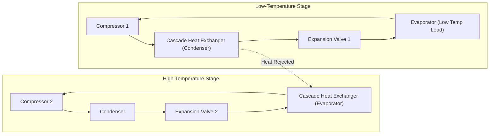
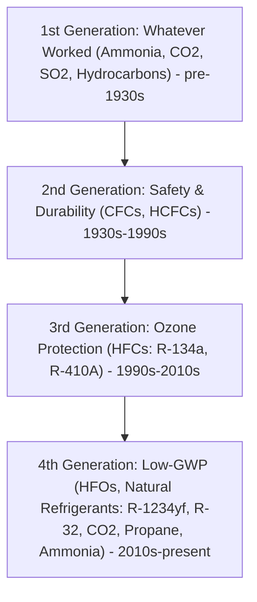

## Actual Vapor-Compression Cycles and Refrigerant Selection

### Overview

The actual vapor-compression refrigeration cycle deviates from the ideal (Carnot-like) reversed cycle due to real component behavior: irreversibilities in compression, pressure drops in piping and heat exchangers, subcooling, superheating, and heat transfer across finite temperature differences. Understanding these deviations, along with the thermophysical and environmental criteria for refrigerant selection, is essential for real-world system design, performance prediction, and regulatory compliance.

### The Ideal Vapor-Compression Cycle (Baseline for Comparison)

Before examining deviations, the ideal cycle consists of four processes:

1. **1→2: Isentropic compression** — saturated vapor at evaporator pressure compressed to condenser pressure
2. **2→3: Isobaric heat rejection** — desuperheating and condensation to saturated liquid
3. **3→4: Throttling** — isenthalpic expansion through a valve to evaporator pressure
4. **4→1: Isobaric heat absorption** — evaporation to saturated vapor

$$COP_{ref} = \dfrac{Q_L}{W_{net,in}} = \dfrac{h_1 - h_4}{h_2 - h_1}$$

$$COP_{HP} = \dfrac{Q_H}{W_{net,in}} = \dfrac{h_2 - h_3}{h_2 - h_1}$$

### Deviations of the Actual Cycle from the Ideal

#### 1. Superheating at Evaporator Exit

In practice, refrigerant leaving the evaporator is superheated by several degrees (typically 5–8°C) rather than exiting as saturated vapor. This ensures:

- No liquid droplets enter the compressor (avoiding **liquid slugging**, which can destroy valves and pistons in reciprocating compressors)
- Complete utilization of the evaporator surface area, since some superheating region exists near the exit

**Trade-off:** Excessive superheat increases compressor discharge temperature and can reduce volumetric efficiency, since the vapor entering the compressor is less dense.

#### 2. Subcooling at Condenser Exit

Liquid leaving the condenser is subcooled below the saturation temperature (typically 2–5°C), which:

- Ensures pure liquid enters the expansion device (preventing flash gas formation before the valve, which would reduce the valve's metering capability and refrigerating effect)
- Increases the refrigerating effect per unit mass, since $h_4$ (post-throttling enthalpy) decreases, widening $h_1 - h_4$

#### 3. Non-Isentropic (Irreversible) Compression

Actual compression involves friction, turbulence, and heat transfer with the compressor housing, so entropy increases: $s_2 > s_1$. The actual compressor work exceeds the isentropic work.

**Isentropic efficiency:**

$$\eta_C = \dfrac{w_s}{w_a} = \dfrac{h_{2s} - h_1}{h_{2a} - h_1}$$

where $h_{2s}$ is the enthalpy at state 2 for isentropic compression, and $h_{2a}$ is the actual discharge enthalpy. Typical reciprocating/rotary compressor isentropic efficiencies range from 0.65–0.85 depending on pressure ratio, compressor type, and load. [Inference: exact efficiency values are manufacturer- and operating-point-dependent and should be taken from compressor performance maps for design work.]

The actual COP becomes:

$$COP_{actual} = \dfrac{h_1 - h_4}{h_{2a} - h_1} = \dfrac{h_1 - h_4}{(h_{2s}-h_1)/\eta_C}$$

#### 4. Pressure Drops in Piping and Heat Exchangers

Friction causes pressure drops in the connecting lines and across the evaporator/condenser:

- **Suction line pressure drop:** lowers compressor inlet pressure, increasing the pressure ratio and compressor work for the same refrigerating effect
- **Discharge line pressure drop:** raises condensing pressure requirement
- **Evaporator/condenser internal pressure drop:** causes the process to be non-isobaric; the actual saturation temperature glide differs slightly across the heat exchanger

These effects collectively reduce the actual COP relative to the ideal cycle, sometimes by 10–20%. [Inference: magnitude depends heavily on line sizing, refrigerant charge, and system layout.]

#### 5. Heat Transfer Across Finite Temperature Differences

Real heat exchangers require a temperature difference to drive heat transfer:

- Evaporator refrigerant temperature must be below the cooled space/fluid temperature ($T_{evap} < T_L$)
- Condenser refrigerant temperature must be above the heat sink temperature ($T_{cond} > T_H$)

This widens the effective operating pressure ratio beyond what the space/sink temperatures alone would require, directly reducing COP compared to a reversible cycle operating between $T_L$ and $T_H$.

#### 6. Pressure Drop and Heat Gain/Loss in Connecting Lines

Suction lines often gain heat from the surroundings (since they carry cold refrigerant), which superheats the vapor further before compression — beneficial for compressor protection but detrimental to volumetric efficiency and increases compressor work without proportional refrigerating benefit (superheat gained outside the evaporator does not contribute to $Q_L$).

### T-s Diagram: Ideal vs. Actual Cycle

<svg xmlns="http://www.w3.org/2000/svg" viewBox="0 0 800 560" font-family="Helvetica, Arial, sans-serif">
<text x="400" y="30" text-anchor="middle" font-size="20" font-weight="bold" fill="#1a1a1a">Actual vs. Ideal Vapor-Compression Cycle on T-s Diagram (svg_diagram)</text>

<line x1="100" y1="480" x2="720" y2="480" stroke="#333" stroke-width="2" />
<line x1="100" y1="480" x2="100" y2="70" stroke="#333" stroke-width="2" />
<text x="420" y="520" text-anchor="middle" font-size="16" fill="#1a1a1a">Entropy, s (kJ/kg·K)</text>
<text x="45" y="275" text-anchor="middle" font-size="16" fill="#1a1a1a" transform="rotate(-90 45 275)">Temperature, T (°C)</text>

<path d="M 180 480 Q 300 130 420 130 Q 540 130 620 480" fill="none" stroke="#888" stroke-width="2" stroke-dasharray="6,4" />
<text x="300" y="120" font-size="13" fill="#666">Saturated liquid line</text>
<text x="560" y="120" font-size="13" fill="#666">Saturated vapor line</text>

<polygon points="300,300 460,180 460,380 300,420" fill="none" stroke="#2166ac" stroke-width="2.5" stroke-dasharray="8,4" />
<text x="500" y="200" font-size="13" fill="#2166ac" font-weight="bold">Ideal Cycle</text>

<polygon points="330,300 500,170 500,400 260,420" fill="none" stroke="#b2182b" stroke-width="3" />
<text x="540" y="170" font-size="13" fill="#b2182b" font-weight="bold">Actual Cycle</text>

<circle cx="300" cy="300" r="4" fill="#2166ac" />
<text x="280" y="295" font-size="12" fill="#2166ac">1</text>
<circle cx="460" cy="180" r="4" fill="#2166ac" />
<text x="465" y="175" font-size="12" fill="#2166ac">2s</text>
<circle cx="460" cy="380" r="4" fill="#2166ac" />
<text x="465" y="395" font-size="12" fill="#2166ac">3</text>
<circle cx="300" cy="420" r="4" fill="#2166ac" />
<text x="280" y="440" font-size="12" fill="#2166ac">4</text>

<circle cx="330" cy="300" r="4" fill="#b2182b" />
<text x="335" y="290" font-size="12" fill="#b2182b">1'</text>
<circle cx="500" cy="170" r="4" fill="#b2182b" />
<text x="505" y="160" font-size="12" fill="#b2182b">2a</text>
<circle cx="260" cy="420" r="4" fill="#b2182b" />
<text x="220" y="440" font-size="12" fill="#b2182b">4'</text>

<text x="150" y="310" font-size="12" fill="#333">Superheat →</text>

<text x="200" y="400" font-size="12" fill="#333">Subcooling →</text>

<rect x="600" y="440" width="16" height="4" fill="#2166ac" />
<text x="622" y="446" font-size="12" fill="#1a1a1a">Ideal (isentropic, saturated states)</text>
<rect x="600" y="460" width="16" height="4" fill="#b2182b" />
<text x="622" y="466" font-size="12" fill="#1a1a1a">Actual (superheat, subcool, irreversible)</text>
</svg>

### Volumetric Efficiency

The compressor's actual pumping capacity is reduced from its theoretical displacement due to:

- **Clearance volume re-expansion:** residual high-pressure gas in the clearance volume re-expands on the suction stroke before intake begins
- **Valve pressure losses:** pressure drops across suction/discharge valves
- **Suction gas heating:** heat pickup from the hot compressor housing reduces suction gas density
- **Leakage (blow-by)** past pistons/vanes/scrolls

$$\eta_v = 1 - C\left[\left(\dfrac{P_2}{P_1}\right)^{1/n} - 1\right]$$

where $C$ is the clearance volume fraction and $n$ is the polytropic exponent. Volumetric efficiency drops sharply as pressure ratio $P_2/P_1$ increases, which is a key driver of multi-stage compression in high-pressure-ratio applications.

### Multi-Stage Compression and Cascading

For large temperature lifts (large $T_H - T_L$), single-stage compression becomes inefficient due to high discharge temperatures and poor volumetric efficiency. Solutions include:

- **Multi-stage compression with intercooling:** reduces total work by cooling vapor between stages, approaching isothermal compression
- **Flash intercooling (economizer cycle):** uses a flash tank at intermediate pressure to remove flash gas before the low-pressure evaporator load, improving COP
- **Cascade systems:** two independent refrigeration cycles with different refrigerants linked by a cascade heat exchanger, used for very low temperatures (e.g., −70°C to −150°C) where a single refrigerant cannot efficiently span the pressure ratio

### Refrigerant Selection Criteria

Selecting a refrigerant requires balancing thermodynamic performance, safety, material compatibility, and environmental regulations.

#### Thermodynamic and Physical Properties

- **Evaporating/condensing pressures:** should be reasonably above atmospheric (to avoid air/moisture infiltration) but not excessively high (to limit equipment wall thickness and cost)
- **Critical temperature:** should be well above the maximum condensing temperature; operating too close to the critical point sharply degrades cycle efficiency
- **Latent heat of vaporization:** higher latent heat means less refrigerant mass flow for a given cooling load
- **Specific volume of vapor:** affects compressor displacement and physical size
- **Discharge temperature:** should remain within safe limits for compressor lubricant and materials

#### Safety Classification (ASHRAE Standard 34 / ISO 817)

Refrigerants are classified by a two-character code combining toxicity and flammability:

| Class | Toxicity | Flammability | Examples |
| --- | --- | --- | --- |
| A1 | Lower toxicity | No flame propagation | R-134a, R-410A, R-32 (note: R-32 is A2L, see below) |
| A2L | Lower toxicity | Mildly flammable, low burning velocity | R-32, R-1234yf, R-1234ze |
| A2 | Lower toxicity | Flammable | R-152a |
| A3 | Lower toxicity | Highly flammable | Propane (R-290), Isobutane (R-600a) |
| B1 | Higher toxicity | No flame propagation | Ammonia is B2L; not B1 |
| B2L | Higher toxicity | Mildly flammable | Ammonia (R-717) |
| B2/B3 | Higher toxicity | Flammable/highly flammable | — |

#### Environmental Metrics

- **Ozone Depletion Potential (ODP):** measures potential to destroy stratospheric ozone, relative to R-11 (ODP = 1.0). CFCs (e.g., R-11, R-12) have high ODP and are phased out under the **Montreal Protocol**. HCFCs (e.g., R-22) have lower but nonzero ODP and are being phased out.
- **Global Warming Potential (GWP):** measures relative heat-trapping capability over 100 years compared to CO₂ (GWP = 1). HFCs like R-134a (GWP ≈ 1,430) and R-404A (GWP ≈ 3,922) are being phased down under the **Kigali Amendment** to the Montreal Protocol and regional regulations (e.g., EU F-Gas Regulation, U.S. AIM Act).

**Refrigerant generation timeline:**

#### Common Refrigerants Compared

| Refrigerant | Type | ODP | GWP (100-yr) | Safety Class | Typical Application |
| --- | --- | --- | --- | --- | --- |
| R-22 | HCFC | 0.055 | 1,810 | A1 | Legacy AC/refrigeration (phased out in most countries) |
| R-134a | HFC | 0 | 1,430 | A1 | Automotive AC, medium-temp refrigeration |
| R-410A | HFC blend | 0 | 2,088 | A1 | Residential/commercial AC |
| R-404A | HFC blend | 0 | 3,922 | A1 | Commercial/low-temp refrigeration |
| R-32 | HFC | 0 | 675 | A2L | Residential AC (replacing R-410A) |
| R-1234yf | HFO | 0 | <1 | A2L | Automotive AC (replacing R-134a) |
| R-1234ze | HFO | 0 | <1 | A2L | Chillers |
| R-717 (Ammonia) | Natural | 0 | 0 | B2L | Industrial refrigeration |
| R-744 (CO₂) | Natural | 0 | 1 | A1 | Transcritical systems, low-temp, heat pumps |
| R-290 (Propane) | Natural (HC) | 0 | ~3 | A3 | Small self-contained units, heat pumps |
| R-600a (Isobutane) | Natural (HC) | 0 | ~3 | A3 | Domestic refrigerators |

[Unverified: GWP values are periodically revised by IPCC assessment reports (AR4, AR5, AR6); designers should confirm current values against the applicable regulatory reference for compliance purposes.]

#### Material Compatibility and Lubricant Considerations

- **HFCs** (e.g., R-134a) are incompatible with mineral oils and require polyolester (POE) or polyalkylene glycol (PAG) lubricants due to differing solubility and miscibility characteristics
- **Ammonia** is incompatible with copper and copper alloys (forms corrosive compounds), requiring steel piping and components
- **Hydrocarbons** (propane, isobutane) require explosion-proof electrical components and strict charge limits due to flammability
- **CO₂ systems** operate at much higher pressures (~70–120 bar) requiring specially rated compressors, valves, and piping

#### Transcritical CO₂ Cycles [Inference: increasingly common but distinct from subcritical cycles]

Because CO₂'s critical temperature (31.1°C) is often below ambient/condensing temperatures in many climates, CO₂ systems frequently operate **transcritically**: the high-pressure side operates above the critical pressure (no true condensation occurs; instead, "gas cooling" occurs at supercritical pressure). This requires:

- An **electronic expansion valve** with variable opening to optimize the high-side pressure for maximum COP (since there's no fixed saturation relationship above critical pressure)
- Careful high-side pressure control, since COP is highly sensitive to gas cooler exit temperature and pressure

### Worked Example: Actual Cycle COP with Compressor Inefficiency

**Given:** A vapor-compression refrigeration system uses R-134a. Evaporator temperature = −10°C (saturated vapor entering compressor at 5°C superheat, so actual inlet ≈ −5°C at evaporator pressure). Condenser temperature = 40°C (liquid leaves with 5°C subcooling, so actual exit ≈ 35°C at condenser pressure). Compressor isentropic efficiency = 0.80.

**Approach:**

1. Determine saturation pressures at −10°C and 40°C from R-134a property tables
2. State 1 (compressor inlet): superheated vapor at evaporator pressure, $T_1 = -5°C$; read $h_1$, $s_1$
3. State 2s (isentropic discharge): at condenser pressure, $s_{2s} = s_1$; read $h_{2s}$
4. Actual compressor work: $w_a = (h_{2s} - h_1)/\eta_C$, so $h_{2a} = h_1 + w_a$
5. State 3 (condenser exit): subcooled liquid at 35°C, condenser pressure; read $h_3$
6. State 4 (evaporator inlet): $h_4 = h_3$ (throttling)
7. Refrigerating effect: $q_L = h_1 - h_4$
8. $COP_{actual} = q_L / w_a$

**Key takeaway:** Compared to the ideal cycle (saturated states, isentropic compression), the actual COP is typically 15–30% lower due to the combined effects of superheat (increases $w_a$ disproportionately to $q_L$ gain), subcooling (modestly increases $q_L$), and compressor inefficiency (directly increases $w_a$). [Inference: exact percentage depends on specific operating conditions and equipment.]

### Practical Design Implications

- **Superheat control** is typically managed via a **thermostatic expansion valve (TXV)** or **electronic expansion valve (EEV)**, which modulates refrigerant flow to maintain a target superheat (commonly 5–8°C) regardless of load variation
- **Liquid subcooling** can be enhanced deliberately using a liquid-suction heat exchanger, which subcools the liquid line using the cold suction vapor — simultaneously superheating the suction gas, though this must be balanced against increased compressor discharge temperature
- **Refrigerant charge optimization** affects both subcooling amount and system efficiency; overcharging and undercharging both degrade performance
- **Low-GWP transition** is an active industry-wide effort; many jurisdictions now restrict high-GWP refrigerants in new equipment, driving adoption of A2L refrigerants (R-32, R-1234yf) and natural refrigerants (CO₂, ammonia, hydrocarbons), which introduces new engineering challenges around flammability mitigation and higher operating pressures

### Related Topics

- Compressor types and performance maps (reciprocating, scroll, screw, centrifugal)
- Multi-stage compression with flash intercooling and economizers
- Cascade refrigeration systems for ultra-low temperatures
- Transcritical CO₂ refrigeration cycle analysis
- Absorption refrigeration cycles (non-vapor-compression alternative)
- Heat pump cycle analysis and COP optimization for heating applications
- Refrigerant blends: zeotropic vs. azeotropic mixtures and temperature glide
- ASHRAE Standard 15 and 34: safety standards for refrigeration systems
- Montreal Protocol, Kigali Amendment, and F-Gas regulatory frameworks
- Second-law (exergy) analysis of refrigeration cycles