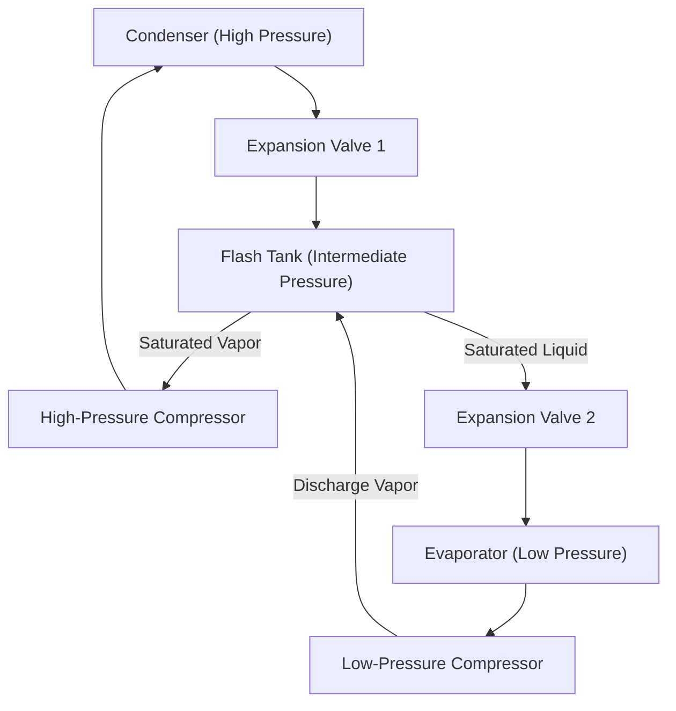
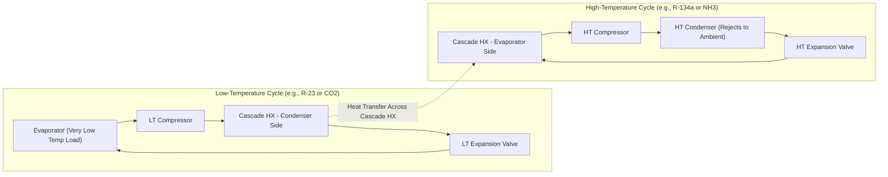

## Cascade and Multistage Compression Systems

### Overview

When a refrigeration system must produce a large temperature lift (large difference between evaporator and condenser temperatures), single-stage vapor-compression cycles become thermodynamically and mechanically inefficient. Multistage compression and cascade systems address this by breaking the compression process into two or more stages, each handling a smaller pressure ratio, improving compressor efficiency, reducing discharge temperatures, and often reducing throttling losses.

### Why Single-Stage Compression Fails at Large Pressure Ratios

As the pressure ratio $P_2/P_1$ across a single compressor increases:

- **Volumetric efficiency drops sharply**, since more of the stroke is spent re-expanding clearance-volume gas rather than drawing in new vapor:

$$\eta_v = 1 - C\left[\left(\dfrac{P_2}{P_1}\right)^{1/n} - 1\right]$$

- **Discharge temperature rises excessively**, risking lubricant breakdown, thermal decomposition of the refrigerant, and mechanical damage
- **Isentropic compression work increases** disproportionately, since work approaches adiabatic (rather than isothermal) compression, which is thermodynamically less efficient
- **Throttling losses grow**, since a single expansion from high condensing pressure to low evaporating pressure produces more flash gas (vapor formed during throttling that does no useful cooling but must still be compressed)

Multistage and cascade configurations mitigate these problems by splitting the pressure ratio, cooling the vapor between stages, and/or removing flash gas at intermediate pressure.

### Multistage Compression with Intercooling

#### Concept

Two (or more) compressors operate in series, with the discharge of the low-pressure (LP) compressor cooled before entering the high-pressure (HP) compressor. This approximates isothermal compression more closely than a single-stage adiabatic process, reducing total work input.

**Optimal intermediate pressure** (for two equal-efficiency stages, minimizing total work) is approximately the geometric mean:

$$P_i = \sqrt{P_{evap} \cdot P_{cond}}$$

This equalizes the pressure ratio (and approximately the work) across both stages.

#### Types of Intercooling

**1. Water/air-cooled (external) intercooling**

The LP discharge vapor is cooled using an external medium (water or air) before entering the HP compressor. Effective when a suitable coolant is available, but does not remove flash gas.

**2. Flash-tank (economizer) intercooling**

The refrigerant is expanded in two stages through two expansion valves, with a flash tank (intermediate pressure vessel) between them. This is the most common industrial approach and provides two benefits simultaneously: intercooling and flash gas removal.

**How the flash tank works:**

1. High-pressure liquid from the condenser is throttled to intermediate pressure, producing a liquid-vapor mixture
2. In the flash tank, saturated vapor separates from saturated liquid
3. The **flash vapor** (formed purely from the pressure drop, carrying no refrigeration benefit) is drawn directly into the HP compressor suction — it never passes through the evaporator, avoiding wasted compression work on gas that already needs no further cooling
4. The **saturated liquid** is throttled a second time to evaporator pressure and sent to the evaporator
5. LP compressor discharge vapor (from the evaporator) is also fed into the flash tank, where it mixes with and is cooled by the saturating liquid before HP compression — this is the intercooling effect

**3. Direct (flash) intercooling without external liquid injection**

Similar to the above, but sometimes a portion of the intermediate-pressure liquid is injected directly into the LP discharge line to desuperheat the vapor before it enters the flash tank or HP compressor — used when discharge superheat is excessive.

#### Thermodynamic Benefit

Compared to single-stage throttling from condenser to evaporator pressure directly, two-stage throttling with flash gas removal at intermediate pressure means:

- The LP compressor only needs to compress the vapor actually generated by evaporator refrigeration duty, not the flash gas that would otherwise be added to the same suction line
- The HP compressor's suction temperature is reduced by mixing with the cooler flash tank vapor, lowering discharge temperature and compression work

$$COP_{2-stage} > COP_{1-stage} \quad \text{for the same } T_{evap}, T_{cond}$$

[Inference: the magnitude of improvement is refrigerant- and pressure-ratio-dependent; typical COP gains range from 10–25% relative to equivalent single-stage systems at large lifts, but exact figures require cycle simulation for a specific refrigerant and operating envelope.]

### T-s Diagram: Two-Stage Compression with Flash Intercooling

<svg xmlns="http://www.w3.org/2000/svg" viewBox="0 0 800 580" font-family="Helvetica, Arial, sans-serif">
<text x="400" y="30" text-anchor="middle" font-size="19" font-weight="bold" fill="#1a1a1a">Two-Stage Compression with Flash Intercooling (svg_diagram)</text>

<line x1="100" y1="500" x2="720" y2="500" stroke="#333" stroke-width="2" />
<line x1="100" y1="500" x2="100" y2="80" stroke="#333" stroke-width="2" />
<text x="420" y="540" text-anchor="middle" font-size="15" fill="#1a1a1a">Entropy, s (kJ/kg·K)</text>
<text x="45" y="290" text-anchor="middle" font-size="15" fill="#1a1a1a" transform="rotate(-90 45 290)">Temperature, T (°C)</text>

<path d="M 180 500 Q 300 150 420 150 Q 540 150 620 500" fill="none" stroke="#888" stroke-width="2" stroke-dasharray="6,4" />

<line x1="100" y1="440" x2="720" y2="440" stroke="#ccc" stroke-width="1" stroke-dasharray="3,3" />
<text x="630" y="435" font-size="11" fill="#666">P_evap (low)</text>
<line x1="100" y1="300" x2="720" y2="300" stroke="#ccc" stroke-width="1" stroke-dasharray="3,3" />
<text x="630" y="295" font-size="11" fill="#666">P_intermediate</text>
<line x1="100" y1="180" x2="720" y2="180" stroke="#ccc" stroke-width="1" stroke-dasharray="3,3" />
<text x="630" y="175" font-size="11" fill="#666">P_cond (high)</text>

<path d="M 290 440 L 340 300" fill="none" stroke="#b2182b" stroke-width="2.5" />
<circle cx="290" cy="440" r="4" fill="#b2182b" />
<text x="255" y="450" font-size="12" fill="#b2182b">1 (LP suction)</text>
<circle cx="340" cy="300" r="4" fill="#b2182b" />
<text x="345" y="295" font-size="12" fill="#b2182b">2 (LP discharge)</text>

<path d="M 340 300 L 320 300" fill="none" stroke="#e08214" stroke-width="2.5" stroke-dasharray="4,3" />
<circle cx="320" cy="300" r="4" fill="#e08214" />
<text x="230" y="315" font-size="12" fill="#e08214">2' (cooled by flash mixing)</text>

<path d="M 320 300 L 380 180" fill="none" stroke="#2166ac" stroke-width="2.5" />
<circle cx="380" cy="180" r="4" fill="#2166ac" />
<text x="385" y="170" font-size="12" fill="#2166ac">3 (HP discharge)</text>

<path d="M 380 180 L 460 180" fill="none" stroke="#2166ac" stroke-width="2.5" />
<circle cx="460" cy="180" r="4" fill="#2166ac" />
<text x="465" y="170" font-size="12" fill="#2166ac">4 (sat. liquid)</text>

<path d="M 460 180 L 400 300" fill="none" stroke="#4d4d4d" stroke-width="2" stroke-dasharray="5,3" />
<circle cx="400" cy="300" r="4" fill="#4d4d4d" />
<text x="405" y="290" font-size="12" fill="#4d4d4d">5 (flash tank, 2-phase)</text>

<line x1="400" y1="300" x2="320" y2="300" stroke="#e08214" stroke-width="1.5" stroke-dasharray="2,2" />

<circle cx="300" cy="300" r="4" fill="#4d4d4d" />
<text x="230" y="300" font-size="12" fill="#4d4d4d">6 (sat. liquid, P_int)</text>

<path d="M 300 300 L 250 440" fill="none" stroke="#4d4d4d" stroke-width="2" stroke-dasharray="5,3" />
<circle cx="250" cy="440" r="4" fill="#4d4d4d" />
<text x="180" y="460" font-size="12" fill="#4d4d4d">7 (evap. inlet)</text>

<path d="M 250 440 L 290 440" fill="none" stroke="#b2182b" stroke-width="2.5" />

<rect x="580" y="440" width="16" height="4" fill="#b2182b" />
<text x="602" y="446" font-size="11" fill="#1a1a1a">LP stage</text>
<rect x="580" y="460" width="16" height="4" fill="#2166ac" />
<text x="602" y="466" font-size="11" fill="#1a1a1a">HP stage</text>
<rect x="580" y="480" width="16" height="4" fill="#4d4d4d" />
<text x="602" y="486" font-size="11" fill="#1a1a1a">Throttling</text>
</svg>

### Cascade Refrigeration Systems

#### Concept

A cascade system uses two (or more) independent, fully separate refrigeration cycles — each potentially with a **different refrigerant** optimized for its own temperature range — thermally linked by a **cascade heat exchanger**. The condenser of the low-temperature (LT) cycle rejects heat directly to the evaporator of the high-temperature (HT) cycle.

#### Why Use Cascade Instead of Multistage?

- **Very large temperature lifts** (e.g., ambient +35°C down to −80°C or lower) exceed the practical range of any single refrigerant, since no single fluid has ideal thermodynamic properties (reasonable pressures, acceptable volumetric efficiency) across such a wide span
- **Refrigerant optimization per stage:** the LT cycle uses a refrigerant with a low normal boiling point suited to very cold evaporation (e.g., R-23, R-508B, CO₂), while the HT cycle uses a refrigerant suited to rejecting heat at near-ambient condensing temperatures (e.g., R-134a, ammonia, propane)
- **Avoids excessively low evaporator pressures** (which would occur if a single refrigerant tried to span the whole range, potentially dropping below atmospheric pressure and risking air/moisture infiltration into the system)
- **Avoids excessively high condensing pressures** in the LT loop, since it condenses at a moderate intermediate temperature (set by the HT cycle's evaporating temperature) rather than at ambient

#### Cascade Heat Exchanger Design

The cascade heat exchanger is central to system performance:

- Requires a finite temperature difference (typically 5–10°C) between the LT condensing temperature and HT evaporating temperature to drive heat transfer — this "cascade temperature difference" represents an inherent efficiency penalty, since it forces the LT cycle to reject heat at a higher pressure than it otherwise would need
- Common designs: brazed-plate heat exchangers (BPHE) for compactness, or shell-and-tube for larger industrial systems
- Sizing the cascade $\Delta T$ is a design trade-off: smaller $\Delta T$ improves system COP but requires larger (more expensive) heat exchanger area

#### Overall COP of a Cascade System

$$COP_{cascade} = \dfrac{Q_L}{W_{LT} + W_{HT}}$$

where $Q_L$ is the useful refrigeration effect at the LT evaporator, and $W_{LT}$, $W_{HT}$ are the compressor work inputs of the low- and high-temperature cycles respectively.

**Optimal cascade temperature** (the intermediate temperature at the cascade heat exchanger) can be selected to minimize total compressor work; for many refrigerant pairs, this optimum is close to the geometric mean of the overall evaporator and condenser absolute temperatures, analogous to multistage intermediate pressure optimization, though the actual optimum also depends on the specific refrigerant property sets on each side. [Inference: precise optimization requires cycle simulation for the chosen refrigerant pair since COP sensitivity to cascade temperature is refrigerant-specific.]

### Common Cascade Refrigerant Pairs

| Application | LT Cycle Refrigerant | HT Cycle Refrigerant | Typical LT Evaporator Range |
| --- | --- | --- | --- |
| Ultra-low freezers | R-23, R-508B | R-404A, R-134a, R-449A | −80°C to −40°C |
| Industrial food freezing | CO₂ (R-744) | Ammonia (R-717) | −50°C to −35°C |
| Pharmaceutical/biomedical storage | R-23 | R-404A | −70°C to −50°C |
| LNG-related and gas processing | Propane, ethylene | Propylene, ammonia | −100°C and below |

**Note on NH3/CO₂ cascade systems:** This pairing has become widely adopted in industrial refrigeration because ammonia (HT side) has excellent thermodynamic efficiency and zero GWP, while CO₂ (LT side) avoids the toxicity/flammability of ammonia in occupied low-temperature spaces (e.g., freezer rooms) and has favorable volumetric refrigerating capacity at low temperatures despite its need for higher operating pressures.

### Comparison: Multistage vs. Cascade

| Characteristic | Multistage Compression | Cascade System |
| --- | --- | --- |
| Refrigerant | Single refrigerant throughout | Different refrigerant per stage possible |
| Complexity | Moderate (shared refrigerant loop) | Higher (fully separate loops, cascade HX) |
| Typical temperature lift | Moderate-to-large (e.g., −40°C to +40°C) | Very large (e.g., −80°C to +40°C) |
| Additional component | Flash tank / intercooler | Cascade heat exchanger |
| Refrigerant charge | Single circuit charge | Two independent charges |
| Serviceability | One refrigerant to manage | Two refrigerant circuits to maintain/service |
| Typical use case | Commercial/industrial refrigeration, moderate sub-zero | Ultra-low-temp storage, food freezing, gas liquefaction support |

### Three-Stage and Multi-Effect Systems

For extremely large lifts or specialized processes, three or more compression stages with two or more flash tanks can be used, following the same principle of splitting the total pressure ratio into smaller increments at each stage. Similarly, cascade systems can, in principle, use three or more linked cycles, though two-stage cascades are by far the most common in practice due to the added complexity and cost of each additional loop. [Inference: three-stage cascade configurations exist mainly in specialized cryogenic or gas-processing applications rather than typical commercial/industrial refrigeration.]

### Practical Design and Operational Considerations

- **Oil return:** in multistage systems with a shared refrigerant loop, compressor lubricant must be properly managed across both LP and HP compressors; oil separators are commonly installed after each compression stage
- **Startup and control sequencing:** cascade systems require careful control logic, since the LT cycle should generally not operate unless the HT cycle has already established a suitable cascade condensing temperature — running the LT compressor against too warm a cascade sink can cause excessive discharge pressure and temperature
- **Standby/pump-down conditions:** LT cycle refrigerant may need isolation valves and pump-down provisions to protect the LT compressor when the system is not in steady operation, since the LT-side pressure could otherwise rise excessively if the cascade heat exchanger is not actively rejecting heat
- **Charge management:** cascade systems require monitoring two independent refrigerant charges and often two separate sets of service/maintenance procedures and safety data considerations, especially where one loop uses a flammable or toxic refrigerant (e.g., ammonia, propane)
- **Instrumentation:** cascade condensing/evaporating temperature and pressure at the cascade heat exchanger are key monitored parameters, since deviations directly indicate performance degradation, fouling, or refrigerant charge issues in either loop

### Related Topics

- Flash-tank vs. direct-expansion intercooling design trade-offs
- Economized (vapor-injection) scroll and screw compressors
- NH3/CO₂ cascade system design and safety considerations
- Refrigerant selection for cryogenic and ultra-low-temperature applications
- Compressor staging control strategies and part-load operation
- Oil management and oil return in multistage refrigeration circuits
- Transcritical CO₂ cycles as an alternative to cascade for certain temperature ranges
- Second-law (exergy) analysis of multistage and cascade cycles
- LNG liquefaction cycles (mixed-refrigerant and cascade processes)