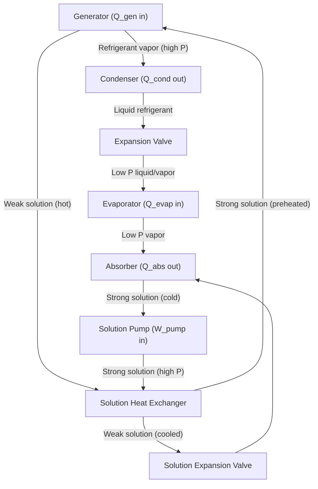

## Absorption Refrigeration Cycles

### Overview

Absorption refrigeration is a heat-driven refrigeration technology that produces a cooling effect using thermal energy as the primary input instead of mechanical shaft work. It replaces the mechanical compressor of a vapor-compression cycle with a "thermal compressor" consisting of an absorber, a pump, a generator, and (usually) a throttling/solution heat exchanger. The cycle exploits the ability of certain liquid or solid substances (the absorbent) to absorb a refrigerant vapor at low pressure and release it again when heated at high pressure.

Because the energy driving the cycle is primarily heat rather than electricity, absorption systems are attractive wherever low-cost or waste heat is available: solar thermal collectors, industrial waste heat, combined heat and power (CHP) exhaust, geothermal sources, or direct-fired natural gas.

### Fundamental Principle

In a conventional vapor-compression cycle, a compressor raises refrigerant vapor from evaporator pressure to condenser pressure by mechanical work input. In absorption refrigeration, this pressure rise is achieved thermochemically:

1. Low-pressure refrigerant vapor leaving the evaporator is **absorbed** into a liquid absorbent, releasing heat (exothermic mixing).
2. The resulting liquid solution is **pumped** to high pressure — a small-work process since it is a liquid, not a gas.
3. Heat is added to the high-pressure solution in a **generator**, driving the refrigerant vapor back out of solution (**desorption**).
4. The refrigerant vapor proceeds to the condenser, expansion valve, and evaporator, exactly as in a vapor-compression cycle.
5. The refrigerant-depleted ("weak") solution returns to the absorber to repeat the cycle.

The key thermodynamic trade: mechanical compression work is replaced by a combination of low-grade pump work (small) and thermal energy input at the generator (large). This makes absorption cycles far less exergy-efficient per unit of driving energy than vapor-compression cycles per unit of electrical work, but economically favorable when heat is cheap, free, or otherwise wasted.

### Common Working Fluid Pairs

| Pair | Refrigerant | Absorbent | Typical Application | Notes |
| --- | --- | --- | --- | --- |
| Ammonia–Water | NH₃ | H₂O | Sub-0°C refrigeration, industrial cooling | Requires a rectifier to remove water vapor carried with NH₃ |
| Water–Lithium Bromide (LiBr) | H₂O | LiBr | Air conditioning, chilled water above 0°C | Cannot produce sub-zero temperatures (water freezes); crystallization risk of LiBr salt |

**Selection Key Points:**

- NH₃/H�2O systems are used when temperatures below 0°C are required (e.g., industrial process cooling, ice-making).
- H₂O/LiBr systems dominate large-scale HVAC absorption chillers due to water's excellent latent heat and non-toxicity, but are limited to chilled water production above 0°C and require crystallization-avoidance controls.

### Basic Single-Effect Absorption Cycle Components

- **Generator (Desorber):** Heat input ($Q_{gen}$) drives refrigerant vapor out of the strong solution.
- **Condenser:** Refrigerant vapor rejects heat ($Q_{cond}$) and condenses to liquid at high pressure.
- **Expansion Valve (Refrigerant side):** Throttles condensed refrigerant to evaporator pressure.
- **Evaporator:** Refrigerant absorbs heat ($Q_{evap}$) from the cooled space/medium, producing the useful refrigeration effect.
- **Absorber:** Low-pressure refrigerant vapor is absorbed into weak solution, rejecting heat ($Q_{abs}$).
- **Solution Pump:** Pumps weak-in-refrigerant ("strong absorbent") solution from absorber pressure to generator pressure; work input $W_{pump}$ is small.
- **Solution Expansion Valve:** Throttles the hot, refrigerant-depleted solution returning from generator to absorber pressure.
- **Solution Heat Exchanger (SHX):** Recovers heat from the hot solution leaving the generator to preheat the cold solution entering the generator — critical for efficiency, typically raising COP by 30–60%.

### Single-Effect Cycle Flow (Mermaid Diagram)

### Energy Balance and Coefficient of Performance (COP)

For a single-effect absorption chiller, the overall energy balance is:

$$Q_{gen} + Q_{evap} + W_{pump} = Q_{cond} + Q_{abs}$$

Since $W_{pump}$ is typically negligible (often less than 1% of $Q_{gen}$), it is frequently dropped in first-order analysis:

$$Q_{gen} + Q_{evap} \approx Q_{cond} + Q_{abs}$$

The absorption refrigeration COP is defined relative to the *heat* input, not work input:

$$COP_{abs} = \frac{Q_{evap}}{Q_{gen} + W_{pump}} \approx \frac{Q_{evap}}{Q_{gen}}$$

**Typical COP values:**

- Single-effect H₂O/LiBr: COP ≈ 0.7–0.8
- Double-effect H₂O/LiBr: COP ≈ 1.0–1.2
- Triple-effect (emerging/high-temperature): COP ≈ 1.4–1.7 [Inference: manufacturer-dependent, sparse independent field data]
- Single-effect NH₃/H₂O: COP ≈ 0.5–0.7 (lower due to rectification losses)

These COP values are inherently lower than vapor-compression COPs (typically 3–5) because the input is heat, not high-grade mechanical/electrical work. A fair comparison uses **exergetic (second-law) efficiency** or a primary-energy-based metric, since 1 kWh of electricity and 1 kWh of low-grade heat are not thermodynamically equivalent.

### Ideal (Carnot-Equivalent) COP Bound

An absorption cycle can be modeled as a combination of a Carnot heat engine (operating between the generator temperature $T_{gen}$ and ambient/absorber temperature $T_o$) driving a Carnot refrigerator (operating between $T_o$ and evaporator temperature $T_{evap}$):

$$COP_{ideal} = \left(1 - \frac{T_o}{T_{gen}}\right)\left(\frac{T_{evap}}{T_o - T_{evap}}\right)$$

**Key Points:**

- Higher $T_{gen}$ (generator/driving heat temperature) improves the heat-engine term.
- Lower $T_o$ (heat rejection temperature, i.e., condenser/absorber cooling) improves both terms.
- This ideal COP represents an upper thermodynamic bound; real cycles achieve only a fraction of it due to internal irreversibilities (mass transfer resistance in absorption/desorption, heat exchanger pinch losses, throttling irreversibilities).

### Multi-Effect and Advanced Configurations

**Double-Effect Absorption Cycle:**

Uses the condensing heat of refrigerant vapor generated in a high-temperature (high-pressure) generator to drive a second, lower-temperature generator, effectively reusing generator heat twice before rejection. This significantly improves COP (roughly 1.0–1.2 vs. 0.7 for single-effect) but requires a higher-temperature heat source (typically direct-fired gas or high-pressure steam, ~150–200°C) and more complex, costlier equipment.

**Triple-Effect Cycles:**

Extend the same cascading principle a further stage, requiring even higher driving temperatures (~200°C+) and advanced materials to manage corrosion (LiBr solutions are highly corrosive at elevated temperatures). [Inference: commercial deployment remains limited relative to single/double-effect systems as of common industry literature].

**GAX (Generator-Absorber heat eXchange) Cycle:**

Used primarily with NH₃/H₂O pairs. Recovers heat internally between the absorber (which has a temperature glide) and the generator by overlapping their temperature profiles, improving COP without needing multiple pressure/generator stages.

**Half-Effect (Double-Lift) Cycle:**

Used when only a low-temperature (~70–100°C) heat source is available (e.g., solar thermal, low-grade waste heat). Splits the pressure lift into two stages to work with a lower-temperature driving source, at the cost of reduced COP (~0.35–0.45).

### Absorption Chiller vs. Vapor-Compression Chiller (Comparison)

| Aspect | Absorption | Vapor-Compression |
| --- | --- | --- |
| Primary energy input | Heat (thermal) | Mechanical/electrical (shaft work) |
| Typical COP | 0.5–1.2 | 3–6 |
| Moving parts | Minimal (solution pump only) | Compressor (high-speed, more wear) |
| Noise/vibration | Low | Higher (compressor-driven) |
| Refrigerants | NH₃, H₂O (low GWP/ODP) | HFCs, HFOs, natural refrigerants (varies) |
| Best use case | Waste heat, solar thermal, CHP, cheap gas/steam | General-purpose electrically powered cooling |
| Capital cost | Higher per ton of cooling | Lower per ton of cooling |
| Part-load behavior | Efficiency drops significantly | More stable across load range |

### Practical Example

**Given:** A single-effect H₂O/LiBr absorption chiller receives $Q_{gen} = 100\ \text{kW}$ of driving heat from waste steam and produces $Q_{evap} = 70\ \text{kW}$ of chilled water cooling effect. Pump work is negligible.

**Find:** COP and heat rejected.

**Solution:**

$$COP_{abs} = \frac{Q_{evap}}{Q_{gen}} = \frac{70}{100} = 0.70$$

Using the simplified energy balance:

$$Q_{cond} + Q_{abs} = Q_{gen} + Q_{evap} = 100 + 70 = 170\ \text{kW}$$

This 170 kW must be rejected via cooling tower or cooling water circuits across the condenser and absorber combined — roughly 2.4 times the useful cooling delivered, which is a key design consideration: absorption chillers require substantially larger heat-rejection (cooling tower) capacity than an equivalent vapor-compression chiller for the same cooling output.

### Crystallization Risk (H₂O/LiBr Systems)

A major operational concern unique to LiBr-based cycles: if the LiBr solution becomes too concentrated (e.g., due to excessive cooling water temperature drop, power failure during operation, or air infiltration disrupting vacuum), LiBr salt can crystallize and block piping. Modern chillers include:

- Dilution cycles triggered automatically on shutdown or power loss.
- Purge units to remove non-condensable gases (air/hydrogen from corrosion) that degrade vacuum and absorption performance.
- Corrosion inhibitors (commonly lithium chromate or lithium molybdate) since LiBr brine is corrosive to carbon steel.

### System Schematic (SVG Diagram)

<svg xmlns="http://www.w3.org/2000/svg" viewBox="0 0 900 480" font-family="sans-serif">
<text x="450" y="25" font-size="18" text-anchor="middle" font-weight="bold">Single-Effect Absorption Refrigeration Cycle (svg_diagram)</text>

<rect x="340" y="60" width="160" height="70" fill="#f4c04b" stroke="#333" stroke-width="2" />
<text x="420" y="90" text-anchor="middle" font-size="14">Generator</text>
<text x="420" y="108" text-anchor="middle" font-size="12">Q_gen in</text>

<rect x="600" y="60" width="160" height="70" fill="#7fb3d5" stroke="#333" stroke-width="2" />
<text x="680" y="90" text-anchor="middle" font-size="14">Condenser</text>
<text x="680" y="108" text-anchor="middle" font-size="12">Q_cond out</text>

<rect x="600" y="300" width="160" height="70" fill="#a3d9a5" stroke="#333" stroke-width="2" />
<text x="680" y="330" text-anchor="middle" font-size="14">Evaporator</text>
<text x="680" y="348" text-anchor="middle" font-size="12">Q_evap in</text>

<rect x="340" y="300" width="160" height="70" fill="#e59866" stroke="#333" stroke-width="2" />
<text x="420" y="330" text-anchor="middle" font-size="14">Absorber</text>
<text x="420" y="348" text-anchor="middle" font-size="12">Q_abs out</text>

<rect x="130" y="180" width="150" height="60" fill="#d7bde2" stroke="#333" stroke-width="2" />
<text x="205" y="205" text-anchor="middle" font-size="13">Solution Heat</text>
<text x="205" y="222" text-anchor="middle" font-size="13">Exchanger</text>

<circle cx="205" cy="335" r="30" fill="#f1948a" stroke="#333" stroke-width="2" />
<text x="205" y="330" text-anchor="middle" font-size="11">Pump</text>
<text x="205" y="345" text-anchor="middle" font-size="10">W_pump</text>

<polygon points="530,95 560,80 560,110" fill="#ccc" stroke="#333" stroke-width="1.5" />
<text x="545" y="130" text-anchor="middle" font-size="10">Refrig.</text>
<text x="545" y="142" text-anchor="middle" font-size="10">Valve</text>
<polygon points="290,290 260,275 260,305" fill="#ccc" stroke="#333" stroke-width="1.5" />
<text x="275" y="265" text-anchor="middle" font-size="10">Sol. Valve</text>

<line x1="500" y1="95" x2="600" y2="95" stroke="#1a5276" stroke-width="2" marker-end="url(#arrow)" />

<line x1="680" y1="130" x2="680" y2="300" stroke="#1a5276" stroke-width="2" marker-end="url(#arrow)" />

<line x1="600" y1="335" x2="500" y2="335" stroke="#1a5276" stroke-width="2" marker-end="url(#arrow)" />

<line x1="330" y1="335" x2="235" y2="335" stroke="#7d3c98" stroke-width="2" marker-end="url(#arrow)" />

<line x1="205" y1="305" x2="205" y2="240" stroke="#7d3c98" stroke-width="2" marker-end="url(#arrow)" />

<line x1="280" y1="195" x2="380" y2="130" stroke="#7d3c98" stroke-width="2" marker-end="url(#arrow)" />

<line x1="360" y1="130" x2="260" y2="195" stroke="#b03a2e" stroke-width="2" stroke-dasharray="5,3" marker-end="url(#arrow)" />

<line x1="180" y1="240" x2="275" y2="280" stroke="#b03a2e" stroke-width="2" stroke-dasharray="5,3" marker-end="url(#arrow)" />

<line x1="265" y1="300" x2="340" y2="325" stroke="#b03a2e" stroke-width="2" stroke-dasharray="5,3" marker-end="url(#arrow)" />
<text x="450" y="440" font-size="11" text-anchor="middle" fill="#555">Blue: refrigerant vapor/liquid | Purple: strong (refrigerant-rich) solution | Red dashed: weak solution</text>

</svg>

### Applications

- **District cooling and large commercial HVAC:** Absorption chillers driven by CHP exhaust or waste steam.
- **Solar cooling:** Solar thermal collectors (flat-plate or evacuated tube) supply generator heat, aligning cooling demand with solar availability.
- **Industrial process cooling:** Where continuous process waste heat (e.g., from furnaces, engines) is available.
- **Marine and remote power applications:** Where engine exhaust or jacket-water heat can be repurposed.
- **Trigeneration (CCHP) systems:** Combined cooling, heating, and power plants integrate absorption chillers to use otherwise-wasted engine/turbine heat for cooling.

### Advantages and Limitations

**Key Points — Advantages:**

- Can utilize low-cost, waste, or renewable thermal energy instead of premium electrical power.
- Few moving parts (solution pump only) → lower mechanical wear, vibration, and noise.
- Often uses natural refrigerants (H₂O, NH₃) with zero ozone depletion potential (ODP) and negligible global warming potential (GWP) directly from the refrigerant itself.
- Suitable for peak electrical demand reduction/load shifting in CHP-integrated buildings.

**Key Points — Limitations:**

- Significantly lower COP than vapor-compression systems, requiring larger heat-rejection infrastructure (cooling towers).
- Larger physical footprint and higher capital cost per unit of cooling capacity.
- H₂O/LiBr systems cannot achieve sub-0°C evaporator temperatures.
- Crystallization risk and corrosion management add operational complexity (LiBr systems).
- Performance is sensitive to heat source temperature stability and cooling water temperature.

### Related Topics

- Vapor-Compression Refrigeration Cycle (for direct comparison)
- Second-Law (Exergy) Analysis of Refrigeration Systems
- Solar-Assisted Absorption Cooling Systems
- Combined Heat, Cooling, and Power (Trigeneration/CCHP)
- Adsorption Refrigeration Cycles (solid sorbent alternative)
- Ejector Refrigeration Cycles
- Lithium Bromide Solution Properties and Crystallization Limits
- Cooling Tower Sizing for Absorption Chillers
- Vapor Compression–Absorption Hybrid (Cascade) Systems