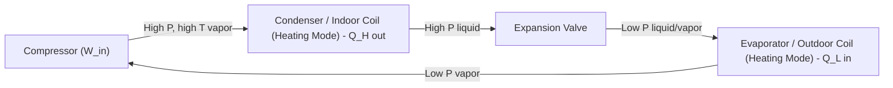

## Heat Pump Systems and Applications

### Overview

A heat pump is a device that transfers thermal energy from a lower-temperature reservoir to a higher-temperature reservoir by consuming external work (mechanical, thermal, or electrical), operating on the same fundamental thermodynamic cycle as a refrigerator. The distinction between "refrigerator" and "heat pump" is one of purpose, not mechanism: a refrigerator's useful output is the heat *removed* from the cold space ($Q_{evap}$), while a heat pump's useful output is the heat *delivered* to the warm space ($Q_{cond}$). Many systems are designed to be reversible, providing both heating and cooling from the same hardware.

### Fundamental Thermodynamics

Heat pumps violate no thermodynamic law because they consume work to move heat "uphill" against the natural temperature gradient, consistent with the Clausius statement of the Second Law: heat cannot spontaneously flow from a colder to a hotter body without external work input.

**Energy Balance (steady-state, vapor-compression heat pump):**

$$Q_H = Q_L + W_{in}$$

where $Q_H$ is heat rejected at the high-temperature sink (useful heating output), $Q_L$ is heat absorbed from the low-temperature source, and $W_{in}$ is compressor work input.

**Coefficient of Performance (Heating Mode):**

$$COP_{HP} = \frac{Q_H}{W_{in}}$$

**Coefficient of Performance (Cooling Mode, same hardware):**

$$COP_{R} = \frac{Q_L}{W_{in}}$$

**Key relationship** between heating and cooling COP for the same cycle:

$$COP_{HP} = COP_{R} + 1$$

This is because the same compressor work $W_{in}$ appears in the denominator of both, while $Q_H = Q_L + W_{in}$ in the numerator of the heating case.

**Carnot (ideal, reversible) heat pump COP:**

$$COP_{HP,Carnot} = \frac{T_H}{T_H - T_L}$$

where temperatures are absolute (K). This represents the theoretical maximum; real cycles achieve a fraction of this due to irreversibilities (compressor inefficiency, heat exchanger pinch losses, throttling losses).

**Key Points:**

- $COP_{HP}$ increases as the temperature lift ($T_H - T_L$) decreases — heat pumps perform best with a small temperature difference between source and sink.
- $COP_{HP} > 1$ always (for a functioning cycle above the Carnot limit floor), meaning more heat is delivered than electrical work consumed — this is the core efficiency advantage over resistive electric heating, where COP = 1.0 by definition.
- Real-world seasonal COP (often called SCOP or SPF — Seasonal Performance Factor) accounts for variable outdoor temperatures and defrost cycles, and is typically lower than the rated COP at design conditions.

### Basic Vapor-Compression Heat Pump Cycle

Identical hardware to a vapor-compression refrigerator: compressor, condenser, expansion valve, evaporator — but with a reversing valve (in air-source heat pumps) allowing the roles of condenser and evaporator to swap between heating and cooling modes.

In **cooling mode**, a reversing valve swaps the roles: the outdoor coil becomes the condenser (rejecting heat outside) and the indoor coil becomes the evaporator (absorbing heat from the room).

### Classification by Heat Source/Sink

| Type | Source (Heating) | Sink (Cooling) | Typical COP (Heating) | Notes |
| --- | --- | --- | --- | --- |
| Air-Source Heat Pump (ASHP) | Outdoor air | Outdoor air | 2.5–4.5 | Most common; COP drops sharply as outdoor temp falls; may need supplemental resistance heat or defrost cycles below ~0°C |
| Ground-Source (Geothermal) Heat Pump (GSHP) | Ground loop (soil/rock) | Ground loop | 3.5–5.5 | Stable source temperature year-round; higher installation cost (drilling/trenching) |
| Water-Source Heat Pump (WSHP) | Lake, river, or well water | Same | 3.5–5.0 | Requires water body access/permitting; often used in loop/district systems |
| Exhaust-Air Heat Pump | Building exhaust air | — | 2.5–3.5 | Recovers heat from ventilation exhaust; common in tight, well-insulated buildings |
| Absorption Heat Pump | Heat-driven (gas/waste heat) | — | COP ~1.3–1.7 (thermal input basis) | Uses heat instead of electricity as primary driver (see Absorption Refrigeration Cycles) |

### Air-Source Heat Pumps (ASHP)

The most widely deployed type due to low installation complexity (no ground loop required).

**Key Points:**

- Performance is highly sensitive to outdoor air temperature: as $T_L$ (outdoor air) drops, the temperature lift increases and COP falls.
- **Frost/defrost cycles:** Below approximately 5°C outdoor air with high humidity, frost forms on the outdoor coil, degrading heat transfer; the unit periodically reverses to defrost, temporarily reducing delivered heat and consuming extra energy.
- **Cold-climate ASHPs** use enhanced vapor injection (EVI) compressors or variable-speed (inverter) compressors to maintain acceptable capacity and COP down to outdoor temperatures as low as −20°C to −30°C [Inference: specific low-temperature performance is manufacturer- and model-dependent].
- **Balance point:** the outdoor temperature at which the heat pump's heating capacity exactly matches the building's heat loss; below this point, supplemental heat (electric resistance strip heat or a backup furnace, in "dual-fuel" configurations) is needed.

### Ground-Source (Geothermal) Heat Pumps (GSHP)

Uses the relatively stable temperature of the ground (typically 10–16°C at a few meters depth in many temperate climates) as the heat source/sink, avoiding the seasonal extremes air-source systems face.

**Configurations:**

- **Closed-loop horizontal:** Pipe loops buried 1–2 m deep, requiring substantial land area.
- **Closed-loop vertical (borehole):** Pipes in deep vertical boreholes (50–150 m), used where land area is limited.
- **Open-loop:** Draws groundwater directly from a well, exchanges heat, and returns it (requires favorable water quality/regulatory approval).
- **Pond/lake loop:** Submerged loop in an adequately sized body of water.

**Key Points:**

- Higher upfront capital cost (drilling/trenching) but higher and more stable COP, and longer equipment life due to less thermal cycling stress than ASHPs.
- Ground loop heat exchange is typically modeled using the **line-source** or **cylindrical-source** analytical methods for borehole sizing. [Inference: exact sizing methodology depends on software/standard used, e.g., IGSHPA guidelines]

### Applications

**Space Heating and Cooling (Residential/Commercial HVAC):**

Reversible ASHPs and GSHPs are widely used as combined heating/cooling systems, replacing separate furnace and air-conditioner units.

**Heat Pump Water Heaters (HPWH):**

Extract heat from ambient (often indoor/basement or outdoor) air to heat domestic hot water, achieving COP of roughly 2.0–3.5, substantially better than resistive electric water heaters (COP = 1.0).

**Industrial Process Heat Pumps:**

Recover low-grade waste heat (e.g., from cooling towers, exhaust streams) and upgrade it to a higher, process-useful temperature — used in food processing, drying, distillation preheating, and district heating.

**District Heating Integration:**

Large-scale heat pumps extract heat from sewage, seawater, lakes, or industrial waste heat to supply district heating networks, especially prominent in Scandinavian and Northern European systems. [Inference: deployment scale is region- and policy-dependent]

**High-Temperature Heat Pumps (Industrial Decarbonization):**

Emerging heat pump technology targeting sink temperatures of 100–160°C+ for industrial process heat, using refrigerants and compressor designs suited to high-pressure ratios — an active area of technology development supporting industrial electrification. [Inference: this is a rapidly evolving field; specific commercial performance figures should be verified against current manufacturer data]

**Reversible (Heat Pump) Chillers:**

Chillers with a reversing valve that can supply chilled water for cooling or hot water for heating from the same unit, common in commercial buildings with four-pipe or two-pipe HVAC distribution.

### Refrigerant Selection for Heat Pumps

**Key Points:**

- Refrigerant choice affects achievable condensing temperature, pressure ratio, and environmental impact (GWP, ODP).
- Traditional HFCs (e.g., R-410A) are being phased down under regulations such as the Kigali Amendment to the Montreal Protocol, driving adoption of lower-GWP alternatives.
- **CO₂ (R-744)** heat pumps use a transcritical cycle (operating above CO₂'s critical point of ~31°C/7.4 MPa in the heat-rejection process) and are especially effective for high-temperature water heating applications (e.g., CO₂ heat pump water heaters common in some markets) due to the favorable temperature glide during gas cooling. [Behavior may vary by specific system design and operating conditions]
- Low-GWP HFO refrigerants (e.g., R-1234ze, R-32) are increasingly used as transitional or long-term alternatives balancing performance, flammability class, and environmental impact.

### Performance Metrics and Standards

| Metric | Definition | Region/Context |
| --- | --- | --- |
| COP | $Q_H / W_{in}$ at a specified rating condition | General thermodynamic metric |
| HSPF (Heating Seasonal Performance Factor) | Seasonal heating output (Btu) / seasonal electrical energy input (Wh) | Common in North America (ASHP rating) |
| SCOP | Seasonal Coefficient of Performance, averaged over a defined climate/heating season | Common in Europe (Ecodesign/EN 14825) |
| SEER | Seasonal Energy Efficiency Ratio (cooling mode metric, analogous concept) | North America, cooling performance |

**Note:** These seasonal metrics [Behavior may vary by climate zone, standard test cycle used, and specific regulatory version] are generally lower than peak/rated COP because they average performance across a full range of outdoor conditions, including low-COP cold snaps and defrost losses.

### Practical Example

**Given:** An air-source heat pump operating in heating mode delivers $Q_H = 8\ \text{kW}$ of heating to a home while consuming $W_{in} = 2.2\ \text{kW}$ of electrical power.

**Find:** COP (heating), heat extracted from outdoor air, and equivalent cooling-mode COP for the same hardware/conditions (approximate).

**Solution:**

$$COP_{HP} = \frac{Q_H}{W_{in}} = \frac{8}{2.2} \approx 3.64$$

$$Q_L = Q_H - W_{in} = 8 - 2.2 = 5.8\ \text{kW}$$

Approximate cooling-mode COP for the same compressor work (illustrative relationship, assuming similar operating conditions):

$$COP_R = COP_{HP} - 1 \approx 2.64$$

This illustrates that for every 1 kW of electricity consumed, the heat pump delivers roughly 3.64 kW of heat — around 3.64 times more effective than resistive electric heating at the same electrical input.

### Heat Pump vs. Resistive Heating vs. Combustion Furnace (Comparison)

| Aspect | Heat Pump | Electric Resistance | Gas/Oil Furnace |
| --- | --- | --- | --- |
| COP / Efficiency | 2.5–5.5 (varies with $\Delta T$) | 1.0 (by definition) | 0.8–0.98 (AFUE, combustion-based) |
| Primary energy source | Electricity (+ ambient heat) | Electricity | Fossil fuel combustion |
| Direct on-site emissions | None | None | CO₂, NOx, combustion byproducts |
| Cooling capability | Yes (reversible) | No | No |
| Performance vs. outdoor temp | Degrades in cold climates (ASHP) | Unaffected | Unaffected |
| Typical capital cost | Higher | Lowest | Moderate |

### System Schematic — Reversible Air-Source Heat Pump (SVG Diagram)

<svg xmlns="http://www.w3.org/2000/svg" viewBox="0 0 900 420" font-family="sans-serif">
<text x="450" y="25" font-size="18" text-anchor="middle" font-weight="bold">Reversible Air-Source Heat Pump (svg_diagram)</text>

<circle cx="450" cy="200" r="45" fill="#f5b041" stroke="#333" stroke-width="2" />
<text x="450" y="196" text-anchor="middle" font-size="13">Compressor</text>
<text x="450" y="212" text-anchor="middle" font-size="11">W_in</text>

<rect x="410" y="60" width="80" height="50" fill="#d5d8dc" stroke="#333" stroke-width="2" />
<text x="450" y="82" text-anchor="middle" font-size="11">Reversing</text>
<text x="450" y="97" text-anchor="middle" font-size="11">Valve</text>

<rect x="60" y="150" width="180" height="90" fill="#85c1e9" stroke="#333" stroke-width="2" />
<text x="150" y="185" text-anchor="middle" font-size="13">Outdoor Coil</text>
<text x="150" y="203" text-anchor="middle" font-size="11">(Evaporator - Heating)</text>
<text x="150" y="221" text-anchor="middle" font-size="11">(Condenser - Cooling)</text>

<rect x="660" y="150" width="180" height="90" fill="#f1948a" stroke="#333" stroke-width="2" />
<text x="750" y="185" text-anchor="middle" font-size="13">Indoor Coil</text>
<text x="750" y="203" text-anchor="middle" font-size="11">(Condenser - Heating)</text>
<text x="750" y="221" text-anchor="middle" font-size="11">(Evaporator - Cooling)</text>

<polygon points="280,340 310,325 310,355" fill="#ccc" stroke="#333" stroke-width="1.5" />
<text x="295" y="375" text-anchor="middle" font-size="10">Outdoor EEV</text>
<polygon points="620,340 590,325 590,355" fill="#ccc" stroke="#333" stroke-width="1.5" />
<text x="605" y="375" text-anchor="middle" font-size="10">Indoor EEV</text>

<line x1="240" y1="340" x2="280" y2="340" stroke="#28b463" stroke-width="2" />
<line x1="310" y1="340" x2="590" y2="340" stroke="#28b463" stroke-width="2" />
<line x1="620" y1="340" x2="660" y2="340" stroke="#28b463" stroke-width="2" />
<line x1="150" y1="240" x2="150" y2="340" stroke="#28b463" stroke-width="2" />
<line x1="750" y1="240" x2="750" y2="340" stroke="#28b463" stroke-width="2" />
<text x="450" y="360" text-anchor="middle" font-size="10" fill="#1e8449">Liquid line (bidirectional flow direction depends on mode)</text>

<line x1="150" y1="150" x2="150" y2="90" stroke="#c0392b" stroke-width="2" />
<line x1="150" y1="90" x2="410" y2="85" stroke="#c0392b" stroke-width="2" marker-end="url(#arrow2)" />
<line x1="750" y1="150" x2="750" y2="90" stroke="#154360" stroke-width="2" />
<line x1="750" y1="90" x2="490" y2="85" stroke="#154360" stroke-width="2" marker-end="url(#arrow2)" />
<line x1="450" y1="110" x2="450" y2="155" stroke="#333" stroke-width="2" marker-end="url(#arrow2)" />
<line x1="450" y1="60" x2="450" y2="20" stroke="none" />
<text x="450" y="410" font-size="11" text-anchor="middle" fill="#555">Reversing valve swaps refrigerant flow direction to switch between heating and cooling modes</text>

</svg>

### Sizing and Design Considerations

**Key Points:**

- **Heat loss/gain calculation** (e.g., Manual J in North America, or equivalent local standards) is required to correctly size the heat pump to the building's peak heating and cooling loads.
- **Balance-point analysis** determines whether backup heat is needed and at what capacity, particularly for air-source systems in cold climates.
- **Variable-speed (inverter-driven) compressors** modulate capacity to match part-load conditions, improving part-load COP and reducing cycling losses compared to fixed-speed, on/off compressors.
- **Defrost strategy** (demand-defrost vs. timed defrost) affects real-world seasonal efficiency in humid, near-freezing climates.
- **Sink/source temperature glide** matters for refrigerant selection: zeotropic refrigerant blends exhibit temperature glide during phase change, which can be leveraged to better match counter-flow heat exchanger temperature profiles (reducing exergy destruction).

### Related Topics

- Vapor-Compression Refrigeration Cycle
- Absorption Refrigeration Cycles
- Second-Law (Exergy) Analysis of Heat Pump Cycles
- Transcritical CO₂ (R-744) Refrigeration and Heat Pump Cycles
- Ground-Source Heat Exchanger Design and Borehole Sizing
- District Heating and Large-Scale Heat Pump Integration
- Refrigerant Regulations: Kigali Amendment and GWP Phase-Down
- Variable Refrigerant Flow (VRF) Systems
- Industrial High-Temperature Heat Pumps for Process Heat