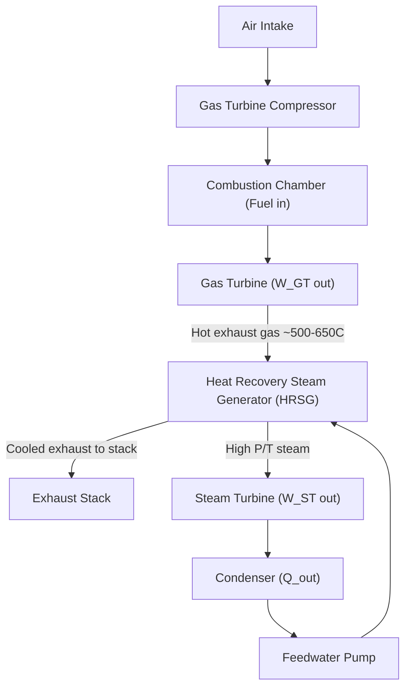
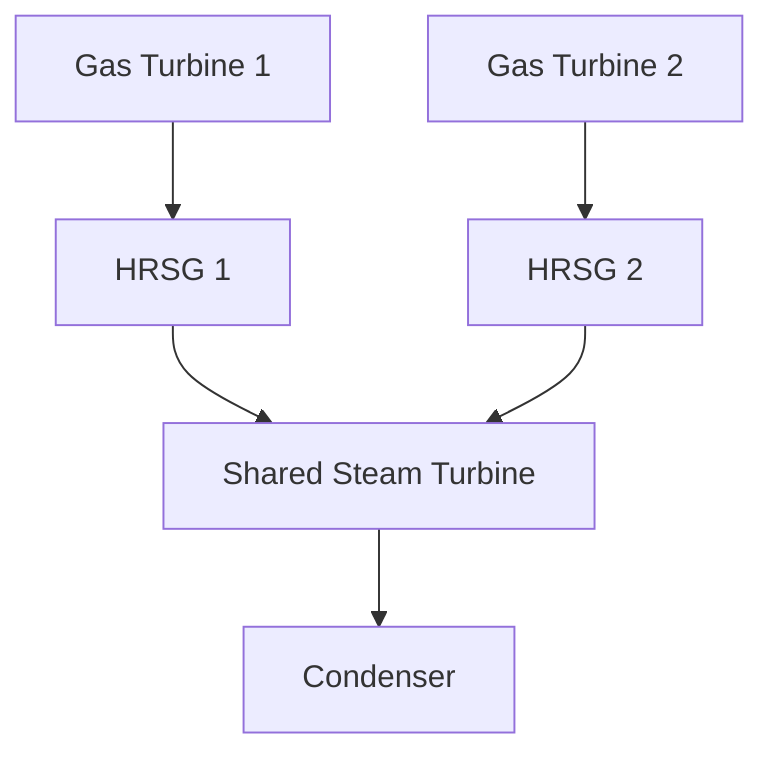

## Combined Gas-Vapor Power Cycles

### Overview

A combined gas-vapor power cycle (commonly called a "combined cycle") couples a gas turbine (Brayton cycle) topping cycle with a steam turbine (Rankine cycle) bottoming cycle, using the gas turbine's high-temperature exhaust as the heat source for steam generation instead of rejecting it directly to the atmosphere. This configuration captures thermal energy that would otherwise be wasted, achieving overall thermal efficiencies substantially higher than either cycle operating alone — modern combined-cycle power plants (CCPP) routinely exceed 55–63% thermal efficiency, compared to roughly 35–40% for a simple-cycle gas turbine or subcritical steam plant alone.

### Rationale: Why Combine Brayton and Rankine Cycles

**Key Points:**

- Gas turbines operate at very high turbine inlet temperatures (1300–1600°C in modern units) but reject heat at a high exhaust temperature (typically 500–650°C), representing substantial unused exergy if vented directly.
- Steam (Rankine) cycles are efficient at converting heat to work at moderate temperatures but require an external heat source; using gas turbine exhaust as that heat source avoids additional fuel combustion for the bottoming cycle (in an unfired configuration).
- The combination exploits the different optimal temperature ranges of each cycle: Brayton cycle excels at high temperatures, Rankine cycle excels at converting the remaining moderate-temperature heat to additional work, closely approximating the ideal Carnot efficiency envelope across a wider net temperature span than either cycle alone.

### Basic Combined Cycle Configuration

The core hardware sequence: Gas Turbine → Heat Recovery Steam Generator (HRSG) → Steam Turbine.

### Thermodynamic Analysis

**Gas Turbine (Brayton) Topping Cycle Efficiency:**

$$\eta_{GT} = \frac{W_{net,GT}}{Q_{in}} = \frac{W_{GT} - W_{comp}}{Q_{in}}$$

**Steam Turbine (Rankine) Bottoming Cycle Efficiency:**

$$\eta_{ST} = \frac{W_{net,ST}}{Q_{HRSG}}$$

where $Q_{HRSG}$ is the heat recovered from gas turbine exhaust and transferred to the steam cycle in the HRSG.

**Overall Combined Cycle Efficiency:**

$$\eta_{CC} = \frac{W_{net,GT} + W_{net,ST}}{Q_{in}}$$

This can be expressed in terms of individual cycle efficiencies and the fraction of gas turbine exhaust heat recovered ($u$, the utilization factor of the HRSG):

$$\eta_{CC} = \eta_{GT} + \eta_{ST}(1 - \eta_{GT}) \cdot u$$

For an ideal case where all rejected Brayton-cycle heat is recovered ($u = 1$):

$$\eta_{CC} = \eta_{GT} + \eta_{ST} - \eta_{GT}\eta_{ST}$$

**Key Points:**

- Because $\eta_{CC} = \eta_{GT} + \eta_{ST}(1-\eta_{GT})$, the combined efficiency always exceeds either individual cycle's efficiency, since the bottoming cycle "recovers" a fraction of the topping cycle's rejected heat as additional work.
- Example: if $\eta_{GT} = 0.40$ and $\eta_{ST} = 0.30$ (bottoming cycle efficiency on recovered heat), then $\eta_{CC} = 0.40 + 0.30(1-0.40) = 0.40 + 0.18 = 0.58$, i.e., 58% overall — significantly higher than either 40% or 30% alone.

### Heat Recovery Steam Generator (HRSG)

The HRSG is the critical link between the two cycles — a heat exchanger (or series of heat exchangers) that transfers gas turbine exhaust heat to the water/steam side without direct mixing of the two working fluids.

**HRSG Types:**

- **Single-pressure HRSG:** Simplest design, generates steam at one pressure level; lower cost but lower heat recovery effectiveness due to pinch-point limitations.
- **Dual-pressure HRSG:** Generates steam at high and low pressure levels, improving the match between the gas-side cooling curve and the steam-side heating curve, increasing recovered energy.
- **Triple-pressure HRSG (with reheat):** Most common in large modern utility-scale combined-cycle plants; three pressure levels (high, intermediate, low) plus a reheat stage closely match the gas-side temperature profile, minimizing exergy destruction due to temperature mismatch (pinch and approach point losses).

**Key HRSG Design Parameters:**

- **Pinch point:** The minimum temperature difference between the gas-side temperature and the saturation temperature of the steam-side fluid at the point where the evaporator section begins; a smaller pinch point improves heat recovery but requires more heat transfer surface area (higher cost).
- **Approach point:** The temperature difference between the saturation temperature and the economizer outlet water temperature, chosen to prevent premature boiling in the economizer.
- **Stack temperature:** The exhaust gas temperature leaving the HRSG to atmosphere; lower stack temperatures mean more heat has been recovered, but excessively low temperatures risk acid-dew-point corrosion, particularly with sulfur-containing fuels.

### HRSG Temperature Profile (Conceptual)

<svg xmlns="http://www.w3.org/2000/svg" viewBox="0 0 850 480" font-family="sans-serif">
<text x="425" y="25" font-size="18" text-anchor="middle" font-weight="bold">HRSG Gas-Side / Steam-Side Temperature Profile (svg_diagram)</text>

<line x1="80" y1="420" x2="780" y2="420" stroke="#333" stroke-width="2" />
<line x1="80" y1="420" x2="80" y2="60" stroke="#333" stroke-width="2" />
<text x="430" y="455" text-anchor="middle" font-size="13">Heat Transferred (Q)</text>
<text x="30" y="240" text-anchor="middle" font-size="13" transform="rotate(-90 30 240)">Temperature</text>

<polyline points="100,90 250,150 400,210 550,260 730,300" fill="none" stroke="#e74c3c" stroke-width="3" />
<text x="620" y="290" font-size="12" fill="#e74c3c">Gas-side cooling curve</text>

<polyline points="100,380 300,340 300,220 500,220 500,150 730,110" fill="none" stroke="#2980b9" stroke-width="3" />
<text x="540" y="140" font-size="12" fill="#2980b9">Steam-side heating curve</text>

<line x1="300" y1="220" x2="300" y2="210" stroke="#000" stroke-width="1" />
<circle cx="300" cy="215" r="4" fill="#000" />
<text x="330" y="205" font-size="11">Pinch Point</text>

<text x="180" y="410" font-size="11" text-anchor="middle">Economizer</text>

<text x="400" y="410" font-size="11" text-anchor="middle">Evaporator</text>

<text x="620" y="410" font-size="11" text-anchor="middle">Superheater</text>

<text x="740" y="315" font-size="11" fill="`#e74c3c`">Stack Temp</text>

</svg>

### Supplementary Firing (Duct Burners)

Some combined-cycle configurations include duct burners in the HRSG's exhaust duct, adding supplemental fuel combustion directly in the gas turbine exhaust stream (which still contains significant oxygen due to the excess air used in gas turbine combustion). This raises the gas temperature entering the HRSG, increasing steam production and steam turbine output.

**Key Points:**

- Supplementary firing improves overall plant flexibility (rapid steam-side output boost) and can increase total plant output.
- It generally reduces the incremental combined-cycle efficiency benefit of that added fuel (the supplementary fuel is converted to power only via the lower-efficiency Rankine bottoming cycle, not the higher-efficiency Brayton topping cycle), though it can still be efficient relative to a standalone boiler.
- Commonly used to allow load-following flexibility without cycling the gas turbine itself.

### Configuration Variants

**Single-Shaft Configuration:**

Gas turbine, steam turbine, and generator are mechanically coupled on a single shaft (one generator). Compact, lower footprint, but less operational flexibility (typically one gas turbine per one steam turbine, fixed ratio).

**Multi-Shaft Configuration:**

One or more gas turbines (each with their own HRSG) feed a single, larger steam turbine on a separate shaft. Common ratios include 2-on-1 or 3-on-1 (gas turbines to steam turbines), offering flexibility to operate gas turbines independently while the steam turbine follows combined HRSG output.

### Combined Cycle Cogeneration (CHP Integration)

When the steam bottoming cycle is designed to extract process steam (rather than expanding fully to condenser pressure) for industrial or district heating use, the plant becomes a **combined-cycle cogeneration (CCHP)** facility. This is covered in depth under dedicated cogeneration topics, but the essential distinction: some steam is extracted at intermediate pressure for useful thermal output rather than continuing through the turbine to generate additional electrical work, trading some electrical output for a highly efficient use of the extracted heat (total utilization efficiency, electricity + heat, can exceed 80%). [Inference: exact total utilization efficiency is installation-specific]

### Performance Comparison

| Cycle Type | Typical Thermal Efficiency (LHV basis) | Notes |
| --- | --- | --- |
| Simple-cycle gas turbine | 30–42% | Efficiency rises with turbine inlet temperature and pressure ratio |
| Subcritical steam (Rankine) plant | 33–40% | Depends on steam conditions and reheat |
| Supercritical/ultra-supercritical steam plant | 42–47% | Higher steam pressure/temperature |
| Combined cycle (unfired) | 55–63% | State-of-the-art units with high turbine inlet temperatures (H/J-class turbines) |
| Combined cycle (with supplementary firing) | Slightly lower marginal efficiency on added fuel | Trades some efficiency for output flexibility |

[Behavior/exact figures may vary by manufacturer, turbine class, ambient conditions, and plant vintage; the values above reflect commonly cited industry ranges.]

### Practical Example

**Given:** A combined-cycle plant's gas turbine has $\eta_{GT} = 0.38$ (38%) thermal efficiency. The HRSG recovers exhaust heat driving a steam bottoming cycle with $\eta_{ST} = 0.28$ (28%) efficiency on the recovered heat, and essentially all rejected gas turbine heat is utilized ($u \approx 1$).

**Find:** Overall combined-cycle efficiency.

**Solution:**

$$\eta_{CC} = \eta_{GT} + \eta_{ST}(1 - \eta_{GT})$$

$$\eta_{CC} = 0.38 + 0.28(1 - 0.38) = 0.38 + 0.28(0.62) = 0.38 + 0.1736 = 0.5536$$

$$\eta_{CC} \approx 55.4\%$$

This demonstrates the characteristic combined-cycle efficiency gain: roughly 17 percentage points of additional efficiency captured purely from exhaust heat that a simple-cycle gas turbine plant would otherwise reject to atmosphere.

### Key Design and Operational Considerations

**Key Points:**

- **Turbine inlet temperature (TIT)** is the single most influential parameter on gas turbine (and thus combined-cycle) efficiency; advances in blade cooling and materials (single-crystal superalloys, thermal barrier coatings) have progressively raised achievable TIT.
- **Ambient conditions** (temperature, altitude, humidity) significantly affect gas turbine output and efficiency (air density effects on compressor mass flow); this is a well-known and quantifiable behavioral characteristic of gas turbine performance.
- **Startup time and cycling capability:** Combined-cycle plants are generally more flexible than large coal/nuclear steam plants but less flexible than simple-cycle gas turbines or reciprocating engines for very fast-response grid balancing; fast-start combined-cycle designs have been developed specifically to improve ramp rates for renewable-integration grid support.
- **Water consumption:** The steam bottoming cycle requires cooling (wet cooling tower, air-cooled condenser, or once-through cooling), which is a major siting and environmental consideration, particularly air-cooled condenser designs used in water-scarce regions (at some efficiency penalty relative to wet cooling).
- **Emissions:** Combined-cycle plants generally have lower CO₂ emissions per unit of electricity generated than simple-cycle or coal-fired steam plants, due to higher overall fuel-to-electricity conversion efficiency, though actual emissions depend on fuel type and plant-specific efficiency.

### Related Topics

- Brayton Cycle (Gas Turbine Power Cycle) Fundamentals
- Rankine Cycle and Steam Power Plant Fundamentals
- Cogeneration and Combined Heat and Power (CHP) Systems
- Heat Recovery Steam Generator (HRSG) Design and Pinch Analysis
- Gas Turbine Blade Cooling and Turbine Inlet Temperature Limits
- Exergy (Second-Law) Analysis of Combined Cycle Plants
- Supercritical and Ultra-Supercritical Steam Cycles
- Fast-Start Combined Cycle Plant Design for Grid Flexibility
- Integrated Gasification Combined Cycle (IGCC)