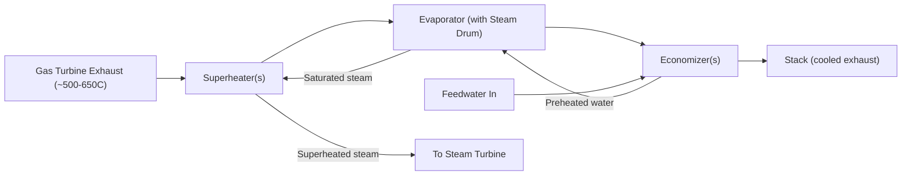

## Heat Recovery Steam Generators

### Overview

A Heat Recovery Steam Generator (HRSG) is a specialized heat exchanger that captures thermal energy from a hot gas stream — most commonly gas turbine exhaust — and uses it to generate steam, without any additional combustion in the simplest (unfired) configuration. The HRSG is the essential thermal bridge in a combined-cycle power plant, converting the topping (Brayton) cycle's rejected heat into the driving heat source for the bottoming (Rankine) cycle. HRSGs are also used in industrial cogeneration applications wherever a hot exhaust or process gas stream is available (e.g., reciprocating engine exhaust, industrial furnace flue gas).

### Role Within the Combined Cycle

Gas turbine exhaust leaves the turbine at high temperature (typically 500–650°C) but atmospheric pressure, carrying substantial usable exergy. Rather than venting this directly to a stack, the HRSG transfers this heat across tube banks to pressurized water/steam, producing steam suitable for driving a steam turbine — enabling the overall efficiency gains characteristic of combined-cycle plants (see Combined Gas-Vapor Power Cycles).

### Fundamental HRSG Sections

An HRSG is internally divided into sections corresponding to distinct phases of the water/steam heating process, arranged so the gas flows across each section in sequence (typically from hottest to coolest along the gas path, with water/steam flowing counter-currently for optimal heat transfer):

1. **Superheater:** Located at the hottest end of the gas path (closest to the gas turbine exit); raises saturated steam from the evaporator to superheated conditions suitable for turbine inlet.
2. **Evaporator:** Boils saturated water into saturated steam at constant pressure/temperature (isothermal phase-change section); typically contains a steam drum for liquid/vapor separation.
3. **Economizer:** Located at the coolest end of the gas path; preheats feedwater close to (but below) saturation temperature before it enters the evaporator, extracting the last usable heat before the gas exits to the stack.

**Key Points:**

- This sectional arrangement matches the counter-flow heat exchanger principle: the hottest gas contacts the hottest working fluid (superheated steam), and the coolest gas contacts the coolest working fluid (incoming feedwater), maximizing overall heat transfer effectiveness.
- Multi-pressure HRSGs repeat this three-section pattern (economizer–evaporator–superheater) at each pressure level, arranged along the gas path to closely track the gas-side cooling curve.

### HRSG Gas Flow Path and Sections

### Classification by Pressure Levels

| Configuration | Pressure Levels | Typical Application | Relative Efficiency |
| --- | --- | --- | --- |
| Single-pressure | 1 | Smaller/simpler cogeneration plants, lower-cost installations | Baseline (lowest heat recovery effectiveness) |
| Dual-pressure | 2 (HP, LP) | Mid-size combined-cycle plants | Improved gas/steam curve matching |
| Triple-pressure (with reheat) | 3 (HP, IP, LP) + reheat | Large utility-scale combined-cycle plants | Highest heat recovery effectiveness, closest match to gas-side cooling curve |

**Key Points:**

- Adding pressure levels allows the steam-side heating curve to more closely track the continuously falling gas-side temperature, reducing exergy destruction from temperature mismatch across the heat exchanger.
- The low-pressure (LP) section often also serves to further cool the exhaust gas after the higher-pressure sections have extracted heat down to a limited temperature approach, squeezing out additional recoverable energy.
- Reheat sections (in triple-pressure designs) reheat steam that has partially expanded in the high-pressure steam turbine section before it continues through intermediate- and low-pressure turbine stages — mirroring conventional reheat-Rankine cycle practice, further improving overall cycle efficiency and reducing turbine exhaust moisture content.

### Classification by Circulation Type

**Natural Circulation HRSG:**

Relies on density difference between the water in the downcomer (cooler, denser) and the steam-water mixture in the riser tubes (heated, less dense) to drive circulation without a pump, similar to a natural-circulation boiler. Requires a steam drum positioned above the evaporator tube bank to allow adequate driving head.

**Forced Circulation HRSG:**

Uses a circulation pump to actively move water/steam mixture through the evaporator tubes, allowing greater design flexibility (e.g., horizontal gas-flow HRSG configurations) independent of the natural buoyancy-driven flow requirements.

**Once-Through HRSG:**

No steam drum; water is converted directly to superheated steam in a single pass through continuous tubing (similar in principle to a supercritical/once-through boiler). Offers fast startup and reduced thick-walled drum components (beneficial for cycling plants), but requires precise feedwater flow control since there is no drum to buffer transients.

### Key Design Parameters

**Pinch Point:**

The minimum temperature difference between the gas-side temperature and the steam/water saturation temperature, occurring at the point where the evaporator section begins (on the gas-inlet side of the evaporator). A smaller pinch point:

- Increases the amount of heat recovered (more steam generated).
- Requires more heat transfer surface area (more tube banks), raising capital cost and gas-side pressure drop.

$$\Delta T_{pinch} = T_{gas,evap\ inlet} - T_{sat}$$

**Approach Point:**

The temperature difference between the saturation temperature and the economizer's water outlet temperature, deliberately maintained to prevent premature boiling (steaming) within the economizer tubes, which could cause flow instability and water-hammer-like effects.

$$\Delta T_{approach} = T_{sat} - T_{water, econ\ outlet}$$

**Stack Temperature:**

The exhaust gas temperature exiting the HRSG to atmosphere. Lower stack temperatures indicate more effective heat recovery, but excessive cooling risks:

- **Acid dew point corrosion:** If sulfur is present in the fuel, condensation of sulfuric acid on cool heat-transfer surfaces can cause severe corrosion; stack temperature is typically kept above the acid dew point (commonly cited in the range of roughly 120–150°C for many fuels, though the exact value is fuel-sulfur-content-dependent). [Inference: exact acid dew point is fuel-composition-specific and should be verified against fuel analysis for a given installation]

### Pinch and Approach Point Illustration

<svg xmlns="http://www.w3.org/2000/svg" viewBox="0 0 850 420" font-family="sans-serif">
<text x="425" y="25" font-size="18" text-anchor="middle" font-weight="bold">HRSG Pinch and Approach Point (svg_diagram)</text>
<line x1="80" y1="370" x2="780" y2="370" stroke="#333" stroke-width="2" />
<line x1="80" y1="370" x2="80" y2="50" stroke="#333" stroke-width="2" />
<text x="430" y="400" text-anchor="middle" font-size="13">Heat Transferred (Q)</text>
<text x="30" y="210" text-anchor="middle" font-size="13" transform="rotate(-90 30 210)">Temperature</text>

<polyline points="100,80 250,140 400,190 550,240 730,280" fill="none" stroke="#e74c3c" stroke-width="3" />
<text x="600" y="270" font-size="12" fill="#e74c3c">Gas-side temperature</text>

<polyline points="100,340 280,310 280,180 480,180 480,120 730,90" fill="none" stroke="#2980b9" stroke-width="3" />
<text x="530" y="110" font-size="12" fill="#2980b9">Steam/water side</text>

<line x1="280" y1="190" x2="280" y2="180" stroke="#000" stroke-width="2" />
<text x="300" y="175" font-size="11" font-weight="bold">Pinch Point</text>

<line x1="260" y1="300" x2="260" y2="310" stroke="#000" stroke-width="2" />
<text x="130" y="330" font-size="11" font-weight="bold">Approach Point</text>

<text x="180" y="390" font-size="11" text-anchor="middle">Economizer</text>

<text x="380" y="390" font-size="11" text-anchor="middle">Evaporator</text>

<text x="620" y="390" font-size="11" text-anchor="middle">Superheater</text>

</svg>

### Supplementary (Duct) Firing

Many HRSGs incorporate duct burners positioned in the exhaust gas path before the superheater, burning additional fuel using the residual oxygen present in gas turbine exhaust (gas turbines operate with substantial excess air, typically leaving 12–16% oxygen in the exhaust — enough to support significant supplementary combustion without additional air supply).

**Key Points:**

- Increases gas-side temperature entering the HRSG, boosting steam production and steam turbine output — useful for peak-load flexibility or compensating for reduced gas turbine output at high ambient temperatures.
- Can be used to enable operation of the steam cycle at higher output independent of gas turbine load, valuable in cogeneration applications where process steam demand may exceed what unfired HRSG heat recovery alone can supply.
- Requires HRSG materials and burner design rated for the elevated temperatures; excessive duct firing can also raise stack emissions (NOx, CO) if not properly controlled.

### Structural/Layout Configurations

**Horizontal Gas Flow (Vertical Tube) HRSG:**

Gas flows horizontally through the HRSG; tube bundles are oriented vertically. Common in natural- or forced-circulation designs; typically requires more plot length but lower structural height.

**Vertical Gas Flow (Horizontal Tube) HRSG:**

Gas flows vertically (usually upward) through the HRSG; tube bundles are horizontal. Common where plot space is limited, often paired with forced-circulation designs since natural circulation is harder to achieve with horizontal tube orientation.

### Materials and Mechanical Considerations

**Key Points:**

- HRSG tube materials are selected based on local gas and steam temperatures: carbon steel is typically adequate for economizer sections (lower temperature), while superheater sections operating at higher temperatures may require low-alloy or stainless steels.
- **Thermal cycling stress** is a major HRSG durability concern, particularly for plants designed for frequent starts/stops (peaking or load-following combined-cycle plants) rather than continuous baseload operation; thick-walled components like steam drums are especially susceptible to thermal fatigue from rapid temperature changes.
- **Fin-tube heat exchanger surfaces** (finned tubes) are commonly used to increase gas-side heat transfer area, compensating for the relatively low gas-side heat transfer coefficient (compared to the water/steam side) inherent to gas-to-liquid heat exchange.
- **Feedwater chemistry control** (dissolved oxygen removal via deaerator, pH control, dissolved solids limits) is essential to prevent corrosion and scaling within HRSG tubes, following similar water treatment principles as conventional boilers.

### Practical Example: Pinch Point Impact on Heat Recovery

**Given (illustrative):** Gas turbine exhaust enters an HRSG evaporator section at $T_{gas} = 550\text{°C}$. Steam is generated at a saturation temperature of $T_{sat} = 280\text{°C}$ (corresponding to a chosen steam pressure). Two pinch-point design options are compared: 20°C and 10°C.

**Analysis:**

With a 20°C pinch point:

$$T_{gas,evap\ inlet} - T_{sat} = 20\text{°C} \Rightarrow T_{gas,evap\ inlet} = 300\text{°C}$$

With a 10°C pinch point:

$$T_{gas,evap\ inlet} - T_{sat} = 10\text{°C} \Rightarrow T_{gas,evap\ inlet} = 290\text{°C}$$

**Interpretation:** The tighter 10°C pinch point allows the gas to be cooled further before reaching the evaporator's thermal limit, recovering additional heat and generating more steam mass flow for the same gas turbine exhaust conditions — but requires a larger evaporator heat transfer surface area to achieve the smaller temperature differential, increasing capital cost. This exemplifies the fundamental HRSG design trade-off between heat recovery effectiveness and capital cost/size. [Behavior may vary based on specific gas mass flow rate, tube bank geometry, and heat transfer coefficients not specified in this simplified illustration]

### HRSG vs. Conventional (Fired) Boiler Comparison

| Aspect | HRSG (Unfired) | Conventional Fired Boiler |
| --- | --- | --- |
| Heat source | Gas turbine exhaust (waste heat) | Direct fuel combustion |
| Additional fuel consumption | None (unfired) or supplementary (duct-fired) | Full fuel combustion for all heat generated |
| Gas-side temperature | Moderate (500–650°C typical) | Very high near burner (1000°C+ near furnace) |
| Heat transfer surface | Extensive finned-tube surface (lower gas-side ΔT) | Radiant furnace section + convective surfaces |
| Typical role | Bottoming cycle heat source in combined cycle | Standalone steam generation |
| Efficiency context | Enables 55%+ combined-cycle plant efficiency | 85-90%+ boiler efficiency alone, but lower overall cycle efficiency without a topping cycle |

### Related Topics

- Combined Gas-Vapor Power Cycles
- Rankine Cycle and Steam Power Plant Fundamentals
- Cogeneration and Combined Heat and Power (CHP) Systems
- Boiler Feedwater Treatment and Chemistry
- Pinch Analysis and Heat Exchanger Network Design
- Gas Turbine Exhaust Characteristics and Emissions
- Steam Turbine Reheat Cycles
- Thermal Cycling Fatigue in Power Plant Components
- Duct Burner Design and Supplementary Firing Control