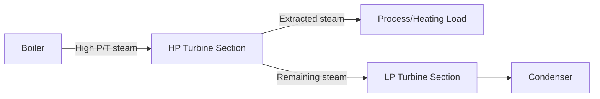
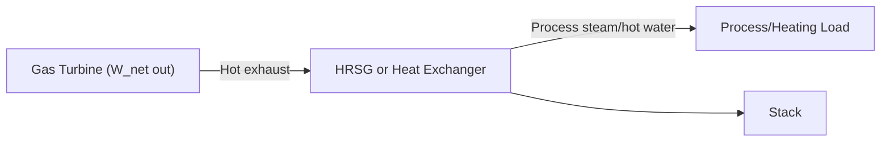

## Cogeneration and Combined Heat and Power

### Overview

Cogeneration, also known as Combined Heat and Power (CHP), is the simultaneous production of electrical (or mechanical) power and useful thermal energy from a single fuel source or energy input. Rather than generating electricity alone and rejecting the "waste" heat to the environment (as in a conventional condensing power plant), a cogeneration system captures a substantial portion of that heat for productive use — space heating, process steam, hot water, or process heat — dramatically increasing the overall utilization efficiency of the input fuel.

### Fundamental Rationale

A conventional condensing power plant converts roughly 33–45% of fuel energy into electricity, rejecting the remainder as low-grade heat to a condenser and ultimately the environment. A cogeneration plant, by contrast, redirects much of that rejected heat to a useful purpose, achieving overall **utilization efficiencies** (electricity + useful heat, combined) of 70–90%, though at a generally lower net *electrical* efficiency than a standalone condensing plant optimized purely for power.

**Key Points:**

- Separate generation of the same electricity and heat quantities (via a standalone power plant plus a separate boiler/furnace) requires more total fuel input than a single, well-integrated cogeneration system providing both.
- The efficiency benefit arises because a single fuel input is "split" into two useful outputs, rather than two independent, separately-inefficient conversion processes.

### Utilization Efficiency

$$\eta_{utilization} = \frac{W_{net} + Q_{useful}}{Q_{fuel,in}}$$

where $W_{net}$ is net electrical/mechanical output, $Q_{useful}$ is the useful thermal output delivered to a process or heating load, and $Q_{fuel,in}$ is total fuel energy input.

**Key Points:**

- Utilization efficiency is fundamentally different from electrical-only efficiency and should not be directly compared to the thermal efficiency of a standalone power plant without accounting for the value/quality difference between electrical work and low-grade heat (see Exergy/Second-Law considerations below).
- A more rigorous comparison uses **exergy efficiency**, weighting the heat output by its actual thermodynamic quality (how much work it could theoretically produce), rather than treating 1 kWh of heat and 1 kWh of electricity as equivalent.

### Common Cogeneration Configurations

**Topping Cycle Cogeneration:**

Fuel is first used to generate high-temperature energy for power generation (e.g., a gas turbine or steam turbine expanding through part of its pressure range), and the *rejected* or *extracted* heat at a lower temperature is then used for the thermal process. This is the most common configuration since it captures power generation at the highest available temperature (thermodynamically most efficient use of high-grade heat) before "cascading" the remaining lower-grade heat to the thermal load.

**Bottoming Cycle Cogeneration:**

Fuel is first used directly for a high-temperature industrial process (e.g., a cement kiln, glass furnace, or steel reheat furnace), and the *waste heat* from that process (which would otherwise be rejected) is then recovered to generate power via a bottoming power cycle (often an Organic Rankine Cycle for lower-temperature waste heat, or a conventional steam Rankine cycle for higher-temperature waste heat). Less common than topping-cycle cogeneration because it requires a high-temperature industrial process to already exist as the primary driver.

### Topping-Cycle Cogeneration Configurations by Prime Mover

**1. Steam Turbine Cogeneration (Back-Pressure Turbine):**

Steam is expanded through a turbine to a discharge pressure well above condenser vacuum, such that the exhaust steam is still at a useful temperature/pressure for process use, rather than continuing to expand down to condenser pressure.

**Key Points:**

- Simple configuration; the ratio of power to heat output is fixed largely by the turbine's pressure ratio and process steam pressure requirement, offering limited independent control of the power-to-heat ratio.
- Since there is no separate condenser rejecting heat to the environment, essentially all steam-side heat not converted to turbine work is available as useful process heat (subject to piping/distribution losses).

**2. Steam Turbine Cogeneration (Extraction-Condensing Turbine):**

A turbine with one or more intermediate extraction points allows a controlled fraction of partially-expanded steam to be diverted to the process load, while the remainder continues to expand fully to a condenser, generating additional power.

**Key Points:**

- Offers greater operational flexibility than a pure back-pressure turbine: the extraction/condensing split can be varied to follow independently varying electrical and thermal demand.
- Slightly more complex and costly than a simple back-pressure turbine due to the need for extraction control valves and a full condensing section.

**3. Gas Turbine Cogeneration (with Heat Recovery):**

A gas turbine's hot exhaust is passed through a heat recovery steam generator (HRSG) or a direct heat exchanger to produce process steam or hot water, while the gas turbine itself provides the electrical/mechanical power output directly.

**Key Points:**

- Common in industrial and district energy applications; the HRSG can be a simple unfired unit or include duct firing to modulate steam output independent of gas turbine load, providing better decoupling of power and heat output than back-pressure steam turbine systems.
- Can be integrated with a bottoming steam turbine as well (combined-cycle cogeneration / CCHP), extracting some steam for process use while the rest drives a steam turbine for additional power.

**4. Reciprocating Engine Cogeneration:**

Internal combustion engines (typically natural gas-fueled) recover heat from engine jacket cooling water, exhaust gas, and sometimes lubricating oil coolers, in addition to producing shaft power (typically driving a generator).

**Key Points:**

- Well-suited to smaller-scale (kW to a few tens of MW) distributed cogeneration applications, such as hospitals, universities, and commercial/industrial facilities, due to good part-load efficiency retention and fast response.
- Heat is recovered at multiple, somewhat lower temperature levels (jacket water typically ~90°C, exhaust higher) compared to gas turbine exhaust, generally suiting hot water or low-pressure steam applications rather than high-pressure process steam.

**5. Fuel Cell Cogeneration:**

Fuel cells (e.g., solid oxide, phosphoric acid, molten carbonate) generate electricity via electrochemical reaction rather than combustion, with recoverable waste heat (particularly significant for high-temperature fuel cell types) available for CHP applications. [Inference: adoption remains a smaller/niche share of overall CHP capacity relative to combustion-based technologies, though this is an area of active technology development]

### Power-to-Heat Ratio

A key characteristic distinguishing cogeneration technologies is the ratio of electrical power output to useful heat output:

$$r = \frac{W_{net}}{Q_{useful}}$$

| Technology | Typical Power-to-Heat Ratio | Notes |
| --- | --- | --- |
| Back-pressure steam turbine | 0.1–0.5 | Low ratio; heat-output-dominated |
| Extraction-condensing steam turbine | 0.3–1.0 (variable) | Adjustable via extraction control |
| Gas turbine + HRSG | 0.5–1.0 | Moderate-to-high ratio |
| Reciprocating engine | 0.8–1.2 | Higher ratio; power-output-dominated |
| Combined-cycle cogeneration | 1.0–2.0+ | Highest ratio among common configurations |

[Ranges are commonly cited industry approximations; exact values are technology- and manufacturer-specific.]

**Key Points:**

- Selecting an appropriate cogeneration technology depends heavily on matching the site's actual power-to-heat demand ratio; a mismatch results in either wasted excess heat/power or the need for supplementary boilers/grid power purchase to cover shortfalls.
- Facilities with high, steady thermal demand relative to electrical demand (e.g., certain process industries) often favor back-pressure steam turbines or reciprocating engines, while facilities with a higher relative electrical demand may favor gas turbine or combined-cycle cogeneration.

### Exergy (Second-Law) Perspective on Cogeneration

**Key Points:**

- Simple utilization efficiency treats all output energy (electrical + thermal) as equally valuable, which overstates the true thermodynamic benefit since heat has lower "quality" (exergy content) than an equivalent quantity of electrical work.
- **Exergy efficiency** properly weights each output stream by its exergy (available work potential relative to a reference/dead-state environment temperature), providing a more rigorous basis for comparing cogeneration to separate heat-and-power generation.
- A commonly used comparative metric is the **Energy Utilization Factor (EUF)** — essentially the same as utilization efficiency above — while a more rigorous alternative is the **Fuel Energy Savings Ratio (FESR)**, which compares fuel consumption of the cogeneration system to the fuel that would be consumed by separate reference systems (a reference power plant plus a reference boiler) producing the same electrical and thermal outputs independently.

### Applications

- **Industrial process heat:** Chemical processing, pulp and paper, food and beverage, refining — industries with substantial, steady steam or hot water demand alongside electrical needs.
- **District energy/heating systems:** Centralized cogeneration plants supply both electricity to the grid and hot water/steam to a district heating network serving multiple buildings.
- **Institutional and campus energy systems:** Hospitals, universities, and military installations often use CHP for resilience (continued operation during grid outages) and efficiency, alongside meeting continuous heating/cooling and electrical loads.
- **Combined Cooling, Heating, and Power (CCHP)/Trigeneration:** Adds an absorption chiller driven by recovered heat to also provide cooling, extending the utility of recovered thermal energy into cooling-dominated seasons (see Absorption Refrigeration Cycles).

### Practical Example

**Given:** A gas turbine cogeneration system consumes fuel at $Q_{fuel} = 10\ \text{MW}$ (LHV basis), producing $W_{net} = 3.5\ \text{MW}$ of electricity and, via an HRSG, $Q_{useful} = 4.8\ \text{MW}$ of usable process steam.

**Find:** Utilization efficiency and power-to-heat ratio.

**Solution:**

$$\eta_{utilization} = \frac{W_{net} + Q_{useful}}{Q_{fuel}} = \frac{3.5 + 4.8}{10} = \frac{8.3}{10} = 0.83$$

$$r = \frac{W_{net}}{Q_{useful}} = \frac{3.5}{4.8} \approx 0.73$$

**Interpretation:** The system achieves 83% overall utilization efficiency — substantially higher than the roughly 35–40% electrical-only efficiency a standalone simple-cycle gas turbine of this size might achieve — by capturing the majority of otherwise-rejected exhaust heat for process use. The power-to-heat ratio of 0.73 indicates a heat-output-leaning system, appropriate for a facility with process steam demand somewhat larger than its electrical demand.

### Cogeneration vs. Separate Heat and Power (Comparison)

| Aspect | Cogeneration (CHP) | Separate Heat & Power |
| --- | --- | --- |
| Fuel input for given output | Lower (single integrated process) | Higher (two independent conversion processes) |
| Overall utilization efficiency | 70–90% typical | ~55–70% (grid electricity + separate boiler, combined) [Inference: depends heavily on grid generation mix and boiler efficiency assumed] |
| Capital complexity | Higher (integrated design, heat distribution infrastructure) | Lower per component, but two separate systems |
| Operational flexibility | Constrained by power-to-heat ratio matching | Independent optimization of each system |
| Resilience/reliability benefit | Can provide on-site power during grid outages | Grid-dependent for electricity |

### Key Design and Economic Considerations

**Key Points:**

- **Thermal load matching** is the central design challenge: sizing the cogeneration system to the base thermal load (with supplementary boilers covering peak thermal demand) is a common strategy to maximize the cogeneration unit's utilization (running near its efficient full-load point) rather than oversizing for peak demand and running most of the time at inefficient part load.
- **Electrical export/import arrangements:** Many CHP systems are grid-connected, allowing excess electricity to be exported when generation exceeds on-site demand, or grid power to be imported when generation is insufficient — economic viability often depends significantly on export tariff structures and avoided-cost electricity pricing. [Inference: economics are highly jurisdiction- and tariff-specific]
- **Emissions credit/regulatory treatment:** Many jurisdictions provide regulatory incentives (efficiency standards, carbon credits, or preferential interconnection rules) recognizing CHP's fuel-savings and emissions benefits relative to separate generation, though specific programs vary significantly by region. [Inference: current as of general industry knowledge; specific incentive programs should be verified against current local regulations]

### Related Topics

- Combined Gas-Vapor Power Cycles
- Heat Recovery Steam Generators
- Absorption Refrigeration Cycles
- Combined Cooling, Heating, and Power (Trigeneration)
- Exergy Analysis and Second-Law Efficiency
- Organic Rankine Cycle for Waste Heat Recovery
- District Heating and Cooling Network Design
- Distributed Generation and Microgrid Integration