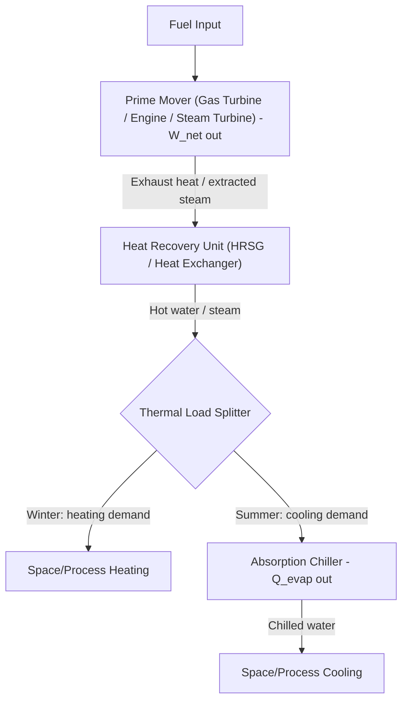

## Trigeneration Systems

### Overview

Trigeneration, also known as Combined Cooling, Heating, and Power (CCHP), extends conventional cogeneration (CHP) by adding a cooling output alongside electrical/mechanical power and useful heat, all derived from a single fuel input. The additional cooling capability is typically achieved by routing recovered thermal energy — which in a standard CHP system would only serve heating loads — into a heat-driven cooling technology, most commonly an absorption chiller. This allows the same prime mover and heat recovery infrastructure to remain fully utilized year-round, including in seasons when heating demand is low but cooling demand is high.

### Fundamental Rationale

**Key Points:**

- A pure cogeneration system's economic and efficiency advantage depends on having a steady thermal (heating) load to absorb recovered heat; in climates or facilities with strong seasonal variation (high heating demand in winter, high cooling demand in summer), a CHP-only system may see recovered heat go unused for much of the year, undermining utilization efficiency.
- Trigeneration solves this seasonal mismatch by converting "excess" recovered heat into a cooling effect via absorption chilling during cooling-dominated periods, keeping the prime mover's heat recovery system productively utilized across a broader range of the year.
- This makes trigeneration especially attractive for facilities with year-round, roughly balanced heating-or-cooling thermal demand: hospitals, hotels, data centers (cooling-dominant), universities, and commercial buildings in climates with hot summers and cold winters.

### System Architecture

The core trigeneration architecture builds directly on a topping-cycle cogeneration system (gas turbine, reciprocating engine, or steam turbine) with an absorption chiller added downstream of the heat recovery system.

**Key Points:**

- The "thermal load splitter" is a conceptual/operational function — in practice implemented via valves, controls, and sometimes thermal storage — that directs recovered heat to whichever end use (heating or chiller generator) is currently in demand, and can split flow between both simultaneously during shoulder seasons.
- The absorption chiller's generator receives the recovered heat as its driving energy input, exactly as described in standalone Absorption Refrigeration Cycles, but sourced from the cogeneration system's waste heat rather than a dedicated boiler or fuel-fired heat source.

### Prime Mover Options for Trigeneration

| Prime Mover | Typical Recovered Heat Source | Suitability Notes |
| --- | --- | --- |
| Gas turbine | HRSG on exhaust (~500–650°C) | High-quality heat well-suited to double-effect absorption chillers (higher COP) |
| Reciprocating engine | Jacket water (~90°C) + exhaust (~400–500°C) | Jacket water often suits single-effect absorption; exhaust heat can be recovered separately for higher-temperature needs |
| Steam turbine (back-pressure/extraction) | Extracted/exhaust steam | Steam directly compatible with absorption chiller generator requirements |
| Microturbine | Exhaust gas (~250–300°C) | Common in smaller-scale distributed trigeneration; typically single-effect absorption only due to lower exhaust temperature |
| Fuel cell | Stack exhaust/cooling heat | Emerging application; heat quality/temperature varies significantly by fuel cell type [Inference: less mature deployment relative to combustion-based trigeneration] |

**Key Points:**

- Higher recovered-heat temperatures (as from gas turbines) enable double-effect absorption chillers, which achieve significantly higher COP (~1.0–1.2) than single-effect chillers (~0.7), improving the overall trigeneration system's cooling output per unit of recovered heat.
- Lower-temperature heat sources (reciprocating engine jacket water, microturbine exhaust) are generally limited to single-effect absorption chillers, constraining achievable cooling COP.

### Absorption Chiller Integration Considerations

**Key Points:**

- The absorption chiller substitutes for (or supplements) an electrically-driven vapor-compression chiller, reducing on-site electrical demand for cooling — a key trigeneration benefit, since it effectively converts "free" (already-being-generated) waste heat into cooling capacity without additional fuel or significant additional electricity consumption.
- Trigeneration plants are frequently designed as **hybrid cooling plants**, combining an absorption chiller (driven by recovered heat, sized to the base cooling load or available waste heat) with a conventional electric chiller for peak cooling demand beyond what recovered heat can supply — this hybrid approach improves overall plant flexibility and avoids oversizing the absorption chiller for infrequent peak conditions.
- As covered under Absorption Refrigeration Cycles, H₂O/LiBr absorption chillers cannot produce sub-0°C chilled water, which is generally adequate for comfort air conditioning but a constraint for certain process cooling applications requiring lower temperatures.

### Trigeneration Energy Flow Example

<svg xmlns="http://www.w3.org/2000/svg" viewBox="0 0 900 460" font-family="sans-serif">
<text x="450" y="25" font-size="18" text-anchor="middle" font-weight="bold">Trigeneration (CCHP) Energy Flow (svg_diagram)</text>
<rect x="60" y="80" width="150" height="70" fill="#f5b041" stroke="#333" stroke-width="2" />
<text x="135" y="110" text-anchor="middle" font-size="13">Fuel Input</text>
<text x="135" y="128" text-anchor="middle" font-size="11">100 units</text>
<rect x="290" y="80" width="180" height="90" fill="#e59866" stroke="#333" stroke-width="2" />
<text x="380" y="110" text-anchor="middle" font-size="13">Prime Mover</text>
<text x="380" y="128" text-anchor="middle" font-size="11">(Gas Turbine/Engine)</text>
<text x="380" y="146" text-anchor="middle" font-size="11">Electricity: ~35 units</text>
<rect x="290" y="220" width="180" height="70" fill="#85c1e9" stroke="#333" stroke-width="2" />
<text x="380" y="250" text-anchor="middle" font-size="13">Heat Recovery</text>
<text x="380" y="268" text-anchor="middle" font-size="11">Recovered: ~45 units</text>
<rect x="600" y="150" width="150" height="70" fill="#f9e79f" stroke="#333" stroke-width="2" />
<text x="675" y="180" text-anchor="middle" font-size="13">Heating Load</text>
<text x="675" y="198" text-anchor="middle" font-size="11">(Winter)</text>
<rect x="600" y="280" width="150" height="70" fill="#a3d9a5" stroke="#333" stroke-width="2" />
<text x="675" y="310" text-anchor="middle" font-size="13">Absorption Chiller</text>
<text x="675" y="328" text-anchor="middle" font-size="11">(Summer)</text>
<line x1="210" y1="115" x2="290" y2="115" stroke="#333" stroke-width="2" marker-end="url(#arrow3)" />
<line x1="380" y1="150" x2="380" y2="220" stroke="#c0392b" stroke-width="2" marker-end="url(#arrow3)" />
<line x1="470" y1="240" x2="600" y2="190" stroke="#c0392b" stroke-width="2" marker-end="url(#arrow3)" />
<line x1="470" y1="260" x2="600" y2="310" stroke="#c0392b" stroke-width="2" marker-end="url(#arrow3)" />
<text x="450" y="430" font-size="11" text-anchor="middle" fill="#555">Illustrative energy split — actual proportions vary by prime mover, load, and season</text>

</svg>

### Thermal Storage in Trigeneration Systems

**Key Points:**

- **Chilled water thermal storage** and **hot water/steam thermal storage** are often integrated into trigeneration plants to decouple the timing of prime mover operation from the timing of thermal demand, allowing the prime mover to run at a steady, efficient load while storage buffers short-term mismatches between generation and demand.
- Ice storage or chilled water storage charged during off-peak hours (when electrical demand and prices are lower) can be discharged during peak cooling demand, improving overall system economics and allowing the prime mover/absorption chiller combination to be sized closer to average rather than peak load.

### Combined Utilization Efficiency for Trigeneration

The utilization efficiency concept from cogeneration extends naturally to trigeneration, now including the cooling output (typically expressed in terms of the primary energy equivalent electricity that would otherwise be needed for electric-driven cooling, or in raw thermal terms):

$$\eta_{CCHP} = \frac{W_{net} + Q_{heating} + Q_{cooling}}{Q_{fuel,in}}$$

**Key Points:**

- Because cooling here is delivered thermally (via absorption) rather than electrically, some analyses convert $Q_{cooling}$ to an "electricity-equivalent" basis by dividing by a reference electric chiller COP, enabling a fairer comparison against a scenario of separate power generation plus electric-driven cooling.
- As with cogeneration, a full exergy-based comparison is more rigorous than simple utilization efficiency, since electricity, heat, and cooling all have different thermodynamic "quality" or exergy content.

### Practical Example

**Given:** A trigeneration system consumes $Q_{fuel} = 10\ \text{MW}$ (LHV) of natural gas in a gas turbine, producing $W_{net} = 3.5\ \text{MW}$ of electricity. The HRSG recovers $Q_{recovered} = 4.5\ \text{MW}$ of thermal energy, which is fully routed (summer operation) to a double-effect absorption chiller with $COP_{abs} = 1.1$.

**Find:** Cooling output and overall CCHP utilization efficiency (cooling counted at raw thermal value delivered).

**Solution:**

$$Q_{cooling} = COP_{abs} \times Q_{recovered} = 1.1 \times 4.5 = 4.95\ \text{MW}$$

$$\eta_{CCHP} = \frac{W_{net} + Q_{cooling}}{Q_{fuel}} = \frac{3.5 + 4.95}{10} = \frac{8.45}{10} = 0.845$$

**Interpretation:** The system delivers an overall utilization efficiency of about 84.5% during summer cooling-dominated operation, comparable to the winter heating-mode utilization efficiency of a similar cogeneration system, demonstrating trigeneration's value in maintaining high year-round utilization of the prime mover's recovered heat regardless of season.

### Trigeneration vs. Cogeneration vs. Separate Generation (Comparison)

| Aspect | Trigeneration (CCHP) | Cogeneration (CHP) | Separate Generation |
| --- | --- | --- | --- |
| Outputs | Power + heat + cooling | Power + heat | Power only (heat/cooling separately sourced) |
| Seasonal utilization | High year-round (heat routed to cooling in summer) | Can drop significantly in low-heating-demand seasons | N/A (independent systems each sized to their own load) |
| System complexity | Highest (adds absorption chiller + controls) | Moderate | Lowest per component, but more total equipment |
| Best-fit application | Facilities with both heating and cooling demand (hospitals, hotels, campuses) | Facilities with steady, year-round heating/process heat demand | Facilities without waste-heat recovery infrastructure |
| Capital cost | Highest | Moderate | Lowest per unit, but duplicated infrastructure |

### Applications

- **Hospitals and healthcare campuses:** Continuous power, heating (sterilization, domestic hot water), and cooling (comfort, medical equipment) needs align well with trigeneration's year-round utilization profile; resilience during grid outages is an additional benefit.
- **Hotels and resorts:** Year-round hot water, space heating/cooling, and laundry steam demand.
- **University and corporate campuses:** District-style trigeneration plants serving multiple buildings with shared thermal and electrical infrastructure.
- **Data centers:** Cooling-dominant loads make absorption chilling from waste heat (including from on-site backup/prime power generation) an attractive efficiency measure. [Inference: adoption varies significantly by facility and is an evolving area of data center efficiency practice]
- **Airports and transportation hubs:** Continuous large-scale heating, cooling, and power demands suited to centralized trigeneration plants.

### Key Design and Economic Considerations

**Key Points:**

- **Load profile analysis** across a full annual cycle (not just peak design conditions) is essential to correctly size the prime mover, heat recovery system, and absorption chiller for a trigeneration plant, given the seasonal shifting between heating-dominant and cooling-dominant operation.
- **Absorption chiller sizing** is typically based on the available recovered heat and the facility's base cooling load, with a supplementary electric chiller covering peak cooling demand — mirroring the same hybrid-plant logic discussed for large HVAC absorption applications.
- **Control system sophistication** is higher than for simple CHP, since the system must dynamically allocate recovered heat between heating and cooling end uses (and sometimes simultaneously, in shoulder seasons with both loads present).
- **Economic viability** depends on the spread between the cost of fuel (input) and the avoided cost of grid electricity plus avoided cost of separately generated heating and cooling — a favorable trigeneration business case generally requires a reasonably high electricity-to-fuel price ratio (a rule of thumb sometimes called the "spark spread") alongside genuinely coincident or complementary heating/cooling demand patterns. [Inference: exact economic thresholds are highly market- and tariff-specific]

### Related Topics

- Cogeneration and Combined Heat and Power
- Absorption Refrigeration Cycles
- Combined Gas-Vapor Power Cycles
- Heat Recovery Steam Generators
- District Cooling and Thermal Energy Storage
- Exergy Analysis and Second-Law Efficiency
- Organic Rankine Cycle for Waste Heat Recovery
- Microgrid and Distributed Generation Integration