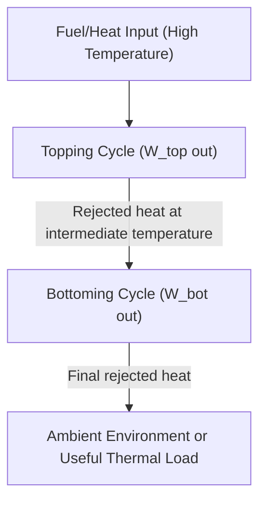

## Topping and Bottoming Cycle Arrangements

### Overview

Topping and bottoming cycle arrangements describe the two fundamental ways that multiple thermodynamic power cycles can be combined in sequence to extract additional useful work from a given fuel energy input, distinguished by where in the temperature range each cycle operates and which cycle's rejected heat serves as the other's heat input. Understanding this classification provides the conceptual foundation underlying combined-cycle power plants, cogeneration systems, and waste-heat-recovery power generation.

### Fundamental Definitions

**Topping Cycle:**

The cycle that operates at the *higher* temperature range, converting the highest-quality (highest-exergy) portion of the available heat into work first, before rejecting its remaining heat at a lower temperature for further use.

**Bottoming Cycle:**

The cycle that operates at the *lower* temperature range, receiving the topping cycle's rejected heat as its own heat input and converting a further portion of that heat into additional work, rejecting final waste heat to the ultimate environment (or to a useful thermal load, in cogeneration configurations).

**Key Points:**

- This arrangement is a direct application of the Second Law principle that heat has more available work potential (exergy) at higher temperatures relative to the ambient/reference environment; using the topping cycle first captures the maximum work from the highest-temperature heat before that heat degrades to a lower, less-valuable temperature.
- The combination is sometimes generically called a "cascaded" or "binary" cycle arrangement, since two distinct working fluids and cycle types are cascaded in sequence, each optimized for its own temperature range.

### Generic Topping-Bottoming Cycle Structure

### Canonical Example: Gas Turbine (Topping) + Steam Turbine (Bottoming)

The most widespread topping-bottoming arrangement in utility power generation is the combined gas-vapor power cycle: a Brayton cycle (gas turbine) as the topping cycle, operating at very high peak temperatures (1300–1600°C turbine inlet), and a Rankine cycle (steam turbine) as the bottoming cycle, using the gas turbine's ~500–650°C exhaust as its heat source via an HRSG (see Combined Gas-Vapor Power Cycles and Heat Recovery Steam Generators for full treatment).

**Key Points:**

- This pairing is thermodynamically favorable because the Brayton cycle is well-suited to very high peak temperatures (gas-phase working fluid, no phase-change temperature ceiling), while the Rankine cycle efficiently converts moderate-temperature heat using water/steam's favorable phase-change thermodynamics — each cycle operates in the temperature range where it performs best.
- A gas turbine alone cannot efficiently use its own exhaust heat internally (a Brayton cycle's minimum cycle temperature is set by compressor inlet conditions, not exhaust conditions); pairing it with a separate bottoming Rankine cycle is what allows this heat to be captured as additional work.

### Alternative Topping-Bottoming Pairings

**Steam Turbine (Topping) + Organic Rankine Cycle (Bottoming):**

In some industrial or geothermal applications, a higher-temperature steam Rankine cycle serves as the topping cycle, with its condenser reject heat (or a separate lower-temperature waste heat stream) driving an Organic Rankine Cycle (ORC) as the bottoming cycle. ORC uses an organic working fluid with a lower boiling point than water, making it effective at converting lower-temperature heat sources (as low as 80–150°C) into additional power that would otherwise be unrecoverable by a conventional steam cycle. [Inference: specific temperature thresholds vary by ORC working fluid selection]

**Industrial Process (Topping) + Steam or ORC Bottoming:**

In "bottoming cycle cogeneration" (see Cogeneration and Combined Heat and Power), a high-temperature industrial process itself functions as the de facto topping "cycle" (e.g., a cement kiln, glass furnace, or steel reheat furnace), with its waste heat exhaust recovered by a bottoming steam Rankine cycle or ORC to generate power that would otherwise be entirely rejected to atmosphere.

**Fuel Cell (Topping) + Gas/Steam Turbine (Bottoming) — Hybrid Systems:**

Emerging hybrid configurations pair high-temperature fuel cells (e.g., solid oxide fuel cells, SOFC) as a topping "cycle" (electrochemical, not strictly a heat engine, but operating at high temperature and rejecting usable exhaust heat) with a gas turbine or steam bottoming cycle to recover the fuel cell's exhaust thermal energy, targeting very high combined electrical efficiencies. [Inference: this remains a developing/lower-maturity technology area relative to established gas-turbine/steam-turbine combined cycles, with commercial deployment more limited]

**Mercury (Historical) or Alternative Working Fluid Topping Cycles:**

Historically, some early combined-cycle concepts explored mercury vapor topping cycles paired with steam bottoming cycles, exploiting mercury's favorable high-temperature vapor pressure characteristics; these saw limited commercial adoption and were largely abandoned due to mercury's toxicity and handling hazards, superseded by the gas-turbine-topping approach once gas turbine technology matured. [Unverified: specific historical deployment details are noted here for context; this is a largely obsolete approach not relevant to modern practice]

### Thermodynamic Efficiency of Cascaded Cycles

For a topping cycle with efficiency $\eta_{top}$ and a bottoming cycle with efficiency $\eta_{bot}$ (operating on the heat rejected by the topping cycle), and assuming a utilization factor $u$ representing the fraction of topping-cycle rejected heat actually captured and delivered to the bottoming cycle:

$$\eta_{overall} = \eta_{top} + \eta_{bot}(1 - \eta_{top}) \cdot u$$

**Key Points:**

- This relationship (introduced in the context of gas-vapor combined cycles) applies generally to any topping-bottoming pairing: the overall efficiency is always greater than the topping cycle efficiency alone, since the bottoming cycle recovers additional work from heat that would otherwise be entirely wasted.
- The magnitude of the efficiency gain depends on: (1) how much of the topping cycle's heat is rejected (i.e., $1-\eta_{top}$, larger for lower-efficiency topping cycles, ironically offering more "room" for bottoming-cycle recovery), (2) the bottoming cycle's own efficiency at converting that rejected heat, and (3) the utilization factor $u$, which reflects practical heat-exchanger and system losses in transferring heat between the two cycles.

### Ideal Temperature Matching Concept

An idealized way to conceptualize topping-bottoming arrangements is as two Carnot cycles operating in cascade across three temperature levels: the topping cycle's heat source temperature $T_1$ (highest), an intermediate temperature $T_2$ at which heat is transferred from topping to bottoming cycle, and the ultimate heat sink temperature $T_3$ (lowest, typically ambient).

$$\eta_{Carnot,combined} = 1 - \frac{T_3}{T_1}$$

**Key Points:**

- Remarkably, for ideal (reversible) Carnot cycles operating in cascade with perfect heat transfer at the intermediate temperature, the combined efficiency depends *only* on the highest source temperature $T_1$ and lowest sink temperature $T_3$ — the intermediate temperature $T_2$ theoretically "cancels out" in the ideal, reversible limit.
- In real (irreversible) cycles, the choice of intermediate temperature $T_2$ (where heat is handed off from topping to bottoming cycle) does matter significantly, since it must be practically achievable by real heat exchangers (with finite temperature differences, i.e., pinch points) and must suit the operating temperature ranges of both real working fluids — this is precisely why the gas-turbine/steam-turbine intermediate temperature (~500–650°C gas turbine exhaust) is a practical engineering compromise, not a freely optimizable variable.

### Comparison of Topping-Bottoming Arrangements

| Arrangement | Topping Cycle Temp. Range | Bottoming Cycle Temp. Range | Typical Overall Efficiency Gain | Maturity |
| --- | --- | --- | --- | --- |
| Gas turbine + Steam turbine | ~1300–1600°C (TIT) | ~500–650°C down to ~30-40°C (condenser) | High (up to 55-63% combined) | Mature, widely deployed |
| Steam turbine + ORC | ~450-565°C (steam) | ~80-150°C waste heat | Moderate (incremental recovery) | Established, especially in geothermal/waste heat |
| Industrial process + Steam/ORC (bottoming cogeneration) | Process-specific (often 800°C+) | Waste exhaust temperature-dependent | Moderate-to-high (depends on waste heat quality/quantity) | Established in specific industries (cement, steel, glass) |
| Fuel cell + Gas/Steam turbine (hybrid) | SOFC operating temp (~600-1000°C) | Turbine-dependent | Potentially very high (60%+ projected) [Inference] | Developing/limited commercial deployment |

### Practical Example: Comparing Two Intermediate Temperature Choices

**Given (illustrative):** A topping gas turbine cycle operates with an effective source temperature of $T_1 = 1600\ K$ and rejects heat at $T_2$. A bottoming steam cycle then operates between $T_2$ and an ultimate sink temperature $T_3 = 310\ K$. Compare the ideal (Carnot-cascade) combined efficiency for two illustrative choices of $T_2$: 900 K and 700 K.

**Solution (using the ideal cascade relationship, illustrating the theoretical insensitivity to $T_2$ in the ideal case):**

For $T_2 = 900\ K$:

$$\eta_{top} = 1 - \frac{900}{1600} = 0.4375, \quad \eta_{bot} = 1 - \frac{310}{900} = 0.6556$$

$$\eta_{overall} = \eta_{top} + \eta_{bot}(1-\eta_{top}) = 0.4375 + 0.6556(0.5625) = 0.4375 + 0.3688 = 0.8063$$

For $T_2 = 700\ K$:

$$\eta_{top} = 1 - \frac{700}{1600} = 0.5625, \quad \eta_{bot} = 1 - \frac{310}{700} = 0.5571$$

$$\eta_{overall} = 0.5625 + 0.5571(0.4375) = 0.5625 + 0.2437 = 0.8062$$

**Interpretation:** As predicted by the ideal cascade relationship, both choices of intermediate temperature $T_2$ yield essentially the same overall Carnot-equivalent efficiency (~80.6%), confirming that in the *ideal, reversible* limit, only the overall temperature span ($T_1$ to $T_3$) matters. In real systems, however, $T_2$ must be chosen based on practical constraints (achievable gas turbine exhaust temperature, steam cycle material limits, heat exchanger pinch-point feasibility), and irreversibilities at each real heat transfer step will make the actual achieved efficiency meaningfully lower than this ideal bound, and somewhat sensitive to the practical choice of $T_2$. [Inference: this idealized illustration excludes real component irreversibilities, heat exchanger losses, and mechanical losses present in actual plants]

### Design Considerations for Topping-Bottoming Selection

**Key Points:**

- **Temperature compatibility:** The topping cycle's rejected-heat temperature must reasonably match the bottoming cycle's required heat-input temperature range; a poor match (too large a temperature gap, or insufficient overlap) results in either wasted exergy or an infeasible/inefficient bottoming cycle design.
- **Working fluid selection for the bottoming cycle:** Water/steam is the default choice when rejected heat is in the roughly 400°C+ range (steam Rankine cycle); organic working fluids (ORC) are preferred for lower-temperature waste heat (80–300°C) due to more favorable thermodynamic matching (lower boiling point, better efficiency at these lower source temperatures) than water would achieve.
- **Capital cost vs. incremental efficiency gain:** Adding a bottoming cycle always increases plant capital cost and complexity; the decision is justified when the value of the additional captured work (or fuel savings) over the plant's operating life exceeds this added cost — a stronger case exists when topping-cycle rejected heat is both large in quantity and high in temperature (more bottoming-cycle work potential per dollar of added equipment).
- **Cogeneration trade-off:** In some cases, rejected topping-cycle heat is more economically valuable as a directly-used thermal output (cogeneration/CHP, see relevant topic) than as the input to an additional bottoming power cycle — the choice between "add a bottoming cycle for more power" versus "use the heat directly for a thermal load" depends on the relative economic value of electricity versus heat at a given site.

### Related Topics

- Combined Gas-Vapor Power Cycles
- Heat Recovery Steam Generators
- Cogeneration and Combined Heat and Power
- Organic Rankine Cycle for Waste Heat Recovery
- Exergy Analysis and Second-Law Efficiency
- Brayton Cycle (Gas Turbine Power Cycle) Fundamentals
- Rankine Cycle and Steam Power Plant Fundamentals
- Solid Oxide Fuel Cell Hybrid Power Systems