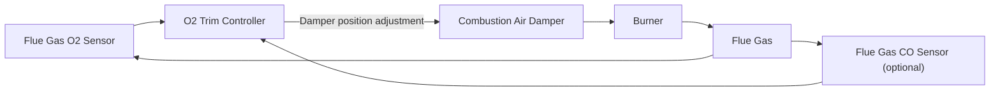

## Air-Fuel Ratio and Excess Air

### Overview

Air-fuel ratio (AFR) and excess air are the central quantitative parameters governing how much oxidizer is supplied relative to fuel in a combustion process. While closely related to stoichiometric combustion fundamentals, this topic focuses specifically on the practical definitions, measurement methods, control strategies, and equipment-level implications of AFR and excess air management in real combustion systems — the operational counterpart to the theoretical stoichiometric balance.

### Air-Fuel Ratio: Mass Basis vs. Molar (Volumetric) Basis

**Mass-Basis Air-Fuel Ratio:**

$$AFR_{mass} = \frac{m_{air}}{m_{fuel}}$$

**Molar (Volumetric) Air-Fuel Ratio:**

$$AFR_{molar} = \frac{n_{air}}{n_{fuel}}$$

**Key Points:**

- Mass-basis AFR is more commonly used in liquid and solid fuel combustion calculations (where fuel is typically metered/measured by mass or volume-then-converted-to-mass).
- Molar or volumetric AFR is often more convenient for gaseous fuel systems, where both fuel and air are naturally metered/measured volumetrically.
- Converting between the two requires the molecular weights of the fuel and of air (approximately 28.97 kg/kmol for air); care must be taken to confirm which basis is being used when comparing AFR values from different sources.

### Fuel-Air Ratio (Inverse Convention)

Some references use the inverse convention, fuel-air ratio (FAR):

$$FAR = \frac{m_{fuel}}{m_{air}} = \frac{1}{AFR}$$

**Key Points:**

- Both conventions are in common use; always verify which convention (AFR or FAR) a given reference or dataset uses, since a "higher" ratio means opposite things under each convention (higher AFR = more air per fuel = leaner; higher FAR = more fuel per air = richer).

### Equivalence Ratio: The Normalized Comparison

Since stoichiometric AFR differs substantially between fuels (e.g., ~17.2 for methane vs. ~15.1 for gasoline), the equivalence ratio $\phi$ provides a fuel-independent, normalized way to describe how far a given combustion condition is from stoichiometric:

$$\phi = \frac{(F/A)_{actual}}{(F/A)_{stoichiometric}} = \frac{(A/F)_{stoichiometric}}{(A/F)_{actual}}$$

| Equivalence Ratio | Mixture Description | Combustion Characteristics |
| --- | --- | --- |
| $\phi < 1$ | Fuel-lean (excess air) | More air than needed; typically more complete combustion, lower flame temperature, higher excess O₂ in products |
| $\phi = 1$ | Stoichiometric | Theoretically complete combustion with no excess air or fuel |
| $\phi > 1$ | Fuel-rich (insufficient air) | Incomplete combustion likely; CO, unburned hydrocarbons, soot formation risk |

**Key Points:**

- Most practical combustion equipment (boilers, furnaces, most gas turbines during normal operation) operates fuel-lean ($\phi < 1$) to ensure combustion completeness, with the specific degree of leanness (excess air level) tuned for the equipment and fuel type.
- Spark-ignition engines historically operated near $\phi \approx 1$ (stoichiometric) for optimal three-way catalyst emissions control compatibility, while compression-ignition (diesel) engines typically operate overall fuel-lean, with locally fuel-rich zones within the combustion chamber during the diffusion-flame combustion process. [Behavior may vary by specific engine design, operating mode, and emissions control strategy]

### Excess Air Quantification

**Percent Excess Air:**

$$\%\ EA = \left(\frac{AFR_{actual}}{AFR_{stoich}} - 1\right) \times 100\% = \left(\frac{1}{\phi} - 1\right) \times 100\%$$

**Percent Theoretical (Stoichiometric) Air:**

$$\%\ TA = \frac{AFR_{actual}}{AFR_{stoich}} \times 100\% = \frac{1}{\phi} \times 100\%$$

**Key Points:**

- 0% excess air corresponds to exactly stoichiometric combustion ($\phi = 1$, 100% theoretical air).
- These two expressions (percent excess air and percent theoretical air) describe the same physical condition and are simply related by $\%TA = 100\% + \%EA$; different industries and reference materials favor one convention or the other.

### Measuring Excess Air via Flue Gas Analysis

In practice, excess air is most commonly determined indirectly by measuring flue gas oxygen (O₂) concentration, since direct measurement of air and fuel flow rates is often less practical or accurate than continuous flue gas sampling.

**Approximate Relationship (dry flue gas basis, for common hydrocarbon fuels):**

$$\%\ Excess\ Air \approx \frac{\%O_2}{21 - \%O_2} \times 100\%$$

**Key Points:**

- This relationship assumes complete combustion (no CO present) and is an approximation; more rigorous calculations account for the specific fuel's stoichiometry and can incorporate simultaneous CO measurement to refine the estimate and detect incomplete combustion conditions.
- Modern combustion control systems commonly use continuous O₂ trim control, automatically adjusting air damper or fuel valve position to maintain a target flue gas O₂ setpoint across varying load conditions, optimizing the excess air trade-off in real time rather than relying on a fixed damper/valve position tuned only for one operating point.
- CO measurement alongside O₂ provides a more complete combustion-quality picture: rising CO at a given O₂ level indicates degrading mixing or combustion completeness, prompting increased excess air; conversely, CO remaining near zero as O₂ is reduced indicates room to reduce excess air (and associated stack losses) while maintaining complete combustion.

### O2 Trim Control Loop Concept

### Effect of Load on Optimal Excess Air

**Key Points:**

- Combustion equipment often requires higher excess air percentages at lower firing rates (part load) to maintain adequate mixing and flame stability, since fuel and air flow rates, velocities, and turbulence characteristics change non-linearly with turndown.
- Well-designed modern burners with good turndown characteristics and advanced control systems can maintain a relatively flat, low excess-air profile across a wider load range than older or simpler burner designs, improving average operating efficiency across variable-load duty cycles.
- Combustion tuning is therefore typically performed across the full expected operating load range, not just at a single design point, to establish an appropriate excess-air control curve (often called an "O₂ trim curve" or "characterization curve") as a function of load.

### Excess Air Impact on Flame Temperature

**Key Points:**

- Excess air above stoichiometric dilutes the combustion products with additional nitrogen and unreacted oxygen, absorbing sensible heat and thereby lowering the adiabatic flame temperature compared to exactly stoichiometric combustion (which theoretically produces the highest flame temperature for a given fuel/air combination, all else equal).
- This flame-temperature-lowering effect of excess air is deliberately exploited in some combustion system designs (e.g., certain gas turbine combustor zones, and some NOx-control strategies) since lower peak flame temperature generally reduces thermal NOx formation — though the overall relationship between excess air and total NOx emissions is more complex and depends on the specific combustion regime, as very high excess air can sometimes increase NOx formation in certain operating conditions due to changes in residence time and local stoichiometry. [Behavior may vary significantly by specific combustor/burner design and should be evaluated via combustion modeling or testing for a specific system]

### Excess Air by Fuel Type and Equipment (Reference Table)

| Fuel / Equipment | Typical Excess Air Range | Primary Driver of Range |
| --- | --- | --- |
| Natural gas boilers | 5-20% | Good mixing achievable with gaseous fuel; lower end achievable with modern burners and O₂ trim |
| Fuel oil boilers | 10-20% | Slightly more excess air needed than gas due to atomization/mixing limitations |
| Pulverized coal boilers | 15-30% | Solid particle combustion requires more margin for complete burnout |
| Stoker/grate-fired solid fuel | 20-60%+ | Larger fuel particles, less controlled mixing than pulverized firing |
| Gas turbine combustors | 200-400%+ | Excess air primarily serves turbine cooling/dilution, not combustion completeness alone |

[Ranges are representative industry approximations; actual optimal values are equipment-, fuel-, and load-specific and should be established via combustion testing/tuning for a given installation.]

### Practical Example: Determining Excess Air from Flue Gas O2

**Given:** A natural gas boiler's flue gas analyzer reads 3.5% O₂ (dry basis), with negligible CO detected.

**Find:** Approximate percent excess air.

**Solution:**

$$\%\ EA \approx \frac{\%O_2}{21 - \%O_2} \times 100\% = \frac{3.5}{21 - 3.5} \times 100\% = \frac{3.5}{17.5} \times 100\% = 20\%$$

**Interpretation:** The boiler is operating at approximately 20% excess air with negligible CO, indicating essentially complete combustion at a reasonable (not excessive) excess air level for a gas-fired unit — consistent with typical well-tuned natural gas boiler operation. If CO were also present at a meaningful level, it would suggest the combustion process is not yet fully complete despite the measured O₂, warranting further investigation into burner mixing or air distribution issues rather than simply reducing excess air.

### Fuel-Air Ratio Control Strategies

**Key Points:**

- **Fixed (mechanical) air-fuel linkage:** Older or simpler combustion systems mechanically link fuel valve and air damper position via a cam or linkage, providing a fixed AFR curve across load that must be manually characterized and adjusted; less precise and less adaptive to changing conditions (fuel composition variation, ambient air density changes) than modern control approaches.
- **Cross-limiting (lead-lag) control:** A control strategy ensuring that, during load increases, air flow increases *before* fuel flow increases (avoiding a momentary fuel-rich condition), and during load decreases, fuel flow decreases *before* air flow decreases — a standard safety-oriented control practice to avoid transient fuel-rich excursions during rapid load changes.
- **Full O₂ trim with continuous flue gas analysis:** The most precise and adaptive approach, continuously adjusting the air-fuel ratio based on real-time flue gas O₂ (and often CO) measurement, compensating for fuel composition variability, ambient conditions, and equipment wear/drift over time.

### Related Topics

- Stoichiometric and Actual Combustion
- Fuel Types: Solid, Liquid, and Gaseous Fuels
- Combustion Efficiency and Boiler Heat Loss Analysis
- NOx Formation Mechanisms in Combustion
- Flue Gas Analysis and Combustion Tuning
- Adiabatic Flame Temperature
- Burner Design and Turndown Characteristics
- Combustion Control Systems and Cross-Limiting Logic