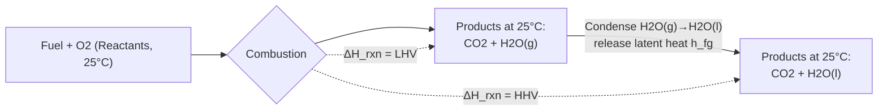

## Enthalpy of Formation and Enthalpy of Combustion

### Definition and Physical Meaning

**Enthalpy of formation** ($\Delta H_f$) is the enthalpy change when 1 mole of a compound is formed from its constituent elements in their standard reference states, at a specified temperature and pressure (commonly 25°C and 1 atm, denoted $\Delta H_f^\circ$).

**Enthalpy of combustion** ($\Delta H_c$) is the enthalpy change when 1 mole of a fuel undergoes complete combustion with oxygen, with reactants and products both returned to a reference temperature (usually 25°C).

Both are state functions — path-independent — which permits their use in Hess's Law calculations to determine reaction enthalpies without directly measuring every possible reaction.

### Standard Reference States

The reference state for an element is its naturally occurring, most stable form at standard conditions (1 atm, 25°C):

- Carbon → graphite (not diamond)
- Hydrogen → $H_2$ gas
- Oxygen → $O_2$ gas
- Nitrogen → $N_2$ gas

By convention, $\Delta H_f^\circ = 0$ for elements in their standard reference states. This is a defined baseline, not a measured zero — it establishes a consistent scale so tabulated formation enthalpies can be compared and combined.

### Formation Enthalpy: Formal Expression

$$\Delta H_f^\circ = H_{\text{products}}^\circ - H_{\text{elements}}^\circ$$

**Example:** Formation of carbon dioxide:

$$\text{C(graphite)} + \text{O}_2\text{(g)} \rightarrow \text{CO}_2\text{(g)} \quad \Delta H_f^\circ = -393.5 \text{ kJ/mol}$$

The negative sign indicates an exothermic formation reaction — energy is released as the more stable $CO_2$ bonds form.

### Table of Common Formation Enthalpies (Standard State, 25°C)

| Substance | Formula | State | $\Delta H_f^\circ$ (kJ/mol) |
| --- | --- | --- | --- |
| Carbon dioxide | $CO_2$ | gas | −393.5 |
| Water (liquid) | $H_2O$ | liquid | −285.8 |
| Water (vapor) | $H_2O$ | gas | −241.8 |
| Carbon monoxide | $CO$ | gas | −110.5 |
| Methane | $CH_4$ | gas | −74.8 |
| Ethane | $C_2H_6$ | gas | −84.7 |
| Propane | $C_3H_8$ | gas | −103.8 |
| Octane | $C_8H_{18}$ | liquid | −250.1 |
| Methanol | $CH_3OH$ | liquid | −238.4 |
| Ammonia | $NH_3$ | gas | −45.9 |
| Sulfur dioxide | $SO_2$ | gas | −296.8 |

These values are widely tabulated (NIST-JANAF, standard thermodynamics texts); minor variations of a few tenths of a kJ/mol between sources are common depending on measurement methodology. [Unverified: exact decimal precision may differ slightly by reference source]

### Calculating Reaction Enthalpy from Formation Data

For any reaction, Hess's Law gives:

$$\Delta H_{rxn}^\circ = \sum n_p \Delta H_{f,\text{products}}^\circ - \sum n_r \Delta H_{f,\text{reactants}}^\circ$$

where $n_p$ and $n_r$ are stoichiometric coefficients.

**Example — Combustion of methane:**

$$CH_4\text{(g)} + 2O_2\text{(g)} \rightarrow CO_2\text{(g)} + 2H_2O\text{(l)}$$

$$\Delta H_{rxn}^\circ = [\Delta H_f^\circ(CO_2) + 2\Delta H_f^\circ(H_2O_{(l)})] - [\Delta H_f^\circ(CH_4) + 2\Delta H_f^\circ(O_2)]$$

$$\Delta H_{rxn}^\circ = [(-393.5) + 2(-285.8)] - [(-74.8) + 2(0)]$$

$$\Delta H_{rxn}^\circ = [-393.5 - 571.6] - [-74.8] = -965.1 + 74.8 = -890.3 \text{ kJ/mol}$$

This matches the tabulated heat of combustion of methane (~−890 kJ/mol), confirming internal consistency between formation and combustion data.

### Higher Heating Value (HHV) vs. Lower Heating Value (LHV)

This distinction is critical in power and energy conversion engineering.

- **HHV (Higher Heating Value / Gross calorific value):** combustion enthalpy calculated with water product in the **liquid** state — includes the latent heat of vaporization recovered when water vapor condenses.
- **LHV (Lower Heating Value / Net calorific value):** combustion enthalpy calculated with water product remaining as **vapor** — excludes the condensation energy, since in most real combustion equipment (engines, gas turbines, boilers without condensing economizers) exhaust water leaves as vapor.

$$\text{HHV} - \text{LHV} = n_{H_2O} \times h_{fg}$$

where $h_{fg} \approx 2442$ kJ/kg (latent heat of vaporization of water at 25°C) and $n_{H_2O}$ is the mass or molar amount of water formed per unit fuel.

**Example — Methane:**

- HHV(CH₄) ≈ 55.5 MJ/kg
- LHV(CH₄) ≈ 50.0 MJ/kg

Power plant efficiency ratings (especially for gas turbines and internal combustion engines) are conventionally reported on an LHV basis, since condensing the exhaust water is not practical in these systems. Boiler and furnace efficiencies are sometimes reported on an HHV basis, particularly in North American practice. [Inference: convention varies by industry/region and should be confirmed against the specific standard being applied, e.g., ASME vs. ISO]

### Effect of Water Phase — Diagram

### Enthalpy of Combustion: Standard Values for Common Fuels

| Fuel | LHV (MJ/kg) | HHV (MJ/kg) |
| --- | --- | --- |
| Hydrogen | 120.0 | 141.8 |
| Methane | 50.0 | 55.5 |
| Propane | 46.4 | 50.4 |
| Octane (gasoline surrogate) | 44.4 | 47.9 |
| Diesel (typical) | 42.5 | 45.5 |
| Methanol | 19.9 | 22.7 |
| Ethanol | 26.8 | 29.7 |
| Carbon (graphite) | 32.8 | 32.8 |
| Carbon monoxide | 10.1 | 10.1 |

Note that for fuels containing no hydrogen (e.g., pure carbon, CO), HHV = LHV since no water is formed and there is no latent heat correction. [Well-established/documented behavior — no water-phase correction applies]

### Temperature Dependence: Kirchhoff's Law

Formation and combustion enthalpies are tabulated at a reference temperature (typically 298.15 K), but combustion in real equipment often involves reactants at other temperatures. Kirchhoff's Law adjusts $\Delta H_{rxn}$ for temperature:

$$\Delta H_{rxn}(T_2) = \Delta H_{rxn}(T_1) + \int_{T_1}^{T_2} \Delta C_p \, dT$$

where $\Delta C_p = \sum n_p C_{p,\text{products}} - \sum n_r C_{p,\text{reactants}}$

This is essential in gas turbine and furnace design, where reactants may enter preheated and the reaction enthalpy at operating temperature differs from the standard-state value.

### Application: Adiabatic Flame Temperature

Enthalpy of combustion directly determines the **adiabatic flame temperature (AFT)** — the maximum theoretical temperature achieved when a fuel burns completely with no heat loss to surroundings and no work extracted.

Energy balance (constant pressure, adiabatic, no work):

$$H_{\text{reactants}}(T_i) = H_{\text{products}}(T_{ad})$$

$$\sum n_r \left[\Delta H_f^\circ + \int_{298}^{T_i} C_p \, dT\right]_r = \sum n_p \left[\Delta H_f^\circ + \int_{298}^{T_{ad}} C_p \, dT\right]_p$$

This is solved iteratively for $T_{ad}$, since $C_p$ of products is itself temperature-dependent. AFT calculations underpin combustor design, NOx formation prediction, and turbine inlet temperature limits in gas turbine cycles.

**Example — approximate adiabatic flame temperatures (stoichiometric, air, 25°C reactants):**

| Fuel | Adiabatic Flame Temp (°C, approx.) |
| --- | --- |
| Methane–air | ~1950 |
| Hydrogen–air | ~2100 |
| Propane–air | ~1980 |
| Acetylene–oxygen | ~3100 |

[Inference: these figures represent commonly cited approximate values; actual AFT depends sensitively on equivalence ratio, dissociation effects at high temperature, and whether air or pure oxygen is the oxidizer — precise values require iterative thermochemical calculation, e.g., via NASA CEA or similar software]

### Enthalpy of Formation vs. Enthalpy of Combustion — Key Distinctions

| Aspect | Enthalpy of Formation | Enthalpy of Combustion |
| --- | --- | --- |
| Reference reaction | Elements → compound | Fuel + O₂ → CO₂ + H₂O (+ others) |
| Sign convention | Can be positive or negative | Always negative (exothermic) |
| Reference state | Elements at $\Delta H_f^\circ = 0$ | Fuel and O₂ as reactants |
| Primary use | Building block for Hess's Law | Direct fuel energy content (calorific value) |
| Typical measurement | Calorimetry, spectroscopic/computational methods | Bomb calorimetry (constant volume) or flow calorimetry (constant pressure) |

### Measurement: Bomb Calorimetry

Enthalpy of combustion is experimentally determined using a **bomb calorimeter**, which measures heat release at constant volume ($\Delta U_c$, internal energy of combustion), which is then converted to enthalpy of combustion ($\Delta H_c$, constant pressure) via:

$$\Delta H_c = \Delta U_c + \Delta n_{gas} RT$$

where $\Delta n_{gas}$ is the change in moles of gas between products and reactants, $R$ is the universal gas constant, and $T$ is absolute temperature.

**Example — Combustion of solid glucose:**

$$C_6H_{12}O_6\text{(s)} + 6O_2\text{(g)} \rightarrow 6CO_2\text{(g)} + 6H_2O\text{(l)}$$

Here $\Delta n_{gas} = 6 - 6 = 0$, so $\Delta H_c = \Delta U_c$ — no correction needed since moles of gaseous reactants and products are equal.

### Bomb Calorimetry Schematic (svg_diagram)

<svg xmlns="http://www.w3.org/2000/svg" viewBox="0 0 640 420">
<rect x="0" y="0" width="640" height="420" fill="#ffffff" />
<text x="320" y="28" text-anchor="middle" font-size="18" font-family="sans-serif" font-weight="bold" fill="#1a1a1a">Bomb Calorimeter Schematic (svg_diagram)</text>
<rect x="150" y="60" width="340" height="300" rx="10" fill="#e8eef5" stroke="#2c3e50" stroke-width="2" />
<text x="320" y="80" text-anchor="middle" font-size="13" font-family="sans-serif" fill="#2c3e50">Insulated Water Jacket</text>
<circle cx="320" cy="230" r="90" fill="#f5d0a9" stroke="#8b4513" stroke-width="3" />
<text x="320" y="225" text-anchor="middle" font-size="12" font-family="sans-serif" fill="#5a2d0c">Steel Bomb</text>
<text x="320" y="242" text-anchor="middle" font-size="12" font-family="sans-serif" fill="#5a2d0c">(Constant Volume)</text>
<rect x="300" y="180" width="40" height="30" fill="#c0392b" />
<text x="320" y="200" text-anchor="middle" font-size="10" font-family="sans-serif" fill="#ffffff">Sample</text>
<line x1="320" y1="180" x2="320" y2="100" stroke="#333333" stroke-width="2" />
<rect x="305" y="85" width="30" height="18" fill="#95a5a6" stroke="#333333" />
<text x="320" y="98" text-anchor="middle" font-size="9" font-family="sans-serif" fill="#000000">Ignition Wire</text>
<line x1="440" y1="230" x2="500" y2="230" stroke="#333333" stroke-width="2" />
<circle cx="515" cy="230" r="15" fill="#ffffff" stroke="#333333" stroke-width="2" />
<text x="515" y="234" text-anchor="middle" font-size="10" font-family="sans-serif" fill="#000000">T</text>
<text x="515" y="260" text-anchor="middle" font-size="10" font-family="sans-serif" fill="#000000">Thermometer</text>

<text x="320" y="390" text-anchor="middle" font-size="12" font-family="sans-serif" fill="`#333333`">Heat released → measured via water temperature rise</text>

<text x="320" y="408" text-anchor="middle" font-size="12" font-family="sans-serif" fill="`#333333`">Δ U_c = m_water × c_water × ΔT (with calorimeter constant correction)</text>

</svg>

### Practical Application in Power Cycles

In Rankine and Brayton cycle analysis, the fuel's LHV directly determines the theoretical maximum thermal input per unit fuel mass, which sets a ceiling on cycle thermal efficiency calculations:

$$\eta_{th} = \frac{W_{net}}{Q_{in}} = \frac{W_{net}}{\dot{m}_{fuel} \times \text{LHV}}$$

Fuel selection for power generation weighs LHV/HHV against cost, emissions ($CO_2$ per MJ released is tied to the fuel's carbon-to-hydrogen ratio), and storage/handling characteristics. Hydrogen's very high gravimetric LHV (120 MJ/kg) but low volumetric energy density (due to low density even when compressed/liquefied) is a central trade-off in emerging hydrogen combustion turbine and fuel cell power system design. [Inference: specific volumetric energy density figures depend on storage pressure/state and are not included here as fixed values]

### Worked Example: Complete Combustion Enthalpy Calculation

**Problem:** Determine $\Delta H_c^\circ$ (LHV basis) for propane ($C_3H_8$).

**Reaction:**

$$C_3H_8\text{(g)} + 5O_2\text{(g)} \rightarrow 3CO_2\text{(g)} + 4H_2O\text{(g)}$$

**Given:**

- $\Delta H_f^\circ(C_3H_8) = -103.8$ kJ/mol
- $\Delta H_f^\circ(CO_2) = -393.5$ kJ/mol
- $\Delta H_f^\circ(H_2O, g) = -241.8$ kJ/mol
- $\Delta H_f^\circ(O_2) = 0$

**Calculation:**

$$\Delta H_c^\circ = [3(-393.5) + 4(-241.8)] - [(-103.8) + 5(0)]$$

$$\Delta H_c^\circ = [-1180.5 - 967.2] - [-103.8]$$

$$\Delta H_c^\circ = -2147.7 + 103.8 = -2043.9 \text{ kJ/mol}$$

Converting to mass basis (molar mass of propane = 44.1 g/mol):

$$\text{LHV} = \frac{2043.9 \text{ kJ/mol}}{44.1 \text{ g/mol}} \approx 46.35 \text{ kJ/g} = 46.35 \text{ MJ/kg}$$

This closely matches the tabulated LHV of propane (~46.4 MJ/kg).

**Related Topics:**

- Adiabatic Flame Temperature and Dissociation Effects
- Stoichiometric Air-Fuel Ratio and Equivalence Ratio
- Bomb Calorimetry vs. Flow Calorimetry Methods
- First Law Analysis of Reacting Systems
- Fuel-Bound Nitrogen and NOx Formation Chemistry
- Second Law Analysis of Combustion (Exergy/Availability of Fuels)
- Gas Turbine Combustor Design and LHV-Based Efficiency Reporting
- Alternative and Carbon-Neutral Fuels (Hydrogen, Ammonia, Biofuels) — Formation Enthalpy Comparison
- Chemical Equilibrium and Dissociation at High Temperature
- Standard Enthalpy Tables: NIST-JANAF Thermochemical Tables