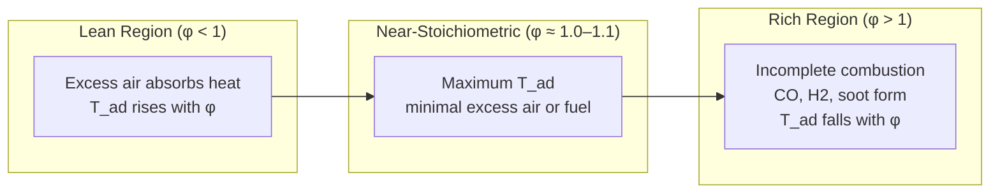

## Adiabatic Flame Temperature

### Definition and Physical Concept

**Adiabatic flame temperature (AFT)** is the maximum theoretical temperature attained by combustion products when fuel and oxidizer react completely, with no heat transfer to the surroundings ($Q = 0$), no work done ($W = 0$), and no changes in kinetic or potential energy. It represents the upper thermal limit achievable for a given fuel-oxidizer combination and initial condition, since any real combustion process loses some heat to walls, radiation, or does work — meaning actual flame temperatures are always lower than the adiabatic value.

Two forms are commonly distinguished:

- **Constant-pressure AFT** — applies to open, flowing combustion systems (gas turbine combustors, furnaces, open flames); governed by enthalpy conservation.
- **Constant-volume AFT** — applies to closed, fixed-volume systems (internal combustion engine cylinders at the instant of combustion); governed by internal energy conservation.

Constant-volume AFT is generally higher than constant-pressure AFT for the same reactants and initial temperature, because no boundary work is done to expand against surroundings — all released energy stays within the fixed volume as internal energy. [Well-established thermodynamic result]

### Governing Energy Balance

**Constant pressure (open system, steady flow, adiabatic, no work):**

$$H_{\text{reactants}}(T_i) = H_{\text{products}}(T_{ad})$$

Expanded in terms of formation enthalpies and sensible heat:

$$\sum_r n_r \left[\Delta H_{f,r}^\circ + \int_{T_{ref}}^{T_i} C_{p,r}(T) \, dT\right] = \sum_p n_p \left[\Delta H_{f,p}^\circ + \int_{T_{ref}}^{T_{ad}} C_{p,p}(T) \, dT\right]$$

**Constant volume (closed system, rigid container):**

$$U_{\text{reactants}}(T_i) = U_{\text{products}}(T_{ad})$$

$$\sum_r n_r \left[\Delta U_{f,r}^\circ + \int_{T_{ref}}^{T_i} C_{v,r}(T) \, dT\right] = \sum_p n_p \left[\Delta U_{f,p}^\circ + \int_{T_{ref}}^{T_{ad}} C_{v,p}(T) \, dT\right]$$

where $\Delta U_f^\circ = \Delta H_f^\circ - \Delta n_{gas} RT_{ref}$ for each species.

Both equations must be solved iteratively for $T_{ad}$ because the specific heats $C_p(T)$ and $C_v(T)$ of the product species (particularly $CO_2$, $H_2O$, $N_2$) are themselves strong functions of temperature, and rise substantially at flame temperatures.

### Solution Procedure (Iterative Method)

1. Write the balanced combustion equation and determine product species and moles.
2. Guess an initial trial temperature $T_{ad,guess}$.
3. Compute total product enthalpy (or internal energy) at $T_{ad,guess}$ using temperature-dependent specific heat data or enthalpy tables (e.g., JANAF tables).
4. Compare to the reactant-side enthalpy (known from initial conditions and formation data).
5. Adjust $T_{ad,guess}$ up or down and repeat until the two sides converge within an acceptable tolerance (typically iterate using linear interpolation between two bracketing trial temperatures).

This is the standard manual method taught in combustion and thermodynamics courses; computational tools (e.g., NASA CEA, Cantera, commercial combustion software) automate this using full chemical equilibrium solvers rather than simple iteration. [Well-established methodology — computational implementation details may vary by software]

### Worked Example: Stoichiometric Methane–Air Combustion

**Reaction (stoichiometric, complete combustion):**

$$CH_4 + 2O_2 + 2(3.76)N_2 \rightarrow CO_2 + 2H_2O + 7.52N_2$$

(Air is approximated as 21% $O_2$, 79% $N_2$ by mole, giving 3.76 mol $N_2$ per mol $O_2$.)

**Given (reactants at 298 K, 1 atm):**

- $\Delta H_f^\circ(CH_4) = -74.8$ kJ/mol
- $\Delta H_f^\circ(CO_2) = -393.5$ kJ/mol
- $\Delta H_f^\circ(H_2O, g) = -241.8$ kJ/mol
- $\Delta H_f^\circ(O_2) = \Delta H_f^\circ(N_2) = 0$

**Step 1 — Heat released at 298 K (reaction enthalpy):**

$$\Delta H_{rxn}^\circ = [(-393.5) + 2(-241.8)] - [(-74.8)] = -877.1 + 74.8 = -802.3 \text{ kJ/mol CH}_4$$

**Step 2 — This energy heats the products (CO₂, H₂O, N₂) from 298 K to $T_{ad}$:**

$$-\Delta H_{rxn}^\circ = n_{CO_2}\bar{C}_p(CO_2) (T_{ad}-298) + n_{H_2O}\bar{C}_p(H_2O)(T_{ad}-298) + n_{N_2}\bar{C}_p(N_2)(T_{ad}-298)$$

Using approximate mean specific heats over the relevant range (values vary with temperature and reference source):

- $\bar{C}_p(CO_2) \approx 55$ J/mol·K
- $\bar{C}_p(H_2O) \approx 43$ J/mol·K
- $\bar{C}_p(N_2) \approx 33$ J/mol·K

$$802{,}300 \text{ J} = [1(55) + 2(43) + 7.52(33)](T_%7Bad%7D-298)$$

$$802{,}300 = [55 + 86 + 248.2](T_%7Bad%7D-298) = 389.2(T_{ad}-298)$$

$$T_{ad} - 298 \approx 2061 \text{ K} \Rightarrow T_{ad} \approx 2359 \text{ K} \, (\approx 2086°C)$$

[Inference: this simplified single-step mean-$C_p$ calculation gives an approximate result; rigorous iterative solutions using temperature-dependent $C_p(T)$ polynomials typically yield adiabatic flame temperatures closer to ~2226°C (2500 K) for stoichiometric methane-air, and results depend sensitively on the specific heat data and dissociation treatment used]

### Key Factors Affecting Adiabatic Flame Temperature

**1. Equivalence Ratio ($\phi$)**

$$\phi = \frac{(\text{Fuel/Air})_{actual}}{(\text{Fuel/Air})_{stoichiometric}}$$

- $\phi = 1$: stoichiometric mixture — theoretically maximum AFT for a given fuel-oxidizer pair (in the absence of dissociation effects).
- $\phi < 1$ (lean): excess air absorbs combustion heat as inert sensible heating, lowering AFT.
- $\phi > 1$ (rich): incomplete combustion occurs (insufficient $O_2$), producing $CO$ and unburned hydrocarbons instead of full oxidation to $CO_2$ and $H_2O$, which also lowers AFT (less energy released per unit fuel).

In practice, peak flame temperature often occurs slightly rich of stoichiometric ($\phi \approx 1.05$–$1.1$) rather than exactly at $\phi = 1$, because dissociation reactions (which absorb heat) are somewhat suppressed under slightly fuel-rich conditions. [Inference: the exact optimal equivalence ratio depends on fuel chemistry and is typically determined via equilibrium software rather than a fixed rule]

**2. Oxidizer Type (Air vs. Pure Oxygen)**

Combustion in pure $O_2$ eliminates the large diluent mass of atmospheric $N_2$ (79% of air by mole), which otherwise absorbs a substantial fraction of released heat as sensible energy without participating in the exothermic reaction. This is why oxy-fuel combustion (e.g., oxyacetylene torches) achieves dramatically higher flame temperatures (~3100°C) than the same fuel burned in air (~2500°C for acetylene-air).

**3. Reactant Preheat Temperature**

Preheating reactants increases their initial enthalpy, directly raising $T_{ad}$ since more sensible energy is already present before reaction. This principle is exploited in regenerative and recuperative combustion systems (e.g., preheated combustion air in industrial furnaces and some gas turbine cycles) to boost achievable flame temperatures and thermal efficiency.

**4. Dissociation at High Temperature**

Above roughly 1800–2000 K, product species undergo endothermic dissociation reactions that consume energy and cap the maximum achievable temperature:

$$CO_2 \rightleftharpoons CO + \tfrac{1}{2}O_2$$

$$H_2O \rightleftharpoons H_2 + \tfrac{1}{2}O_2$$

$$H_2O \rightleftharpoons OH + \tfrac{1}{2}H_2$$

$$N_2 + O_2 \rightleftharpoons 2NO$$

Simplified calculations that assume complete combustion to only $CO_2$, $H_2O$, and $N_2$ (ignoring dissociation) will overpredict $T_{ad}$ at high temperatures. Full chemical equilibrium calculations (minimizing Gibbs free energy across all possible product species) are required for accurate high-temperature AFT predictions — this is standard practice using tools such as NASA CEA (Chemical Equilibrium with Applications) or Cantera. [Well-established combustion chemistry principle]

### Approximate Adiabatic Flame Temperatures (Stoichiometric, Reactants at 25°C)

| Fuel | Oxidizer | Approx. AFT (°C) |
| --- | --- | --- |
| Methane | Air | ~1950–2226 |
| Propane | Air | ~1980–2200 |
| Hydrogen | Air | ~2100–2250 |
| Acetylene | Air | ~2500 |
| Acetylene | Pure Oxygen | ~3100–3300 |
| Hydrogen | Pure Oxygen | ~2800–3000 |
| Carbon Monoxide | Air | ~2100 |

[Inference: reported ranges reflect variation across sources depending on whether dissociation is included, the specific heat data set used, and exact stoichiometric assumptions — precise values should be obtained from equilibrium software for engineering design purposes]

### Adiabatic Flame Temperature vs. Equivalence Ratio (Diagram)

### System Energy Flow: Adiabatic Combustion (svg_diagram)

<svg xmlns="http://www.w3.org/2000/svg" viewBox="0 0 640 320">
<rect x="0" y="0" width="640" height="320" fill="#ffffff" />
<text x="320" y="26" text-anchor="middle" font-size="17" font-family="sans-serif" font-weight="bold" fill="#1a1a1a">Adiabatic Combustion Energy Balance (svg_diagram)</text>
<rect x="40" y="80" width="180" height="120" rx="8" fill="#dce8f5" stroke="#2c3e50" stroke-width="2" />
<text x="130" y="110" text-anchor="middle" font-size="12" font-family="sans-serif" fill="#1a1a1a">Reactants</text>
<text x="130" y="130" text-anchor="middle" font-size="11" font-family="sans-serif" fill="#333333">Fuel + Oxidizer</text>
<text x="130" y="150" text-anchor="middle" font-size="11" font-family="sans-serif" fill="#333333">at T_i = 298 K</text>
<text x="130" y="175" text-anchor="middle" font-size="10" font-family="sans-serif" fill="#555555">H_reactants(T_i)</text>
<line x1="220" y1="140" x2="330" y2="140" stroke="#c0392b" stroke-width="3" marker-end="url(#arrow)" />
<text x="275" y="125" text-anchor="middle" font-size="11" font-family="sans-serif" fill="#c0392b">Combustion</text>
<text x="275" y="160" text-anchor="middle" font-size="10" font-family="sans-serif" fill="#555555">Q = 0, W = 0</text>
<rect x="330" y="80" width="220" height="120" rx="8" fill="#fbe3d4" stroke="#8b4513" stroke-width="2" />
<text x="440" y="110" text-anchor="middle" font-size="12" font-family="sans-serif" fill="#1a1a1a">Products</text>
<text x="440" y="130" text-anchor="middle" font-size="11" font-family="sans-serif" fill="#333333">CO2, H2O, N2, etc.</text>
<text x="440" y="150" text-anchor="middle" font-size="11" font-family="sans-serif" fill="#333333">at T_ad (unknown)</text>
<text x="440" y="175" text-anchor="middle" font-size="10" font-family="sans-serif" fill="#555555">H_products(T_ad)</text>

<text x="320" y="250" text-anchor="middle" font-size="12" font-family="sans-serif" fill="`#000000`" font-weight="bold">H_reactants(T_i) = H_products(T_ad)</text>

<text x="320" y="272" text-anchor="middle" font-size="11" font-family="sans-serif" fill="`#333333`">No heat lost, no work done → all chemical energy becomes sensible heat</text>

</svg>

### Engineering Significance

**Gas turbine combustor design:** Actual turbine inlet temperature is deliberately held well below the adiabatic flame temperature of the fuel-air mixture through excess air dilution (lean combustion, $\phi \ll 1$ in the primary zone or overall), because turbine blade materials cannot withstand true stoichiometric AFT (~2200°C+) even with advanced cooling and coatings. Combustor design uses staged combustion (primary, secondary, dilution zones) to manage local temperature distribution and control NOx formation, which increases sharply with peak flame temperature (thermal NOx / Zeldovich mechanism).

**Internal combustion engines:** Constant-volume AFT is relevant to peak in-cylinder temperature and pressure, which affects knock tendency, NOx formation, and heat transfer to cylinder walls.

**Furnace and boiler design:** AFT calculations inform refractory material selection and radiant heat transfer analysis, since actual furnace temperatures approach (but never exceed) the adiabatic limit for the fuel-air-preheat combination used.

**Safety and materials:** AFT represents a hard upper bound used in fire hazard analysis and material flammability assessment — no accidental fire in a given fuel-air system can exceed its adiabatic flame temperature under the ambient conditions present.

### Common Simplifying Assumptions and Their Limitations

| Assumption | Effect on Calculated $T_{ad}$ | Validity |
| --- | --- | --- |
| Constant (non-temperature-dependent) $C_p$ | Introduces error, typically underestimates true $C_p$ at high T, overestimates $T_{ad}$ | Reasonable for quick hand estimates only |
| Complete combustion (no dissociation) | Overestimates $T_{ad}$, especially above ~1800 K | Acceptable for lean/moderate-temperature systems; invalid near stoichiometric at high pressure/temperature |
| Ideal gas behavior | Generally valid at combustion pressures encountered in most practical systems | Valid for typical atmospheric to moderately elevated pressure combustion |
| Air composition simplified to 21% $O_2$ / 79% $N_2$ | Minor deviation from exact atmospheric composition (ignores Ar, CO₂, trace gases) | Standard simplification, small effect on results |

[Inference: the qualitative direction of each assumption's error is well-established in combustion theory, but the magnitude of deviation depends on the specific fuel, equivalence ratio, and temperature range]

**Related Topics:**

- Chemical Equilibrium and Gibbs Free Energy Minimization in Combustion Products
- Thermal NOx Formation (Zeldovich Mechanism) and Flame Temperature
- Gas Turbine Combustor Design: Primary, Secondary, and Dilution Zones
- Flame Speed and Flammability Limits
- NASA CEA and Cantera: Computational Combustion Equilibrium Tools
- Constant-Volume vs. Constant-Pressure Combustion Analysis
- Effect of Fuel-Air Preheat on Combustion System Performance
- Oxy-Fuel Combustion Technology
- Second Law Analysis: Exergy Destruction in Combustion Processes